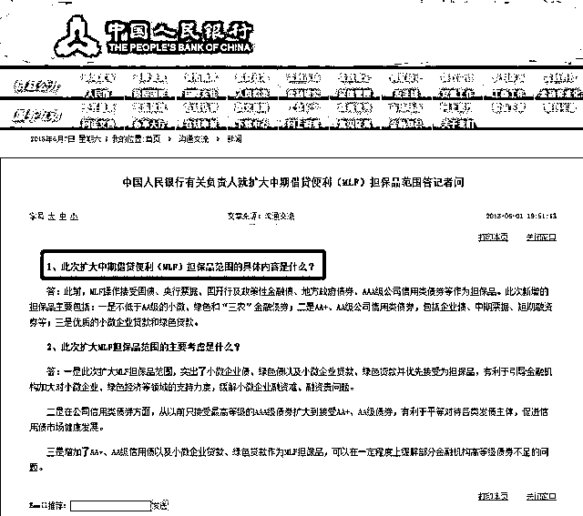
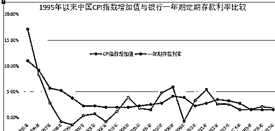
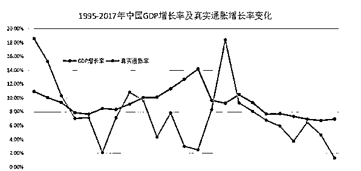

# 央妈又大放水大通胀时代现在的 100 万 10 年后值多少钱？

作者：只会炒股

刚看了一下央妈的网站大为吃惊

  MLF 就是我们常说的“麻辣烫”是中央银行提供中期基础货币的货币政策工具，对象为符合宏观审慎管理要求的商业银行、政策性银行，可通过招标方式开展。发放方式为质押方式，并需提供国债、央行票据、政策性金融债、高等级信用债等优质债券作为合格质押品。

“中国人民银行决定适当扩大中期借贷便利（MLF）担保品范围是什么含义？

这句话其实细细推敲起来让人毛骨悚然。

也就是说以前不在质押范围的担保品（抵押品）现在扩大范围了，现在也可以拿着垃圾类的资产、债券、地方债、企业债，可以向央行抵押借钱了。

我们知道当前任何一个国家的货币都是信用货币。从布雷顿森林体系崩溃后，美元脱离与黄金挂钩，美国开始耍流氓靠信用印刷美元。既然是信用，那么就必须有实实在在的抵押品——这个抵押品，可以是一个国家的税收、国债，黄金、外汇、期货等。

那如果扩大担保品会是什么结果呢？

以前印刷钞票是从 1994 将人民币与美元挂钩，那时候缺少外汇，所以严格执行用外汇储备政策，央行收到 1 美元就会印刷对应汇率的人民币。这样就形成了外汇占款，也就是外汇抵押品。

后来钱不够花，就用国债作抵押品，如果再降低抵押品等级，那意味着货币的信用严重降级，货币的通胀升级、可以随意印刷钞票。

我们现在再来分析新闻中的担保品（抵押品）的信用等级。

不低于 AA 级的小微企业；

绿色和“三农”金融债券；

AA+、AA 级公司信用类债券（优先接受涉及小微企业、绿色经济的债券）；

优质的小微企业贷款和绿色贷款。

是不是看着都挺不错的？ 但你看到天津的政府城投公司 2000 亿的违约政府都没办法、金盾股份的 450 亿的违约、辉山乳业、龙煤集团的债务违约政府都束手无策，那这些小微企业、绿色经济债券，切不说这些企业的盈利状况如何，单单这种信用评级的可信度在哪里？

国家在去杠杆的过程中，去的是政府的杠杆，加的老百姓的杠杆，那些将要违约的，已经违约的烂摊子已经无法收拾了，现在又要扩大化，将来债务处置，还是全民买单，通胀化处理。

那我们继续推演，这将是 2014 年来又一次 QE 的号角。

举个例子你可能就更明白了：我们村的 15 个员工的手工作坊“英开电气”在新三板上市了（这是真事）。本来新三板的上市门槛就比较低，他在联合信用评级机构在资产证券化的同时通过财务手段获取 AA 级的信用评级。然后市场上发行债券融资，获取“三农”金融贷款。运作两年老板掏空公司后破产了，贷款收不上来了，债券可能偿还不了。

正常情况这家企业是没有能力融资的，即使融资也要拿出硬通货来做抵押的比如：土地、房产、技术、专利等，一旦破产企业和银行都要承担亏损责任，可现在倒好，央妈出面了，你的这些垃圾债券纳入人民币担保品范畴，还不了钱央妈直接在账上记上一笔就结束了。但钱已经装到老板自己兜里流通到社会里了。

这就是央妈的凭空印钞，自然会增加整个社会的通货膨胀。

然而更严重的还在后面，央妈凭空印钞帮助那些不诚实、不讲信用的企业，这意味着鼓励整个社会采用投机取巧的方式骗取财富……

用句大白话说，我找二狗子借了 100w，打了欠条，明年还本付息 110w。但我根本就不打算还，因为很有可能明年央妈直接把这个欠条纳入到人民币的担保品中。给了二狗子 110w，我还操心还账干嘛，劣币驱逐良币嘛。

那我凭空借着 100w 到社会上流通会造成多大的通货膨胀呢？

我们先看一下央妈截止 2017 年 12 月末发行的人民币的数据：

广义货币(M2)余额 167.68 万亿元,同比增长 8.2%；

狭义货币(M1)余额 54.38 万亿元,同比增长 11.8%；

流通中货币(M0)余额 7.06 万亿元,同比增长 3.4%。

从过去 20 年货币发行量、CPI 指数统计，保守的用历史数据估算一下，现在的 100 万，10 年后还值多少钱……

1995 年《中国中央银行法》颁布实施，央行印钞有了紧箍咒，再也不能随便印钞了，印钞只能拿国债和外汇换才行。

所以我们先来看看 1995-2017 年的 CPI 是多少。

上面的数据说明，很多时间 CPI 是高于定期存款利率的，存款来补贴银行。我们这 20 多年，都是个人用自己的存款来肥富了银行和贷款的人。

而 2017 年 12 月末公布的 CPI 同比值为 101.8，相比 2016 年仅增长 1.8%。

我们把 CPI 的数值复利算下来，相对于 1995 年 CPI 为原来的 1.88 倍！连两倍都不到。对，你没看错，根据统计局数据，22 年来物价总体仅上涨为原来的 1.88 倍！平均下来，过去 22 年，中国每年的物价上涨幅度仅有 2.9%。

用这一数据估算，今天的 100 万，到 2028 年，大约相当于今天的 75.03 万元。

是不是说到这里你会说我瞎扯，那我们先记住这个 75w 元，继续往下看，因为这还没算我接二狗子那 100w 在社会中的流通呢。

那二狗子的那 100w 在社会当中的流通造成的通胀该怎么算呢？我们用个最简单的方法：

真实通胀=广义货币发行量（M2）增长速度-中国实际 GDP 增长速度。

这个公式就把央妈纳入的那些垃圾债券包括二狗子的债券都计算进去了，是不是比较简单又真实又直观？

根据央妈的数据，2017 年广义货币供应增长率为 8.2%，GDP 增长率约为 6.9%，那 2017 年的保守通胀率为 1.3%。

按照咱们的公式 22 年来真实通胀率全部计算进来，实际物价相比 1995 年底翻了 5.44 倍，平均每年大概 8%左右。是不是感觉还是比较不靠谱？没办法，这都是根据保守数据计算得来。

用这个数据估算，2028 年我们的物价将上涨至目前的 2.16 倍——

换算下来，今天的 100 万元，到 2028 年初，大约相当于今天的 46.3 万元。

所以买房选择等额本息的人是不是占了大便宜？你现在还的钱越少，将来的钱越来越不值钱，看着多付了一些利息，实际上远远赶不上通货膨胀的速度，你就多占便宜。

纵观国际全球的国家没有一个不是在通货膨胀的路上，因此你贷款的时候，如果利率低于真实通货膨胀率，那就贷的越多、还的越长，越占便宜。

像我的一套房子用公积金贷款 3.35%的利率，每个月还款大概 2000 块，当时贷款时问我要贷多少年，我真想告诉他能否贷我 100 年？因为现在的 2000 块，10 年后乐观的估计最多也就价值 1000 块，20 年后也就价值 500 块吧。

这也是为什么这么多年房价拼命涨，有人就敢拼命贷的原因。

作者：只会炒股

