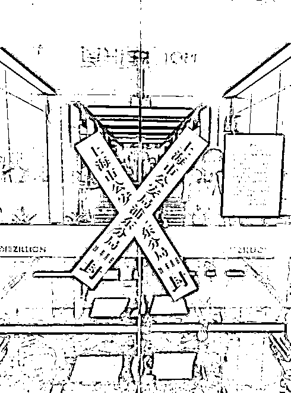
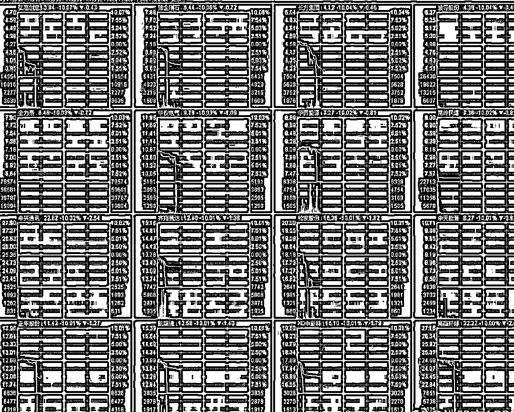
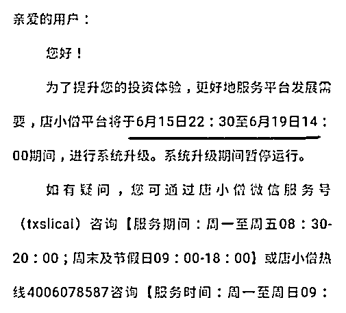

# 一个 800 亿的地雷爆炸了，网贷平台后面可能会连环炸雷

近日，网贷平台迎来至暗洗牌时刻，一家成交量达到 800 亿的大型网贷平台唐小僧炸雷，高管主动找经侦报案，然后经侦介入查封，所有投资人血本无归。。。

唐小僧曾经一度被誉为民间四大高额返利平台，其他三家分别是钱宝网、雅堂金融、联璧金融。而这 4 家除联璧金融外，其他三家全部爆雷，所以我这里首先提醒大家，联璧金融炸雷的概率非常非常的高，四大金刚已死其三，没道理他能一枝独秀。

然后，我提醒大家，网贷平台出问题这件事并不是孤立的，整个中国的金融系统，都在经历痛苦的去杠杆过程，其目的很明确，就是削减债务，为什么美国屡屡加息中国不敢加？那是因为中国目前的债务规模达到了历史高峰，按照目前公布的数据，如果按照 6%的贷款利率进行推算，18 年的全社会新增融资量甚至无法抵消掉全社会存量贷款的利息，但是实际上我们知道，企业的平均融资利率绝对不止 6%，所以 18 年会频繁发生债务危机，如果在去杠杆完成之前，央行加息，只会增大债务负担，引发债务危机更快更猛的爆发，如果引起连环爆炸，08 年美国金融危机的惨痛教训就是例子。

今年受到金融紧缩效果波及的，不仅仅是 P2P 平台，股市和债券市场都付出了惨痛的教训。因为信托计划紧缩导致的资金链断裂，在 2018 年 2 月 1 日，造成了一轮闪崩的效果，在上个星期五 2018 年 6 月 15 日，又造成了一轮闪崩效果。

而在股市大面积闪崩的当天，也就是 6-15 日，唐小僧宣布晚上 10 点半会进行系统升级，次日高管主动报案，引发了地雷爆炸。

我觉得这不是巧合，金融系统都是互相联通的，为什么 2 月 1 号的时候全国几十家股票一起崩盘，6 月 15 日的时候又是几十家一起崩盘，难道他们的主力都是同一天肚子疼吗？肯定不是，其原因就是资金互相交织，互相都有业务联系，一家出问题的时候，其余几十家原本挣扎在生死线上的就立刻崩溃了。唐小僧的资金，估计也有部分牵扯在里面，成了压垮骆驼的最后一根稻草。

而对于债券市场的债务违约，就更吓人了，他们的投资人，就拿着 6-8%的利息，就是看中债务的刚兑效果，并没有贪图高收益高利息，然后债务违约，直接血本无归。债务违约是资本市场最可怕的事情，因为高风险高收益资产违约是正常现象，经常出现，也不会对经济造成太大的影响。而一旦债务出现违约，极易引起违约潮，一旦某一家国企出现债务违约，人们会直接类推，其他的国企会不会也出现债务违约风险，如果这种风险存在，再以 6-8%的利息买他的债券，那就很不划算，不出事也就最多 8%的收益，一旦出事 100%的本金都没了，这笔买卖当然不划算。

**中国其实还有一个最大的雷是地方债**，其债务规模简直无边无际，一旦某一个地方债出问题，有可能引发中国版的次贷危机，这是政府所决不允许的，中央既不可能给地方债兜底，他也兜不起，也没办法遏制地方债迅速膨胀的规模，处理起来非常棘手，这一点先略过不谈，以后有机会深谈一下。

然后，就是谈到剩余的 P2P 平台了，首先，在这一轮的金融去杠杆过程中，所有的金融机构都要经历洗牌过程，企业、机构、私募都是如此，倒闭的如过江之鲫，P2P 平台当然也不例外。在高风险的资产垮台之后，多米诺骨牌效应会逐渐的向中低风险资产蔓延，他们不是不出事，是重压之下他们还能比高风险资产多抗一会。

银保监会主席郭树清说，高收益意味着高风险，收益率超过 6%的就要打问号，超过 8%的就很危险，10%以上就要准备损失全部本金。你以为他是说着玩的？10%以上的项目已经基本全军覆没了，按照郭主席的说法，8%以上的都很危险，6%以下的才算安全。

他这是在发出一种预警，对于 P2P 平台来说，后续肯定会有挤兑效应，我们都知道，一轮大洗牌之后，肯定会有一个平稳发展的黄金期，也就是抗完这一轮倒闭潮，活下来的都是精英。但是在这一轮倒闭潮结束之前，你就拿着 10%不到的收益，去负担本金损失 100%的风险，不划算。

最理性的做法是，先把资金存入 6%的低风险机构之中，观望一年，坐等这一轮倒闭潮结束，然后在剩余活下来的 P2P 平台里进行选择，同样的收益率，所负担的风险，那个时候明显会低于这个时候。

金融市场的效率并不会等到坏账周期真实来临，事实上，投资者抽资就是至暗时刻的开始，当知晓这一原理的聪明的投资者多了起来之后会发生什么事情呢，会对现有的 P2P 平台造成严重抽血，加速其破产整合的速度，这个预期结果，会反过来加速理性资金抽离 P2P 的速度，造成连环炸雷的恶性循环直到整个行业跌到谷底为止。

所以，我建议参与其中的人不妨先出来看一看，按照郭主席的建议，先把资金转入 6%收益率以下的资产，等国家这一轮金融泡沫全部挤炸裂为止。

往期回顾（回复“目录”关键词可查看更多）

为什么中国必须购买美国国债？| 租房贷款会将房子拆分成房骨和房皮 | 宁波老虎事件遇难者不应该得到赔偿 | 中国的房价什么时候会崩盘？ | 中国地产达到什么样的条件会崩盘？| 你根本不知道烟草公司有多赚钱 | 如何把自家孩子培养成一个顶尖人才 | 我是如何保证自己不近视的

