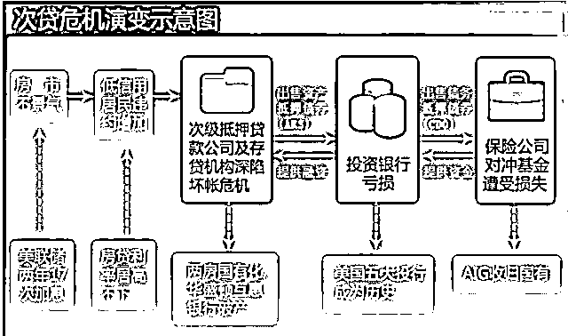
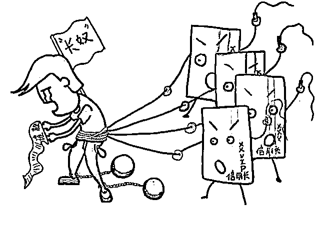
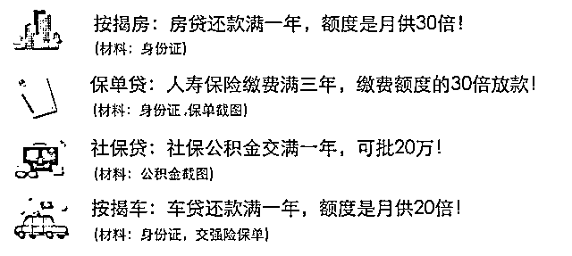
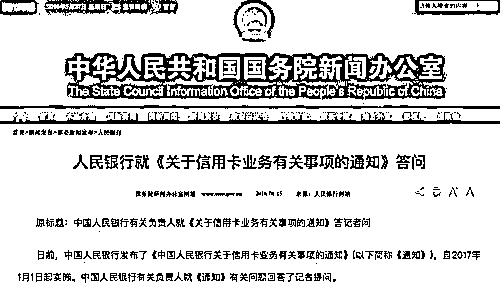
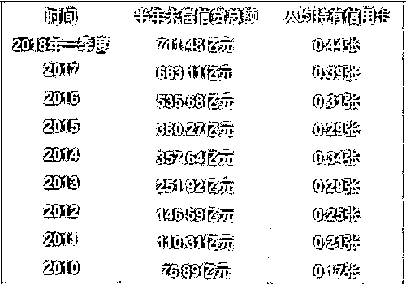
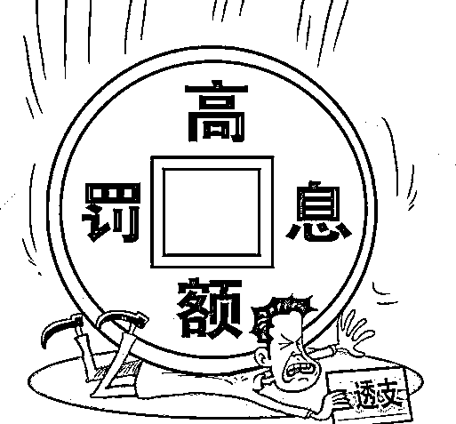
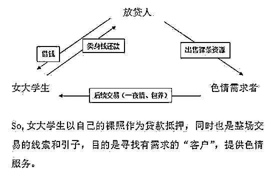
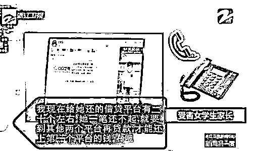
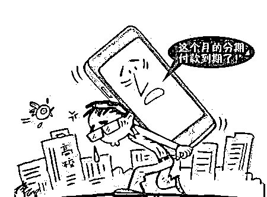
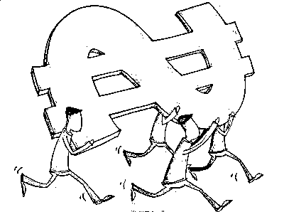

# 除了债务，你我一无所有

作者：小飞大侠

2003 年，由于 1997 年的金融危机重创，韩国采取“扩大内需”的方式来刺激经济。为了鼓励民众消费，信用卡销售热火朝天。

无论有无固定收入，无论失业与否，只要填了申请表就能发卡。有了信用卡的韩国民众开始了疯狂的透支消费。

结果由于消费过于盲目，致使背负的债务大大超过了偿还能力，导致无数家庭因债台高筑而破裂，犯罪和卖淫现象激增，整个社会一地鸡毛，韩国的“卡债危机”正式吹响。 

2008 年美国次贷危机前，美国住房市场出现了一个长达 6 年的繁荣期。这给美国民众带来了一个房价会一直涨的错觉，并且认为房子的升值空间一定大于贷款的利率。于是很多民众贷款买房，催生出了很多金融机构。

有钱的人就不用说了，关键是那些没有固定收入、还贷风险极高的人也被鼓励来买房。美国房地产的泡沫越吹越大，结果击鼓传花进行不下去了，泡沫破裂，房价大幅下降。

这时候美国民众发现自己房子的市值还抵不上贷款的额度，于是放弃还贷。而此时市场低迷，银行收回了房子却迟迟卖不出去，大面积亏损，最终引发了次贷危机。 

我们生活在一个最好的时代，同时也是最坏的时代。 

在父母辈，有急事找人借钱是非常低声下气的，是要报以恩情念一辈子的。除非婚丧嫁娶，不然是绝无可能去找人借钱应急的。

到后来有了信用卡，但是因为门槛原因，也并不是每个人都能办理一张，且享受高额度的。平时急需用钱时，还是得靠亲戚朋友的接济。

而现在，只要你有身份证，是个合法公民，就可以靠信用借钱。花呗、借呗、白条等等。信用卡的门槛也放低了许多。只要能按时还钱，额度还能越来越高。普通人急用钱的时候随随便便套个几万块出来再容易不过。也远离了放低姿态找人借钱的窘迫。

这在以前看来，绝对是件不可思议的事情。 

不知不觉间，勤俭节约、省吃俭用等一贯用以描述中国人的词已经不再贴切。随着时代的改变，大部分中国人已经从“高存款”转变成了“高负债”。

在扩大内需、消费升级的口号下，消费成了对内刺激经济，对外抵御威胁的主要方式。相对应的，信用卡和互联网金融得到了空前的发展。短短几年间就涌入种类繁多的金融产品，看得人眼花缭乱，各种借钱工具信用贷等充斥在网络中。一时间，透支消费成了当下的主流。

不论什么东西都能用来贷款，除了能直接作为抵押物的房子、车子外，还有保单、社保，甚至还有裸照和肉体！于是便催生出了很多“月光族”、“季光族”甚至是“年光族”。 

这群透支未来的人群，往往月收入不到一万，但在衣食住行方面却毫不吝啬，甚至还请客吃饭、旅游唱 K，生活过得滋润又自在。可是他们每个月的工资、花呗、借呗、信用卡等等全部都透支完毕。打开各种钱包，皮甲钱包、微信钱包、支付宝钱包等，余额全是“0”。

在这样一个无痛消费的时代，无脑消费已经成了大部分人的消费方式。当各种贷款的还款日期临近，刚到手的工资只能用于还款，而接下来的一个月又要靠继续刷卡、继续透支来维持，逐渐陷入了一种透支与还款的恶性循环。 

2017 年 1 月，央行发布了 “信用卡新规”，新规中给予了银行信用卡定价的自主权。放开了免息期、最低还款额、透支利率等，各大银行纷纷响应，又开始疯狂争夺信用卡市场。

于是 2017 年的人均持卡量增幅创下了历史新高，增长了 0.08 张。如果以 14 亿总人口计算，则增长了 1.12 亿张。到了今年一季度，信用卡人均持有量已经达到了历史最高值，平均每人 0.44 张。

 随之而来的便是透支金额的大幅增长。

通过五大行的财报可以看出，2017 年，五大行的信用卡贷款(透支)金额同比大幅增长，其中，农业银行增幅超过了 30%。对比 2016 年增长数据可见，五大行信用卡贷款(透支)金额增速几乎都实现翻番。

股份制银行的信用卡发展速度更加迅猛。 

信用卡人均持有量的上升，我们可以说是消费观念的转变，大家对信用卡已经不再“谈虎色变”。

透支额的大幅上升，我们可以说是大家消费能力的增强，可以反应出大家都在积极响应扩大内需消费升级的口号。

那么对应的还款能力如何呢？

根据今年 5 月央行发布的《2018 年第一季度支付体系运行总体情况》显示，信用卡逾期半年偿信贷总额达到 711.48 亿元。

纵观历年数据发现，与 2014 年的 357.64 亿元相比，信用卡逾期额度已经翻番，与 2010 年相比，更是增长超过 8 倍。

什么概念？

假设一直都只有 700 万人用信用卡并透支，那么相当于每人欠了银行一万多元。而且这部分欠款还有罚息还有滞纳金，就算办理了分期，利息也是高得吓人。欠银行的钱可能只有一万，但是利息滞纳金等等加起来肯定远远高于一万。

物欲是会不断膨胀的。

有了一百就会想要五百，有了五百就会想要五千，接着就是五万、十万。

可能一开始只打算买一个大牌的包包，买到手后又想着要买双大牌的鞋，买一套大牌的衣服，买相应的配饰等等。毕竟包包很贵，全身上下都要搭配起来。还有化妆品、手机等等。物欲的快速膨胀带来的是透支额度的不断攀升。

前段时间引起社会轰动的校园裸贷便是如此。

借款的多为女学生，家庭经济状况不太好，但是又眼红周围打扮亮眼的同学。在虚荣心的作用下，走上了“裸贷”的道路。随着第一笔负债的产生，她们的心理也逐渐发生了变化。

从一开始的惴惴不安，时刻担心逾期还不上，到后来的破罐子破摔，拆东墙补西墙，直至东窗事发，追悔莫及。家里条件不错的父母还可以兜底，可若实在还不上的，便只能为“鱼肉”，走上“肉偿”的漫漫还债路。 

校园裸贷是一个比较极端的例子，但是就算是信用卡贷款，也有许多因负债太多还不上而自杀的案例。

只能说，是这种透支需求催生出的借贷市场。所以当我们在痛斥信用贷暴利、催收账款的方法过于极端的同时，应该反向思考一下——为何就算这些借贷平台、借贷方式剥削得这样赤裸裸，却仍旧有人前仆后继地上前呢？ 

如果说信用贷是为了“高消费”而主动负债，那么买房买车便是在丈母娘威逼之下的“被动负债”了。

2008 年之后，为了刺激经济，开启了“国民经济加杠杆”的发展模式，各类地产项目纷纷启动，一派热火朝天的景象。结果刹不住车了，2015 年又提出“去库存”，同时各种金融融资方式出现。有钱的直接买房，没钱的借钱买房。过了两年，旧房改造货币化后，大家手上突然都有钱了，于是全都拿去买房，引发三四线城市房价暴涨。到今年，各地开始“抢人”，又激发了一轮房价上涨。

短短几年间，由于“接盘”房子，已经有超过三分之一的家庭属于高负债家庭。在当前全球加息缩表的背景下，不仅这类高负债家庭不堪一击，也给整个高杠杆的社会带来了巨大的隐患。

据统计，去年，我国房地产存量房的总市值大概是 300 万亿计算，但我国的基础货币只有 30 万亿左右。

也就是说，只要有十分之一的买房者套现离场，就可以耗尽所有货币！而比房价暴涨更可怕的，是背后的债务问题——目前，中国家庭债务杠杆率已逼近美国次贷危机前夕！

在资金充裕的年代，拆东墙补西墙也能维持很长一段时间的相安无事。但是现在，国家的“去杠杆”和“强监管”决心之大，“东拆西借”这一套已经行不通了。流动性比任何时候都重要，企业债风险已经爆发了，且有愈演愈烈的趋势。质押爆仓的事件也接连发生。那么下一个是什么呢？会不会就是个人债务呢？

或许风向已经转变了，钱，正在比任何时候都紧缺。钱，正在逐渐变得更值钱！ 

除了债务，你我一无所有

历史不会简单的重复，但是会惊人地相似。

据外媒统计，2008 年金融危机爆发以来，全球各个国家和地区的自杀人数明显攀升。研究认为，这跟金融危机造成美国和欧洲等发达经济体的失业率大幅上升有关。另外还有研究显示，在 1997 年的亚洲金融危机中，日本、韩国、香港等亚洲经济体中有超过一万人因经济危机自杀。

为什么自杀？肯定不仅仅是因为失业。

当你上有老人要抚养，下有孩子要培育，此时你失业了。没有经济来源的同时，身上还背负了巨额的债务，未来的出路在哪里？眼前是一片黑暗，看不见退路也看不清前方，在走投无路下迫使他们走向了自杀的绝路。

十年一个周期，十年一个轮回。

他们的故事离我们并不遥远，看似体面的中产阶级，面对社会的巨大变革、面对经济风险的突袭其实毫无还手之力。 

如今去杠杆正在进行，虽然解决的难度极大，但总归是有希望。作为一个小市民，一定要顺势而为，时刻警惕，远离一切高负债、高杠杆的投资行为，避免成为“一夜暴负”的时代炮灰。

要记住，资产泡沫可以被捅破，但是欠下的债务不会凭空消失。十年一轮回，钱，又到了最值钱的时候。

作者：小飞大侠

