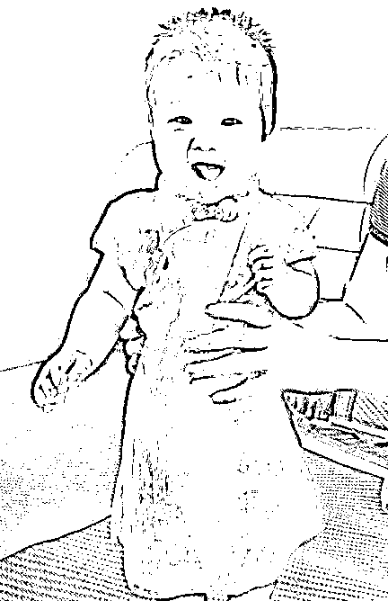

# 为什么婴儿那么喜欢哭-父亲节专篇

<link rel="stylesheet" href="view/css/APlayer.min.css">

今天是父亲节，正好我当父亲也 7 个月了，所以我特意写一篇宝宝的文章来作纪念，谈一下自己的育儿心得。

我们都知道，咯咯笑的宝宝就像天使一样，但是小宝宝特别喜欢哭，没事就哭，而且宝宝的哭声还特别具有穿透力，并且带有扰乱特效，不管多么淡定的人，听到宝宝哭，你一定坐不住，我今天就谈谈为什么宝宝那么喜欢哭，以及怎么让宝宝少哭闹。

宝宝哭的意义

谈宝宝为什么喜欢哭之前，先说说宝宝哭的意义，宝宝会哭是她的一项生存技能，也是唯一的生存技能。婴儿期的宝宝，不会说话，甚至连爬都不会，遇到任何伤害都毫无抵抗能力只能承受，那么她如何保护自己呢，只能靠哭。对于成人来说，哭泣代表在宣泄悲伤的情绪，而对于婴儿来说则未必，他们的哭声蕴含着很多含义。

当一个宝宝饿的时候，她如何获取食物，是冲着她的父母咯咯笑吗？肯定不是，如果那样的话，父母的唯一结论就是，孩子的状态很好嘛，继续忙自己的活去了，这个宝宝唯一的下场就是饿的皮包骨头。宝宝既没有办法通过语言表达自己饿了想吃奶，也没有力气主动爬到母亲身上，想吃上奶，唯一能使用的手段就是哭，哭的越惨，母亲来喂奶的速度越快。

这种行为有个俗语可以描述，那就是爱哭的孩子有奶吃，可见对于婴儿来说，哭是获得食物的重要且唯一的方法。那么除了饿之外，还有哪种情况下宝宝会哭呢？

首先是需要换尿布的时候宝宝会哭，当宝宝便便但是大人没有及时发现的时候，宝宝会啼哭不止以便于被大人发现，完成卫生清理之后宝宝就会停止哭闹，宝宝是因为感觉难受才哭的，但是这样的卫生清理大幅度增加了宝宝的健康系数，这就是宝宝哭的意义。

其次，宝宝受到伤害的时候会哭，这是在向大人报警求助，宝宝的抵抗能力就是 0，别说遇到大型伤害，就算是一只成人可以随手碾死的蚂蚁过来，她也只能乖乖被咬。宝宝抵御这些伤害的能力只有一个，那就是依靠哭声来呼唤成人的保护。

最后，是当宝宝长时间看不到大人的时候，她会哭。这个的原因就更简单了，在几亿年的进化史里，人类拥有稳定居所的时间不过几千年，大部分人能住进一个坚固且私密的居所可能也就几百年历史吧，所以很多地方在大人看来是很安全的，在婴儿看来是很危险的。

有什么办法能让宝宝不哭

写完了宝宝为什么哭的原因，我们来分析一下怎么能让宝宝不哭，首先我们要明确，宝宝虽然喜欢哭，那是因为她有哭的必要性，不会无缘无故的哭，当她哭的时候一定是有原因的，解决就好。

那么，宝宝饿这个问题是第一优先去解决的，宝宝哭有大一半的原因都是因为她在提醒你需要喂乳了，哺乳之后自然不哭了。这个问题的唯一办法就是哺乳，即便宝宝不哭，我也怕她饿着了想多喂点，但是又怕撑坏了，所以宝宝的哭声就是喂食的生物钟，这点上我是欢迎宝宝饿了就哭的。

其次，宝宝哭的第二大原因就是要换尿布了，这个也是必要的，如果不是宝宝的哭声提醒，很有可能我们要过很久才能发现需要更换尿布，时间一长，各种细菌滋生，对宝宝的身体健康是大为不利的，所以这种婴儿啼哭我们也是欢迎的。

然后是婴儿伤害问题，婴儿受到了伤害，摔着碰着了，被蚊虫咬了，都是会哭闹的，这个是必然的。而且说实话，当婴儿摔着的时候，哇哇大哭的宝宝才是让人放心的宝宝，如果宝宝摔着了之后不哭不闹一声不吭，那才真的吓人，我建议立刻送医院，因为这代表宝宝受到了重伤。在战场上，军医首先抢救的不是那些哭天抢地喊疼的伤员，而是那些无声无息的人，这是因为那些还有力气喊疼的基本都是轻伤，缓一缓救也没什么，那些一声不吭的，基本都是濒死状态，其道理是一样的。

最后，是宝宝黏人的问题，对于宝宝哭泣来说，这个是唯一的非必需品，宝宝具备这个基因，是因为她希望和大人 24 小时黏在一起，互相不脱离视线之外，这样宝宝能获得最大程度的保护，对于那些不爱哭的孩子来说，这样的宝宝，在远古野外环境下，明显生存率要高很多。

鲁迅笔下曾经有过祥林嫂这么一个形象，很多人可能忘记了祥林嫂儿子被狼瞬间叼走的细节，这里先帮大家回忆一下鲁迅原文。

> *“我真傻，真的，”祥林嫂抬起她没有神采的眼睛来，接着说。“我单知道下雪的时候野兽在山坳里没有食吃，会到村里来；我不知道春天也会有。我一清早起来就开了门，拿小篮盛了一篮豆，叫我们的阿毛坐在门槛上剥豆去。他是很听话的，我的话句句听；他出去了。我就在屋后劈柴，掏米，米下了锅，要蒸豆。我叫阿毛，没有应，出去口看，只见豆撒得一地，没有我们的阿毛了。他是不到别家去玩的；各处去一问，果然没有。我急了，央人出去寻。直到下半天，寻来寻去寻到山坳里，看见刺柴上桂着一只他的小鞋。大家都说，糟了，怕是遭了狼了。再进去；他果然躺在草窠里，肚里的五脏已经都给吃空了，手上还紧紧的捏着那只小篮呢。……”她接着但是呜咽，说不出成句的话来。*

屋前屋后，十米不到的距离，这还是快到解放前了，距离现代社会也就只差几十年，小孩子依然可能被狼瞬间叼走，有时候连哭的机会都不给孩子。在几十万年前的远古时代就不用说了，只要离开大人，小孩子随时都可能有生命危险，距离越远，危险系数越高，在自我保护能力最差的婴儿阶段，一直呆在大人怀里，才是最安全的。在野外，一旦大人消失在婴儿的视线之内，婴儿就随时可能被其他动物所伤害，所以最安全的做法，就是通过哭声让大人归来，只要在大人的怀抱里，婴儿才会具有安全感。在历史上，凡是大人离开距离过远还不哭不闹的“乖孩子”，恐怕都已经被优胜劣汰的大自然给消灭了。

但是到了现代社会，在自家的小屋里面，不可能有猛兽什么的外部伤害，这个道理大人清楚，但是宝宝不清楚啊，她看不到大人就会哭，这个时候宝宝哭，你只要把视线转向她，和她对视一眼，她马上就转哭为笑了，她哭的目的就是为了获得你的注意力，让你不要远离她。

对于这一种哭闹，是有办法进行部分解决的，因为由于文明的进化，大人未必要 24 小时抱着宝宝才能保护她安全，这里就要提一下玩具的重要性了。

玩具的重要性

在以前，我曾经认为宝宝的玩具是没有存在的意义的，玩物丧志嘛，大人如此，小孩不也一样，但是自从当了爸爸，经过几个月的实践，我发现玩具这东西还真的具有很大价值。

当宝宝吃饱喝足又睡醒的时候，她只有二件事可以做，第一件事是自己玩，第二件事是找你玩。如果当她觉得自己玩没意思的时候，她就哭，哭到你来抱她陪她玩为止。

所以，如果你当时忙于其他事情的时候，你就需要一个人来代替你陪宝宝玩，有一个大人 24 小时陪着宝宝那自然是最好的，如果你暂时找不到其他大人帮你带宝宝，那么你就需要一个玩具来吸引宝宝的注意力。

根据我这几个月的实践结果，闪光的东西，发出声响的东西，是宝宝的最爱，天生就会吸引他们的注意力，一个玩具帮你拖半个小时不在话下，然后再换一款。。。

但是要注意，闪光的东西一定要买低亮度的正规玩具，千万不要让宝宝盯着灯光看，对眼睛伤害特比大，这一类的报道是很多的。

而最好用的，就是声音类玩具，一款能唱儿歌的玩具可以省下你很多事，当然，这个和婴儿不同的年龄阶段有很大关联，6 个月以内的孩子连爬都困难，也没什么力气去抓玩具，只能对光线和声音做出反应，最能吸引他们注意力的，就是唱儿歌玩具。

另外，还要记得带孩子出去走走，除了吃母乳之外，婴儿最爱的事情就是被抱在怀里出去散步，当你带着孩子出去散步的时候，外面的世界会吸引孩子全部的注意力，除非真的饿极了，否则基本是不哭不闹的。吃饱能让婴儿获得食物满足感，被抱在怀里能让婴儿获得安全满足感，出去散步能让婴儿获得新奇信息满足感。

所以我个人认为，吃饱之后被大人抱出去散步的宝宝，就是这个宝宝一天之中最幸福满足的时刻。

最后，晒一张自家的宝宝照，祝大家父亲节快乐。