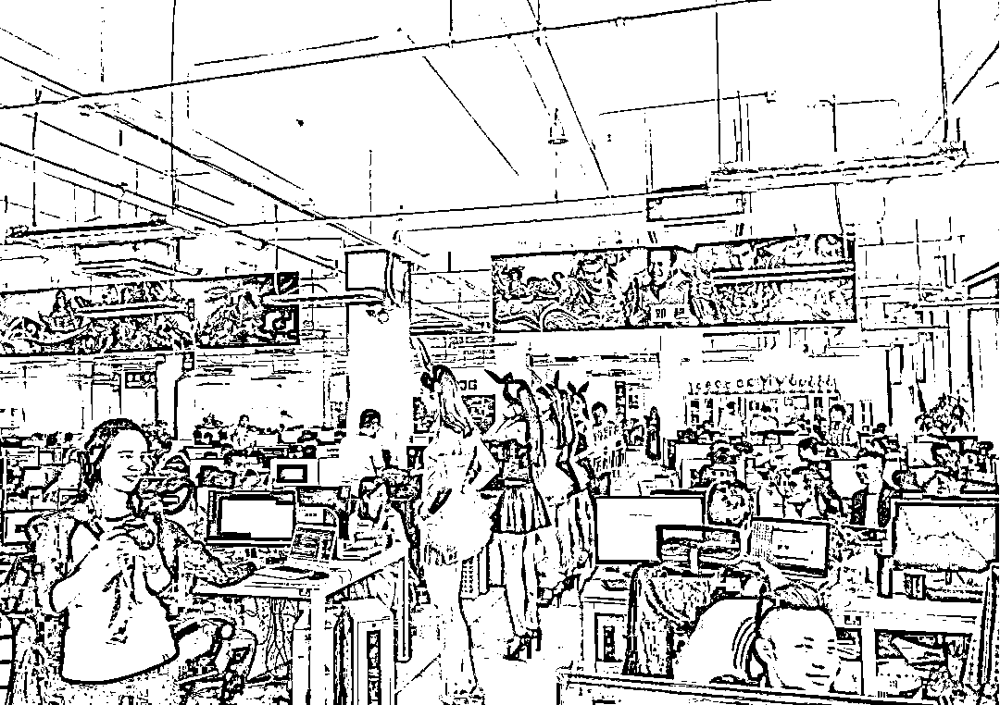
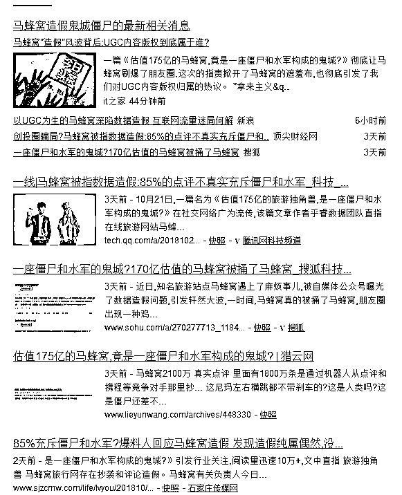
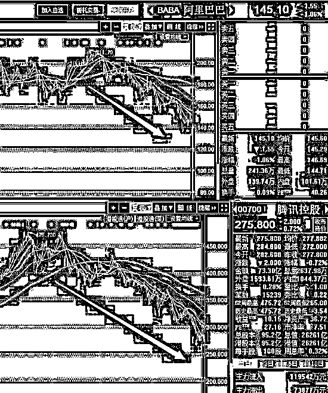

# IT 行业高工资的时代已经结束了 | 紫竹张先生

喜欢我的都关注我了~

今天是 10 月 24 日，因为 1024 是程序内的重要计量单位，所以这一天被称之为程序员节。今天，还有不少 IT 公司请了很多美女来进行“心理减压”。。。

所以今天我正好借这个节日，谈一谈我对 IT 行业的看法。大家都知道，IT 行业的工资远远超过其他行业，同一个大学生，学实体制造类的专业，和学 IT 行业，毕业后的起步工资可能都要差一倍以上，干个二三年积累经验后，差距可能会更大！真是男怕入错行。

之所以 IT 从业人员能拿到这么高的工资，完全是因为借了互联网时代的大风口而已，同样的天赋，同样的努力，从事 IT 行业，获得的收入就是远远高于其他行业，这只能解释为风口的原因。

而同样的一幕也曾经发生过，那就是 1980-2000 年的实体制造业。

改革开放后的工厂老板发财了

1978 年 12 月，十一届三中全会宣布中国将进行改革开放，1979 年 7 月 15 日，中央特批广东、福建可以实行“特殊政策、灵活措施”，并决定在深圳、珠海、厦门、汕头设立经济特区。

从 1980 年开始，改革开放的进程开始加速，各类加工作坊在中华大地上如雨后春笋般冒出来，这些作坊工艺粗糙、质量不稳定、规模可怜，基本等同于个体户。带着三四个工人，一个瓦房和一个破机器，这些人就大言不惭的声称自己开的是工厂，自己是工厂的老板。

历史的结果告诉我们，敢下海开工厂的，都发财了，甭管产品质量多差，都被一抢而空，因为那个时候的中国物资实在太匮乏了，再烂的产品都比没有好，产品只要出炉压根不愁卖。

在那个实体制造业的黄金年代，老板=有钱人，开工厂=开金矿，开工厂的利润之雄厚不亚于贩毒。

海量的利润刺激了工厂老板们疯狂的投资扩充产能，而不断扩大的产能需求大量的工人，工人的工资也开始一路狂涨，在八九十年代，沿海地区的工人收入，是要比内地的工资高上好几倍的，内地人开始不断的涌入沿海地区进行“淘金”，来了深圳就发财，打小工也好，摆地摊也罢，都能赚到在内地一辈子赚不到的钱，这不是一个玩笑，这是真的。

正是因为那个阶段开工厂来钱太快，很多人就迷失了自我，要么纸醉金迷享受人生，要么自信心爆棚以为自己是商业奇才开始傲视一切，这些人的工厂，很快就在后面的残酷竞争中被淘汰掉了。

从 2000 年开始，实体制造业的效益开始一路下行，造什么东西都能卖掉，开什么工厂都能赚钱的神话刚刚传播到内地人的耳朵里，这个时代就结束了。残酷的竞争开始进行，中国的工厂开始不断的进行优胜劣汰，哪个新产品卖的好，马上就有数万家工厂跟进，瞬间杀成红海。大规模、高效率的工厂开始脱颖而出，利用价格战不断的消灭竞争对手，小规模、低效率的工厂不断的被淘汰出局。

到了今天，实体制造业的格局基本定型，新工厂要发育成长难如登天，老板从一个代表财富的褒义词变成了一个贬义词。“你才是老板，你全家都是老板。”这种戏谑之词都形成了一个段子了，之所以会出现这样的段子，是因为新工厂和新企业的死亡率奇高无比，创业不再是一个能发财的事情，多半都是以败家而收场。

腾飞的互联网经济

1998 年 11 月，马化腾在深圳创立了腾讯公司；1999 年 9 月，马云在杭州创立了阿里巴巴公司，时间是如此的巧合，差不多就是改革开放 20 周年之际。

随后，中国的互联网经济开始蓬勃发展，互联网企业赚到了大钱，在那个年代，倒腾一个网站，分分钟就能赚到你干其他行业一辈子赚不到的钱。而如果你天赋好一点，能力强一点，你就能迅速成长为一个互联网大型企业，2000 年之后发育成长起来的中国知名大企业大家可以掰掰手指头数一数，八九成都是来自于互联网行业。

互联网企业赚到钱了，自然想着疯狂投资扩大产能，需要扩张更大的市场获得更多的用户，于是就需求更多的程序猿，所以整个 IT 行业的工资就被拉的很高很高，和八九十年代深圳工厂里的工人一样高。

互联网的造富效应太明显了，明显到风投资金无限的偏爱这个行业，八九十年代中国还很缺资金，但是现在不缺，海量的资金疯狂涌入这个行业，催熟了大量的项目和公司，也带来了大量的数据造假骗估值。例如刚刚被媒体广泛报道的马蜂窝，就被人指控有 85%的点评数据属于造假，充斥僵尸和水军。

互联网行业数据造假其实非常普遍，只要是涉及到融资和估值的企业都不能免俗，大家五十步笑百步而已。为什么今年开始捅爆这个话题，那是因为从今年开始，互联网企业的规模增速开始大幅度减缓，整个行业从一个飞速扩张的状态改变为一个平缓发展的状态，就好像 1998 年的实体制造业一样。

随着电脑和智能手机的不断普及，现在可以说在中国用电脑上网已经不是一件稀罕事，通过手机上网也不是一件稀罕事，前几个月腾讯刚刚公布自己的报表，表示微信的活跃用户达到了 10 亿。

这表示什么大家知道吗？表达了腾讯的强大吗？的确是的，微信覆盖了几乎全部的中国人。但是这也体现出了另外一个问题，那就是最后一波穷困人口和中老年人也已经杀进了微信，互联网终于实现了国人的全覆盖，增量时代彻底结束，再想获得一个新用户难如登天，微信再有本事，也弄不来 20 亿中国人当用户。。。

过去 20 年里，平台型思维充斥互联网，把平台做大，再做大，不断的拉人头，粗放式的发展就足够了，大鱼吃小鱼，快鱼吃慢鱼，抢速度抢人头高于一切。这也是互联网企业充斥着烧钱换规模的思维，资本青睐于规模数据而不重视盈利数据，导致数据造假行为蔓延全国的核心原因所在。

过去的 20 年里，不断的有中国人新增入网，不断的有新的中国人因为经济的发展买到了人生中的第一部智能手机，或者在儿子甚至孙子的手把手教导下第一次学会了网上冲浪，人头效应和规模效应带来的红利虽然越来越弱，但是始终存在。

但是在 2018 年，这种规模效应终于达到了极致，微信用户在史无前例的达到了 10 亿人数之后，也表示了互联网人口红利的潜力即将消耗殆尽，淘宝、京东等互联网巨头，统统都遭遇了这个问题。

今年，阿里巴巴的股价跌幅远大于美股平均跌幅，而腾讯的跌幅远大于港股的平均跌幅，至于京东就不谈了，跌的更惨。这种跌幅，足以说明市场对于互联网人头增量红利耗尽的担忧，认定腾讯和阿里巴巴不能维持以前的业绩增速。资本认为，互联网行业即将迎来惨烈竞争，开始存量时代的优胜劣汰，就好像 2000 年之后的实体工厂们一样。

历史的轮回是不断进行的，2018 年的工厂老板的生存状态，大概率就是 2038 年的互联网老板的生存状态。

IT 程序员的高工资问题

在过去的 20 年里，互联网太赚钱了，所以各种互联网企业如同雨后春笋一样的冒出来，随便谁谁谁想出一个点子，就要去拉融资，拉到融资了就招兵买马开始做网站，网站上线运营就开始发财变现。

在这样的刺激下，市场对程序员的需求是无穷大的，甚至有程序员看到赚钱太容易了，自己开项目当老板，随便弄个网站就赚这么多钱，我也会啊。

为了留住程序员，老板们不得不开出很高的工资，高到程序员掂量一下辞职创业的失败率和既有的保底工资之后，默默的选择留下来继续敲代码。

市场经济会自动修复一切供需不平衡的问题，看到程序员这么吃香，各大高校和培训机构闲不住了，疯狂的培训程序员送入市场，程序员的供需不平衡问题正在逐渐的修复。

但是没想到修复工作刚刚启动，智能手机就横空出世，开网站还没有步入不赚钱的时代之前，移动端 APP 就成为了新的淘金蓝海，2011 年那会，随便上线一款 APP 都能收割巨大的流量，新的互联网企业不断的在 APP 里崛起。

APP 的出现，导致对程序员的需求一下子翻倍都不止，为了能抢先让自己的 APP 上线，人人争抢程序员，懂 APP 开发的程序员更是价比黄金，移动端 APP 造就了一个又一个的富豪，也造就了程序员今天的高工资时代。

2011 年 1 月 21 日，腾讯推出了微信 APP，这款 APP 的用户从 0 开始，用了 7 年时间，做到了 10 个亿，他的飞速发展基本代表了互联网移动端的历史轨迹，有 10 亿人用微信至少代表了 10 亿人拥有智能手机。而微信用户见顶，也侧面说明了其他 APP 的用户也统统见顶。

增量经济时代，蛋糕在不断的变大，到处都有黄金，大家比赛的是谁捡黄金的速度快，根本不考虑地上有没有黄金的问题。但是在存量经济时代，地上的黄金都被捡完了，大家考虑的不是在去找零散的碎金子，而是把目光瞄向了彼此身上的大包裹，那里的黄金才是最多的。

所以，互联网即将迎来血腥残酷的存量竞争时代，优胜劣汰，败者出局，粗放式发展是没有未来的，工匠精神做出的精品、优品，才是决胜到最后的关键。

在这个存量竞争的过程中，互联网企业的掌舵人，会从人人羡慕的所谓创业者，慢慢的变成“你全家都是老板”，带了一个点子就想来拉融资？好时代已经过去了，你先自己掏钱做出盈利，再来谈投资吧。

资本在互联网企业身上烧钱的速度越谨慎，互联网里的无效项目就会越少。新成立的互联网公司和新项目越来越少的情况下，对程序员的需求也会越来越少。

而与此同时，大多数人回顾历史，看的是后视镜，现在全国人都知道做程序员赚钱，从事 IT 很风光，这是过去 20 年的事情，根据后视镜原理，他们会认定未来的 20 年也会是这样。所以涌入 IT 行业的人不仅不会减少，还会一直加速，直到 IT 程序员的供需达到平衡为止。

最近几天，关于华为、阿里要停招、缩招的传言不绝于耳，而这些企业也纷纷出来辟谣，世上没有空穴来风的事情，即便缩招是假，也至少说明这些企业不会继续扩招了。

IT 行业对程序员的需求已经达到了最高峰，后面的需求会慢慢的衰减，但是与此同时，程序员的供应数量却在加速，你觉得未来会发生什么？2000 年之前深圳工人的工资情况，和 2000 年之后深圳工人的工资情况，我觉得可以大概率反应出未来 IT 行业程序员的工资走势。

不过程序员们也不用悲观惊慌，互联网经济毕竟代表了最先进的经济，正如同 2000 年的时候，实体制造业代表了最先进的经济一样，你们的工资是不可能断崖式下跌的，既然已经达到了这个高度，那大概率就始终保持这个高度，最可能发生的事情，是其他行业的工资在上涨的时候，你们的工资涨幅低于其他行业，大家的差距慢慢的缩小。

为什么我会做出这样的推论呢，因为 2000 年之后的深圳工厂的工人工资就是这么涨的。所以至少十年之内，IT 行业的程序猿依然是高工资的代表，只不过和其他行业之间的工资差距会飞速的缩小而已。

你们现在不是程序猿，十年之后才是，而强弱转折点，大概率就是 2018-2020 年。

觉得此文的分析有道理，对你有所帮助，请随手转发。

长按下方图片，识别二维码，即可关注我

近期精彩文章回顾（回复“目录”关键词可查看更多）

华为员工都这么穷，怪不得拼多多能火 | 房价跌 20%就会全面崩盘，地产杠杆远比你想的要脆弱 |  为什么碧桂园的质量那么差 | 清醒点，放弃全面开征房产税的幻想 | 央行和财政部隔空掐架，我支持央妈 |中国土地制度源自香港，但是香港却是劏房密布 | 为什么中介哄抢租赁房源，因为贩毒都没它来钱快 

复活号+紫竹林功能的公众号

**长按扫描下方二维码即可关注**

