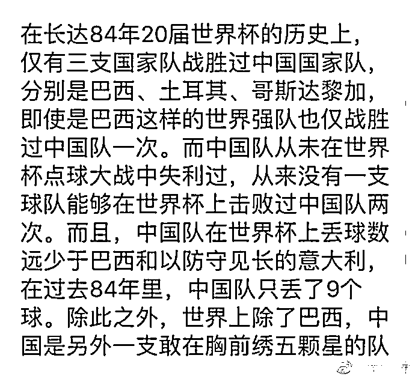
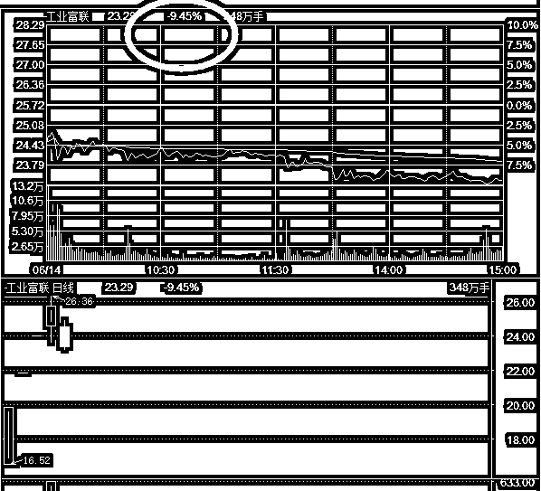
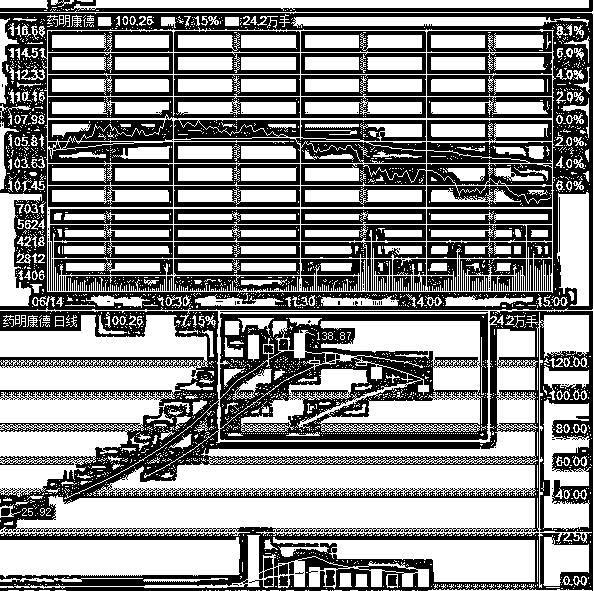

# 员工持股计划这个骗局终于露馅了

<link rel="stylesheet" href="view/css/APlayer.min.css">

今天，A 股首例员工持股计划爆仓了，上千员工投入的 1.3 亿血本无归，员工持股计划这个被质疑了一二年的骗局，终于露馅了。

所谓员工持股计划，本来是一种外国的股权分配激励制度，让员工和公司共命运，原本是个好制度。但是前几年被引入 A 股后，被异化为一种炒高市值的工具，因为大股东在里面加入了一个条件，那就是兜底。

中国特色的员工持股计划，是一种让员工集资然后通过资管计划配资买入，员工不敢买怎么办，大股东兜底，如果员工持股计划赚了，收益全部归员工，如果亏了，大股东负责赔偿。天底下怎么会有这么好的事情？大股东是雷锋吗？

事实并不是，大股东通过这一手段，有效的刺激了股价的上涨，然后偷偷卖出私下持股部分来获取利润，员工持股计划已经变成了一种题材和概念，是拉升股价的利器，于是出现了很多花式员工持股，甚至还有区区几十万元的象征性员工持股。。。

今天，凯迪生态(000939)披露了一份《关于员工持股计划一般受益人份额丧失的公告》，核心内容是：员工持股的资管计划低于补仓线，要求大股东补仓，但是经过反复沟通后，大股东拒不补仓，于是这个凯迪生态成为了 A 股首只员工持股计划爆仓股，凯迪生态可不是象征性持股，本金 1.3 亿，资管计划总额 4 亿，直接爆仓了。

原本，员工持股计划能刺激股价的原因，就是因为大股东承诺，亏损他帮员工补钱，假设计划是在 20 元买入的，那市场会想了，大股东一定会想尽办法，不让股价跌破 20 元，那么市场向上的空间就很大了，肯定会刺激一波大涨，现在大股东兜底被证伪了，那么所有的员工持股计划，都变成了废纸一张。从去年开始，对员工持股计划的质疑不断，但是还是有源源不断的新计划出来，市场只是缺一个证明的材料而已，今天这个活材料出来了，员工持股计划这个骗局终于露馅了，大股东兜不了底，所以他也不应该具备刺激股价的作用。

这个股目前停牌状态，利空一堆，大股东债务缠身，一旦复牌，注定是连续跌停，持有该股的人请注意。

~~~

明天晚上，是美国对华 500 亿关税的征收日期，对于美国的这一招，中国早就严阵以待，采用的对策也很简单，外交部发言人今天重申，如果美方出台包括加征关税在内的贸易制裁措施，双方谈判达成的所有经贸成果将不会生效。

简单的说，为了制衡美国的关税制裁，中国之前放弃几百亿美元的筹码让美国先吞下去，现在就让美国自己内部打成一锅粥，一部分既得利益者会出来反对另外一部分倡议增加关税的，大幅度减轻了中国的压力。

至于美国到底会怎么选择，猜不到，美国既然已经放出去的话，收回来也不好看，明天晚上这个雷怎么爆，市场都在拭目以待。

~~~

今晚好多人谈世界杯，我不是球迷，不懂足球，不过下面这个图流传挺广的，给大家看一下，国足实在是太强大了，我看了一下，下面这个图说的，全是事实！

~~~

富士康今天跌停，对富士康预计的 3 个板，以及昨天说的，再涨子公司估值就超过母公司了，判断还是准确的。但是其实最关键的是，证监会插手了富士康的炒作，电话指导了很多大户，否则的话，管你什么估值，直接炒上天。。。。

对应的，药明康德这个股，开板后也是一路大跌，价值回归。

同比之下，我们可以预测宁德时代这个独角兽的开板日期，不是明天就是下周一，跑不远了。

现在整个大盘的抵抗是越来越强烈了，今天开盘的迅猛反弹足以说明这里的抵抗意愿，而实际上，因为今晚还有一个关税的雷，是肯定涨不多的，而明天，又是端午节前最后一个交易日，所以又被砸回去了，但是第一开盘市场反弹是非常强烈的。第二，今天再次出现了护盘的迹象，蓝筹主抵抗。

大概就这样，我个人估计，熬过明天是最后一关了，熬过明天的震荡，下周就要开始反弹了，我有强烈的信心，所有的利空都是超大个的，但是都没砸死，目前死守防线中。

往期回顾（回复“目录”关键词可查看更多）

为什么中国必须购买美国国债？| 租房贷款会将房子拆分成房骨和房皮 | 宁波老虎事件遇难者不应该得到赔偿 | 中国的房价什么时候会崩盘？ | 中国地产达到什么样的条件会崩盘？| 你根本不知道烟草公司有多赚钱 | 如何把自家孩子培养成一个顶尖人才 | 我是如何保证自己不近视的

