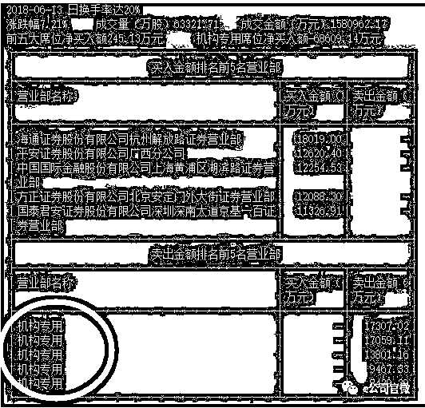
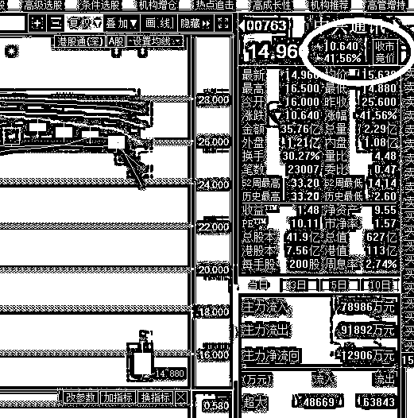

# 富士康开板对大盘抽血 158 亿 | 夜报

<link rel="stylesheet" href="view/css/APlayer.min.css">

今天，富士康如预期一样的开板了，没有实现第四个涨停，止步于第三个，同时，也如预期的一样，对大盘造成了天量的抽血，今天，富士康的抽血效应规模达到了 158 亿，吓呆众人，要知道今天上证总成交才 1559 亿，创业板总成交才 589 亿，富士康一只股吸金 158 亿，这个是什么概念。

我不知道市场上总共炒新的资金有多少，但是我相信，抽离了 158 亿之后，剩下的就算有，也一定严重失血了。

我之前和大家说过，像独角兽这种巨无霸新股上市有二次重击，第一次是上市当天，会有几十亿资金封涨停板带来抽血效应，第二次重击是开板当天，会有百亿以上的资金买入造成更大的抽血效应，第二次是大于第一次的，二波都扛过去之后，对大盘的影响就会逐渐减弱。

富士康和宁德时代，会对大盘造成总共四次打击，后面还有宁德时代开板的当天，是最后一劫。

另外，今天富士康的卖出前五名，清一色是机构，买入的前五名，没有机构，我觉得机构卖出的逻辑也很简单，工业富联是富士康的子公司，估值居然要超过母公司了，这说明跌是早晚的事，如今不过是炒新资金趁着新股上市筹码干净，炒一把而已，机构不参与炒作，于是就直接退出了

今天晚上，美联储会宣布加息情况，大概还剩 5 个小时吧，明天早上起来看结果就行了，市场的预期是 100%加息，25 个基点，超过这个数值是利空，低于这个数值是利好。

中兴通讯今天复盘，和预期一样的一字板跌停，昨天在留言区里有人问我，我的回答就是开盘就摁跌停卖，运气好你还是能跑出去的，今天就 A 股就有 4000 万金额成交了。。。

那么中兴通讯最终会有几个跌停板呢，我昨天晚上在留言区翻上墙并回答的结果是，预估 2~3 个，因为利空太大了，反正前二天是铁定封死跌停的，但是今天港股的市场实践，告诉了我们结果，那就是 4 个跌停，因为今天港股的跌幅是 41%。。。

如果明后天港股涨了，那么 A 股就是 3 个跌停，如果明后天港股没涨，那么就是 4 个跌停。不管怎么样，我感觉 3 个跌停是吃定了。

昨天一根中阳之后，筑底图形已成，不过鉴于后面还有诸多利空在等着落地，所以我的总体判断是未来几天走势会反复磨底，非常平淡，涨不多，跌不动是主要形态。

目前美股走势平缓，估计今晚的加息应该是没太大意外的，15 号是 500 亿关税清单宣布日，也就是本周五，目前还不知道什么结果，但是市场担忧没解除前，是不太可能会涨的。

所以，今天一根阴线，刚好抵消了昨天的阳线，又回到了原点，这个底部磨的真的是非常煎熬，但是各种背离、钝化又是普遍存在的，这里就不列举了，简直是密密麻麻，从 30 分钟到日线级别，清一色都是背离存在，所有指标都指向这里筑底。

对于中线和波段持股的人来说，这里只有买入一说，理应达到正常调整范围内的最大仓位，也就是 7 成，这里向下一步，就是崩溃式暴跌，直接满仓捡便宜，如果没有一根大阴线，那就是反复磨底，如果这么多利空都打不穿底部的话，那么这个底部就厉害了，我认为可以支撑月级别的上涨。

简单的说，这个位置，判断为底部，死多，7 成，留 3 成等极低概率的超大黑天鹅，至于是不是底部，走走看呗。