# 高房租正在挤压富士康工人的生存空间

紫竹张先生

紫竹出品，必属精品

近日，富士康深圳员工在厂区张贴的一张《致富士康员工的公开信》在网上疯狂流传，公开信的起因是万科即将对深圳富士康工厂北门的清湖新村进行城中村改造，员工预计城中村房租会翻 2~3 倍，故而要求全面涨薪。

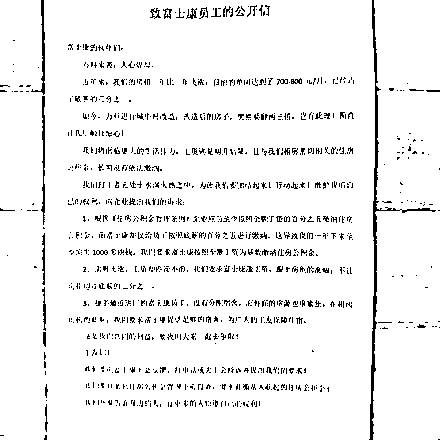

图片有点模糊，但是这是目前整个网络最清晰的一张图了，我就给大家文字表述一下，深圳富士康一位员工表示，目前他所住单间的月租已经达到了 700-800 元每月，达到了每月底薪的 1/3，但是万科入驻城中村改造后，估计租金会涨 2~3 倍，实在无法承受，于是提出涨薪要求。首先是要求增加住房公积金，目前富士康仅按照员工底薪的 5%缴纳住房公积金，公开信要求足额缴纳，大概一年可以多 1000 块钱，同时富士康解决员工宿舍数量不足的问题，或者涨薪以便每月房租不超过底薪的 1/3.

当天夜里，万科发布公告，表示万科对城中村的改造会大幅度提升租房的质量，但是并不会大幅提升租金价格，城中村改造前后租金价格会处于同等区间。

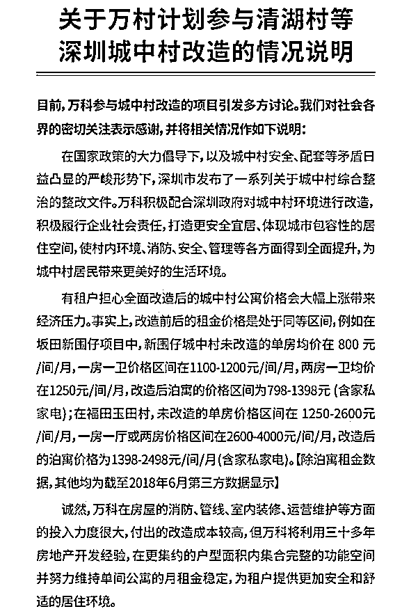

一个说房租会翻 2~3 倍，一个说房租不会涨，到底谁说的对呢，我们来搜一下事实。

城中村改造

此次事件源于万科对富士康北门的清湖新村进行城中村改造，首先我们要知道什么叫城中村改造，是把整个清湖新村拆掉之后重新建小区吗？

不是，城中村改造是广州深圳目前非常流行的一种城建模式，我们知道，广州深圳那边，由于改革开放的比较早，有很多城中村是非常有钱，他们通常都会在自己的土地里“种房子”，一般都盖起来十几层的房子出租赚钱，通常都是握手楼，布局规划混乱，安全条件差，租房质量低，但是价格非常便宜，是民工的首选。

这种房子，建筑密度太高，拆迁的成本没有任何企业和政府能承受，于是万科提出了一项创新性发明，就是和农民房签长约，万科收到房源之后进行投资，改造成高端公寓之后出租给白领，我们来看一个网上公布的，广州城中村的万科泊寓改造实战案例。

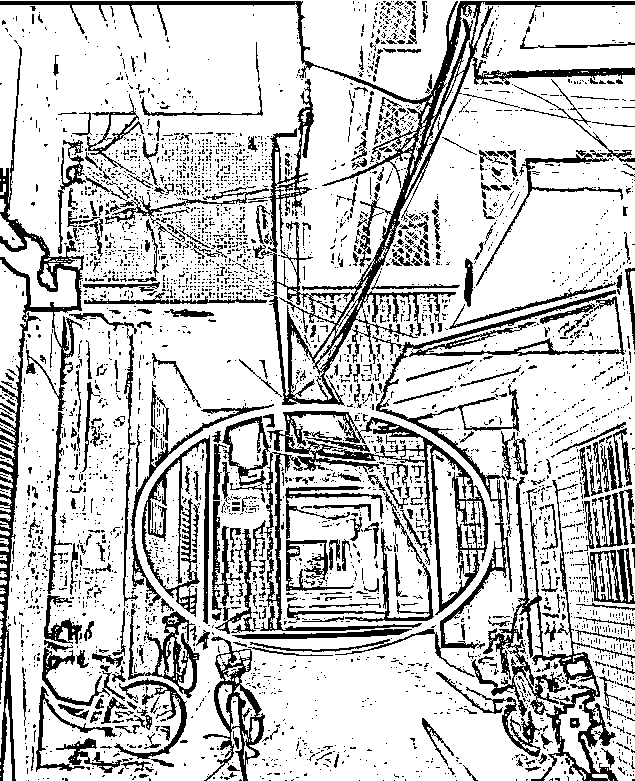

破旧凌乱的典型城中村握手楼内，有一栋楼被收为房源并进行改造，我们看看改造后的内景图，首先看看入门大厅。

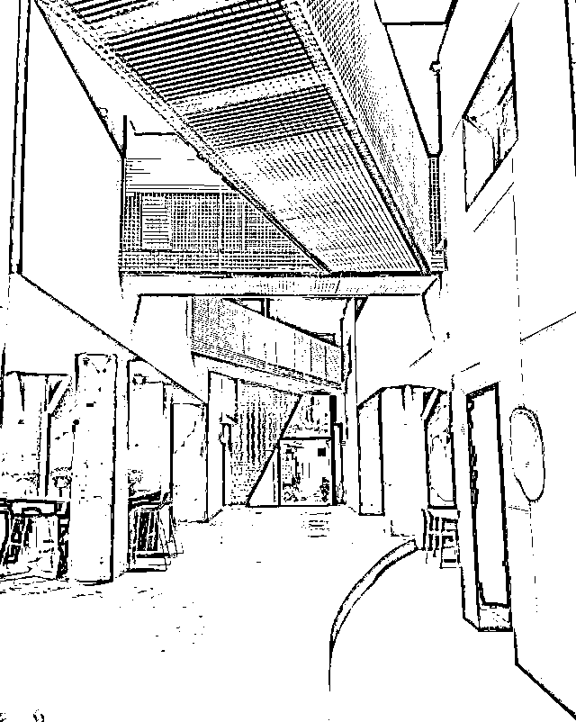

然后有公共厨房，一人一柜，付费使用。

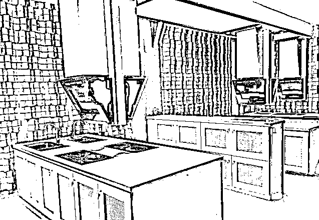

室内剪影，一室一厅一卫，租金大概 2600，万科一口气收购了 5 个连在一起的握手楼，然后把他们全部打通改造成了 120 间房，至于改造的效果，我只能用变魔术来形容，这基本上就是七天如家酒店的简配版了，除了没有电梯和小区，周围治安略差之外，这价格简直太实惠了，完全符合宣称的改造成公寓给白领使用。

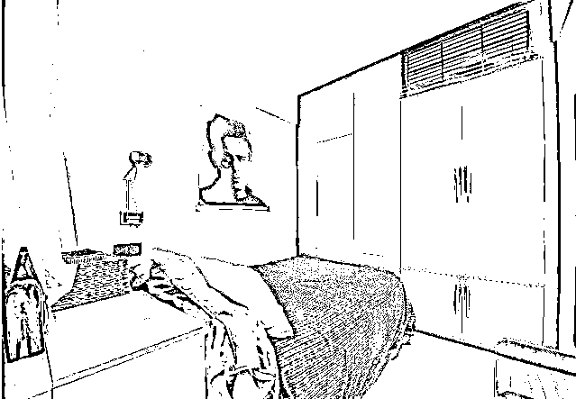

首先给万科这种城中村改造的行为定个义，符合城市进步的发展方向，让城中村得到了全方面的提升，我认为应该支持并鼓励，是城市白领的福音。

蓝领的愤怒

这种变魔术一样的城中村改造，大幅度提升了租房的质量，这一点无可否认，但是这样的改造肯定花费不菲，大家都是有经济学常识的人，企业再厉害，也不能做亏本的买卖，在上面万科的公告里，我们可以看到，他提到新围仔城村改造后租金在 798-1398（含家私家电），真的这么便宜吗？

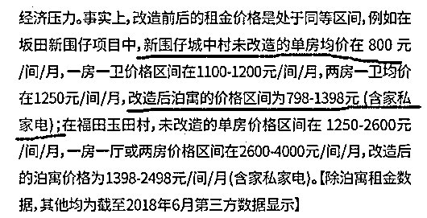

公开信息显示，新围仔居民小组城中村改造项目由万科承包，计划工期为 2017 年 8 月～2019 年 8 月，目前改造尚未彻底完成，仅有样本房，不过给记者的报价，的确是这么便宜，相比改造前，只涨价 10%

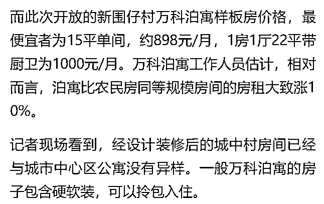

好像真的是这么便宜，那么为什么富士康的员工说租金要翻 2~3 倍呢，因为同在新围仔村，毗邻万科公寓的竞争对手魔方公寓已经开门营业，他报出的价格是，最低单间 2500 元，导致网友普遍怀疑，等万科的公寓放出来之后，也会参照此价格。

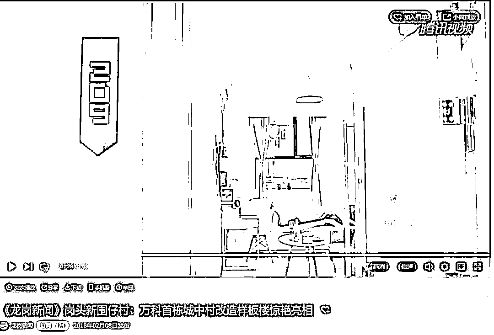

从道理上讲，改造需要耗时 1~2 年，就算按一年算，这期间给原房东的房租也是持续支付的，租期只有 12 年，加上改造的耗资也是巨大的，如果仅仅提价 10%，这笔账怎么算都是亏本生意，像魔方这样完成公寓改造后，直接把租金从 800 元提升到 2500 元，才是正常的市场定价行为。

亏本的生意是无人做的，除非万科真的不打算赚钱。所以富士康员工担心万科改造完成之后，后面会年年涨租金，直到拉回可以盈利的价格，这个担忧是有道理的，改造成这么好的公寓，下图这种靓丽的房间，报价才 800 元每个月，别说富士康员工不信，我也不信。这不是良心不良心的问题，这是违背经济规律的，如果万科的施工水平和成本控制真的高魔方公寓这么多，那么魔方公寓趁早破产算了，损失还能小一点。

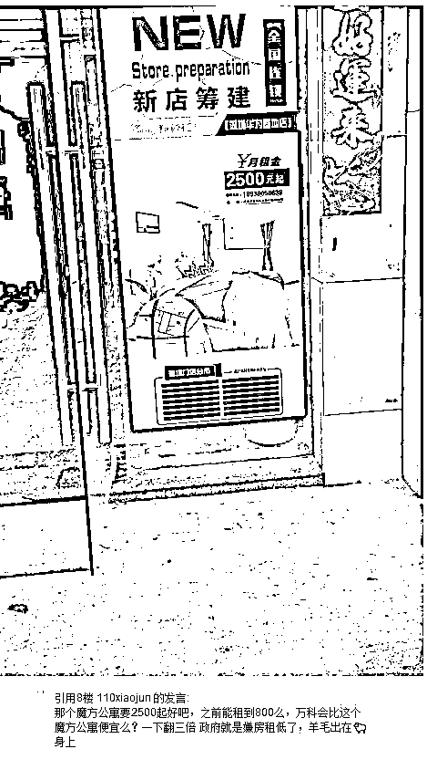

但是实际上，我们只是从成本进行推测万科亏本运营持续不了多久，未来可能会涨价，但是那只是猜测，至少目前万科并没有涨价，新围仔村项目作为万科在深圳的首个标杆性项目，目前改造完成的部分，也是低价出租的，涨幅并不离谱，为什么富士康员工的矛头对准了万科呢。

万科是在给高房租背锅

**我个人认为，万科只是个背锅的，我们看看下面这个数据。**

富士康的员工在过去的几年里，承受了房租的疯涨，但是自己的工资却没怎么涨的窘境，在万科的万村计划开启之前，清湖这里的房租就已经从 380 涨到了 850，而金地入驻后，公寓改造的现实给了富士康人重重一击。

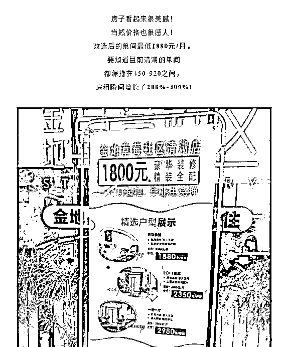

在清湖，在万科改造开启之前，金地就先开始了公寓改造，改造完成后，单间最低价是 1800 元，这个价格是富士康人根本不可能承受的。

尽管万科承诺将努力维持单间公寓的月租金稳定，为租户提供更加安全和舒适的居住环境。但富士康工人租客对于价格实在敏感，除了略微上涨的房租，甚至还考虑到了每月上百元的物业管理费用等杂费。

而万科对清湖的大规模改造开始后，不管后面的租金到底有没有涨，短期之内有不少房子被腾出来进行改造工程，造成供不应求助推租金上涨这个是不可避免的。

对于富士康的工人来说，房东涨价他只能接受，万科改造他也只能接受，他唯一能做的，也就是去工厂门口贴个公开信看看能不能涨点薪水来支付日益飞涨的房租了。

高房租正在驱赶低收入人群

即便万科不改造，清湖村的房租也是年年飞涨，万科改造只是矛盾激化的导火索而已，飞涨的房租正在驱赶低收入人群。

按照黄奇帆的六分之一理论，一个正常的租房价格，应该相当于月收入的 1/6，一个正常的购房价格，应该相当于年收入的六倍，否则，痛苦指数就会很高。那么按照这个理论，月租金 1000 的单间，月入 6000 的人才能去租，富士康工人月入仅 3000，负担达到了 1/3，自然不堪重负。

除了高房租之外，困扰深圳富士康的还有另外一个问题，那就是土地不足，富士康园区内是带有员工宿舍的，环境不错，价格仅为 200~300 元每月，但是随着富士康的迅速发展，员工数量越来越多，宿舍不够用了，但是深圳土地不足，没有多余的土地拨给富士康，就算有，富士康也买不起，深圳富士康的员工宿舍只能优先分配给高学历人才，而最低收入的那群人，连宿舍都分不到，只能去厂外的城中村居住。

在 5 年前，这不算什么事，因为城中村单间月租三四百，厂区宿舍八人间也要二百，差价并不大，厂外的单间住起来还自在些，但是如今城中村月租涨到了 850，这个差价很多工人就无法承受了。

对此，富士康唯一的解决渠道，就是把新的产能和工人，都移到内地去，在土地比较便宜的内陆省份，大面积的修建员工宿舍来解决住宿问题，至于深圳的富士康，受限于土地价格，员工流失和被迫搬迁，我觉得只是时间问题。毕竟，华为的工程师只是买不起房，而富士康的工人是连租都租不起了，这是真待不下去了。

一个城市，如果没有实业，只有地产和金融，那只是空中楼阁，目前深圳的高房租已经开始对最低端的蓝领工人产生了明显的挤出效应，他们连深圳最便宜的房租都租不起了，而随着房租的持续上涨，被挤出的人群会迅速扩散到月入 5K、8K 甚至更高的群体。

因为，不是所有的人，都像富士康工厂那样坐落在郊区边缘，还有城中村那么便宜的房子可以租，相当多的企业员工，是租住在市区内的，房租单间基本都是 3000 起步，按照 1/6 理论，他们是非常痛苦的，而实际上，整个深圳，月入高于 6000 元的，恐怕连一半人口都不到，实际上，很多人是在拿 1/2 的收入在交租，典型月光族，之所以他们还能抗下去，就是因为还能剩 3000 可以供花费，而富士康的最低端工人月入 3000，交 1000 房租，剩下 2000 只够维持基本生活花费。

所以，只需要整体房租再稍微涨一点，月入五六千的人，一样会被挤出去，第一步是从市区挤到郊区，第二步就是彻底被挤出这个城市。但是实际上，房租是跟随房价上涨的，相对于房价来说，目前的房租过低，深圳的年化收益还不足 1.5%，收 70 年房租才能拿回买房钱，而房租的上涨已经达到了临界点，工人的收入不提升上去，再提升房租，唯一的效果就是把人赶出这座城市。

都说高房价挤压了制造业的生存空间，但是一直没有活生生的例子，这次的富士康员工发出的公开信，让我们直接感受到了高房价的威力，高房价带来的高房租正在驱赶低收入人群

这种情况不能再继续下去了，整个城市的活力，都在逐渐被房价所吞噬，等整个城市和产业都失去活力的时候，损害的是我们所有人的利益。

<link rel="stylesheet" href="view/css/APlayer.min.css">

往期回顾（回复“目录”关键词可查看更多）

为什么中国必须购买美国国债？| 租房贷款会将房子拆分成房骨和房皮 | 宁波老虎事件遇难者不应该得到赔偿 | 中国的房价什么时候会崩盘？ | 中国地产达到什么样的条件会崩盘？| 你根本不知道烟草公司有多赚钱 | 如何把自家孩子培养成一个顶尖人才 | 我是如何保证自己不近视的

