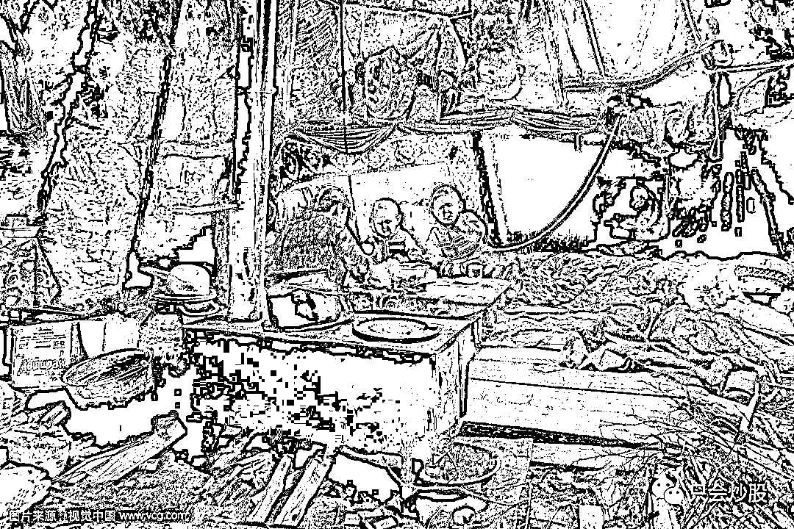
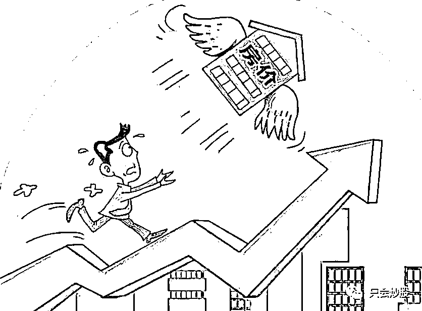
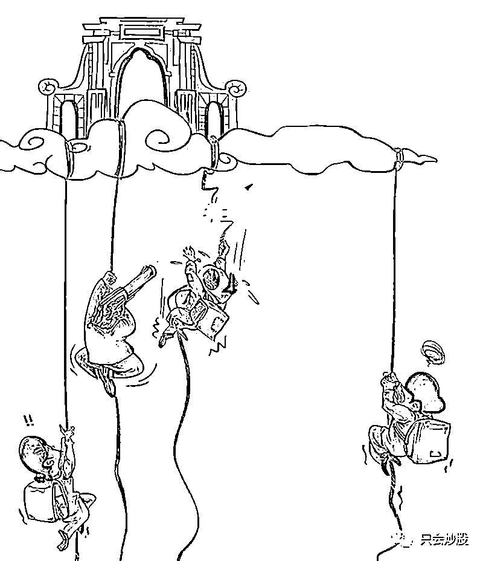
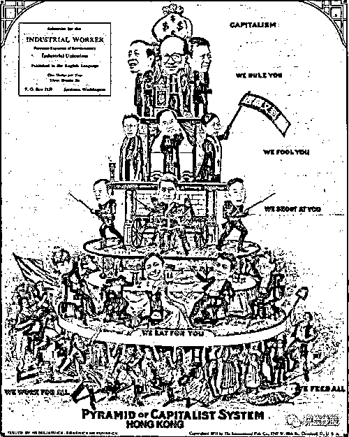
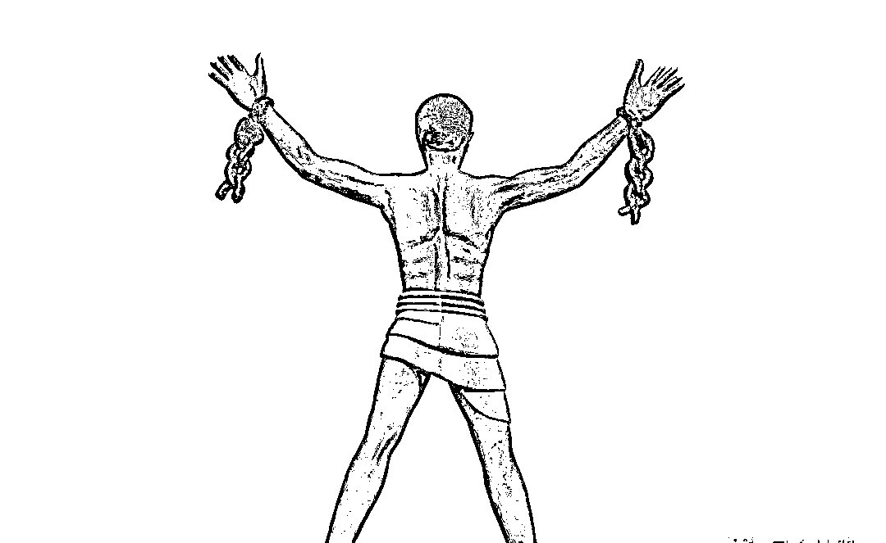
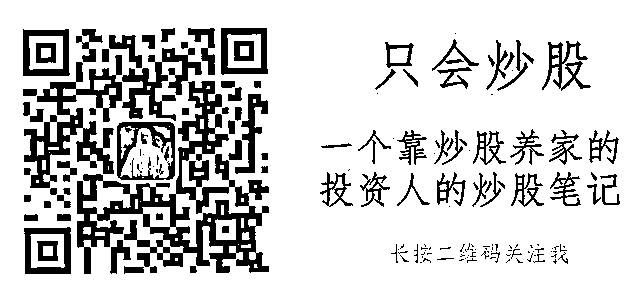

# 用野心化解焦虑，用行动击碎贫穷

**1、哪来的焦虑？**

小王近来找我诉说，经常夜里 2 点钟醒来，5 点钟又睡去，7 点钟起床，匆忙洗涮，扒上两口饭，看上一眼母亲照顾的咿咿呀呀刚会走路的儿子，转身出门上班。不知不觉这种状态已经持续半年了，左边眉毛掉了很多，睡不着的时候很多事情在脑海中来回不停的穿梭。他曾以为可以这样的混吃等死。现在经常睡不着的时候想的最多的是“他还能干啥”，他说：“一把年纪低不成高不就的，上有老下有小每月有房贷。”

说到底手中没粮，心中慌慌。焦虑这东西不是你能控制的。

焦虑的根本是贫穷

盖茨说其实人生是不平等的，而我常常觉得，对你我这样的共产主义接班人在贫穷上是平等的，因为我们贫穷与生俱来，胎里带。也就是生而贫穷，生而平等。

对比过去我们日子是好过了一些，至少饿不死；四肢健全，脑子不傻也不会流落街头，但同一个时代，我们的焦虑更多的原因是我们对“穷”的标准早就不是过去的那一套了。

50 年代，结婚基本上不用准备什么，两个铺盖卷到一块儿，就算结婚完事了，基本不需要什么结婚礼物。条件好的，会简简单单摆一桌酒。

60 年代，结婚开始有点讲究了，按老一辈人的话说，得凑够“72 条腿”或“36 条腿”，也就是去木匠铺订做个大木床、大衣柜和桌子、椅子等木制家具。看来凑够“72 条腿”或“36 条腿”也得需要不少东西啊，每个椅子四条腿，9 个椅子才凑够“36 条腿”，18 个椅子凑够“72 条腿”。

70 年代，结婚讲究“三大件”（自行车、手表、缝纫机），加上“一响”即收音机，称之为“三转一响”。谁要是戴上一块上海牌石英表，骑着一辆永久牌自行车带女方出门，左邻右舍都会羡慕的。不亚于今天开着敞篷的跑车，拿着镶钻 的 iphone。

80 年代，要求更上一层楼。必须有电冰箱（一般都是单门的）、电视机（一般都是黑白的）、洗衣机（一般都是单缸的）这“三大件”，才算成了家。

90 年代结婚的人，其婚房大多还是单位分房。男方准备些金戒指、金耳环、金项链等一些首饰，房子搞个简单装修，外加彩电、洗衣机（摩托车）、录像机（影碟机）这“三大件”，就算是豪华迎娶了。

00 年代结婚的人，三大件，房子，车子，票子。北京地区：房子，车子，船。

再对比一下对“富”的定义

七十年代，家有万元，即为富

八十年代 万元户 贫困户，十万元 刚起步

九十年代 百万元马马虎 千万元才跳一步

新世纪初，一千万 脱贫户因为北京的阿姨对我说在北上广深这种城市一千万刚刚脱离扶贫对象。

如今呢？

在北京上海深圳随便买个房子，就是一千万。牢里没亲人、医院没病人，这样的日子还能凑合过。一旦有点风吹草动，就像前段时间北京大爷一个感冒，一个月的时间花了一百万，钱没了人也没了，让人揪心，感同身受，内心不免唏嘘不止。如果再提高一下标准，没有一个亿 ，都算穷人。用王家人的说法，没有实现小目标的人 就是穷人。

在阶层固化越来越明显，阶层上升越来越难的今天，我们的工作性收入增长的太慢，主要原因是被动收入指数级的增长太快，因为有钱人的投资收益越来越高，速度越来越快；因为房子涨的太快，资产泡沫越严重，普通大众被动贫穷。而另外一个真相是绝对穷人是少了，缺衣少吃的时代过去了，这是科技推动生产力产生的红利，但相对穷人的数量在不断增多，就像《北京折叠》书中说的，我们永远都处在金字塔的低端，顶端的数量是稀少的，位置有限的。向上的通道愈发狭窄，在社会两极分化的现实当中，绝大数人在焦虑中贫穷。

我们常说自己输在了起跑线上，不能让孩子也输在起跑线上，我们拼了命的买老破小的学区房，来换取优质学区资源；拼了命的给娃报各种学习班，各种补习；拼了命的当虎爸虎妈，生怕落人一步；因为我们自己体会到起点不同，是造成贫穷的第一个基础来源。我们都想自己的孩子是富二代，出生在赵家，王家、李家、马家之中，或者天中大奖，一夜暴富改变命运。是不是我们必然贫穷一生呢？也非绝对。

但从社会发展的角度在历史的进程中，一个社会结构越稳定，人们变成富人的概率就越小，因为金字塔上层永远是极少数人。马太效应从宏观上一直都是正确的，强者愈强、弱者愈弱。社会越发达，阶层越固化。

 

贫困的起点，阶层的固化，会限制思维宽度和深度。限制的思维蒙蔽了我们的双眼，造成我们认知的贫穷。你站在山下肯定没有站在山上看的远，认知的贫穷反过来又限制了我们的视野和思维。

2、贫困的第二个来源，是个体的贫穷思维。

什么是思维的贫穷？

就是一个锤子满眼中都是钉子。从古至今一直在流传的“三个老汉想当皇帝”的笑话。为什么到现在还有它存在的价值: 因为它对现实太有讽刺意义了。

三个老汉一天碰到一起了，于是就聊天， 聊着聊着就聊到了皇帝身上。

第一个是个拾粪的老汉说:“如果我当了皇帝，我就下令这条街东面的粪全部归我; 谁去拾就有公差来抓。”

第二个是个砍柴的老汉瞪了第一个老汉一眼说:“你就知道拾粪，皇帝挑粪干啥? 如果我当了皇帝，我就打一把金斧头; 天天用金斧头去砍柴。”

第三个是个讨饭的老汉听完后哈哈大笑，眼泪都笑出来了，他说:“你们两个真有意思，都当了皇帝了，还用得着干活吗? 要是我当了皇帝，我就天天坐在火炉边吃烤红薯。”

这些老汉们就是想坏了脑子，也不知道皇帝是如何生活的。

他们局限的思维就框定在自己狭小的思维范围内，

因为你不但没吃过猪肉，你连猪跑都没见过，甚至你根本不知道还有猪这种东西存在。你怎么会去想猪呢？

思维的穷困 直接影响到个人的舞台的拓展，能力的发挥，最终在财富积累的表现上出现严重错配，你本来能吃上猪肉的，如果你知道猪的存在的话。

思维的局限，不但可以使起跑线落后很多的人，最终确定地跌入贫困，也可以使禀赋起点很高的人，坠入普通阶层，完全抵消起点优势。

贫困的思维一旦没有打破，造成认知的局限。它就会与行动相互加强，如下这个过程就会循环往复，自我实现：

*认知局限-穷人思维-穷人行动-认知进一步局限-穷人思维强化-更局限的行动-贫穷实现。*

个体的突变是因为内因发生了变化，他不想安于现状的日子，他想有突破，他这个时候野心开始萌发，但，对于相当一部分人来说：

沦为穷人，是个体不自觉的自我选择，自我安慰，自我实现的结果。

3、野心与安逸

当听闻中兴的工程师跳楼之后，小王向我诉说欧某新的往事，我觉得有必要写一些文字，死是最简单的事情，每个人都要毫不费力的走这一道。但活着，如何精彩的活着才是我们活着的意义。

欧某新错就错在

追求「安全感」和过分稳定的生活工作环境，忍受当前的压力，小安既富的思想，有点风吹草动，有点家庭波澜，不顾一切的让自己解脱。有点野心的人不会顾及这种压力，他如果拿出 5 年前在深夜加班还在考取研究生的思想，用野心占据焦虑的时间，冲破思维的贫困，一定不是今天这种选择。

在个人成长和财富积累的过程中，如果追求稳定，那么认知边界，就会死死地被限制在一个狭小的空间里，我们也走不出思维贫困的牢笼。

阶层固化的年代，很多人焦虑，又有很多人坦然，觉得现在的日子很安逸，不折腾也挺好，日子不是跟你们一样过得有吃喝？但有人说互联网不就拉近了大家的距离吗？

互联网在缩短信息差的过程本身就是一个造富得过程，可惜的是，目前互联网的发展还不能达到造福的作用。可以预见的未来，互联网将会使社会趋于公平，但公平并不意味着题主能打破既有的阶层举个例子两个同样出生在小镇的人，考上一线城市的大学，怀有野心努力留在北京上海这样的城市打拼，尽管三五年之内过着比小镇的伙伴辛苦得多的生活，但是他的思维和眼界，正在逐步升级为皇帝的高度，而不是全国的大粪都是自己的。而小安既富，放弃拼搏，没有野心，安安稳稳的小伙子可能思维里都是满脑子的捡大粪。

但再过个三五年，你把时间拉长你就会发现你会发现

一线城市小伙子升级的思维影响的行动，和小镇里的，天壤之别。

野心小伙设计游戏的时候，你在打王者荣耀

野心小伙互联网创业的时候，你在抢 APP 的优惠券

野心小伙被动收入大幅增加，资产收益不断新高的时候，你在舔酸奶瓶盖。

野心小伙和安逸小伙的对比，仅仅是追求稳定导致思维贫困的一个维度。

其实这样的场景无处不在。

别人在充满激情和野心的工作，而你只愿意在机关单位进行稳定的工作

别人在不断的试图创业，而你只愿意购买彩票幻想发财

别人在天天锻炼身体，而你只愿意喝鸿茅药酒幻想强身壮体。

人人都会同意，折腾是一件反人性的事。

反人性是什么意思，意思就是，没人逼你，你是不会去做的。

凡是学有所成，做有所成，都是经历一番折腾，不断的用野心激发自己的欲望，最终突破了原有的认知局限，武装了自己的头脑，提升了自己的思维层次。

都说兴趣是最好的老师，但别忘了，师傅领进门，修行在个人。

莫扎特六岁第一次写协奏曲，在这之前，父亲已经指导他练习超过了 6500 小时；稍微了解郎朗、李云迪成长经历的人，就会知道他们小学时每天就起码练 5 小时的琴；立志成为钢琴家后，每天更是全天练习，全年无休；

丁俊晖八岁半开始练台球，初一辍学后，每天平均练 10 小时，18 岁成为英国锦标赛冠军时，已经练习超过了 1.75 万小时； 盖茨高中时就在编程，事业成功之前早已经编写了数十万条程序了；巴菲特在 2011 年投资 IBM 之前，看过 IBM 50 年来所有的年报，而在 1988 年决定投资可口可乐之前，阅读过该公司 1892 年之后所有的年报......

在稳定的环境里，在混吃等死，一眼看到头的日子里。

你的思维，怎么可能逆袭，去升级指导你的行为？

   你每天按时上下班，经常吐槽公司的种种。你天天忙的像狗一样，拉皮条做项目，东奔西跑，你天天骂着自己的老板，又没有独立的野心。慢慢的搞坏了自己的心态，混吃等死，麻木了自己，

直到有一天你才知道

狗蛋搞了个十来张信用卡循环套现慢慢的从第一套房已经升级成 4 套房子了，原来没钱也能买这么多套房？

甚至你最看不上的驴蛋连年炒股亏损，突然在一个牛市后彻底扭转了人生。

你被震惊了，原来我们都差不多啊，原来人生还有这么多彩蛋。

你也想过经常丰富，财务自由，来去如风，远走高飞的生活，但你只是限于夜里睡觉是想想安慰自己早点睡觉，白天继续打卡上班，混吃等死。

你这不是野心，你这是幻想，你用幻想在安慰自己麻痹自己来应对焦虑。

因为你害怕失败

不稳定不安逸，就对应着风险。。可是不冒险，你永远就不知道冒险失败后，你要怎么处理这些烂摊子。

你得知道，每一个白手起家，获得大财富，完成阶层大跳跃的人，都是处理过无数烂摊子，经历了无数次失败才走到那一步的。

42 岁的任正非妻离子散，还欠下前单位 200w 的账务，借高利贷冲刺研发，用他的话说，如果这次再研发失败，他只能从楼上跳下去。

Jack 马带领十八罗汉 失败三次 再次团结团队创造了阿里帝国

连小目标的健林爸爸也是断臂求生，英勇果断的卖掉万达发展，万达酒店，卖掉海外资产换取万达集团的安全。

 一直在公司里上下班的人，他们的思维局限，就只是标准化传送带上一个螺丝钉的认知。你也是从网络上获取这些资讯后作为茶余饭后的谈资，在内心偶尔有点点小涟漪又随之泯灭。

一直追求安全感，追求稳定，害怕环境变化带来不确定性和风险的人，他们的思维，便被牢牢地禁锢在这「安全感」和「稳定」之中。

4、突破与被收割

每次时代变换，首当其冲的就是那些为稳定，安全感有着执着追求的人

像前两天下岗的收费员，二十年的青春都先给了收费站，除了收费什么也不会干

想想不断缩减员工，营业柜台的银行，AI 会替代多少简单逻辑重复性的工作

再想想富士康恐怖的关灯工厂，整个工厂在没有照明的情况下，无数个机器人 24 小时不停的工作。

从国际环境的资源分配到一个活动的组织安排，都是游戏规则的制定者，收割了游戏参与者的大部分利益。

现在网上闹得沸沸扬扬不就是中国要站在 5G 通信的制高点，建立标准，制定游戏规则，收割其他国际厂商吗。联想干掉了倪光南，怕花钱

干掉了程控交换机部门，这种追求稳定的企业，能有什么大的发展前途吗？

一个追求稳定的阶层，可能推翻一个制度，建立全新的体系吗？

一个没有野心，天天幻想，追求稳定，害怕风险的阶层，能自己建立全新的游戏规则吗？

一个小安既富，优柔寡断，患得患失的人能成立公司 收割别人吗？

这是不可能的，因为你怎么想的，那些经历过折腾，痛苦，怀揣野心走过来的人一清二楚

一旦有变，那些没有思维禁锢的人，实现野心的人就会毫不犹疑的手起刀落收割那些追求稳定活在安逸里的韭菜。就像健林爸爸裁掉万达网科 6000 人也就在一个晚上完成，就像乐视网的贾跃亭毫不犹疑的常驻国外，甩掉国内的包袱继续前行。

韭菜甚至都不知道，收割他们的镰刀长什么样。思维的局限，注定了视野的狭窄和他们被收割的宿命。

5、用野心  化解焦虑 用行动  击碎贫穷

逻辑到此，便不言自明了。

就像过去要想富先修路一样，要想要吃上猪肉，先得想办法看见猪跑。

看到猪跑的次数多了，自然就会萌生想要吃肉的想法。

看到别人都资产升级了你自然会突破原有的想法，萌生一点小野心

这一过程，便是产生焦虑唤醒自己萌生野心打破贫困思维的升级。

每天稳定地把自己囚禁在内心焦虑不安里，你上哪儿去看猪跑呢？你不走出自己的囚禁，焦虑永远都不会是野心，你天天焦虑自己吃不到猪肉是没用的，你要有天天吃肉的野心才是你的目标。

越追求稳定，越让怕失去。越怕失去更加焦虑，思维的局限无法打破，我们也只是幻想的巨人，行动的矮人。没有行动，所有的结果，都不会凭空产生。行动的局限，必将反作用于思维的局限，狭小的视野和追求稳定的想法激发更多的焦虑。

这一过程，不断加强的反自身行和啊 Q 精神的不断演绎

因为追求稳定，所以不敢也不愿冒险。

而冒险，无论成败，往往是打破思维局限最快最彻底的方式。

而行动，去尝试是我们探索视野禁区，思维盲区，实现野心的唯一方式。

稳定的追求的渴望，又让这些处在安全感之中的人们，被稳定地收割，而不自知。

当你稳坐思考稳定的时候，也就是你焦虑的时候，所以当人们亲手放弃了这些认知升级的机会，眼看着自己通过辛勤劳动的双手创造的财富，被那些「知道得更多」，「胆子更大」的人收割。

只要你一辈子都在追求稳定，那你必然在幻想中麻木自己，在焦虑中各种恐慌，在安逸中滑向贫穷。

值得庆幸的是我们生在高速发展的中国，各种人口红利还没结束，阶层的固化还没牢固，涌现的各种逆袭的机会还很多，虽然比前些年代竞争更激励，但当你拥有野心的时候，你会忽略掉这些困难，将自己从那些鸡毛蒜皮的世俗中解脱出来。

为此，作为生而贫穷的你我，

最应该做的，

怀揣自己的野心，

玩儿命冒险，拼命努力，快速行动，要有光脚的不怕穿鞋的的大无畏精神。

用野心化解焦虑   用行动击碎贫穷

作为新时代“无产阶级的我们”，行动起来 我们失去的是思想禁锢的锁链，我们得到的是自由。 

 

你不这样做你永远什么都得不到，

**属于穷人的，只有敢想的野心、敢做的行动和冒险。**

**作者：只会炒股**

