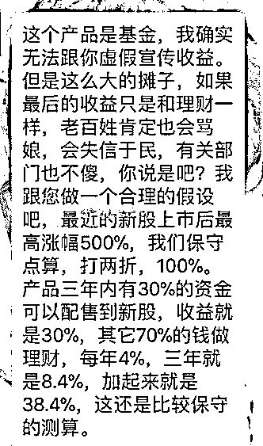
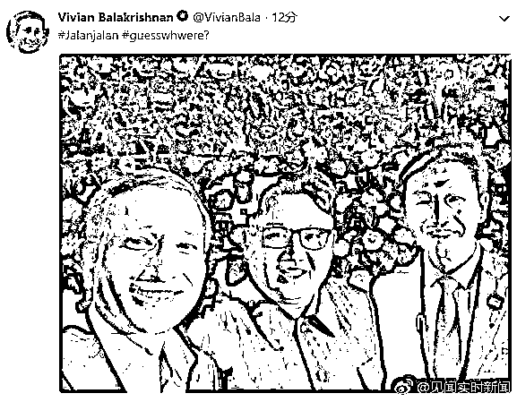
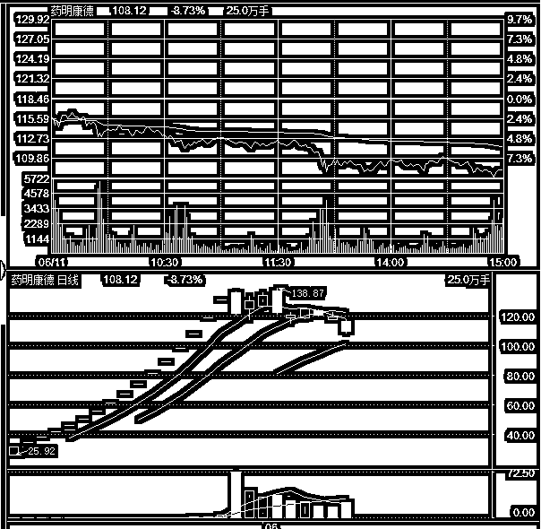
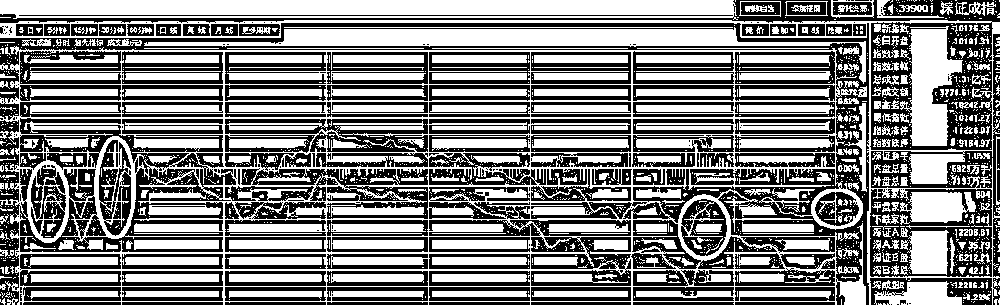

# 今天，销售能力最强的银行诞生了

周末，独角兽基金的事情网络刷屏，银行券商拼命推销之下，引发全社会的反感和猜疑，所以昨天深夜 11 点，证监会紧急下文，提到了三项内容：1、请各公司尽力控制募集规模在 200 亿左右。2、从收到通知起，不投入新的广告，不进一步宣传。3、以前广告中若有不合规的内容，比如“前所未有”，请修正并消除影响。

然后，市场直接解读为募资规模要从 3000 亿压缩到 1200 亿，毕竟单只基金的规模从 500 亿降低到 200 亿了嘛，这又引起了社会恐慌，是不是说基金卖不掉了，募资能力不足，那差了 1800 亿的缺口哪里去补？从股民身上抽血？

于是，证监会周一中午又紧急辟谣，：该说法系误读，根据机构部窗口指导精神，战略配售基金的规模门槛是 50 亿元即可设立，上限仍为 500 亿元不变。简单的说，就是之前 500 亿才及格，现在改成 500 亿是满分，200 亿是及格线，大概是这个意思。

从这里，我们可以猜出一点，就是周末的时候为什么券商银行都那么拼，很大的可能是，销售独角兽基金被当成一个政治任务来传达的，要求每只基金必须募集 500 亿，总共募集 3000 亿，如果别人都完成了指标，自己家没完成，那不是在领导面前丢脸嘛。所以周末的时候，各大券商银行发力那么猛，恐怕他们心中认为这个任务不是简简单单就完成的，必须要用尽全力。

所以周末的时候一看到舆论风向不对，引发了民众的全面反感，证监会就紧急修改政策，及格线降低到了 200 亿，为了实时了解基金的募集情况，监管要求基金公司上下午各上报一次信息；同时基金公司所有的宣传资料和新闻稿都要上报证监会，这让我等吃瓜群众，有了一次窥探机密数据的机会。

这一波券商银行全体出动倾力销售独角兽基金的活动里，谁家销售额最高呢，冠军出炉了，居然是招商银行。。。

按照目前媒体披露的数据，招商银行的销售数据遥遥领先，最低也在 120 亿以上，四大行卖的独角兽，加起来居然不足招商银行的一半，而全国 100 多家券商累计起来，第一天销售额总共才 57.4 亿元。

招商银行的业绩简直亮瞎眼，或许招行的规模不是最大的，但是这个销售能力真的是厉害，不过人红是非多，今天招商银行业绩碾压同行，一枝独秀，下午 5 点数据统计完之后，黑材料马上就被媒体放出来了，比如这个。

这个就属于严重违规了，一款公募基金，是必须盈亏自负且不承诺任何收益的，这位销售经理说保守测算 38%，属于特别强的诱导暗示行为，和公募基金的销售准则相违背，如果是国家出面保证 3 年 38%，别说 3000 亿了，3 万亿也被一夜抢空啊，你也不看看国债的收益率才三点几。

~~~~~~

美国和朝鲜将在新加坡举办特金会，双方领导人都已经飞抵新加坡，新加坡的外长今天还发了一张自拍。

所以明天的碰头会应该是没跑了，按理说，肯定会取得一定的成果，如果连一点共识都没有，双方的领导人是没必要见面的，费这么大劲见面，然后毫无共识，岂不尴尬。所以和平成果是必然会有的，大小而已。

对于全球股市来说，这都属于利好。

~~~~

华谊兄弟发了一则公告，华谊的二位老板王忠军，王忠磊，在原有的股份质押到期之后，直接质押了几乎全部股份，质押率达到 90%，媒体直接把这种行为类比成乐视网贾跃亭当初质押了 9 成持有股份的行为。

这个新闻吧，要展开说，那是可以说很深的，不过我觉得大家看到这些个数据就能理解了，我处于敏感期，就不谈了。

~~~~

还有一件小事，华舟应急今天改名为“中国应急”，我不知道这个名字是怎么过审的，居然放行这样的名字，这家上市公司的老总也真的是有创意，服。

别的不说，这个名字我就深深的记住了，以后每次股市大跌，他都会成为段子手的素材，然后知名度会越来越广，这个是可以预料的，就好像每次明星出轨，都会诱发红墙股份的大涨一样。。。

~~~~

今天，宁德时代上市，二大独角兽终于都上市了，而市场直接在上周五和本周一吃了二击重锤，刚反弹了点，又给锤回谷底了。

今天宁德时代对个股的吸血影响，可以从药明康德这个股里看的一清二楚，这个股本来是次新医药龙头股，属性是很好的，但是被炒的太高了，加上又是富士康和宁德时代的直接竞争对手。药明康德开板第一天有接近百亿的资金买入，估计是想着这是独一份，品种稀有，借着稀缺性炒一炒，结果没几天，富士康和宁德时代都来了，失血严重，药明康德直接变成了要命康德。。。

我昨天晚上给大家说了，本周利空特别多，最大的就是周一的这一枚炸弹，而结合总体形势来看，也只能硬抗，不适合卖出。

在今天的分时图中，可以明显看出，拉升都是短促的，下跌都是缓慢的，这说明是整体在卖出，而大资金在护盘，这是意料之中的事情，也是必然。

我并不介意总队的护盘行为，这个档口了，护总比不护好，我这个时候只秉承一个信念，如果本周的利空没有砸死大盘，全部挺过去了，那么大盘必定是彻底完成筑底开始向上。如果突然崩溃式暴跌，那么我剩余的 3 成子弹会立刻满仓入场捡便宜。

最怕的阴跌，不过 3000 点大关就在下面，他也阴跌不到哪去，不太可能慢悠悠的破了 3000，然后慢悠悠的向下，破 3000 大概率会引发恐慌盘，也一定会引来大力度护盘，崩盘次日，就是抄底时机。

毕竟，现在是涨是跌，基本都在证监会一念之间，他少抽点血，立刻就涨，多抽点血，立刻就跌，崩盘了责任谁也担不起，所以涨上天是不可能的，跌下地也是不可能的，无非就是拖一拖时间而已。

这个位置，加上政治形式大环境，不适合看空。