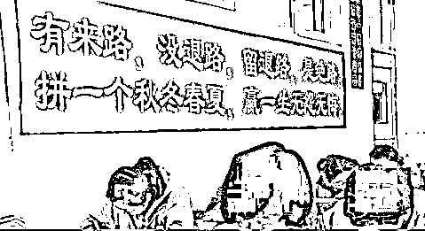
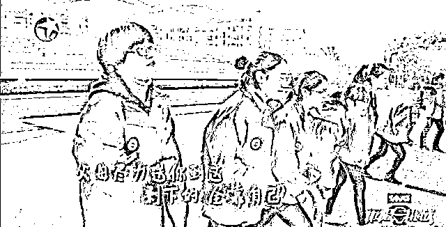
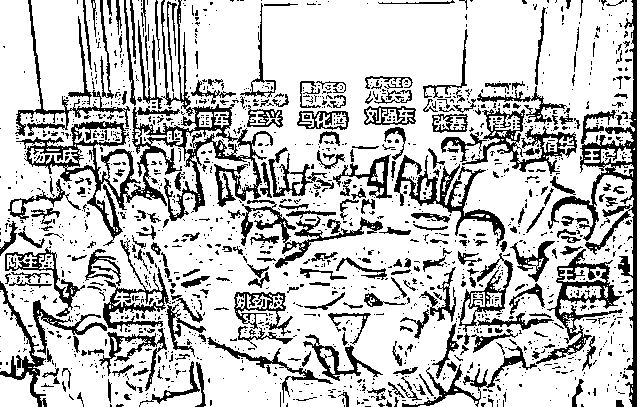
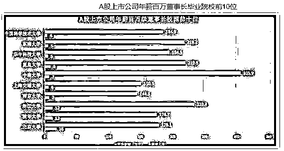
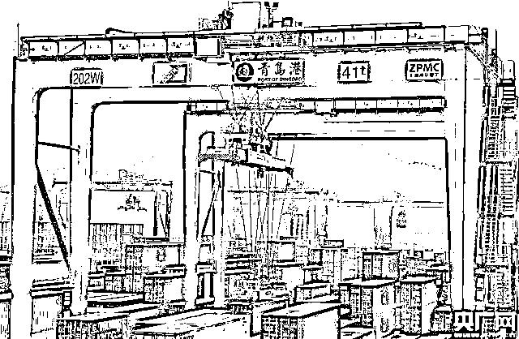
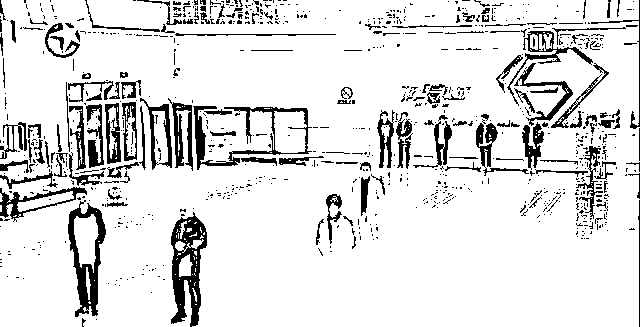
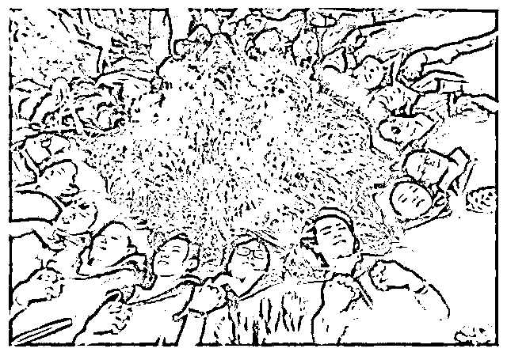

# 人生是场马拉松，而高考仅仅是下半场开始时的号令，不是终点

最近，看着网络上铺天盖地的有关高考的消息，不禁回想起自己当年高考时的情形。明明还历历在目，却早已时过境迁，感慨万千啊。你们的现在，是我们回不去的昨天。 

01

人生的起跑线

在最新的一季《极限挑战》里，设置了一个别开生面的游戏。竞赛分为上半场和下半场，上半场开始时所有参赛的同学均站在同一条起跑线上。然后主持人提问题，如果你的回答是肯定的，那就往前走六步到达下一条线。如果不是，那就站在原地。

他们提的 6 个问题分别是：

1\. 你的父母都接受过大学以上的教育吗？

2\. 你的父母有给你请过一对一的家教吗？

3\. 你的父母是否有让你持续学习功课以外的一门特长并还保持一定的水准？

4\. 父母是否有和你一起出国旅行的经历？

5\. 父母是否有曾许诺过送你出国留学？

6\. 父母是否一直视你为骄傲，并在亲友面前炫耀你？

在游戏过程中，有人一直前行，也有人一直停在原地。当问题问完，参赛同学之间的差距也被拉开。

下半场，让站在不同起跑线上的同学同时奋力向前冲。前 20 名到达终点的才能获得奖励。于是号令发起后，有人反超，奋起直追。

节目的深意也在此体现。

上半场，领先的同学依靠的是自己的原生家庭优势。

下半场，同学们就需要凭借自身的努力去追逐和超越。

每个人的人生就如同该游戏，高考前为上半场，上半场输了没有关系，下半场还有机会赢回来。而高考，便是下半场开始时的号令。 

02

读书无用论的骗局

近年来，不断有人鼓吹“读书无用论”。

韩寒当年不也是高挂七盏红灯，现在也算小有成就。比尔盖茨当年不也是大学都没读完就出来创业，现在成了世界首富。等等例子不一而足。

套用今年高考的作文题来说，这种想法便是陷入了“幸存者偏差”以偏概全的思维方式。

只看到有些人没有好好读书却能当老板、赚大钱，却忽略了那些因为没有好好读书而默默无闻甚至穷困潦倒的人。

那些所谓读书少、学历低，却能在社会上取得世俗意义上成功的人毕竟是极少数。更多的放弃读书学习的人，因为低学历缺乏竞争而不得不在社会上苦苦挣扎。 

比如此前传遍互联网的一张饭局合照上，我们可以发现，中国互联网的大佬们，是一群名副其实的学霸。 

还有人统计出了 A 股上市公司的百万年薪董事长们毕业院校分布情况。 

这说明学习好的高学历者，有更大的概率能获得传统意义上的成功。

从概率的角度来说，虽然不读书不上学也有可能获得成功，但是你的付出绝对不会比读书拿好学历的人少。

所以，不要再鼓吹读书无用了。

读好书、上个好大学还是能让你有更大的机会成为一个精英的，至少在大学里，能让你接触到真正的精英，并有靠近的动力和目标。 

03

体面又稳定是不存在的

如今你努力学习并考上好大学了，但是进入大学后反而开始松懈了。

毕竟原来家庭贫困的你，如果不念书只能去做些不体面的工作，而现在一旦毕业便能凭着那个学历找到一份体面又稳定的工作。

于你来说，相当于是改变了既有的命运轨迹，具备了由穷变富的可能。

但有没有人告诉过你，在过去，一份体面又稳定的工作只能保证你的温饱。而如今，你的稳定工作随时可能离你而去，到时候你连温饱都没有着落。 

今年年初，唐山撤销了路桥收费站，没想到遭到了收费站工作人员的反对。反对理由很奇葩“我今年 36 了，我的青春都交给收费了，我现在啥也不会，也没人喜欢我们，我也学不了什么东西了！”

在收费站还是香饽饽时吸引了不少大专甚至本科的毕业生前来，这些毕业生以为就此可以过完安稳又体面的人生，并且周围的人都是如此，于是开始松懈，安于现状。

当变革来临给了当头一棒时，不去反思自身，居然还义正言辞地说自己学不了其他东西了，意欲让别人对他们的失业负责。 

都知道，收费站的工作时清闲又简单，并无太多技术含量。

而就是这样的一份工作，都要求至少大专学历并通过相关考试才能择优录取。曾经是多少人心心念念的体面又稳定的工作之一。

结果现在随着信息技术的变革加快，高速路收费站的工作从此不再需要人工操作。一大批工作人员面临着失业。

套用一句网络名言：时代抛弃你，连一句再见都不会说。 

收费站的变革只是社会上的一个小小缩影。随着人工智能时代的到来，此类机器替代人工的事情会越来越多，最先被替代的便是如同高速收费这种稳定的重复性工作。

去年 5 月青岛港自动化码头正式投入商业运营。整个码头上见不到一个人，是全球最安全环保、智能高效的码头之一，并两度刷新了集装箱作业的世界纪录。 

今年以来，在新闻上看到智能分拣机器人已经见怪不怪了。用人工智能机器人分拣包裹不仅速度快，而且精确率近乎百分之百，还会自动充电，永不疲倦。 

近日，浙江一家公司还研究出了一款产品“再生资源全封闭自动化分拣设备”。说白了就是垃圾分类机器人。

同样的，用该机器人进行垃圾分拣不仅效率高、无出错率，并且识别垃圾的精确率也高。 

看到这些，你还敢说希望找一份“体面又稳定”的工作么？

所以考上一所好大学并不意味着你就可以开始松懈，这仅仅是对你勤奋学习的奖励。

等你毕业凭着这份学历找到了好工作也不能就此止步，这也仅仅是对你大学四年没有虚度光阴的奖励而已。

人生的赛道才刚刚铺开，正是需要持续发力的时候。一张录取通知书，一张文凭仅仅是你过去努力的证明，代表不了你的未来。

你的未来，能靠的仍是自己的努力与上进。

出了校门，你的竞争对手已经不再局限于学校里的同龄人了，你面对的将会是整个社会阶层，甚至还要加上近在眼前的人工智能。

如同逆水行舟，不进则退。 

04

人生是场马拉松

节目最后，极限男人帮（黄磊、孙红雷、黄渤、罗志祥、王旭）和极限智囊团也做了同样的测试。

极限智囊团中有杜克大学在读的人工智能学者，有现曾经的亚运会双冠军，有国内某反恐部队的现役军官，有计算机产业行业从业者，有曾就读于英国皇家野外陆战队的野外生存家。

当问题结束，极限智囊团的成员已经走出去好远，而男人帮成员仍旧在起点。只有孙红雷在被问到“你的父母是否将你视为骄傲”时往前迈出了一步。

结果令人唏嘘的同时也引发大家的思考。

正如孙红雷所说的“我们都不是起跑线上最前面的人，无论父母给你创造了什么样的条件，但最终能够成就怎样的人生，只能靠你自己努力。” 

而黄磊的话更是让人醍醐灌顶：人生一定不是场百米赛，一定是场马拉松，世界上从来没有一场马拉松是在起跑线上赢，最初的领先也会被生命长河稀释，领先的几步在漫长的人生路上不过是微小的几毫米。 

与君共勉。 

致我们回不去的昨天。

致参加高考的考生，祝金榜题名。 

作者：小飞大侠

