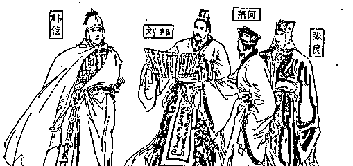
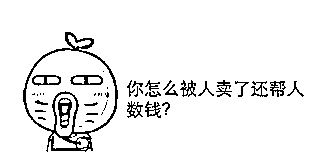

# 高考有利于穷人，而不利于富人

紫竹张先生

每篇都有干货的财经公众号

今天是高考的大日子，所以我今天来谈谈高考，我个人是非常支持高考的，我认为高考有利于穷人，而不利于富人。

说这个之前，先说说什么是高考，高考起源于古代的科举考试，科举考试是为了什么，是为了选拔人才，从统治者的角度考虑，希望把所有的人才都纳入自己的统治阶层，而不是散落在外，这样会对自己的统治构成重大威胁。

我举个例子，刘邦，只不过是一个亭长，管辖的人口还比不过今天的一个乡镇派出所，其职位连所长都谈不上，顶多算一个带着五六个协警的正式片警吧。兵荒马乱的时候，这样的人才起义了，然后，就成帝王了，如果他当年是市公安局局长，那基本上就不会起义，如果再有家有孩子，外加良田千亩，不被逼到死角，那是肯定不会起义的，这就是体制内和体制外的区别。

如果这样的人才为统治阶层而战，而不是挑战统治阶层，那毫无疑问统治阶层的地位会稳固很多，那问题来了，你咋知道这个人有没有才华，随机抓 1000 个壮丁给你，你告诉我里面哪个人最可能是刘邦。

统治阶层当然没这种超能力，如果有，刘邦刚出生的时候就会被抓进宫当嫡系培养，或者直接一刀咔嚓了。虽然统治阶层无法慧眼识人才，但是他是真的很想尽最大努力把他们都收于麾下。

炒股就是炒概率，收人才寻黑马也是。古人根据经验发现，读过书的不一定是人才，但是人才大部分都是读过书的，换句话说，读过书的成才概率远大于没读书的。然后，古人还发现，智力高的人，成才的概率远大于智力低的。

科举考试诞生了

于是，古人发明了科举考试，一个纯粹的读书竞赛游戏，这个游戏的规则很简单，比谁在读书方面的智力天赋高，读书智商高者胜。统治者的目的，根本不是说读书最好的人就一定是最厉害的人才，而是把读书方面智力优于常人的选手统统收归于体制内成为自己人，从而纳入自己的观察范围，这样的人里面出现顶尖人才的概率远远高于普通人群。至于有一些个体，读书智力不高，但是也是人才的人，或者说是读书智力很高，但是因为太穷没有接触读书机会的人，漏掉就漏掉了，只要站在自己这边的人才数量，数十倍于朝野之外的人才，自己这边是有组织有集团的，对方是零散无组织的，那就可以保证自己统治稳固了，是否埋没了小部分人才，并不关心。

到了现代，就演化成高考了，高考可以改变命运，这一点毫无疑问，不要拿个例做特例。当年大学没扩招之前，就算是大专生，回到县城，那也是响当当的人物，至于扩招后，你考个重点甚至是清华北大试试，换句话说，一个农村小伙子，进北大还是北大青鸟，他们的命运能一概而论吗。

不是大学不能改变命运，而是你考的大学可能不够好，360 行，行行出状元，每行都有成材率，其中高考上大学的成材率是最高的。在日常生活中，谁家的孩子上了重点大学居然没成材，现在收入还不如出去打工的，那是重磅新闻，会迅速传播的。如果谁家的孩子外出打工没成材，就挣个辛苦钱，大家会习以为常，这不是很正常的事情嘛。

就凭这一点区别，就可以看出人们对高考和打工所赋予的不同期望值，把上大学和成才直接划等号，其他哪行哪业敢给这么高的期望值。就从期望值如此之高这一点，我们也可能看出高考的与众不同。

富人会想法设法独霸教育权

从古至今，给后代一个更好的成长环境就是人类的天性，每个人都会尽量的给后代各种资源以便于其顺利成长，除了衣食住行等资源之外，最重要的一个资源，就是教育权。

在古代，最初的时候，教育权为大贵族独有，那个时候做官是要靠举荐制的，有大人物保举你，你才能做官，这个时候读书自然只会是大贵族子弟才会去读，教育权垄断在大贵族手里，也就是俗称的世家。如秦朝，几乎所有的高级官员将领都来自于关中世家望族，平民想向上爬，唯一的途径就是依附于世家，不可能一步登天。

后来，发明了科举考试，这个发明把做官的可能性赋予了所有的读书人，不过这个时候教育权依然是贵族的专利，所谓寒门学子，那只是相对于大贵族而言的，相对平民依然是富裕之家。在封建社会，家里必须相当富裕，才能供养的起读书人，一本书要半个月工资，上京赶考路上就要花半年，考不上就直接在京里继续住一年。这种天价耗费不是普通人家承担的起的，穷人孩子还是早点长大去干农活养家吧。就算到了民国时代，能读书的也都是地主富农家庭出身，哪怕是带领农民翻身做主人的开国元勋都是，家里没足够的钱是不可能读书的。

穷苦人家大规模通过教育逆转命运，历史上只出现过一次，就是 20 世界八九十年代，全国统一应试教育，大批的真正的穷人子弟进入了大学，甚至考进了清华北大，现在好多高级领导都是那个时候上的大学，查他们家族履历那真的是三代贫农，父母常年连吃饱饭都做不到，就这么通过大学教育逆转了人生命运。

珍贵的教育权，阶级上升的通道，打开了大概 20 年，又缓缓的合拢了，这一次贵族们用的武器是：素质教育。

素质教育的特色

高考决定命运的作用，不仅仅是农村小伙子知道，即便是体制内的贵人，也在争夺这种教育权，看看北京就知道了，没有大佬支撑，你以为普通北京市民能争取来那么多名额吗。

那么好，谈到素质教育，是对穷人好，还是对富人好呢，毫无疑问，素质教育越深入，富人获得的教育权越多，应试教育越深入，穷人获得的教育权越多。除了课本，素质教育还比什么，会比跳绳踢毽子吗？肯定不会，表面原因是太俗了，实质原因是门槛太低，富人没有优势，要比就比芭蕾舞啊，钢琴啊这种，一节课 300 快，没 100 个小时连入门都做不到的东西。至于课本，越简单越好，但是考试照样考。大家都去补习班，200 一小时，每周 6 小时，不补跟不上，上不起补习班的孩子就老老实实去蓝翔吧，大学不适合你。

这样说可能还不太明显，我举个极端的例子，把素质教育做到极致，假设只考 2 样，试卷和高尔夫。平时的课堂上大家不上课，就使劲玩，没有作业，课本是白纸，当然，考试照样考，而且很难，想学习的可以参加补习班，200 一小时，大概要学 3000 小时毕业，家里需要准备 60 万资金当学费。素质方面我们只考高尔夫，只有大城市有场地，中小城市的就算了直接给零分吧，学费 1000 每小时，大概 300 小时可以毕业，耗资 30 万，大城市的工薪阶层就老老实实上几节课入个门，拿个及格分，去三本吧。

在以上制度下，不用上课，素质方面采用最高端的高尔夫，家里准备了 100 万资金，你也就是刚刚够高考的资格而已，属于寒门学子，家里有几个亿的才算正儿八经的贵族学子，这和解放前最低也要小地主富农才读得起书的难度几乎是一致的，这个时候重点大学会清一色的是富人阶层，富人去北大，穷人去北大青鸟。

应试教育的特色

如果取另外一个极端，僵化到极点的应试教育，课本 10 年不改，就比大家的智力高低，那富人的优势会被削弱到最小。

至于学什么，并无所谓，大家拿一本九阳豆浆机的说明书比赛谁钻的快钻的深，一样可以比出人才。当初发明应试教育就是统治者为了筛选出高智商人才的游戏，这个游戏只比读书智商，不比家世，也不比财富，非常公平。在当年的应试教育体系下，我们可以发现这么一个现象，并不是每一个清华北大的学生都是人才，但是 100 个清华学生出人才的概率，比 100 个大专生，要大的太多太多。

什么人会反对，当然是既得利益阶层。古代，那就是士大夫，现代，那就先富起来的那群人，他们都想尽可能的把教育权和进入利益阶层的机会，留给自己的后代，而不是公平的散发出去，于是就会有各种奇奇怪怪的事情干扰科举，从古至今都有。

有人说，僵化到极点的应试教育会扼杀中国的创造力。这个很悲哀，但那是因为中国的体制问题。如果上大学目的并不是研究学术，而是进入体制内或者说是进入利益阶层，那么无论你采用什么方法选拔人才，都不可能改变这一点。知识并不能带来财富，权力才能，在这种社会氛围之下，永远不会有人静下心去搞研究创造，我认为并不能怪罪于高考。

中国的高三学生到了外国大学定居之后，成才的比比皆是，为何到了中国的大学就只会玩王者荣耀和看韩剧，即便是清华北大的学生，本科阶段有较大知识吸收创造的也很少，进入社会后成才概率大，那纯粹是靠他们天生的智商优势去碾压别人，以及，其他学校的毕业生本科的时候也在玩王者荣耀和韩剧的原因。。。

关于科举考试能选出隐藏人群的人才这一点，你不得不服古人，他不可能搜出所有的人才，但是绝对可以搜出大部分的人才，然后用体制的锁链锁住他们的翅膀，把他们的力量化为已用，智商高的人，无论是从政从军或者是搞违法活动，成功的概率比普通人那确实是大很多。

教育权到底值多少钱

有人说，学历根本不值钱，为什么学区房卖这么贵，那些花上千万买学区房的人是不是蠢。首先我们看看这个问题是谁提出来的，是穷人提出来的，还是富人提出来的，很显然，那些争先恐后去买学区房的人不会提出这样的问题，提出这样问题的人，一定是买不起学区房的人。

那么结论就很显然了，教育权到底值多少钱，是不是就仅仅是毕业后的那份工资呢，很显然不是，教育对一个人一辈子的提升是多方面的，所以富人才会甘愿出大价钱去获得这个教育的权利，而穷人并不认为教育权值这么多钱，不就上个学嘛，犯得着花那么多钱吗？那么你认为，是穷人精明，还是富人精明呢，是不是说这些富人全都是笨蛋来花冤枉钱呢？

一些不负责任的媒体舆论，鼓吹知识无用论，经典名言就是“读大学有什么用?还不是要给高中毕业生打工。”，而实际上，这个世界上最坑人的谎言，就是“学历不重要”。

知识无用论的盛行，让一些穷人家的孩子，真的相信了北大毕业也是去卖猪肉的，辍学创业打工也能发大财，硕士毕业了也是给高中毕业的老板当员工这些谎言。然后这些穷人的孩子就放弃了教育权，与此同时，我们发现那些鼓吹知识无用论的媒体撰稿人全是一些高学历的知识分子，他们自己靠知识吃饭，却告诉别人知识无用。

北京教育每出一次新政策，都会迅速的被人找出漏洞，学区房的存在并不能证明房子比教育重要，只能证明有钱人家远远比穷苦人家要重视教育，他们宁可耗费巨资，也要保住子女的教育权，让自己的社会地位和财富能够传承下去。

素质教育和应试教育哪个好

无论采用什么高考模式，都不可能影响在当前中国国情下创造力匮乏的原因，核心原因是知识很廉价，社会激励太弱，而不是高考压制。从让穷人翻身的角度考虑，我反对素质教育，素质角度程度越高，穷人越没资格进门，所谓降低课本难度，课后无作业，那绝对是最美丽的谎言，有钱人都去找家教单独补课了，农村孩子们还在幸福的玩耍呢。

从让穷人获得平等教育权，选出隐藏人才，打破阶级固化，让人才流动到社会上层阶级的角度考虑，建议应试教育。从阶级固化，保护既有利益阶层的角度考虑，建议素质教育，最好只考高尔夫，课本全部清空成白纸，穷人靠边站。

那么素质教育和应试教育培训出来的孩子，哪个更优秀的，很不幸，素质教育的更优秀。道理也很明显，你花 10 万读完了九年教育，别人花 200 万读完了九年教育，在同等智商的情况下，效果能一样吗？如果一样的话，谁还去花这个钱，富人也不傻。素质教育塑造出来的孩子，综合能力，甚至单独谈学习能力，都是更优秀的，但是前提是你家里有钱，没钱不配谈素质教育。

这也是素质教育大行其道的原因，因为根据目前的教育实践，素质教育选拔出的尖子生，确实比当年纯应试教育选拔的尖子生更优秀，唯一的缺点恐怕就是太费钱了。利益阶层不缺这个钱，但是他们需要确保自己的孩子享受珍贵的教育权，穷人阶层以为素质教育能让他们更不用苦读就能轻松的进入大学，也举双手赞成，所以这个事情就这么愉快的决定了。

我今天写这个文章，不是为了推翻素质教育恢复应试教育，因为那是不可能的，从古至今，上升通道越来越狭窄，最终被上流阶层独占都是不可逆的趋势，穷人大规模通过高考翻身也就是 1980-2000 年这短短 20 年时间，这种盛况以后不可能再出现了，没有素质教育，也有其他教育，**总之通过教育翻身的机会不会那么轻易的再被穷人获得了**。

我今天写这个文章的目的，主要是进行科普，让大家知道高考和应试教育到底是对穷人有利还是对富人有利，别自己傻乎乎的去为对富人有利的政策摇旗呐喊，自己被卖了还给别人数钱。穷人应该感谢高考，还保留了一扇向上的门，虽然这扇门已经越来越窄了，但是如果彻底取消这扇门，采用推荐入学制、特长入学制等素质教育特色的选拔制度，我敢保证，穷人的孩子这辈子就别想翻身了。

如果你身边有朋友平时吐槽高考不好，应试教育不好，而他却不是那种有能力给孩子掏出 200 万补习费来读书的富人，那么请把这篇文章转发给他进行科普，以后进行舆论呐喊的时候，让他注意站队，别害了自己孩子。

往期回顾（回复“目录”关键词可查看更多）

001 《为什么中国必须购买美国国债？》 

002 《租房贷款会将房子拆分成房骨和房皮》

003 《黄圣依签 7.5 亿阴阳合同，还要灭掉崔永元？？》

004 《宁波老虎事件遇难者不应该得到赔偿》

005 《中国的房价什么时候会崩盘？》

006 《中国地产达到什么样的条件会崩盘？》

007 《你根本不知道烟草公司有多赚钱》

008 《如何把自家孩子培养成一个顶尖人才》

009 《我是如何保证自己不近视的》

