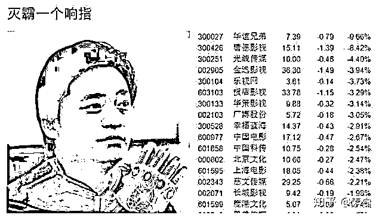
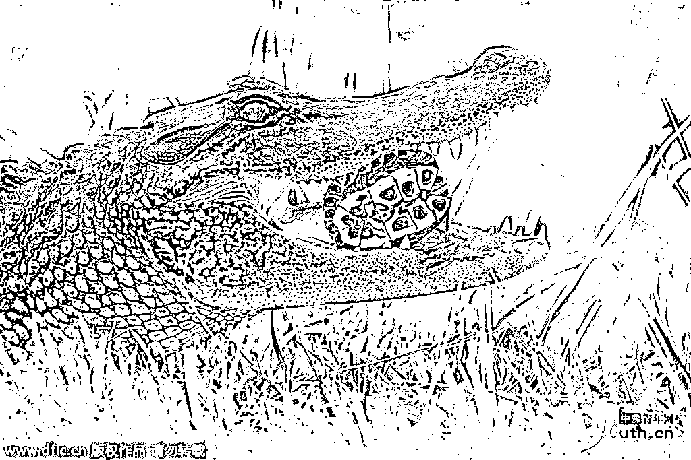

# 二条文章 | 股市杂谈

首先是独角兽公募基金，正式获批，募集 500 亿，这批基金啥也不干，就是申购独角兽，作为战略投资者获得一定折扣，然后锁定 12~36 个月这个样子。

很多人说这和我有啥关系，我也不申购他，他也不去买二级市场的股票，其实还是有关系的，变相降低了市场的抽血额度，属于利好，估计可以对冲下富士康周五上市的坏消息。

~~

今天，退市几年的长油 5，提交了重新上市的申请，如果通过的话，按照规定，从申请到重新上市只需要 185 天。

从逻辑上来说，被退市的企业，也是企业，只要重新符合了上市的规定，那就可以重新上市，美股也有很多股是上了退，退了上。

但是 A 股是个例外，A 股长期以来股市扭曲，退市从来不是主动退市的，都是因为触犯了某种规定而被迫退市的，对于这种被强制退市的股票，我个人认为应该永不上市，如果是那种因为经营困难主动退市，后面经营又变好了再上市的，我觉得还可以接受。

否则的话，我怕又掀起一轮炒壳的歪风邪气。

~~~~

在连续暴跌之后，今天乐视网盘中拉涨停，对于乐视网我的态度很明确，基本面差的一塌糊涂，里面就一堆被套牢的大游资在不断自救，在孙宏斌回到乐视网之前，乐视是起不来的，不管里面的大佬怎么折腾，拉多高都没用，基本面摆在那里。券商被套牢的质押股份这颗地雷被拆除之前，你觉得乐视网能走牛吗？让券商解套了立刻砸盘。

至于说在里面高抛低吸做 T，你觉得你做的过那帮手握资金，有控盘能力的大游资吗，怎么玩都是他们赢。

~~~~

对了，今天还碰到一个好玩的东西给大家说一下，有人做了这么一个图，说崔永元是灭霸，打了一个响指，半个娱乐圈的超级英雄都灰飞烟灭了，影视股全面暴跌。。。

这里给不知道灭霸是谁的朋友科普下，灭霸是复仇者联盟 3 里面的一个 BOSS，有一个超级手套，戴上这个手套之后，打一个响指，美国队长、钢铁侠带领了超级英雄们，瞬间就随机有一半的人化成飞灰，堪称 BUG 级的能力。

灭霸手套风靡全球，今天崔永元给戴上了。

~~~

今天的大盘其实没什么好说的，特别平淡，一天的时间，从头横到尾，我昨天晚上和大家说了，大盘见底了，开始筑底，不能确认是 V 型反弹还是震荡筑底，但是可以确认排除的是，不会再继续大跌了。

所以今天这个走势，没什么可说的，就涨这么一点自然不会卖，他继续震荡筑底也只能继续等，唯一的一个我们可以看出的东西，就是昨天创业板在没有任何利好的情况下，大涨那么多，全面彪红，气势如虹，结果今天在没有任何利空的情况下，突然就开始横盘了，不涨也不跌，操控的痕迹有点浓，这种涨跌都有控制有序的环境下，只能从大势来判断，细节是完全无法判断了，已经被打成混沌状态，只能不变应万变。

贵州茅台今天冲击 800 元新高，然后被砸落，这件事情有什么重要意义呢，你看一下其他蓝筹，都被砸的稀里哗啦了，茅台作为蓝筹股的总龙头，他率先爬起来，对整个蓝筹的股价都是一个稳定的作用，蓝筹不深跌，大盘就能稳定，跌不了了。

从技术形态来看，目前的大盘形态是非常漂亮，注意我的用词是非常漂亮，筑底的迹象简直太明显了，不管是哪个角度看，这都是完美的筑底图形，也就是创业板差了一点，不过昨天他领涨的中阳线，补掉了这个缺点，也还算凑合，所以周五的富士康上市，我打算看戏，虽然是大利空，但是不恐慌。

我这个人炒股挺懒的，中线操作，反正也没有趋势大跌和趋势大涨，跌了我也怕，涨了我不贪，不挣钱不走，耗着呗，看谁活的长。