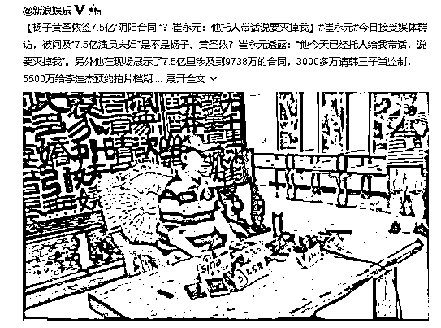
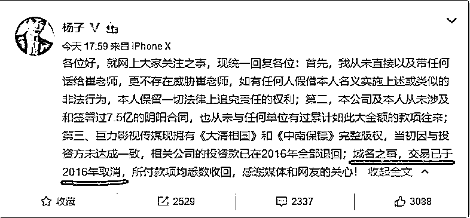
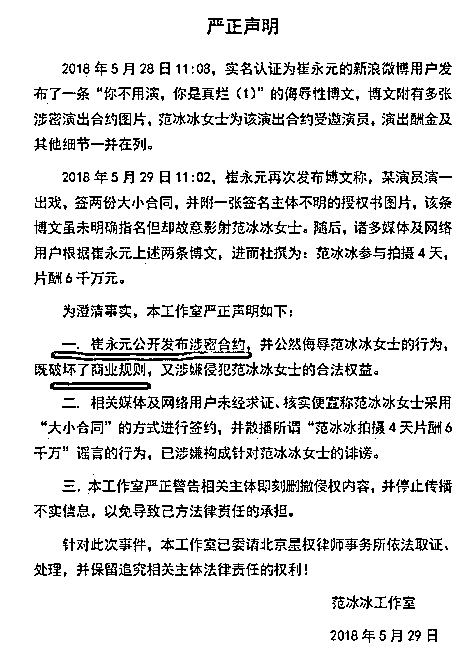
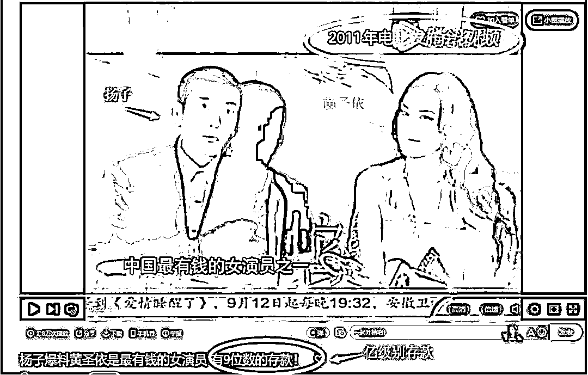
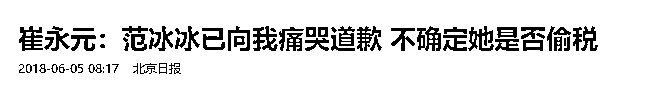
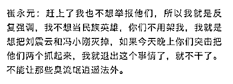
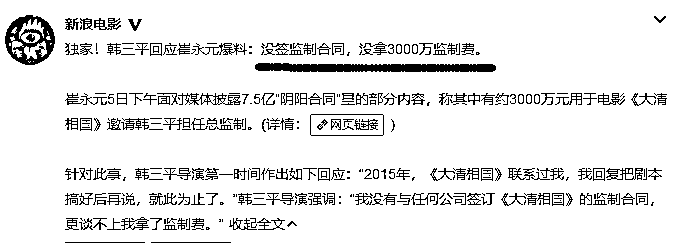

# 黄圣依签 7.5 亿阴阳合同，还要灭掉崔永元？？

紫竹张先生

每篇都有干货的财经公众号

今天，在接受媒体群访的时候，崔永元扔出一枚核炸弹。当被媒体问到前一段时间透露的 7.5 亿演员夫妇是不是扬子，黄圣依夫妻的时候，崔永元没有承认，但是也没有任何否认，反而回了一句话，“你们愿意猜是你们的事，但是我可以透露一下，他今天已经托人给我带话，说要灭掉我”。

当记者问崔，“那也就是说你现在人身安全已经受到威胁了是吗？”崔直接回复“起码受到这对狗男女的威胁”。对着一众媒体，用狗男女来形容一对明星，对于熟知媒体规则的崔永元来说，不可能不知道这代表着什么，唯一的结论就是，彻底撕破脸了，崔永元天生硬骨头，吃软不吃硬，用死亡威胁崔永元，只能加速他的曝光。

采访视频发布了如此之久，媒体直接点名扬子和黄圣依，崔永元依然没有任何反应，未出面辟谣，仅仅扬子发了一条微博进行澄清。当年范冰冰的工作室发表的澄清声明比这个强硬多了，直接说崔永元涉嫌诽谤。扬子的声明里还有一个巨大的漏洞，就是说域名之事，交易已在 2016 年取消，这简直是自己承认崔永元所述合同全部属实，而自己就是主角。这个败笔和前几天范冰冰工作室说崔永元发布涉密合约，破坏商业规则一样差劲，这些明星发声明之前建议先请专业人士过目一下。

现在崔只是隐晦的点出，没有指名道姓，但是中国明星夫妻本来就没几个，而《大清相国》和《中南海保镖》都是黄圣依所在公司拍摄的，域名之事也被扬子亲口证实，崔直接点名曝光的三个合同全部针对扬子黄圣依，仅仅随手点名甩出的 9700 万合同都够他们俩被税务稽查的了。结合上述种种迹象，黄圣依扬子就是这对 7.5 亿明星夫妻的可能性，达到了 90%以上。而在 2011 年的电影发布会上，扬子就公开爆料黄圣依有了亿元以上的存款，现在是 2018 年，存款不知道有多少了，我虽然不怎么看电影，也知道黄圣依不算一线影星，拿得出手的作品不太多，请问黄圣依的存款哪来的？巨额财产来源不明，税务部门可是要好好查查了。

而更厉害的是，崔永元对媒体表示，7.5 亿的阴阳合同不是他掌握合同里最大的，还有更大的金额合同。这么大的炸弹居然还不是最大的，崔永元这是要掀翻整个娱乐圈啊。

崔永元是一个爱恨分明的人，有仇报仇，有怨报怨，而且影响力还特别大，这些人被崔抓住了真凭实据，还幻想用威胁迫使崔放手，简直是大错特错。你看范冰冰前几天对崔永元痛哭道歉，崔现在对范的语气就缓和了很多。当然，已经放出去的资料，崔不会收回，范冰冰能否扛过税务部门的稽查，就只能靠她自己了，顶多就是崔不再继续曝光范冰冰了而已。

为什么崔永元放了范冰冰一码，他也说的很清楚，他现在不是央视记者了，曝光谁不是他的义务，而是他的自由，他手里的黑材料太多了，涉及整个娱乐圈，他主要恨的是刘震云、冯小刚，但是手头没有直接的黑材料，于是只好围魏救赵，用这件事弄沉他们俩的小船，既然是选择性曝光，那曝光谁很简单，谁和刘震云冯小刚站在一边，就曝光谁，谁姿态强硬，就曝光谁，哪天冯小刚又拍新戏了，谁接拍，就曝光谁。

崔永元的目的就是把刘震云和冯小刚灭掉，所以这一波所有被牵涉到的明星，其仇恨值一半在崔永元身上，但是另一半都会转移到他们俩身上，同时以后和他们合作，都会心存顾忌，崔永元的目的，就达到了。

对于崔不想当圣人，只想报私仇我表示理解，只要手段是合法的，这么做完全合情合理，比伪君子要强太多了，而且对中国的经济和法制都是一次净化，对普通群众的利益是有很大帮助和促进作用的，所以不管崔怎么做，我都支持，因为总比不做要好，逼崔放弃自己一切人脉关系，得罪一切朋友来无差别曝光，是不合理的，给予这些曝光者一些回报，让其利大于弊，才能鼓励出更多的曝光者，我们需要更多的曝光者，而且不仅限于娱乐圈。

电影黑幕的各种手段

在这次的事件中，崔永元还曝光了大批的造假手段，让人眼花缭乱，首先谈谈扬子黄圣依的 7.5 亿阴阳合同，这里面就有 9738 万的合同已经不算是偷税漏税的，涉嫌洗钱或者贪污。

这里面第一件事是 3000 多万请韩三平当总监制，涉及的电视剧叫《大清相国》，崔永元直接说，你们可以联系韩三平问一下，看他有没有拿过这笔钱，知不知道这回事，而韩三平已经回应此事，没有拿过这笔钱，也不知道这回事。

第二件事是《中南海保镖》，5500 万是给李连杰的，崔永元表示这个事实非常清楚，他和李连杰面谈过了，李连杰表示自始至终根本就不知道这回事，这 5500 万就不翼而飞，不知道谁拿去了，崔永元直接定义这种行为是“骗”。第三件事是非要去购买一个域名，而这个域名已经被别人提前抢注了，所以要花 1200 万去购买这个域名，崔表示不知道一个域名值多少钱，但是他觉得 1200 万可以买下全中国的域名了。

这只是 7.5 亿合同的冰山一角，崔在这次里，也只先爆了不到一个亿的合同，已经是触目惊心了，而且仅凭明星夫妻二个人肯定是吃不下这么大的蛋糕的，后面肯定有更大的老板，要是一层层深挖下去，那就有趣了。

除此之外，崔还在闲聊中曝出了很多明星偷税漏税的手段，“比如说这个人要 500 万元，但是实际上他要 700 万元，那怎么给呢？可以签完后说延长拍摄时间，加 100 万元，然后又延长拍摄时间，又加 100 万元。或者说剧本修改，要钻火海，要从山上滚下来，反正各种招儿，巧立名目，就够给钱了。还有一种方式是，你直接给我现款，那就不用上税了。还可以除了以演员的名义签表演合同，同时我给你当编剧，还有参与策划、监制、发行，再弄一个 3000 万元的合同。那 3000 万元的合同不是跟我签，是跟我背后的公司签，或者跟我二姨或者三姑签。”他说，这些方式他可以罗列三十多种，而且这些“阴阳合同”在国内影视圈非常普遍，尤其是大制作中。

还有的一种行为就是他上面曝光的那种韩三平和李连杰的合同，巧立名目，名义上聘请了 XX，实际根本没有这回事，上亿资金直接就不翼而飞了，不知道被谁拿去了。

还有一种就是崔永元回忆，当年他拍《电影传奇》时，制片主任每次都浩浩荡荡地率领汽车队去加油，而他感到不解：谁没油谁加呗，干吗要领着去加？他说你不懂，这汽油费可以黑掉你几十万、几百万，“他们全都加油，加完后抽出去都卖了，然后再加再卖再加，如果没人管，也是一大笔钱。任何一个环节，都是黑钱的环节。你说你两个亿、五个亿的电影，谁会在乎你这点加油费吗？总导演会一张一张翻加油费吗？”

其实后面还有跟多的乱象，比如演员片酬以入股电影分红的形式给予，或者公司拿到片酬后之后把钱转给 B 公司买理财，B 再投资 C 公司等等，来回倒腾多次，虚增成本，最后算算账，没多少税了，再转给明星 A 的个人账户。

这件事后续会如何发展

这件事发展到这个地步，已经不单纯的是崔永元和刘震云冯小刚的私人恩怨了，已经上升到国家机构和娱乐圈偷税漏税风气的战斗，甚至可以说升华为整个贫困阶级和富人阶级的战斗，既然国家已经动起来了，最后碰到谁，那就只能看命了。

崔永元本来只是和《手机 2》剧组过不去，扇了一下小翅膀，结果掀起了超级风暴。7.5 亿，这个涉案金额之大，哪怕只是核实了这一份合同，都可以称得上是惊天动地了，而且这仅仅是一对演员的一份合同，整个演艺圈这三五年来的累计阴阳合同有多少金额，几百亿还是几千亿？如果全部查实，按照 40%的纳税比例，这是逃掉了一个航母编队啊。

所以，这次的事件绝对不单单是几个明星的事情，肯定要对娱乐圈进行全部彻查和整顿，如果最后只是交出了崔自己曝光的 6000 万和 7.5 亿合同作为成绩单，那么税务部门是完全没办法向全国人民交代的，至少得 10 倍甚至百倍以上的数额，才能算对全国人民交代的过去。

这一波，甚至有可能从娱乐圈开始引发中央对整个富人偷税漏税的全面税务整顿，正好这段时间全球经济困难，趁机向富人阶层抽血帮国家度过难关再合情合理不过了。

我不反对明星高薪，但是我反对明星偷税漏税，中国身上的脓疮太多了，娱乐圈是一个，但是绝对不是唯一的一个，每一个都是在吸广大底层群众的血，崔永元这样刺脓拔毒的人，我希望越多越好，今天发此贴的目的，是摆明立场支持他，因为支持他的人越多，他就越安全。

~~~

PS:崔永元的采访视频我无法贴上来，放到阅读原文里了，有兴趣看原始采访视频的，可以点击左侧的阅读原文。

往期回顾（回复“目录”关键词可查看更多）

001 《为什么中国必须购买美国国债？》 

002 《租房贷款会将房子拆分成房骨和房皮》

003 《中国自古以来就是一夫一妻制》

004 《宁波老虎事件遇难者不应该得到赔偿》

005 《中国的房价什么时候会崩盘？》

006 《中国地产达到什么样的条件会崩盘？》

007 《你根本不知道烟草公司有多赚钱》

008 《如何把自家孩子培养成一个顶尖人才》

009 《我是如何保证自己不近视的》

