# 崔永元手撕范冰冰，揭开了富人的税收黑幕

紫竹张先生

每篇都有干货的财经公众号

近日，崔永元手撕范冰冰及冯小刚、刘震云，和《手机 2》剧组誓不两立，借这个契机，我们也看到了富人纳税的黑幕，让我们终于明白了为什么中国的个人所得税沦为了工薪税，让我们先回顾一下事件的起源。

事件的引爆点，是崔永元公开了范冰冰的剧组劳务合同，这份阴阳合同让收入达到 6000 万的范冰冰，只进行了 1000 万的申报纳税，而如此高薪酬只演出 4 天的表述，直接引发了中国贫富严重分化的阶级矛盾。

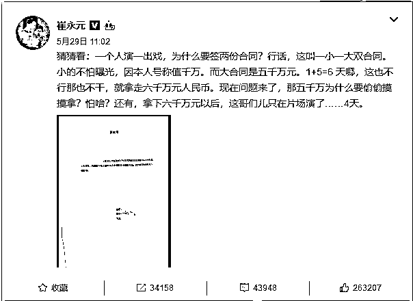

为什么崔永元选择手撕《手机 2》剧组成员呢，因为 15 年前，在拍摄《手机》前，冯小刚拜访崔永元，说电影里有个主持人栏目叫《有一说一》，想要借助崔了解当时他主持的《实话实说》流程并邀请崔演出，崔虽然回绝，但是很热心的给出了很多资料和建议。

但是后来《手机》上映，完全复制《实话实说》的《有一说一》，其主持人严守一被塑造成一个出轨的伪君子，节目上是厚道老实人，私下里却出轨女下属，后来还让出轨对象，也就是范冰冰演的武月顶替了自己的工作岗位。

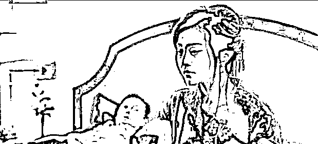

正好，当电影热播的时候，崔已经离开了《实话实说》，并且女主持人和晶接替了他的节目。很多观众直接把严守一和崔永元进行了对号入座，流言四起，崔永元的家人遭到了严重的伤害，甚至崔永元自己的妻儿都对崔产生了怀疑，而冯小刚认为自己只是开了个玩笑，绝不认错，从此崔永元和冯小刚彻底绝交。

而今年 5 月份，冯小刚又要开拍《手机 2》，崔永元愤怒了，直接联系编剧刘震云是否有这回事，刘一口否认，说剧名是《朋友圈》，让崔放心。

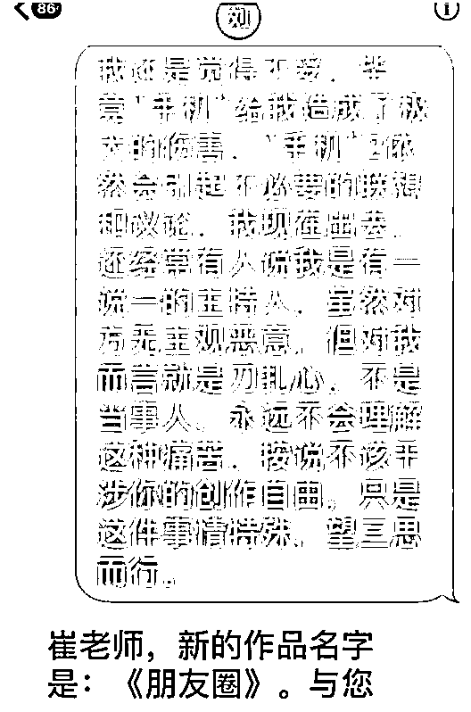

然后，冯小刚在微博晒出《手机》原班人马齐聚的照片，并声称要开拍《手机 2》，这让崔永元彻底爆发了，骗人一次就够了，还想骗第二次？就像严守一的经典台词一样，做人要厚道啊。

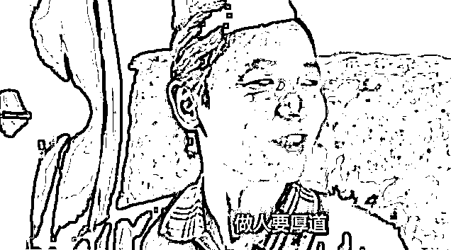

于是，崔永元开始了报复行动，为什么手握一抽屉演员阴阳合同的崔永元选择了范冰冰进行开火呢，因为范冰冰发了这么一条微博。

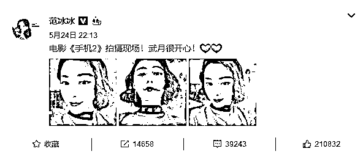

处于爆发边缘的崔永元，立刻翻出了范冰冰的合同进行曝光开火，这一下捅破了娱乐圈的税收黑幕，也引发了中国百姓对整个富人阶层长期偷税漏税的愤怒。

**娱乐圈的税收黑幕**

整个娱乐圈是有潜规则的，那就是不缴税或者少缴税，这个习惯从刘晓庆开始就没断过，这是一个黑幕，但是从来没人去揭开它，大家心照不宣。

以这次范冰冰的合同为例，小合同注明薪酬一千万，这个是上报税务局进行纳税的，而大合同则注明薪酬 5000 万，连范冰冰随行的化妆师月薪都有 8 万，一并由剧组支付。也就是说，范冰冰 6000 万的收入，只按照 1000 万进行了纳税，这个潜规则一旦曝光在台面上，就很难救了。

按照我国现行税法规定，影视、演出、表演所得属于劳务报酬，按 3 级累进税率表纳税。

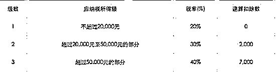

按照这个税表，如果曝光的阴阳合同属实的话，收入 6000 万的范冰冰应该纳税 2400 万左右，但是实际上她纳税了多少呢，按 1000 万收入计算则不到 400 万，直接涉嫌偷税 2000 万元，在应纳税额中占比，直接超过法律红线 30%。

根据我国逃税罪的规定，纳税人采取欺骗、隐瞒手段进行虚假纳税申报或者不申报，逃避缴纳税款数额较大并且占应纳税额百分之十以上的，处三年以下有期徒刑或者拘役，并处罚金；**数额巨大并且占应纳税额百分之三十以上的，处三年以上七年以下有期徒刑，并处罚金**。

应纳税额是 2400 万，逃税 2000 万，逃避纳税款占应纳税额占比 83%，远超 30%红线，2000 万的金额无论从哪个角度说都称得上是数额巨大，如果崔曝光的合同被税务部门给坐实，那么范冰冰最少也要被处三年以上有期徒刑，并处罚金。

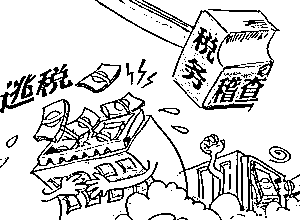

那么有没有明星因为逃税被处罚的先例呢，有，北京晓庆文化艺术有限责任公司采取不列或少列收入、多列支出、虚假申报等手段偷税漏税达 1458.3 万元。后因数额巨大，刘晓庆被公安机关依法逮捕，蹲了一年监狱，并处以天价罚金。

所以，这一次范冰冰摊上大麻烦了，要怪只能怪冯小刚，直接点燃了崔永元的火药桶，把潜规则给捅上了媒体放到了台面上曝光。而据目前网络爆料，类似于这种明星阴阳合同避税的行为，并非个例，而是普遍现象，只不过以前无人管而已，这一次由范冰冰引起的税务稽查风暴，很明显会波及整个娱乐圈，高收入的明星群体却不负担应有的纳税义务，这很明显不符合富人多缴税，穷人少缴税的现代税务理论核心。

**富人阶层普遍偷税漏税导致个人所得税沦为工薪税**

除了范冰冰为代表的娱乐圈之外，其实整个中国的富人阶层，都存在严重的偷漏税问题，广度甚至涵盖所有行业，甚至已经形成了一种风气和认知，偷税漏税是正常的，所有人都在这么做，如果你不做，你就是傻子。

人人都有偷税的倾向，富人和穷人都是如此，这是人之本性，但是在中国的穷人基本上没有偷税的，偷税的都是富人，这是为什么呢？因为有偷税的想法，不代表你有偷税的能力，花样繁多的偷税手段只有富人才有能力实行，拿死工资的人是没有任何办法避税的。

毕竟，只要摆在台面上的收入，国家是不可能不征税的，这是他的权利，也是他的义务，但是随着富人纷纷少报收入，虚增成本，导致以劫富济贫为征收旗帜的个人所得税居然工薪阶层成为纳税主力，劫富济贫沦为劫贫济富，这就是中国富人大面积偷税漏税的铁证。

那么国家是不是有意偏袒富人阶层，故意无视他们的偷税漏税行为呢？别逗了，怎么可能呢，国家巴不得从富人身上多征点税，让他们偷税成功是因为征不到税。之所以征不到，是因为很多收入是非常难核实的，中国的税法漏洞很多，一般来说，只要主动缴的税看起来像那么回事，税务局就睁一只眼闭一只眼了，尤其是对影视行业这种避税手段特别丰富的，收入极难核实的，缴税主体实力又特别雄厚很难得罪的，自然成为中国富人阶层偷税漏税的第一重灾区。

**国外是怎么处理富人偷税问题的**

那么好，既然中国的税法不健全，能不能学一下欧美发达国家的税法呢，或者说对富人进行普法教育，提升富人的素质，让他们自觉缴纳税收。

很抱歉，相比中国的税法，欧美国家的税法也强不到哪里去，甚至可以说还不如中国的税法全面，所谓道高一尺魔高一丈，再先进的税法，总会被人找到漏洞，然后回避，欧美税法一样漏洞一堆，学过来一点用都没有。而欧美的富人，素质也不见得有多高，依然是有强烈的避税倾向。美国就有一种公司就叫避税公司，是堂而皇之帮富人通过调节收入支出等方式来避税的，只不过他们是通过合法手段来避税，而不是非法偷税漏税，所以政府也拿他们没辙，所以幻想通过教育富人，提升富人的素质让他们主动缴税这一条路就不用再想了，行不通的。

那么国外是不是偷税漏税成风呢，并不是，国外的偷税漏税现象比国内强的实在是太多了，偷税漏税是非常罕见的行为，那么国外是怎么做到这一点的。

很简单，诚信系统，欧美国家有一套非常发达完善的诚信系统，一旦有失信行为就会被记录信用污点伴随终生。这个诚信系统，是专门用来针对那种需要高度自觉，法律覆盖盲点的行为的。

比如论文抄袭，论文抄袭是核实成本很高的一件行为，就好像自媒体的洗稿一样，判断极难，成本极高，但是法律惩处成本并不大，如果你依靠法律去惩罚论文抄袭，那么欧美肯定会抄袭成风，就好像我国一样，欧美人也是人，人皆有私利之心，别指望他们自觉性多高。但是引入诚信系统后就不一样了，一旦被抓住一次论文抄袭，这个信用污点伴随终生，这个人这辈子基本别想问鼎学术巅峰了，会被整个学术界所排斥，虽然法律惩罚不了你太多，但是整个学术界的排斥，是任何一个学者都无法接受的巨大惩罚。所以欧美人对著作权非常重视，绝对不让自己和抄袭二个字沾上边。

诚信系统同样作用于纳税领域，欧美的税务部门，对于偷税漏税行为，也是很难发现的，基本靠举报和拉网式排查。但是只要发现一个，除了例行惩罚之外，这个人就会上失信黑名单，偷税漏税行为在欧美的文化体系里，是名列前茅的失信行为，说明这个人心中没有国家利益，欧美人信奉人的一生只有二件事不可避免，那就是死亡和纳税。

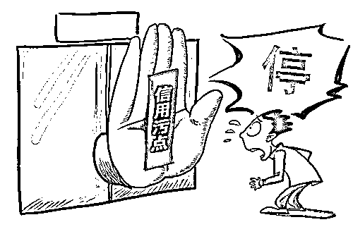

所以，一旦有人在诚信系统里被记载了偷税漏税，那可是巨大的信用污点，和信用卡逾期不还这种小信用污点是有天壤之别的。一般来说，只要有过一次偷税漏税的污点记录，这个人终身无缘与名流圈子和高端阶层，会被当成上不了台面的、不诚信的钻营者去对待，这个惩罚对于穷人来说或许无所谓，但是对于富人来说，这是绝对无法接受的，人的财富多到一定地步的时候，追求的就是名声，如果在上流社会里名声烂掉了，那还要财富做什么。

**中国的诚信体系何时建立**

欧美的诚信体系，说穿了就是中国的道德社会，法律和道德是一对孪生体，法律解决不了的事情道德来解决，道德解决不了的事情法律来解决，二者相辅相成才能构建一个稳定社会。而中国的道德社会在这些年损毁的实在太多了，完全无法对法律进行辅助。偷税漏税其实只是中国富人阶层的原罪之一而已，而且还是最小的那种原罪，其他的原罪更多，这里就不再过多阐述，大家自己心里都清楚。

所以，崔永元手撕范冰冰，只是掀开了富人偷税漏税的冰山一角，而富人阶层的偷税漏税，也只是掀开了中国富人原罪的冰山一角，中国急需建立自己的诚信体系，对信用污点进行记录，同时号召人们对信用进行尊重，当年刘晓庆出狱后，人们依然把她当做成功人士来对待，还能到处走穴赚钱，这在欧美是不可想象的事情，如果刘晓庆是美国人，她出狱后，谁敢公开赞美她一句，都会遭到全社会的鄙视。

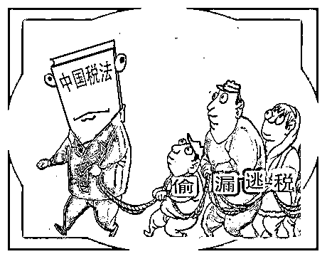

目前国家有关部门已经插手崔永元手撕范冰冰的事件，崔永元正在对有关部门提交资料，一旦资料确认属实，税务部门就会开始正式立案稽查，范冰冰的麻烦就大了，一份合同都能偷税 2000 万，这 20 多年的影视生涯，随便核实几个，那金额简直不敢想象，而整个影视圈，也有可能迎来一轮税务稽查风暴，对于阴阳合同成为半公开潜规则的娱乐圈来说，这就是一场地震。

如果能趁机建立诚信体系让整个富人圈以后自觉缴税，那是最完美的，因为很多富人其实都是不介意纳税的，但是如果大家都不纳税，自己去老实纳税，那自己就是傻，而且由于成本过高会被社会给逆向淘汰，属于典型的劣币驱除良币。中国人之所以仇富，就是因为大部分富人并不是通过合法合规发的财，如果每个富人都是干干净净发的财，那么富人理应得到最高级的尊重，因为干净发财的富人对中国做出的贡献，是远大于一般人的，如果这样的富人多了起来，中国的富强也就有希望了。

所以，我是支持这一次娱乐圈税务稽查风暴的，毕竟如果富人能多缴点税，那么穷人就能少缴点税，如果能借此推动诚信体系的建立，那更是所有中国人之福。

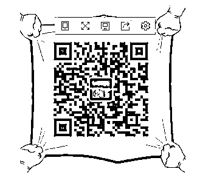

长按识别二维码关注「紫竹张先生」公众号

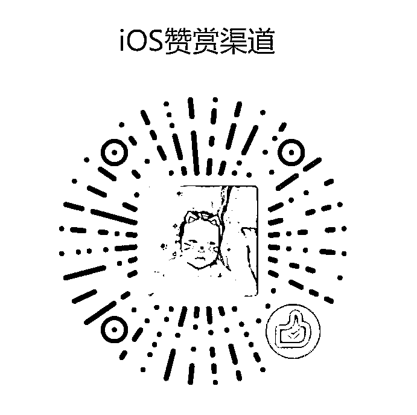