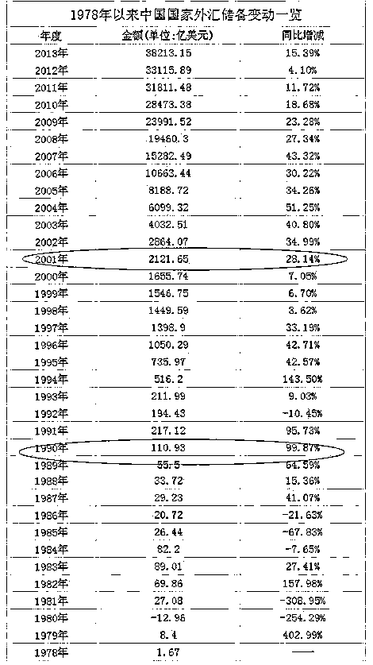
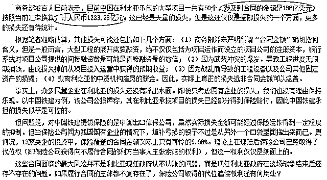

# 为什么中国必须购买美国国债？

紫竹张先生

每篇都有干货的财经公众号

中国长期购买大量美国国债，很多人对中国购买美国国债存在很大的思维误区，我今天给大家深度梳理一下这个问题，这种误区归纳起来大概有下面几种：

一、认为中国的外汇储备都是中国人自己挣的，应该给中国人自己花，比如从国外购买大量设备或者物资把中国物价打下来。

二、认为即便不愿意花在国人身上，也不应该买美国国债送给美国人花，应该进行海外并购，购买工厂等资产进行美元增值。

三、认为即便你投资能力很差，投资赚不到钱，你买点黄金矿山石油等战略资源储备起来总可以吧，也犯不着把中国人辛辛苦苦赚来的美元反手再借给美国政府让美国人消费。

这种思维误区的核心观点是，中国人用民工的血汗和环境污染为代价给美国代工，赚一点微薄的美元，这些钱又被美国利用美元霸权强制中国买美国国债回到美国了，所以美国空手套白狼弄来了大量物资过的很滋润，中国人除了一堆国债债权什么都没捞着，过的很辛苦全因为政府无能，被人忽悠去买美国国债了。网上很多伪专家都是这么说的，也忽悠了很多愤青，今天写这篇文章的目的主要是为了科普，让你真正了解中国为什么必须购买美国国债，不是给政府洗地，纯粹是知识扫盲贴。

1**中国的外汇储备并不都是中国人赚的**

很多人有这么一个思维盲点，中国的外汇储备都是中国人的血汗钱，都是中国人自己赚的，这其实是非常错误的。当然，这看起来理所当然，这个基础常识错误，也正是很多人后面一系列判断错误的根源。

回答这个问题之前，先看一组数据：

这是中国官方宣布的 1978 年到 2013 年的外汇储备，从图中我们可以看出，1990 年之前，中国的外汇储备极度可怜，区区几十亿，遇到一点风浪就变成负的了，那个时候中国的基础还没有打好，说通俗点，你想当欧美的血汗工厂赚苦力钱都没资格，1990 年之后开始走上正轨，中国开始稳定的赚钱了，外汇储备逐年增加，大概一年增长个 100 多亿美金吧。突变发生在 2001 年，这一年外汇储备增长了 500 亿美金，2006 年之后出现直线上升，一年增长接近 5000 亿美金。

我们都知道万事万物都是循序渐进的，即便改革开放之初中国基础建设太落后，改革开放 20 年才储备 1500 亿美金，2001 年一年直接增长了近 500 亿美金，2006 一年甚至增长了 5000 亿美金，这个速度肯定不正常，那么 2001 年发生了什么事情导致外汇异常增长呢？

2001 年 12 月 11 日我国正式加入世界贸易组织(WTO)，成为其第 143 个成员。根据 WTO 协议，中国将会开放诸多领域的市场并且允许外资进入，例如汽车银行等，对于中国这种开放的姿态以及展示的巨大市场潜力，大量外资一夜之间开始纷纷看好中国，外国对华投资额开始激增。外国人持有的是美元，进入中国办厂或者合资用的是人民币，那么这些美元就只能通过央行进行兑换。天量的外资进入就形成了天量的外汇占款，这些美元换成了人民币进入了中国市场进行流通，美元只是暂存于央行，将来某一天外资退出的时候，这些人民币是要再兑换成美元撤离的。

这些外资带来的天量投资带来了巨大的生产能力，巨大的生产能力导致中国的出口顺差飞速增加，但是这些赚的钱，很大一部分，是资方所有，也就是外国人所有的，他可能拿这些钱继续扩大投资，但是将来总归有一天，他会撤离的。

所以，中国的外汇储备并不全部都是中国人自己赚的，里面有一部分，而且是很大一部分，是外国投资引来的外汇，这笔美元只是暂存在央行，其所有权并不归属于中国。中国每年的巨额出口顺差，赚的钱也并不全是中国的，相当大一部分，都是属于外国资方的。

当然，我们不能因此排斥外国资方，相反还要拼命引资，没有这些外国投资，中国不可能发展到今天这个高度。

2**能否进行海外投资进行美元增值**

很多人问了，这些美元只是暂存在你这里，你别买美国国债啊，拿去海外投资啊，实现资产增值。

这法子不仅国家想过，而且还试过，大家应该都对前几年的国家战略有印象吧，那就是鼓励企业走出去，鼓励海外并购。那也是国家逼的没办法了，手里捏着一大把美元，每年以一个恐怖的速度增加，这些美元还不是自己的，放手里逐年的贬值，只能鼓励企业走出去，如果这些企业出去能获得资产投资收益，那是再好不过了。

于是乎，中石油走出去了，中海油走出去了，中铁建走出去了，中 XX 也走出去了，在各个领域各个触角都进行了市场并购的尝试，花了大把美金，不敢说 100%输，九负一胜的战绩还是有把握的，这些中字头老大哥在国内垄断舒服惯了，去海外接受市场残酷磨练，尤其还是带着行政任务一窝蜂出去的，为了花美金而花美金，忽视了很多市场风险。

我举个简单的例子，中铁建的高铁技术，是世界领先技术，所以很骄傲的认为高铁走出国门是很有赚钱把握的，但是这些高铁打不进欧美市场，于是一些有建设高铁需求，但是风险极大外国人不愿去的市场，中国愿意接。比如利比亚存在战争隐患，跨国公司评估风险较大，不愿意接这种活，中国接了，结果战争爆发了，技术人员紧急撤离，修了一半的设施以及大量的机械设备全部仍那不要了，一把就损失了接近 200 亿美金，这不是外国人的外汇占款，是实实在在属于中国人的 200 亿。

中铁建这个损失太大，是个意外，毕竟战争也有可能不爆发，只是蕴含这个风险而已。中国绝大部分投资亏损，都是损公肥私型，例如中石油花 30 亿美金买的油田，几年之后评估价值只剩十几亿，后来查处某某受贿上亿强行通过这种，毕竟是国企，花国家的钱不会有人太过计较。

那么这些美金不给中字头，给私企行不行，首先外汇储备是国之重器，政府不可能放心给私企替国家花，如果是盈亏自负的话，私企是不带政治任务的，他们也想走出去，但是走的很谨慎，没有 90%把握不会出国门，毕竟中国企业还很弱小，离开国门的保护，大部分都是无法存活的，所以私企的美元投资有，但是很少，投资速度很慢很谨慎，完全无法抵消中国飞速增加的外汇储备，政府也知道国企投资不靠谱，但是私企投资太慢，也就捏着鼻子让国企出去试一下了，既然失败了，也就死心不走这条路了。

3**能否买黄金石油等战略物资进行储备**

既然投资不行，那我们蠢一点，买黄金石油矿石等物资，囤积在国内行不行，反正我就是不借给美国人花。这个更不行了，相反，如果中国真这么做了，那么这个提议的人就是典型的爱国贼，会以爱国名义行卖国之实，以此毁灭整个中国。

首先要记住，中国的外汇储备不是自己的，绝大部分的美金所有权是外国人的，只不过因为在中国投资，暂存在中国央行的。这个巨大的外汇储备，不能算是你的储蓄，相反，应该算是央行欠下的外债，外国投资者一旦撤离，这些钱都是要还回去的。根据国家统计局公布的 2007 年年末的《中国国际投资头寸表》，在 2007 年，中国政府拥有 1.5282 万亿美元外汇储备，同时外国在华资产为 1.2664 万美元，也就说，如果外资全部撤离，那么真正属于中国的，只有 2600 亿美金左右。07 年之后外汇每年都增长 5000 亿美金左右，大家可以结合我第一张图，算一下这个比例问题，新增的 5000 亿，绝大多数，肯定还是外资的。

为了应付随时可能流出的外资，央行手里必须储备大量的流动性，确保任何时候央行都有足够的美金应对任何形式的提款要求，确保不出现挤兑现象。以 07 年的数据为例，如果央行认为自己很有钱，头脑发昏拿自己 1.5 万亿美金去到处买买买，假设买了 8000 亿美金的黄金石油运回国，一旦被美国政府察觉到你外汇储备不足，暗地里组织欧美几百家大型跨国公司在某个时间点统一要求提现，导致你剩余的 7000 亿外汇储备瞬间降低到 3000 亿以下甚至给你打到更低，那剩余的外资就会极度恐慌，他们来华投资是为了赚美元，一个外国人要人民币没用啊，就像我现在给你日元，你不还是要兑换成人民币才有用，所以他们就会拼命出逃引发恶性连锁反应，绝对可以把你的外汇储备变成负值。

你以为这就算完了?还没结束，一旦央行被挤兑，拿不出美元，就像当年亚洲金融危机的泰国一样，央行被宣布破产了，会引发全体国民极度的恐慌，拿人民币换美金的有，换黄金的也有，不信任本国银行的也有，总之，全国经济都会像当年亚洲金融危机时候泰国那样崩溃，如果要制止，只能抛售当初储备在国内的黄金石油换美金来应付提现要求，但是你当初买了那么多，短期内想变现哪有那么简单，全球都找不到买家，不趁机压价是不可能的，7 折出手都算良心价，想给你把价格打到 5 折，也不是不可能，这种时候中国就真被剪羊毛了，一夜返贫，诸多社会矛盾在经济繁荣发展的时候都会弥补掉，经济大幅衰退的时候都会爆发出来，越乱中国经济越差，越差就越乱，恶性循环，最终的残局，会是噩梦一样的景象。

4**那应该怎么处理手头的外汇储备**

既然大量的美元储备不是自己的，放手里也贬值，投资不行黄金石油也不能买，那该怎么处理呢，那就只能贷给别人了。

贷给谁呢？借给个人是肯定不行的，这么大体量的美元贷款个体是肯定消化不了的，安全性和流动性也没有保障，借给银行也是不行的，任何银行都是会倒闭的，一旦倒闭就鸡飞蛋打，中国承受不起这种外汇损失。那么如果要借，就只能借给美国政府了，15 年来，美国国债的平均债息大约在 5.5%左右，而 CPI 约为 2.2%。也就是说扣除通货膨胀，投资美国国债的原始收益依然在 3%以上。美国国债也不是 100%保险的，万一美国政府完蛋了美债也作废，但是哪一种资产是 100%保险的？退一步说，如果美国政府完蛋了，美债不要就不要了呗，中国做老大哥也不是不行，这么多美债就当战争费用了便是。

最重要的是，购买美国国债不仅具有安全性、收益性、流动性，还具有核捆绑效应。国债是一国信用的体现，如果中国国债暴跌崩盘了，会极大挫伤民众对中国国力的信任，市场避险情绪会激增，不能短期解决的话，会引发很严重的经济后果，美国国债同理。

所以只要中国自己不出现问题，如果美国想采用上文那种私下撮合几百家外资甚至更多短期抽离中国外汇这种阴谋的话，中国完全可以立刻抛售相应规模的美国国债来应对提现要求，这种流动性危机就被对冲掉了，甚至可以说转嫁掉了，你小规模抽离我就小规模卖美债，你大规模抽离我就大规模卖美债，反正不卖我也没钱，任何人都不可能对我大量抛售美债说三道四。我美债短期卖多了肯定有损失，但是你短期抽离太多外资，损失比我大多了，因为你抽离步骤更繁琐，看谁玩的过谁呗。

所以，各国政府例如中国、日本等，都争相购买美国国债，在诸多选择里面，无论是安全性、增值保值性还是流动性，美国国债优势明显，也许买美债有很多问题，但是在一篮子烂苹果里面，他是最不烂的那一个，中国曾经做过多渠道尝试，最终还是回到买美债这条路上来，不要怀疑国家智囊团的智商有问题。

所以，为了在外汇储备激增的前提下尽可能的保护中国的利益，买美国国债，是保护中国外汇储备最佳的选择。

由于最近形势紧张，很多公众号莫名其妙就消失了，所以这里建议大家可以关注一下**我的复活号**，这个复活号平时不会发送任何信息，只是一个复活手段而已，这样可以让大家在以后我突然消失后，也还能找到我。

长按识别二维码关注「紫色后花园」公众号

<link rel="stylesheet" href="view/css/APlayer.min.css">

长按识别二维码关注「紫竹张先生」公众号