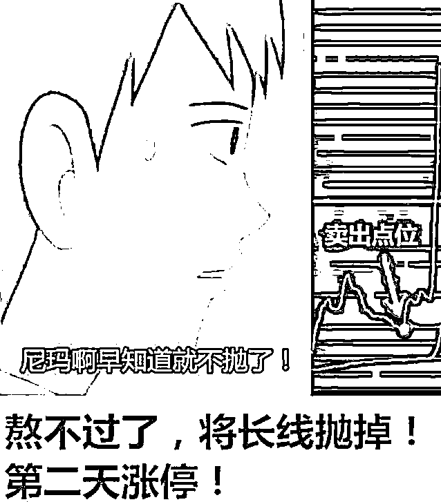
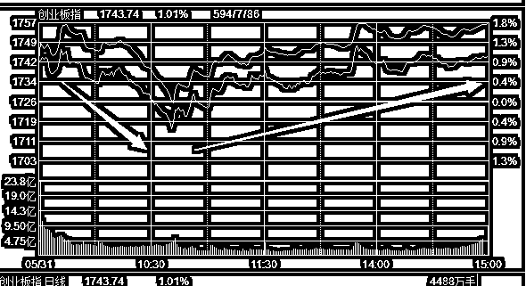
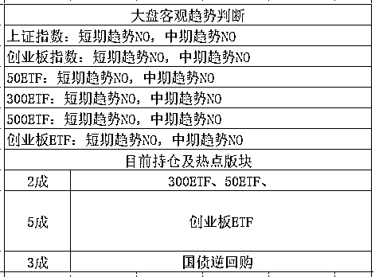

# 伊利董事长潘刚现身，股价涨停 | 夜报

今天伊利股份出了大事，然后涨停了。什么大事呢，在伊利股份今年度的股东大会上，董事长潘刚现身并亲自主持会议。

董事长展开股东大会不是很正常的事情，有什么好大惊小怪的，但是伊利股份不一样，潘刚自去年 9 月赴美治病，就消失在公众视线里，连中共十九大都未能参加。过去几个月里，关于伊利董事长潘刚失联逃亡美国的质疑声音越来愈大。但是即便在公众媒体的质疑之下，潘刚也迟迟没有在公开场合露面或发表声明，还闹出跨省抓人案件，新闻爆出当天股价跌停。这让民间关于潘刚逃亡美国的传言越演越烈，股价萎靡不振屡屡暴跌。

假设董事长逃亡了，那说明伊利就摊上大事了，不管以后怎么走，短期内跌的稀里哗啦是不可避免的，为了规避风险，有部分资金选择卖出是非常正常理性的选择。所以，今天潘刚在股东大会上一现身，关于他逃亡的谣言就不攻自破了，不管他过去的几个月里是不是像他所说的那样在养病，还是有了麻烦在处理，总之，他现在应该是没事了，对于伊利的股民来说，这是好事。

不过，关于伊利最大的问题，并不是董事长的问题，而是他产品的问题，关于伊利的产品的声誉实在是太差了，抵制伊利产品的呼声越来越大，我觉得这才是伊利急需解决的事情，企业形象也很重要。

至于我，由于个人口味问题，本人不会选择购买伊利产品，和大部分人的口味保持一致。

~~~~~~~~~

新闻：美国宣布对加拿大、墨西哥和欧盟征收 25%的钢铁关税，征收 10%的铝关税。

点评：我很佩服特朗普，弄中国也就算了，疯起来连盟友都咬，为了这点钱弄僵盟友关系划不划算啊，要有大国思维，我国为了拉盟友都是要给予各种补贴优惠的。。。

PS：对于美国的关税制裁，欧盟和墨西哥迅速采取了报复性行动，导致美股这会正在低开低走。

~~~~~~

今天股市暴力反弹，上证指数收涨 1.78%，创业板收涨 1%，当初那个满 3200 立减 150 的弱鸡上证指数，今天都能带头领涨，昨天很多大 V 悲观看空，尾盘割肉，还有粉丝留言给我，说别的 V 都是看空的，就你敢买入，勇气可嘉，2850 等着你。

昨天那些恐慌性割肉的大 V，不知道现在还好不好。。。

昨天晚上我和大家说的，除了认为一口气破 3000 基本是不可能这个判断之外，还认为只要稍微顶个一二天，深成指就会触发日 K 底背离，而今天一根阳线打上去，只要明天不是太糟糕，下周基本触发背离没有悬念。

而今天还看到的利好有，官方宣布 MSCI 基金已经成立并完成初步建仓，一波蓝筹的援军即将抵达战场，创业板 ETF 宣布认购额度再创新高，其额度已经达到 2017 年底部的 28 倍之多。一个对蓝筹有利，一个对创业板有利，可以说都是好消息了。当然，就我个人偏好而言，更偏向于创业板。

而由于昨天晚上美股暴力反弹，今天三大指数全部高开，然后由于下跌惯性低走，随后暴力拉起。高开低走基本消化了下跌趋势的影响，后面的单边上涨，才是真正的上涨，对于多头的鼓舞是非常大的。

可以说，今天收出了金针探底，预示底部的形成，而深成指方面，除非下周连阴否则一定会形成底背离，这些现象都预示着，这波回调可能结束了。

在这一次的波动中，我们有 2 成仓位卖在了最高点，然后分批买回，在 6 月里，我看涨，但是并不看大涨，所以冲上去之后，还是会分批出货的，卖我也是分批卖。这次吃进的 2 成，我打算 1800 之下卖出 1 成，1856 附近再卖出 1 成。其余的部分，到时候再看看。

~~~

插个广告，长期招募股市研究员和操盘手，要求技术扎实，战绩优良，自认为高手的，可以发送截图和个人简历到邮箱 723791931@qq.com