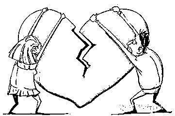
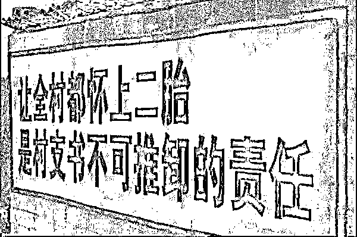

# 结婚容易离婚难，为什么？

紫竹张先生

每篇都有干货的财经公众号

最近看到最高法院发的推文，赞扬四川宜宾法院发明了“婚姻考卷”测试最终成功劝和 80 后夫妻。这就让我想到之前的新闻说四川婚登员以“打印机坏了，网络故障”为由不办离婚挽救 500 对婚姻获得国家赞扬，这明显违背规章制度的事情居然能够得到国家赞扬，这说明国家不希望我们离婚，只希望我们结婚。

**绝对不让结婚群众跑第二遍**

先说结婚容易，只要符合法定婚龄，拿着身份证、户口本和照片来民政局登记下就可以结婚，唯一的检查项目就是询问一下双方是否自愿，其他一概不管；如果家人不给户口本，工作人员就会温馨提示你拿身份证去派出所挂失补办就好；以前还收 9 块钱结婚费，现在也取消了，工作人员效率之高简直可以堪称政府楷模，结个婚真的比炒股开户都容易。（万 1.7 开户可以到主页菜单右下角【推荐工具】里查看哦）

政府的口号是，绝对不让结婚群众跑第二遍。

**至少要让离婚群众跑第二遍**

至于离婚，这就麻烦了。假设是简单模式的离婚，你需要带起证件，提前弄好夫妻分割财产孩子抚养的协议，然后再去民政局排队登记，毕竟只有达康书记才能把工作人员叫家里马上办，要是遇到“打印机坏了，网络故障”还真没办法，为了防止冲动离婚，设定了一个冷静期，一般来说，至少要跑第二次，就算顺顺利利办到证，房产分割要登记，户口要处理，有的忙的。

而困难模式的离婚：那得带着上面说的证件，还得带着证明财产情况的各自材料，毕竟假如无法自行谈妥的话，还得让法院来分财产。

弄好材料后，来法院立案，离婚案一般一审六个月加六个月（可以无限延期），法庭上扯完过去扯现在，扯完小孩扯财产，扯一会法官就劝和一次。但凡法官认为你们还有一丝和好的希望，就会按照《关于人民法院审理离婚案件如何认定夫妻感情确已破裂的若干具体意见》进行处理。

一旦开始认定夫妻感情是否破裂，这就厉害了，总之就是除了有家暴、重婚、不间断分居两年、犯罪判十年、性无能等非常严重的情况，一般一审都不会判离婚的，连约炮、出轨后悔、判刑三年都很难让法官判离婚。那上诉等二审咯，三个月加三个月加 N 个月，上面开庭的东西又得吵一遍，法官倒是懒得劝和了，准备真正判离婚。于是乎，一个婚离下来一年算快的了，两三年不算新闻。

判了之后，不满意是正常的，毕竟除了重婚同居、家暴虐待和转移财产等重大过错才一定会多分钱给受害方，其他比如约炮、判刑等离婚原因，怎么分割财产全凭法官良心了，那可能又要申请再审，上面程序再重复下吧。还有千万别告了之后又撤回起诉，法律规定下次再起诉离婚得间隔半年。还有最难版就是军婚，除了军人一方有过错，不然必须军人一方同意才能离，这是自 1931 年瑞金苏维埃政府持续到现在的规定。

在简单版模式下，离婚至少要跑第二遍，在困难版模式下，离婚你可能要跑二十遍。

**为何国家增大离婚难度**

为啥国家要弄得结婚容易离婚难呢？除去传统思想“宁拆十座庙不拆一桩婚”和家长思维，最重要的原因就是国家自古以来都是主要通过婚姻制度来维稳和控制人口。在古代，官府对婚姻制度一直有明确的规定，鼓励结婚，严格限制离婚。

例如，在春秋战国时期，管仲曾规定，女子二十岁还没嫁出去全家服役，国家医保报销全部接生费，生男送小狗，生女送小猪；三胎免服役，四胎免纳税，五胎送保姆。汉朝初期汉惠帝为了人口增长还收起来单身税，宋代为了鼓励生育曾把法定婚龄降低到男十五女十三。

而离婚就难了，七出三不去自西周开始就一直流传下来，通行整个封建时代，古代妻子是没有离婚的权利的，而丈夫想离婚也是千难万难。所谓七出就是在妻子不孝顺、没儿子、乱伦、各种破坏男方家庭家族关系、盗窃男方财物情况下可以离婚，三不去就是不能跟没娘家的、为公婆守孝三年的、发达之前娶的妻子离婚。如果不符合七出三不去，那么男方就是有天大的本事，也离不了婚。

除此之外，国家还规定同姓不婚，这里可不是说同性恋啊，是不准同姓氏的男女通婚防止近亲结婚有家族遗传病，后来变成“五服”即近亲不准结婚。有这个规定，是因为古人发现近亲结婚会大幅度降低人口质量。

除了增大国家人口的目的之外，有家有口的人更容易统治也是官府考虑的重要原因。古代对剩男还有一个称呼就是“流氓”，毕竟家里上有老下有小的人得乖乖做良民，一辈子跟土地捆绑住，但要是一人吃饱全家不饿，那做事就随便的多了，很难管控。古代还有鳏夫寡妇（丧偶男女）门前是非多的说法，而单身率高的地方确实治安也不好。以至于古代长期以来把结婚率作为官员考核的重要标准。

到了现代，国家鼓励结婚也是有道理的，毕竟结婚就需要房子，买房子就要背房贷，有了房贷压身上，谁敢乱闹腾。而在国家的政策导向慢慢的转变为鼓励生育的时候，鼓励结婚限制离婚就更能理解了。

而国外的人口制度，和国内的其实如出一辙。例如俄罗斯每年以谁生得多来评选英雄母亲；欧洲一些国家实行鼓励生育政策；欧美一些地方征收单身税；爱尔兰设置婚姻有效期，期限越长登记费用越低，期限内不准离婚，看来鼓励结婚限制离婚并不是中国特色。

倒是新闻说我们国家现在已经开始结婚收 5000 押金，生孩子才还，这才是中国特色。理论上说，想退还这个押金是有办法的，可以拿收据去找政府法制办行政复议和去法院告，但是实践操作中，一般没人有精力去这么做。按照这个趋势去发展，如果全面放开生育之后生育率不上升，我估计后面可能会对单身税、无子税进行立法推进，离婚可能会交罚款，给生育奖赏，延长产假和陪产假都是很可能发生的事情。

总之，在中国结婚容易离婚难这种事情，是有很长的历史渊源的，也并非中国独有，其形成原因非常复杂，涉及多方面，这些知识点，你今天学到了吗？

往期回顾（回复“目录”关键词可查看更多）

001 《为什么中国必须购买美国国债？》 

002 《租房贷款会将房子拆分成房骨和房皮》

003 《中国自古以来就是一夫一妻制》

004 《宁波老虎事件遇难者不应该得到赔偿》

005 《中国的房价什么时候会崩盘？》

006 《中国地产达到什么样的条件会崩盘？》

007 《中等收入陷阱为何如此难以突破》

008 《如何把自家孩子培养成一个顶尖人才》

009 《我是如何保证自己不近视的》

