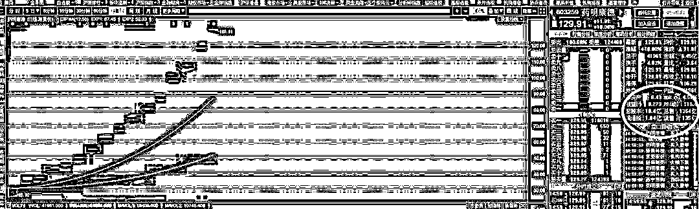
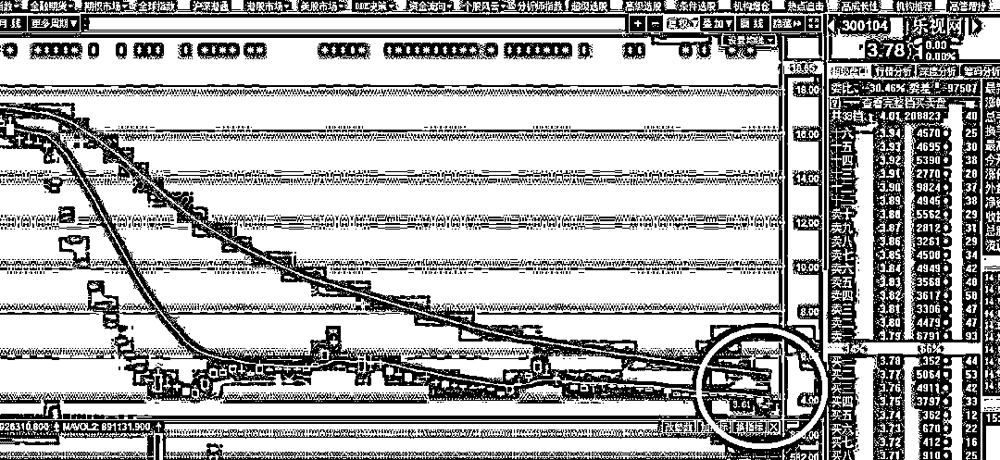
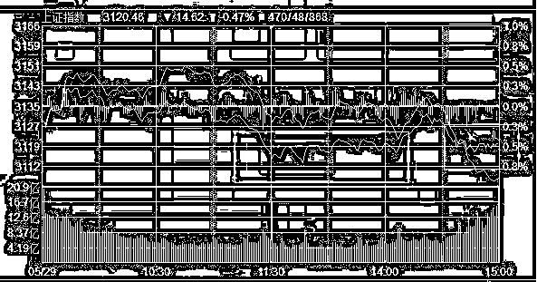
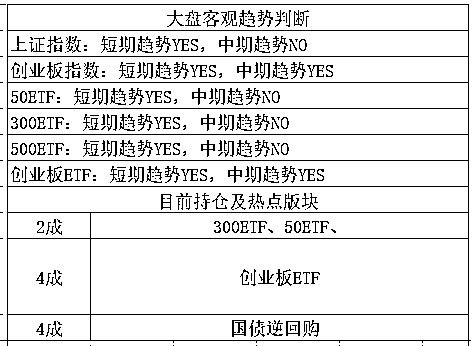

# 来不及起标题了

<link rel="stylesheet" href="view/css/APlayer.min.css">

今天看到一个新闻标题，上交所：坚决防止股市大起大落、暴涨暴跌确保资本市场行稳致远。

首先我给大家科普一下，这个公告是上交所会员单位今天开会发出来的，并不是证监会的官方通告，那么什么叫会员单位呢，就是券商，他的一百多会员单位，就是一百多个券商，也就是说，这个新闻其实是券商开会的宣言，但是也没啥意思，这句话是永远正确的，无非是在迎合监管层慢牛的中心思想，而慢牛都提好几年了，所以并不能以这条信息，决定后市的涨跌。

~~~~

药明康德上市之后连续一字板，目前市值已经上亿了，市梦率破百。药明康德总资产 127 亿，净资产 66 亿，2015 年在美国退市的时候总市值只有 35 亿美元，差不多百亿人民币，来了中国，立刻翻 10 倍。

这个票完美证明了 A 股 IPO 的优越性，以前有个段子说，连厕所上市都能十连板，真不是吹的。这个票我不建议买，要么买不到，买到基本就是套，360 借壳上市就是一个极端的例子。更何况，今天医药板块全面暴跌，对于连涨 2 年的医药板块来说，今天一根断头暴跌，基本代表这波行情已经快结束了，那么药明康德，明天很有可能就会开板。

~~~

对了，还有乐视网提一下，当初乐视网连续跌停的时候，我曾示警说，连续跌停的个股，第一次开板，一定不是底，通常反弹之后，还会再跌一波，我今天看了一下，乐视网已经连续刷新新低了。

而实际上，在当初乐视网第一次反弹的时候，由于反弹强度很惊人，一度涨到 7 块钱，当时还有人在后台留言喷我，说我耽误他发财了。。。

说句实话，乐视网是因为里面套的游资大佬太多，很多人试图自救，才开始在里面爆炒的，正常的股票，绝对反弹不了那么多，一波软绵绵的反弹之后，就是连续阴跌，这种股不能碰是普世真理，是经历多年实战验证的，乐视网仅仅只是一个小小的意外。

但是就算乐视网里这么牛 X 的大佬干扰，也就只是短期拉了一下而已，如今乐视网的价格，已经在 7 块钱，再度腰斩，如果你是追高买入的话，亏 45%了，别人吃大地雷亏也就算了，你没踩到地雷，就硬冲，也亏那么多，冤不冤啊。

今天，三大指数全面收阴，上证和创业板收出 5 连阴，其实今天本来不该跌的，至少不会跌那么多，因为昨天的盘中已经出现了明显的抵抗迹象，说明有人开始买入了，我昨晚还和大家分析，估计就是 3200 点砸盘的那批人，而实际上，今天这批人还在买入护盘，从锯齿状的分时图可以明显看出来。

尤其是最后 20 分钟的走势，简直是摆明了告诉别人我在护盘，因为这种走势图在高度控盘的庄股票里，是极其常见的。正是因为昨天和今天都在有人吃进，所以今天早上的走势非常之好，创业板一度冲高到涨幅 1%，那为什么收盘反而跌 1.2%呢，而且直接弄出了 5 连阴。

因为今天利空太多了，首先，意大利政治危机大爆发，冲击全球，金融市场大暴动，欧股期指全面大跌，欧洲市场遭遇抛售浪潮，全面大跌，仅凭这一点，今天就足够把股市给砸下来，2 点半之后的那波急速跳水，现在知道为什么了吧，那个时候消息已经出来了。

我们在 3 月底的判断是越涨越卖，那一波很给力，直接暴涨到 1900 点，把我的仓位几乎都给卖空了，多头给力到，我打赌收盘破 1900 吃鼠标都给摆了一道。然后整个 4 月都是暴跌，4 月底开始抄底，预估 5 月会反弹，所以要重仓。

5 月的时候反弹是猜对了，的确是阳多阴少，一直涨了接近一个月，到 5 月底的时候开始下跌，吃了 5 连阴，就是整个 5 月的上涨幅度有点少，我划定了几层压力位，打算分批抛售，结果就在第一层减了 2 成仓，就直接成了最高点了。大盘满 3200 立减 100，创业板 1866 直接见顶回落。。。

不过好处是，5 月如果上涨，蓄积了足够多的势能，那么 6 月必定下跌，还是大跌，但是如果 5 月不涨，那么 6 月很可能是横盘度过。

对了，我昨天在文章中说，创业板跌到 1756~1766 我会再度抄底，那么今天形态那么难看，这会欧美市场也在大跌，中 mei 贸易还有继续加剧的趋势（新闻大家都看到了，不要问我分析了，我微博试发了一下，直接被删除），那么后续还敢不敢买呢。

当然敢，我当初制定这个策略的时候，就没考虑过消息面和外围，不管怎么样，我都执行，我看的是月级别的波动，跌下来买一点点，涨上去卖一点点，每一波咬一口小肉下来，认真研究每一层压力位和支撑位后，就可以无脑执行了，最终总收益，一定是很客观的，而且远远比追涨杀跌要科学。

~~~~

今天很忙，回到家都很晚啦，所以就发一篇股市分析的，其实精华文我有挺多想写的，比如最近发生的奇葩区块链大会啊，杭州新房折价 40%引发抢购啊，我都想写一写，奈何时间严重不够，我忙的事情太多了，过几天有时间的时候，多写一点。