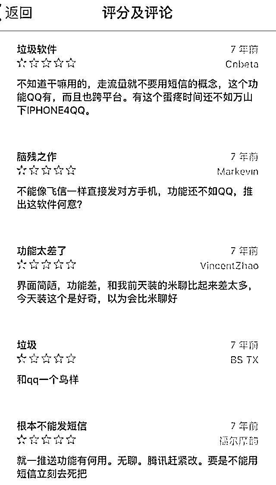
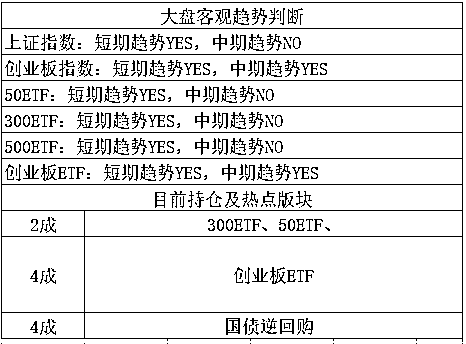
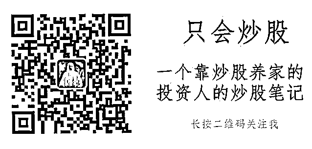

# 七年前，有一款软件曾差评如潮 | 夜报

这几天我看到一张截图，非常有趣，截的是 APP 商店里，7 年前的用户对微信的评价，可以说是差评如潮，吐槽微信垃圾，打一星的人排成排。而今天的微信，是 APP 界的巨无霸，甚至已经超脱了一款聊天软件的定义，而成为了一种互联网生态环境，等于自造一个小互联网。

那么，是不是 7 年前这些人有眼无珠不识，智力堪忧呢。还真不是，我就这么说吧，7 年前微信刚出的时候，我也是这么看微信的，这玩意有啥用，我手机 QQ 用习惯了，懒得换。

这是真的，我一直拒绝用微信，大概一直到 2013 年才被好友给硬拖进微信的，因为他们都在微信玩语音聊天，发送那种很短的语音留言，这个功能当时 QQ 是没有的。后来微信的小花样越来越多，当微信红包这个功能研发出来之后，就彻底完爆手机 QQ 了，再到后来，手机 QQ 都不怎么用了，现在我只用微信。。。

所以，看完这个截图之后，我只能说张小龙真牛，因为这个截图上说的话，说的全是实话，当时的微信就这个样子，和我当时的看法一模一样，7 年后微信能发展成这样的庞然大物，是任何人都想不到的，包括马化腾和微信之父张小龙，我认为他们当时也没想到微信会这么火。

道理很简单，腾讯旗下搞了那么多 APP 了，微信只是其中之一而已，这种感觉就好像去医院给你拉来一百个婴儿，让你猜里面哪一个以后能考上清华一样，这个可真猜不到，哪怕他们的父母都是清华毕业，也只能说这个婴儿上清华概率大一点而已，并不敢说必然能上。

放到风投里也一样，投哪个企业能成，哪个企业不能成，都只是凭概率，简单的说就是连猜带蒙，尽职调查，经验丰富等，都只能说让所投的企业成功的概率增大一点而已，实际上，哪怕增大一点概率，都能富可敌国，所以不要苛求 7 年前那些留言微信的人都能未卜先知。

~~~~~~~~~~~~~

今天出了公告，*ST 烯碳正式宣布退市，其公司财务会计报告被中兴华会计师事务所(特殊普通合伙)出具了无法表示意见的审计报告。

我这里给大家科普一下，一般来说中国公司之间都是花花轿子人抬人，你好我也好，那么当一家会计师事务所顶着上市公司的压力说我无法对你的财务状况表示什么意见的时候。基本上就差不多等于实名举报这家公司的财务有重大问题了。

*ST 烯碳退市已成定局，里面大概有 18 万股东，如果有谁不幸持有这个股，我建议每天坚持挂跌停板赶紧出逃，不要心存侥，前面一堆退市股的走势图摆在那里呢，随便参考几个就可以了，都没啥好果子吃，我们是来炒股的，你还真想退市之后当股东啊。

顺便提一下，今年被审出财务有问题导致退市的公司，清一色东北的，不是啥地域歧视，只是说，今年东北的票稍微回避一下，谁也不知道下一个地雷是谁。

~~~~

周五的时候，股市全面破位，真的是破的很惨，按照趋势交易的逻辑来说，这里应该赶紧空仓割肉，但是我并没有动，是不是我认为趋势战术无效呢，并不是，而且趋势战术在最近的一年多里，被国家队给打残了，刚拉成上行趋势，就有莫名其妙的抛盘，刚跌成下行趋势，就有莫名其妙的护盘。

当然，这一操作，称之为维稳操作，目的是慢牛，实现股市经济的平稳增长，出发点是没什么问题的，所以也没办法指责他什么，只能默默的跟随他操作。

跟随的结果，就是不动如山，比如，昨天刚刚进行了趋势的破位，按理说今天会加速下跌的，但是今天开盘一次跳水之后，莫名其妙的买盘出现了，直接把三大指数全部都给拉红了，简直亮瞎眼。

说真的，今天这么一搞，形态好了很多，搞不好就有可能不跌了，因为出现一定的见底迹象，但是我们采取的是横盘震荡网格交易法，1886 差不多算是一条线，但是空间不够大，如果是 1756-1766，我觉得我是可以直接买 1 成的，但是估计跌不到。

大概就这个样子，从目前的种种迹象来看，有人在护盘，大概就是 1866 之上砸盘的是同一拨人，对于他们的实际打算，猜不到，但是我不管这个，我按照自己的节奏走就行了，跌了不恐慌，涨了不贪心，该买的买，该卖的卖，就这样。

今天推荐一位好朋友，只会炒股，是圈内有名的短线高手，对短线热点股非常有独到的心得，每天都是把自己的热点股操作计划给列出来的，比较有参考价值，长按下方二维码关注。

