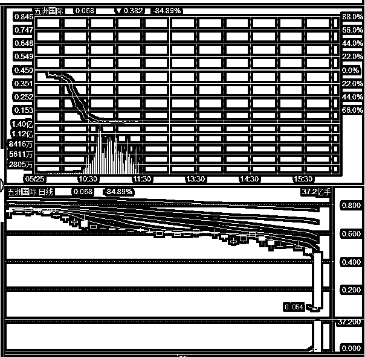
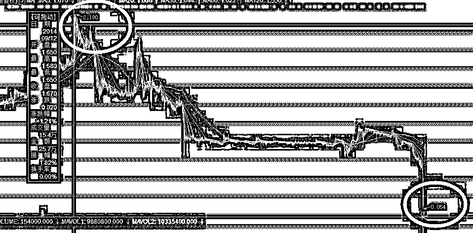
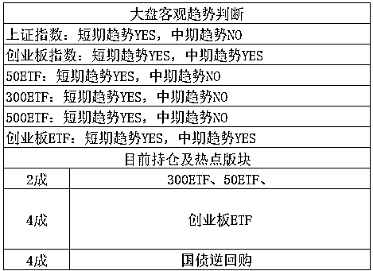

# 一天暴跌 85%的股票 | 夜报

周五的时候，港股五洲国际暴跌，收跌 85%，收盘价 0.068 元，其壮烈程度不亚于乐视网，而且是瞬间完成，不用每天跌停来割钝肉，国内的散户估计很少见过如此惨烈的景象。

而实际上，在 14 年顶峰，该股的股价是 2.19 元，涨的并不多，相对于 IPO 价格而言只是翻倍，摊上大牛市里，这个成绩只是马马虎虎，不过跌的很惨，周五的最低价已经到了 0.054 元，要想回到 2 元钱，这个股需要涨幅 40 倍，也就是 4000%，这辈子怕是不可能了，等下辈子吧。

那么这种股有什么特征呢，还真有，那就是老庄股，换手率特别低，以五洲国际为例，在上周五的时候，全天交易量只有 5.54 万元，你没看错，就 5 万元，一个小散都能贡献全天的交易量了。

那么筹码都哪去了呢，都被庄家给搜集起来了，但是常年出不了货，他们就任由几个散户在里面玩了，所以才会出现成交量如此萎靡的情况，拖的时间太长，在资金压力下，就直接崩盘了。

说这个事不是让你们听八卦的，现在很多骗子团伙，带人炒港股，说自己有内幕消息，在刚开始的一段时间，说涨就涨，说跌就跌，神的不得了，靠的是什么，就是靠和港股的老庄股配合，这些香港的老庄股名声都已经臭了，是人人皆知的老千股，但是大陆人不知道啊，大陆散户进去之后，就别想再出来，这个套路你们了解之后，就不会轻易被骗了，港股里有很多老千股操纵非常容易，其核心特征就是，交易量和换手率特别小，如果日交易额连 100 万都没有的，那铁定是不能碰的。

~~~~

特朗普宣布将会正常和朝鲜进行会晤，可惜了一堆刚在丹东割肉离场的炒房族。不过呢，关于这个事吧，我觉得和朝鲜会晤还是不会晤，虽然还有十几天就开始了，但是真不好说，到时候再看吧，特朗普的脾气我们都熟悉了，到最后一天都有可能变卦。

在上周，指数冲高回落，充满段子手精神的股民用一句话总结了上周的大盘，那就是满 3200 立减 100。

对于我们而言，在上周进行了减仓，上证原定 3200 点减仓，实际减仓 3192，创业板原定减仓 1866 点，实际减仓 1866 点，各减仓 1 成。

减仓的原因并不是感受到了什么危险，而是这里是第一层压力位，以及我们在 5 月初就制定好的越涨越卖的减仓计划的第一层，严格执行而已。减仓之后，等跌个差不多了，创业板 1826，我又回补了 1 成创业板仓位，上证的依然按兵不动。

整体的走势，周五出现了破位，全面破位，上证、深成指、创业板均出现了破位。我们原本对 5 月的判断是涨，不过越涨越卖，因为 4 月的暴跌，所以 5 月可能有一波不错的反弹，不奢求卖最高点，分批卖出，每一层压力位都卖一点，以防万一。

结果第一层压力位就是 5 月最高点了，从这个走势看，整个 5 月可能是月 K 横盘级别，涨不怎么涨，跌也应该不会怎么跌。这种走势让我们 5 月本来是打算大波段操作的，4 月底大幅度加仓，5 月底大幅减仓，结果只减了 2 成，还逢低买回了 1 成，只能算小波段操作。

不过好处是，5 月不涨，那么 6 月就不会跌，道理很简单，4 月暴跌我才看 5 月上涨，5 月暴涨那么 6 月必跌，如果不是，那么 6 月就不一定跌了，因为没有动能。股市最简单的一个原理，不涨就不会跌，不跌就不会涨。

从目前的走势看，全面破位，如果是当年大波动交易的时候，这就要赶紧跑路了，可惜现在的股市就被压制成了一条直线，被熨斗给熨平了，我的策略也就修改成，留一定的子弹等大型黑天鹅意外降临的时候买带血筹码，平时就不动如山，涨一点我卖一点，跌一点我买一点。

你看到我周五把 1866 卖的筹码，1826 买回来了对吧，如果再跌，我还会买，拉起来我再卖，就这么粗暴，但是点位定的非常精细，我的每一层压力位的制定，都不是随便制定的，并不是无脑的按百分比上涨卖出的那种。为什么我始终说上证 3200 和创业板 1866 有压力，这是有道理的。

简单的说，周五破位了，别慌，目前 6 成仓位 4 成子弹，机动性灵活的很，不可能会有连续大暴跌，怎么玩，都能挣钱，无非是多拖一点时间而已，不是要慢牛嘛，我来配合你就是。

