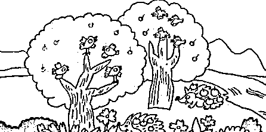
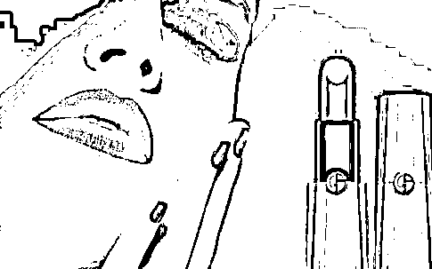
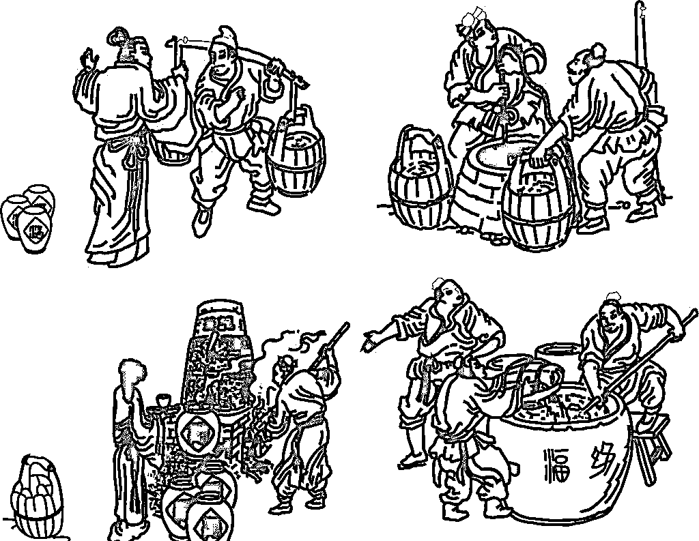
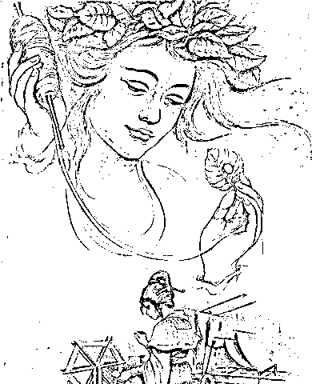
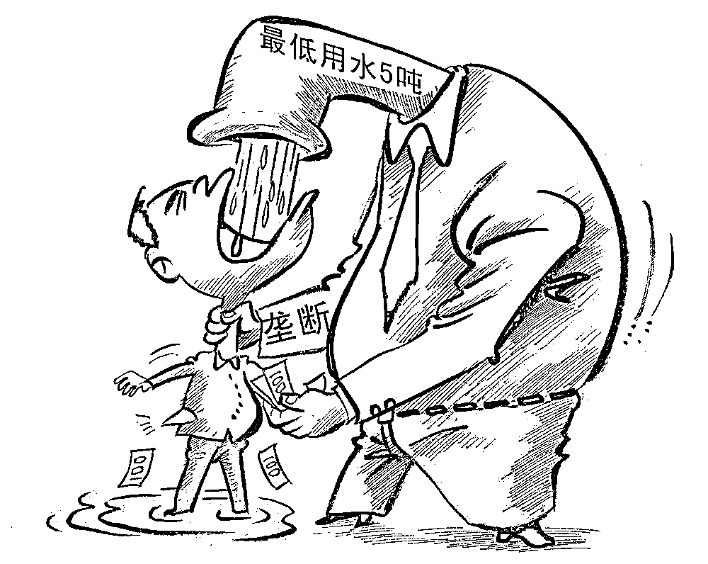
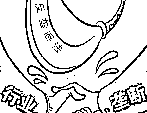
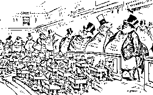
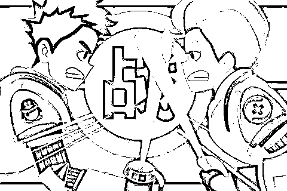

# 垄断行业的前生今世

紫竹张先生

每篇都有干货的财经公众号

在我国，有很多行业是垄断的，例如和人民生活息息相关的水电、烟酒、铁路、金融、国防，但是也有很多行业是不垄断的。有很多人或许认为，反垄断不是天经地义的吗？为什么会允许垄断行业的存在？那么我国是怎么界定一个行业是应该垄断或者是不应该垄断的呢，我们今天从经济学原理的角度谈一谈，垄断行业的前生今世。

垄断行业的起源

任何一个垄断行业，都是起源于规模经济和行业分工，那么我们来谈一谈规模经济和行业分工对于垄断的作用。

远古时期，人类靠外出采果子维持生计，而出外采果子来回都要时间，既然来回花的时间是固定的，采一个果子跟采十个果子在路程上也就几乎没区别，那么每次来回采的果子越多，平均采每个果子需要的时间便越少，所以那为了节省时间和采更多的果子，人们总是每次外出尽可能采更多的果子。

这便是我们说的规模经济的好处——我们可以通过增加采果子数量（规模）来减少每个果子采集的时间（增加经济效应）。

后来，人们在采果子的过程中发现，男人真是不细心，看颜色都看不出果子熟没熟、有没毒。不过倒是男人比女人力气大点、速度快点，偶尔遇到野兔什么的能够打到，还不如让他们专门找野兔去，到了后来，就变成女人采果子、男人去打猎。这时，相比对方，女人在采果子上有优势而男人在打猎上有优势（比较优势），在这种情况下，女采果男打猎比大家一起去采果打猎好得多。（据说这便是男女差异的由来：**女人以前做篮子装果子**、要靠颜色区分果子、采了果子跟别人交换，**现在喜欢包包、喜欢各种颜色的口红**、喜欢买买买；男人以前靠组织起来用速度、力量打猎，如今喜欢权力、车子和枪支。偏题了偏题了）

这便是行业分工的好处——我们要按大家擅长做的工作去安排大家的工作，分工越细，经济效率越高。

再后来，人们学会种田养猪，吃饱喝足之后便搞些小发明，有个叫杜康的就发明了拿果子去酿酒，然后拿酒去换果子和烤肉，羡慕他的人也学着酿酒，一时间就有一批人酿酒为生。但是剩余果子和烤肉总是有限的，人们也喝不起那么多酒，那么大家换酒的时候就挑便宜的好喝的，于是一些酿酒不便宜不好喝的就只得回去种田养猪打鱼去了，而酿酒便宜的好喝的还能带亲戚朋友一起做，循此往复。最后，由于托拉斯酿酒团队酿酒最出色，只剩下他们在酿酒卖。

这就是市场竞争后形成的自然垄断——市场竞争优胜劣汰，优的收购劣的，那么最终市场必然只剩最优的。酿酒市场中，只有托拉斯酿酒团队卖酒，这就是垄断，而托拉斯酿酒团队可以称他们为垄断组织，他们的经济地位可以成为垄断优势地位。

这时，部落各个地方已经形成了不少种类的垄断，除了酿酒业这种通过市场竞争形成的自然垄断行业，还有别的原因也形成了垄断行业。部落首领黄帝的老婆嫘祖发明了养蚕取丝做衣服，黄帝要求全部人只能买嫘祖做的衣服，这叫因行政形成的垄断，即行政垄断。全部落只有神农氏知道哪里能采天山雪莲，只有神农氏卖天生雪莲，这叫独占资源形成的垄断，即资源垄断。

此外，所有渔民组织起来，一起商量怎么打鱼运鱼卖鱼，这便是横向垄断；而托拉斯酿酒团队要求各洞穴卖酒的人必须按照团队规定的价格卖，否则不给酒卖，这便是纵向垄断。卖酒的基本只有托拉斯酿酒团队而买酒的人有的是，可以成为卖家垄断；反过来，对于卖酿酒粮食的人来说，买酿酒粮食的也就托拉斯酿酒团队，那么就是买家垄断。

垄断行业对经济的影响

当酿酒行业形成了自然垄断之后，部落里托拉斯酿酒团队统一跟各种卖酿酒粮食的人买酿酒粮食，统一运酿酒粮食，统一酿最好最便宜的酒，统一向部落里有余粮的人分派卖酒，甚至可以从每月卖酒情况分析要酿多少酒，向哪里的谁卖多少（大数据分析有点穿越了），这比以前集市一群人乱哄哄讨价还价，花费同样的粮食酿出了很多劣酒造成资源浪费，真是省了大量人力物力和时间。而黄帝、嫘祖、神农氏、渔民组织也都这样。

这边是垄断本身是有利于经济的——细化分工和规模经济结合到一起形成了一定区域内的垄断，经济效应倍增。如果垄断行业按照这种形态运转的话，他是有利于经济的，但是人心是都是有贪欲的。

一段时间后，托拉斯酿酒团队变心了，像男人有钱变坏一样，他们商量了下，既然部落的酒都是我们负责的，那么我们压低卖粮价提高卖酒价，这样不是赚的更多，如果谁再来跟我们抢酿酒生意，我们就免费送，反正家大业大，弄崩他们后咱们继续低买高卖，还可以绑定出售些酒杯酒瓶，价格算到酒里面。于是，他们操控价格，作假掺假，排除竞争，酒变得又贵又不好喝，部落再也没好酒了。

这便是垄断的弊端：在相关市场垄断组织利用垄断地位随意操纵原材料和产品的买卖价格，降低产品的质量，谋取暴利，当有其他竞争者介入时，即使新竞争者产品更有优势，垄断组织也会用远低于市场成本价的价格出售产品来击溃新竞争者，而不是通过优化产品价格获得市场份额，最终资源达不到分配最优化，与经济发展正常方向背道而驰，对经济的发展造成了破坏。

反垄断和国家垄断

鉴于部落里的经济在垄断行业的控制下节节衰退，部落首领黄帝为了部落决定开始反垄断，于是他编订部落规则：一、强行用部落公款收购各个垄断组织的一半以上，然后低价卖给原有员工或者部落干部，而独占资源的团队不想拆分必须公开资源来源和方式。二、不准任何团队占市场份额的一半、两个团队合计占市场份额的三分二、三个团队合计占市场份额的四分之三。三、让部落干部组成反垄断联盟，以后凡是大一点的团队们要合作都要联盟同意，联盟常规检查，接受部落人民举报，以后再发现垄断的由联盟一律罚款、征收、坐牢、砍头。

这就是反垄断法，反垄断主要通过强行收购或公开信息破除已有垄断，通过市场份额界定界定垄断，通过设立机构行政机构、合并审批、常规检察、群众监督加以惩罚来防止垄断。

反垄断一段时间后，部落头领黄帝发现不对劲了，几乎没人送信了，妻子嫘祖赚来的部落公款收入少了好多，神农氏不研发新草药了，鱼比之前渔民合作更贵了，蚩尤团队打造武器后就造反了。想了下才知道，反垄断反得过分了，某些行业还是要允许垄断的：送信是部落沟通的方式，利润低还必须要有，所以，薄利且必要的基础设施类得国家垄断，所以古代的驿站基本都是国家垄断。

赚钱的生意让部落嫘祖垄断才能让部落财政收入增加，这样可以降低对百姓的税收。所以，简单暴利的生意得国家垄断，以后建立国家了，食盐、烟酒、彩票都得国家垄断。

神农氏尝百草发明创造，研发成本高，得允许他垄断一段时间才有动力继续，所以，发明创造保护短时间内的垄断，得建立知识产权制度，有人向国家公布他的发明创造后，用知识产权保护他短时间内垄断。

渔民合作没有做坏事反而让渔业更好了，如果没有规模合作，成本反而上升了。所以，允许某些行业形成垄断组织但必须严格监控有没做坏事，以后建立国家了，不仅要看有没垄断地位，更要看有没利用垄断地位干坏事，我们只反干坏事的。

蚩尤团队敢造反跟他们能生产武器有关，所以，以后关系到部落命脉、涉及部落安全的生意只能部落垄断，所以武器重工、军队国防必须国家垄断。

因此，企业垄断本身是利于经济的，只有当垄断行业利用垄断优势破坏经济时，必须反垄断。但是反垄断也是有限度的，反的是不利于国家的垄断，即利用垄断地位破坏相关市场的垄断行为，而对于有利于国家的垄断，国家是支持的。国家衡量一个行业是否应该垄断，只有一个标准，那就是是否对国家经济有利。

中外的垄断实例

中国自古就有官方垄断。秦始皇收天下武器铸造金人，而后凡是统一的朝代，武器产业全部国家控制，相传元代更是十人一把菜刀，连可以做武器的生活用品都不放过。除了铁，盐也是官方垄断的重点，制盐产业工艺简单，利润丰厚，打击私盐便是关系国家经济命脉的大事。此外，还有邮政也是国家垄断，通讯基本都是驿站负责，明末钱不够驿站裁员五万人，李自成就此走上反政府之路。

而对于反垄断，比较公认的说法是，反垄断是从美国开始到全世界的。美国南北战争后，国内市场统一，美孚石油企业垄断了石油市场，随后进入各个经济领域，各种经济集中滥用市场支配地位，降低员工薪酬，低买高卖产品，引发大规模抗议，美国经济也丧失活力。1890 年美国议员谢尔曼提案打击这种托拉斯，史称谢尔曼反托拉斯法案。而二战后各种反垄断法案更是陆续推出，不仅对于国内市场，国际条例里面也有一些反垄断条款，主要针对跨国企业。而反垄断也从一开始只有有垄断地位支配地位就无脑反，到后面只反利用垄断地位获取不正当利益的公司。

我国 08 年出台了反垄断法，成立了反垄断委员会。当然，国家出台的法律，不反国家垄断，正义女神告诉我们：剑锋所指非执剑之人。所以至今我们水电石油电信还是国家垄断的，也是合乎反垄断法的，毕竟反垄断法是国家所立。而凡是要加价就是开个听证会的问题，降低国家垄断产业的定价也是神仙打架了。

互联网时代的垄断新定义

到了互联网的新时代，垄断的定义出现了新的挑战，互联网不同于传统经济，其垄断行为很难判定。

当年有名的 3Q 大战，一个互联网安全行业的龙头与一个互联网通讯行业的龙头掐架。一会腾讯要出安全软件，一会奇虎要拦 QQ 广告，一会 QQ 和 360 最多用一个，在国家调停后，两家又去法院打官司了。到底算不算涉嫌垄断，至今都没扯明白。

首先，要说 QQ 在即时通讯市场算垄断，要先找到通讯市场有多大，这可不是测量部落村子多大，因为互联网是全世界的。那么 QQ 按世界互联网算，肯定不是垄断。如果按照中国互联网算，那也不好说，毕竟上淘宝上贴吧只有有聊天窗口的都算即时通讯。

其次，有没有支配地位也很难说，以前可以通过公司大小谈支配地位，但是大家都知道网络影响力跟公司大小关系没那么大，像蓝洞搞出个吃鸡游戏风靡全球，可以说在这个细分领域支配了吧，但是蓝洞公司有多大？一家小公司而已。

要说排除其他竞争者的能力，不能说微信护城河不深，毕竟有惯性依赖，习惯微信了就一般不换了，而且要是真的换得全部好友搬过去。但是微信之后还有陌陌、探探甚至支付鸨横空出世，试图挑战微信的地位。

最后，滥用市场支配地位的行为也难说。如果村头卖油条的免费送，把全村其他卖油条的都搞垮，然后再卖高价，妥妥是滥用垄断地位。但是互联网上不好说，因为大家都免费服务，然后用其他方式赚钱。QQ 微信自己公司运作要钱，但聊天不用钱，储备了用户群体之后，就能弄别的赚钱。

奇虎 360 更是用免费服务发家的：当年杀毒市场有金山毒霸有瑞星，统统收费安装，360 半路杀出来，又免费又好用，市场 90%都占了，等他们反应过来已经凉了。现在谁都不好意思说谁免费是滥用市场支配地位，而强迫二选一也是跨市场的，至于搭售 QQ 管家或者 360 管家，没收钱也是配套软件，更不好说是滥用垄断地位。

所以互联网行业出现了一个奇怪的现象，互联网是天然的垄断行业，一款软件研发出来之后，边际扩展成本几乎为 0，用的人越多，这家公司收入越高，研发能力越强，最后必然是赢家通吃，形成垄断。但是互联网垄断企业却步步如履薄冰，你都不知道下一个把你干掉的人是不是和你一个领域的，跨界打击比比皆是，所以互联网界遍地巨头，但是至今也没有一个明确的垄断定义。

垄断行业对我们的影响

对于我们而言，其实最关注的，就是和生活息息相关的水费、电费、油费等国家垄断行业，认为如果破除了国家垄断，自己的生活会过的更好。其实并不一定是这样，我们前面已经分析了，国家在界定一个行业是否应该垄断的时候，只有一个标准，那就是是否对国家有利，这样国家垄断行业提供的利税，可以增加财政收入，来变相压低税收。了解了垄断行业的前生今世之后，你就会发现，这事情没有那么简单，哪怕是美国也不是无脑反垄断的，也是考虑对国家经济的综合影响。

所以拆掉国家垄断是不可能的，那么大家想知道如何把自身的利益最大化吗？还真有，我这里可以教大家，那就是每次当水费、电费开听证会的时候，就在网上无脑喷，舆论的声音大了，相关部门会处处顾忌，会压缩自己的利益，直到忍受不了了才开始提价的。

这种情况，也算是中国国情吧，这一招也算是全球民众反垄断的一股泥石流了。。。

往期回顾（回复“目录”关键词可查看更多）

001 《为什么中国必须购买美国国债？》

002 《租房贷款会将房子拆分成房骨和房皮》

003 《中国自古以来就是一夫一妻制》

004 《宁波老虎事件遇难者不应该得到赔偿》

005 《中国的房价什么时候会崩盘？》

006 《中国地产达到什么样的条件会崩盘？》

007 《中等收入陷阱为何如此难以突破》

008 《如何把自家孩子培养成一个顶尖人才》

009 《我是如何保证自己不近视的》

