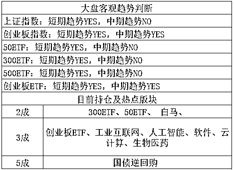

# 特朗普不愿意和朝鲜和谈了

紫竹张先生

每篇都有干货的财经公众号

今日，特朗普宣布取消原定于在新加坡举行的和朝鲜最高领导人金（和谐）的会谈，此消息一宣布，国际黄金期货价格急涨。 

“特金会”取消的原因，是因为谈不拢，在朝鲜看来，我宣布废弃核试验场，以后不再研发核武器，但是手头已经有的核武器保留，大家以后和平发展，美滋滋啊。

美国人认为，简直想得美，此例一开，以后大家都开始拼命研究核武器了，美国要求朝鲜销毁所有核武器存货和资料，不允许一枚核弹头留在朝鲜，这个朝鲜是坚决不能同意的，要是同意了，老子卧薪尝胆那么久研发核武器是为了放个烟花好看吗？

谈不拢是必然的，所以特朗普宣布取消会谈之后，朝鲜局势再度升温，国际避险情绪开始抬头，黄金期货大涨。

我刚才看了一下盘，截止晚上 11 点，大概涨了 1%左右，欧美下跌幅度，也在 1%以内，说明这件事的影响有，但是不会太大，因为大家本来也没期望第一轮解决朝核问题。将心比心，换我是朝鲜，保留现有核武器是底线要求，换我是美国，销毁现有核武器，也是底线要求，这怎么可能谈得拢嘛。

更尴尬的是，朝鲜昨天才安排记者拆毁了核设施。。。不知道今天晚上会不会赶工修新的。

~~~

在前几天，我们先是尊重上证 3200 压力位卖了 1 成，然后尊重创业板 1866 这个 20 月均线压力位卖出 1 成，按照原设想，这里只有小概率遇阻回落，不过按照概率的原则，还是减仓了，没想到意外收获，直接跌下去了。。。

我这里科普下股市的概率原则，假设在某个位置，你有 100%的把握他一定会涨，你就满仓，如果你有 70%的把握他会涨，你就 7 成仓，如果你有 30%的把握他会涨，你就 3 成仓，按照这个原则去操作，你会非常的从容，而且是慢性稳定复利。

我这一波就是按照这个原则来做的，首先从月级别的推算上，4 月主跌，5 月主涨，但是涨跌都有限，所以 4 月的时候慢慢买，5 月的时候慢慢卖。

4 月的时候遵循的原则就是，跌的越深，其上涨的概率越大，所以我越跌越买。5 月的时候遵循的原则就是，涨的越高，其上涨的概率越小，例如创业板 1950 附近，我认为上涨概率大概只有 30%了，达到 2000 点，我认为上涨概率大概只有 1%，没说 0%是因为世界上没有绝对的事情。

所以，这一波我进行的减仓，是 3192 和 1866，几乎完美减在了高点，这是概率的馈赠。那么接下来，我会进行买回操作，因为跌了。。。

今天创业板收盘 1838，美朝会谈取消，欧美下跌，地缘风险凸显，很明显明天会有低开，跌入 1826 区域的概率是非常非常高的，我打算在这里买入 1 成，回补仓位。至于上证仓位，仍然不打算加仓，那些 ETF 就扔那吧，我是打算当压舱石用的，跌的足够多，才有参与的必要。

