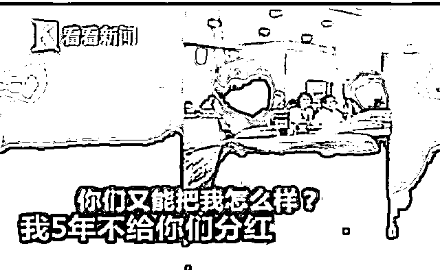

# 特朗普提出了解决中兴事件的预想，或罚款 80 亿人民币

紫竹张先生

每篇都有干货的财经公众号

1

今天凌晨，一则消息刷爆朋友圈，在美国美国总统特朗普对媒体表述了他对解决中兴事件的构想，特朗普表示美国政府尚未与中国政府就中兴事宜达成任何协议，这和中兴公司表述的美国将会解除对中兴的制裁并不完全一致，因为只有完全达成协议，签字的时候，才算尘埃落定，只要不达成双方协议，哪怕可能性再大，也存在失败的概率。

另外，特朗普提出了解决中兴事件的预想，特朗普表示可以解除对中兴的禁运，但是中兴要接受惩罚，预想将会对中兴处以 13 亿美元罚款，折合约 80 亿人民币。同时会更换管理层，成立新董事会，并采取“非常非常严格的安全规定”，而且中兴未来还不得不从美国采购很大比例的部件和设备。

中兴通讯，已经是一桩持续六七年的诉讼旧案了，起因于中兴向伊朗出售违禁科技产品，2017 年宣布达成和解，中兴缴纳 8.9 亿美元（62 亿人民币）罚款，解雇 4 名高管，并处罚了涉事的 35 名员工。

这个罚款很痛，但是中兴执行了，罚款一分不少的缴纳给了美国，4 名高管也解雇了，但是唯独那 35 名员工没有处罚。也许中兴觉得大头已经做了，剩下一点尾巴无所谓了，区区 35 个员工算什么。但是他小瞧了美国人的较真程度，已经 18 年中美贸易冲突的激烈程度。

到了 18 年，美国发难，表示中兴未对其他 35 名涉事员工进行纪律处罚或减少奖金严重违反美国制裁伊朗相关措施后与美国政府达成的协议，决定对中兴再度实施禁运。

这件事冤不冤，从情理上说是冤的，从法律上说是不冤的，关键拿着法律条文对质的话，中兴的确无话可说，所以这下吃了大亏。按照特朗普的最新设想，中兴还要继续被罚款高达 13 亿美元，整个管理层和董事会都要大换血，采取符合美国要求的安全规定，并且未来还必须从美国采购大比例的部件和设备，限制了中兴的采购权，这个条件真的很苛刻。

你以为这个条款苛刻了？这还没完，特朗普这个设想一发表，就遭到了美国国会的联名抵制。

是抵制特朗普罚款过高吗？不是的。26 名参议员在信中敦促特朗普政府，要对“连续和蓄意违反美国法律的人，如中兴通讯，进行处罚。”参议院银行委员会也以 23 票对 2 票的投票结果，让特朗普修改对中兴通讯的处罚变得更加困难。

换句话说，他们觉得特朗普的处罚太轻了，要弄死中兴才算完事，认为特朗普这么做是在对中国示弱讨好。这简直。。。果然哪里都有高举爱国旗帜不顾实际的人群。

美国人非常重视合法合规，例如 2005 年，波音公司爆出大量丑闻。它先在用于出口的 737 客机上违规使用了禁止出口的军用级芯片，又通过提供国防部官员子女工作等方式行贿国防部，再通过挖走竞争对手马丁公司高管的方式非法获得对方的大量机密等。这些都使得波音公司成为美国司法部调查的对象。最终，波音公司前后有 15 名副总裁下台，3 人面临刑事指控。波音公司还签署和解协议，缴纳了 6.15 亿美元的巨额罚单。之后，波音公司没有按照税法把罚款充做经营成本抵扣营业税，硬是比法律要求多交了 2 亿美元税，只是为了避免日后成为国会和媒体对波音攻击的靶点，使得波音免于在今后的政府采购案中处于不利的局面。

我们可以看到，美国对于这方面的要求简直就是吹毛求疵，哪怕是本国企业都是这样，对于中国企业而言，再加上意识形态的差别，要求肯定更严格。但是解除禁令对中国太重要了，6 月份是 5G 标准制定的关键节点，中兴作为世界第四大电信公司，是 5G 的主要玩家之一，目前中兴拥有 4G 标准 815 件，全球占比 13%，而 5G 的全球专利更是超过 2000 件，如果中兴缺席 5G，那损失简直太大了。

关于这件事，我没啥好评价的，只能祝中兴顺利挺过这一劫吧，代价实在太惨痛了，更换管理层，改组董事会我认为是必要的，高管必须为愚蠢的决策进行埋单，而不是让中兴普通员工甚至是普通中国人平白付出高额代价。

2

**以前我是每天一半进行财经和时事点评，另一半进行股市点评。**过去一周，我尝试每天发 2 篇文章，篇篇精华，所以我拆分成了 2 篇，头条放财经时事，次条放股市。

不过今天我没有拆开，合在一起了，因为今天中兴的评论不够精彩，我认为达不到我自己定义的精华文的标准，所以今天改成合集。

其实关于中兴我可以写的很精彩，奈何一写就被删除，而且是点名删除，说实话我那篇挺爱国的，到现在都没想明白哪里犯禁了，不过这种点名删除的事出现几次就被拉黑名单了，所以我今天只是阐述事实外加简单评论，以免犯禁。

上次写的中兴，**21 个小时阅读破百万，然后被网监局点名删除**，以此图纪念一下。

3

汽车关税全面下浮，税率从 20~25%下浮到 15%，且增值税等都跟随下浮，执行日期是 7 月 1 日。

很多人被混乱的税制算晕了，我这里可以提供一个简单的算法，那就是所有的进口汽车，价格都会下降 8%左右，你可以认为会在前几天的价格基础上，直接打 92 折。

所以，打算买汽车的，可以等几天，这几天先别急着买，等价格下来了再下单购买，据我所知，很多外国厂家都已经开始决定降价了，无非等一段时间而已，能便宜好多钱呢。

而对于国内的汽车厂商来说，他们的成本没有变，但是随着国外进口汽车的降价，他们也会被倒逼降价，这是自由市场机制所决定的，所以决定买国产汽车的，也可以等一等，要不了多久，一定会进行降价，哪怕降价 5%，也不少钱呢。

谈到这里，我想到了 20 年前，那个时候有媒体争论先买房好还是先买车好，二者价值等同，但是代表二种不同的消费观念。

现在不用争了，因为一辆车的价格，已经从能买一套房，变成只能付首付，后来更是变成了只够首付的零头，如今居然还要降价！

4

今天还有个消息，河北银隆大面积停工，濒临倒闭。

对股市不关心的人可能对银隆不太清楚，这家总部位于珠海的企业主要进行新能源汽车的生产，16 年中旬，格力电器的董明珠看好珠海银隆，要求格力电器对银隆进行投资，估值 130 亿，大量机构一致反对，不管董明珠说什么都没用，董小姐一气之下扔下了**我就 5 年不分红你们能把我怎么样**这句名言。

结果就算如此威胁，这些机构还是不肯就范，于是董明珠一气之下以个人名义投资珠海银隆，试图证明自己的正确，还拉上了万达的王健林一起投资。

当年还是首富的王总，一口气投资了 5 个亿，达到了 5 个人生小目标。

通过不断追加投资，董明珠目前成为了珠海银隆最大单一股东，董明珠入股银隆一年以来，银隆挑战不断：创始人兼董事长“出走”，格力高管入驻；新能源汽车补贴退坡和收紧，新能源汽车销量严重下滑等，如今位于河北的银隆工厂出现大面积停工的情况，不知道董小姐作何感想。

格力做得好空调，不代表做得好手机和新能源汽车，俗话说隔行如隔山，这话是有道理的，如果有钱就能决定一切，那全天下早就归一家企业管了。

上一家气冲斗牛，到处买买买，什么行业都想涉足的中国牛企，叫哇哈哈。

5

今天股市全面下跌，上证下跌 1.4%，创业下跌 1.6%，多只妖股出现开板吃面迹象，原因不明，唯一流传的小道消息是中美贸易战好像又有反复的迹象，不过并未得到官方证实。不过整个亚洲股市都出问题了，利空消息出现的时间，是早上 9 点，我可以观察日本股市，上午 9 点的时候出现剧烈跳水。

虽然到目前为止流传的都是小道消息，没有官方证实的消息可以解释 9 点的突然跳水，但是好处是，昨天我们刚刚进行了减仓。。。

根据我们之前定的计划，我们在上证 3192 进行了减仓 1 成处理，创业板 1866 进行了减仓 1 成处理。上证原计划是 3200 进行第一次减仓，后面退一步改成了 3190 附近。创业板则是因为尊重 20 月 K 压力位。

减仓不是看空，而是我们在 4 月进行了重仓抄底之后，5 月的总策略就是越涨越卖，如今已经到了 5 月底，那么适当卖一卖，是很正常的，后面继续涨，我们就继续卖，创业板涨到 2000 左右，就直接彻底空仓。

但是今天的利空，是一个意外惊喜，虽然已经濒临 5 月底，但是如果跌的足够多，我还是可以买回来的，我决定明天如果能跌到 1826-1830 附近，打算买回在 1866 抛出的创业板 1 成，上证的暂时不买回。

因为我觉得吧，这一波涨的有点少，跌下来我不妨就再买回来一点，至于上证，暂时没兴趣进行如此小范围的高抛低吸。

大概就这样，刚卖就跌，属于尊重压力位带来的意外收获，明后天打算吃回仓位。

往期回顾（回复“目录”关键词可查看更多）

001 《为什么中国必须购买美国国债？》

002 《租房贷款会将房子拆分成房骨和房皮》

003 《中国自古以来就是一夫一妻制》

004 《宁波老虎事件遇难者不应该得到赔偿》

005 《中国的房价什么时候会崩盘？》

006 《中国地产达到什么样的条件会崩盘？》

007 《中等收入陷阱为何如此难以突破》

008 《如何把自家孩子培养成一个顶尖人才》

009 《我是如何保证自己不近视的》

<link rel="stylesheet" href="view/css/APlayer.min.css">

