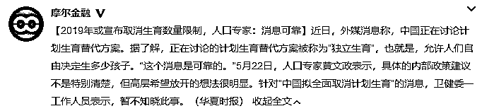
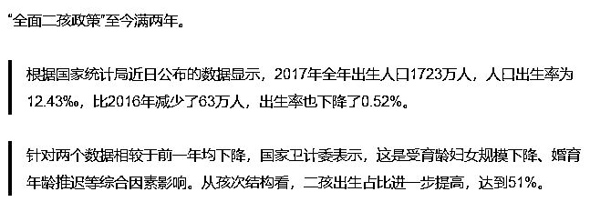
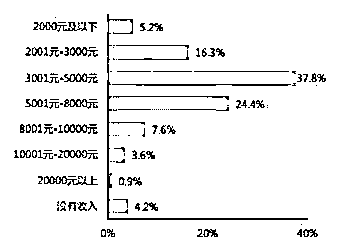
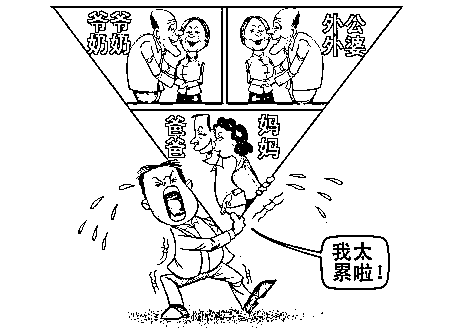

# 孝顺成了奢侈品，所以中国人不会去生孩子

紫竹张先生

每篇都有干货的财经公众号

中国要全面放开计划生育了？！ 

近日，外媒报道中国正在讨论全面取消计划生育，也就是说想生几个生几个，今天人口专家黄文政表示，具体政策还不清楚，但是高层希望放开的想法很明显。以中国国情而言，说出这样的话，表示中国的计划生育全面放开只是时间问题了，而中国加速的老龄化和养老压力，也让这个消息更加的可信。

为什么高层会选择取消持续几十年的计划生育政策，我想这是和近些年开放二胎的效果远不及预期有关。计生委曾乐观的预期开放二胎后每年会多出 200 万以上的新生儿，但是实际上的生育数据远远低于预期，生育数据下滑的非常厉害，在这种情况下，开放全面生育是势在必行的，如果开放全面生育还不能挽救中国断崖式下滑的人口数据，那么下一步恐怕就是采用补贴进行奖励生育了。

为什么中国人不愿意生孩子了，原因很简单，在中国育龄人口的生活压力非常大，他们连孝顺父母都做不到了，还生孩子干什么。孝顺曾经是中华美德，理应人手一份，但是如今，他已经成为了奢侈品。

**1**

小王的故事

小王和妻子是双职工，月薪均在万元以上，在中国全国范围内进行比较，这个收入已经甩掉了 90%的人群了，我们来看看 2015 年的一份月收入分布数据图。大家平时心灵鸡汤看多了会觉得月薪上万不算多，但是拉出全国的数据一看，才知道月薪上万已经属于中国 TOP10%的人群了。

小王的家庭就是这样的双精英组合，按理说是非常富裕幸福的，但是当他的同事问他有没有生二胎的打算的时候，他像听了笑话一样，说：“你逗我呢”。

小王和他妻子虽然收入很高，但是他们的家庭属于典型的 421 家庭，上面 4 个老人已经垂垂老矣，下面还有一个孩子嗷嗷待哺，他们 2 个人是家庭的全部经济支柱。每一天，他都处于焦虑之中，因为家庭的收入怎么算都不够。

小王的爸妈，岳父母虽然身体健康，大病没有，但是小病不断，这四位老人一边照顾自己的父母，也就是小王的爷爷辈，一边自助养老。在父母没病的情况下，家庭收入基本能维持平衡，一旦有一个老人住院，那么家庭瞬间就会出现赤字。

医院、幼儿园、单位、家，样样都得顾，但是样样都顾不上。小王只恨自己分身乏术，但是请人又请不起，自己请假去照顾更是不敢，左右为难。很多小城市里，医院护工的价格是 135 元一天，如果是一二线城市，价格会涨到 200 元左右，很多在一二线城市打拼的子女的月薪，也就刚好给护工发工资罢了。

对小王来说，再过 10~15 年左右才是真正考验他家庭的时候，那个时候的父母会频频生病，孩子也在成家立业的关键时刻，花费不菲。多生一个孩子，就意味着多一份巨大的支出，但是父母的养老问题，也是一个巨大的吞金黑洞。这种情况下，只能选择不生，毕竟对自己付出最大的是父母，而不是孩子，不管怎么样，先尽自己全力照顾好自己的父母才是正道，如果连自己的父母都照顾不好的情况下，还去生孩子，不仅是对父母的不负责任，也是对孩子的不负责任。

有一位土豪朋友，请了 2 名护工照顾他的老母亲，加上老太太的其他生活开销，一个月要花差不多 2 万元。连护工都说“这老太太命真好，有这么孝顺的儿子”。

这位土豪朋友很明显是非常孝顺的，他父母没有白养他，但是在中国能做到这份孝心的人群有多少呢，1%都不到，不是他们不想尽孝心，而是他们没有那个能力尽孝。在未来的中国，孝顺是一个奢侈品。

**2**

养老的本质问题

那么，我们好好工作，多交一点养老保险，等老的时候靠养老金来照顾自己，这种方法可行吗？很可惜，不可行，我这里说说养老的本质问题。

养老的本质，是社会商品和服务之间的代际转移，我举个通俗的例子，假设在一个孤岛上，有一万个人，每年生产一万袋粮食，他们全岛共有一万个贝壳作为货币。

在初始状态，有 5000 名壮劳力，2500 个孩子，2500 个老人是非劳动力，每个壮劳力每年生产 2 袋粮食，足够全岛衣食无忧。而这 5000 名壮劳力，每人持有 2 枚贝壳作为凭证，岛主告诉他们，等他们老了，交出这 2 枚贝壳，岛上会每年发他们一袋粮食给他们养老。

过了一段时间之后，人口结构发生了变化，岛上共有 1250 个孩子，2500 个壮劳力，5000 个老人。这个时候，岛上一年生产的粮食总共只有 5000 袋，但是光老人就有 5000 个，很明显不可能每个老人发一袋粮食，否则的话壮劳力和孩子全部要饿死。怎么办呢，只有涨价，交出 2 枚贝壳，岛上每年只能发半袋粮食给他们，你必须持有 4 枚贝壳，才能获得一袋粮食。

总之，现在全岛只有 5000 袋粮食可供分配，1250 个孩子，2500 壮劳力，5000 个老人，不管你怎么分，粮食不会凭空多出来，必须有人要挨饿，当初的养老凭证——贝壳，会大幅度贬值。

这就是养老的本质，社会建立养老保险制度，是解决陌生人之间的代际信任问题，由于商品和服务是无法储存的，我们不可能把自己年轻时候生产的粮食和理发等服务保存下来，到自己年老的时候自己享用。只能先给这个社会的老人无偿提供这些服务，然后期待自己老去的时候，社会上的其他年轻人，也能无偿提供给自己这些服务。这个信用交换的过程，就是社会养老体系的建立，他的中介就是社会养老金。

但是不管建立怎么完善的社会养老制度，他的本质上还是进行社会产品的重新分配过程，一旦某一年，我国的商品和服务产量大幅度降低了，那么哪怕你手里有海量的钞票，也只能是废纸一张。

所以，发给你的养老金只是个虚数，整个社会必须有充沛的商品进行供应，这些养老金才能换到商品。而商品的生产，本质上是要靠劳动力的，这里就可以得到养老的核心实质问题，那就是养老靠的不是养老金，而是靠当时社会上的壮劳动力。如果壮劳动力不足，那么养老必然不足。

**3**

中国未来的养老之痛

中国养老最危险的时候大家知道是什么时刻嘛，还不是现在，是 421 结构里的那个 1，当他踏入社会成为壮劳动力，而他的父母老去的时候，中国的养老社会负担会达到历史峰值。

前一段时间曾有砖家提出 6 个钱包给孩子付首付，不知道 6 个钱包倾尽全力养出来的孩子，能否负荷 6 个老人的养老之痛，这位孩子的收入得高到什么程度，才能在供养六位老人的养老问题上，称得上一声孝顺。

那么富人能不能养老，能，只要有钱，什么服务都买得到。但是富人能养老的本质，是他通过手中钞票，多占据了一部分社会资源，在整个社会的平均值无法供养老人的前提下，有人能妥善解决养老问题，就一定有人远远低于平均值。我们无法改变整个时代，注定有人是无法妥善养老的，我们能做的，只能是让自己更优秀，能成为中国的前 TOP10%人群，才能保护好自己年迈的父母。

**4**

生不起孩子的中国人

一床难求的养老院，和不断衰落的小学呈现严重的反差，而且这个趋势在未来会越来越严重。中国人不是不想生二胎，是生不起。生不起孩子的原因是因为养不起父母，在保障父母的晚年生活和再生一个二胎面前，如果财力不够只能选一个，我想有良知的中国人，都会选择自己的父母。

如果人人都不生二胎，中国未来的壮劳力会出现断崖式下跌，如果到时候没有出现机器人革命，有大量的机器人来替代劳动人口进行社会生产，我这里可以明确的给大家预言未来，那就是一片黑暗，孝顺将成为奢侈品，我相信 100%的人心中都是有孝顺的，但是恐怕只有 10%的人才有资格去谈孝顺。

那么有没有办法鼓励中国人生育呢？还真有，不过很难实现。比如把小王家里每个月 8000 元的房贷压力给免掉，或许小王就有胆子生二胎了。

往期回顾（回复“目录”关键词可查看更多）

001 《为什么中国必须购买美国国债？》 

002 《租房贷款会将房子拆分成房骨和房皮》

003 《中国自古以来就是一夫一妻制》

004 《宁波老虎事件遇难者不应该得到赔偿》

005 《中国的房价什么时候会崩盘？》

006 《中国地产达到什么样的条件会崩盘？》

007 《中等收入陷阱为何如此难以突破》

008 《如何把自家孩子培养成一个顶尖人才》

009 《我是如何保证自己不近视的》

