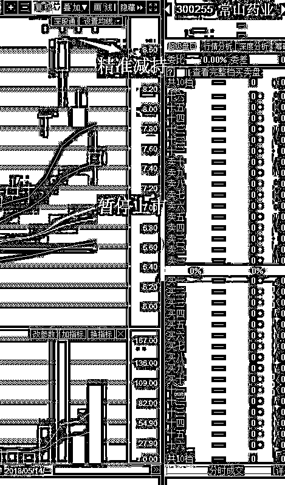
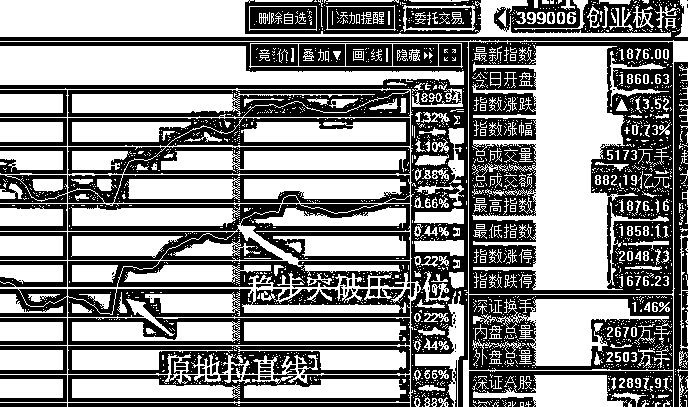
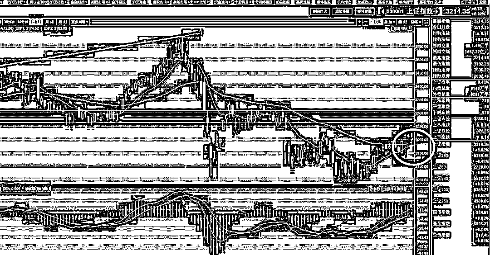
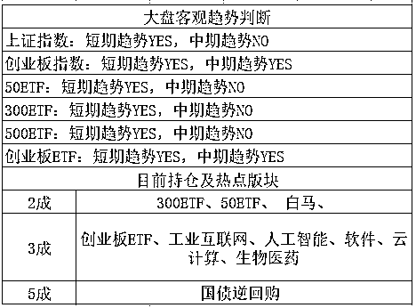

# 股评|那家宣称中国有 1.4 亿阳痿患者的公司可能要被暂停上市了

紫竹张先生

每篇都有干货的财经公众号

首先谈谈前一段时间的伟哥股，常山药业，这家号称中国有 1.4 亿阳痿患者的上市公司，在 5 月 17 日涨停板上精准减持，导致次日股价直接跌停，坑苦无数散户。

你以为这就结束了？今天早上，常山药业宣布临时停牌，同时宣布收到证监会立案调查通知书。今天晚间，公司发布公告称，公司可能存在被暂停上市的风险，公司股票将于 5 月 23 日起复牌。

一般而言，上市公司被证监会立案调查，严重性有大有小，大部分都还不会触及到被暂停上市的程度。然而常山药业 5 月 22 日晚间的公告却明确地向投资者提示，公司股票存在被暂停上市的风险。

这就厉害了，常山药业里面的股民不是被坑苦了，这是要被坑哭了啊。。。复牌之后想都不用想，绝对是一地鸡毛。

不就是减持嘛，怎么处罚这么严厉，据专业人士分析，此次立案调查大概率指向上市公司高管减持方向。2017 年 10 月 28 日，常山药业高管披露减持计划，2018 年 5 月 17 日是公告约定的合法减持的最后一天。

常山药业高管就是在 5 月 17 日减持的，这个动作是合法合规的，但是拖到最后一天才减持，而且在减持的前 2 天，也就是 5 月 15 号披露自己治疗阳痿的产品公告引发股价连续涨停，这个动作就有点耐人寻味了。

嗯，我说直白点，就是吃相太难看了。

证监会这么调查他是没错的，合理合法，可惜了被大股东陪绑的一群股民了，这其实等于挟持人质，让证监会投鼠忌器。

* * *

今天的大盘就比较好看了，首先看创业板，收盘突破 1866 强压力位，我们可以看到，早盘的时候，创业板再次突击 1866，被打落，然后缓慢坚定的下跌，无资金愿意冲关，买盘顶不住卖盘。

但是下午 2 点左右，一股莫名的资金出现，直接把指数拉了一波直线，然后坚定的爬升，一鼓作气突破并站稳了压力位。

至此，20 月线 1866 被突破，只要 5 月能站稳，就是彻底突破，而实际上，月底站稳是大概率的。

按照我上述所说，只要突破 1866，拿下 1900 只是时间问题，概率很大，所以我创业板在 1866 会减 1 成仓位，但是 1900 不会减仓，我会直接看高百点左右，1950 附近才会开始减仓。

而上证指数还有一个问题需要注意，我今天复了下盘，根据目前的走势，如果 3 天之内不出阴线，或者出一根中阳线，那么整个上证指数的中期趋势就会从 no 转 YES，所以我可能会把剩余的 2 成上证仓位改为趋势交易做法，也就是暂停出售，按趋势线去做，过几天再看看盘面做决定。有人曾经问我，我的中期趋势是按照上面来定的，我这里可以透露一下，我这一波是按照 EXP 趋势线来定的。

总的来说就是这样，1866 被突破，士气大振，后续估计还有冲高，不过我的仓位已经足够多，5 成吃肉也比很多人仓位要重了，加上我对 5 月的判断时间已经到了末尾，所以我不打算重新加大仓位，只是对剩余仓位的高抛进行了调整。上证暂停动作看几天盘面，创业板下一个高抛位改为 1950 附近，如果冲到这个位置，怎么减仓都是满意的，因为我们是 4 月底疯狂加仓的啊，赚那么多足够了，后续再涨也有点难度。

总之我的操盘计划是，涨到满意的位置我就卖，跌了我也有应对方案，按大概率的股市走势做买卖方案，获取稳定回报。

