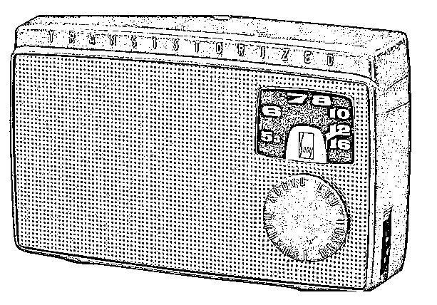
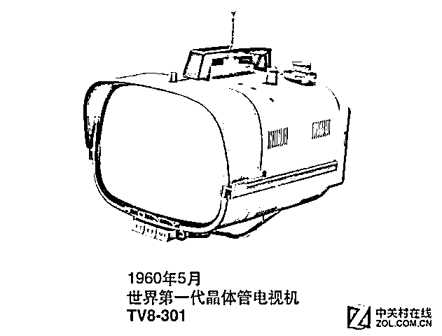
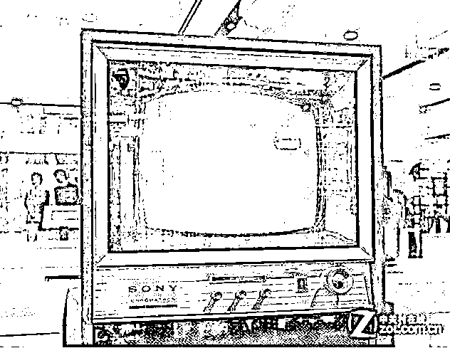
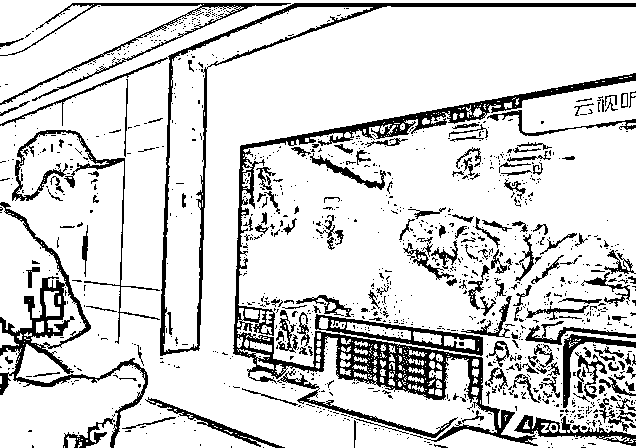

# 索尼公司的创始人也曾严重分裂

紫竹张先生

每篇都有干货的财经公众号

在消费电子领域，索尼一直是龙头公司，向来以各种黑科技著称，索尼产品就是**最新科技和高质量的代名词**，这是大家所熟知的。但是大家可能不知道，在索尼公司慢慢强大的过程中，其创始人曾经严重分裂。 

**索尼的创建**

1946 年 1 月，年轻的技术迷井深大决定创立一家科技公司，他找到了盛田昭夫，经过 3 个月的磨合，二人决定合伙创建公司。5 月，井深的公司成立了，启动资金 17 万日元（6 万美元）全部来自于盛田的父亲久作工门，后来公司数度资金困难，都是久作工门慷慨解囊，每一次都以股票的形式得以确认，盛田家族最多的时候曾持有索尼公司 17%的股份。

1946 年是日本刚刚战败的日子，整个日本一片狼藉，日本的国力大大衰退，一家新成立的公司，拿什么去挑战外国巨头的产品。

井深大为索尼制定了发展路线，不惜一切代价拼技术，不在外国巨头擅长的领域死拼，找一个新领域，集中力量研发，推出新产品抢占市场。

就这样，索尼公司发明了日本第一台晶体管收音机，一下子火爆日本，索尼公司借机挖掘了第一桶金，奠定了索尼发展的基石，并确定了索尼的**核心竞争力----科技为魂****。**索尼能有如此之多的黑科技诞生，始终保持科技领先的地位，和公司内部这种**鼓励研发、鼓励创新**的环境是分不开的。

井深大是唯技术之上主义者，在技术上固执己见，性格古怪，不知道妥协为何物，这样的人适合搞技术，搞管理简直是一塌糊涂，所以井深大在管理上高度依赖盛田昭夫。在公司的日常经营中，井深大几乎不干涉盛田的决定，并且在重大问题上高度支持盛田，**二人的性格和能力非常互补**，形成完美搭档，索尼在这二人的掌舵之下，越来越大，最后成为世界巨头。

**井深和盛田的第一次剧烈冲突**

在一个完美的开局之后，井深的威望大大的提升，但是好景不长，井深和盛田很快就陷入了第一次剧烈冲突。

1955 年，索尼公司试图走出国门，把产品卖到美国，但是索尼这种名不见经传的小公司根本无人搭理，没有任何经销商感兴趣。盛田在美国奔波了许久，终于找到了一个愿意购买索尼产品的大客户，而且订单高达 10 万台之巨，但是这位客户却提出一个要求，那就是这批晶体管收音机以布罗瓦的名义销售，理由是索尼没有任何名气，担心消费者不买账，不如用一家有名气的美国公司名义进行销售。但是对于盛田来说，他的第一诉求是让索尼公司在美国打出自己的名气，他的梦想就是要把索尼这个品牌打造成世界知名品牌，坚决不同意这个条件，要求以索尼的名义进行销售。

对于此时的索尼公司来说，10 万台晶体管收音机是一个令人眩晕的超级大单，其价值超过了公司的资产之和，日本董事会一致同意接受美国客户的要求，当时的井深大在研发晶体管电视机，烧钱烧的手都抖了，急需这笔资金来给研发部门进行输血，井深几次给盛田打电话，试图说服盛田先接受这笔订单，打响品牌的事情，以后慢慢再来。

盛田无法说服董事会和井深大，于是决定行使自己的权利，那就是总裁所拥有的一票否决权，否决这个订单。并威胁董事会，如果董事会再逼他接受美国客户的条件，他就要辞去董事职务。最后井深大妥协了，转而支持盛田，对于当时急缺资金的井深来说，这是一个巨大的冒险，失去了这 10 万订单，索尼甚至有可能资金链断裂。

60 年之后，我们回头去看当年盛田悍然拒绝 10 万台订单的行为，不得不佩服盛田的商业眼光和雄心壮志，**盛田曾经评价自己人生中最成功的商业决策，那就是拒绝了这 10 万台订单。**盛田能拒绝近在咫尺的巨大利益，而着眼于长远的品牌收益，足以看出其巨大的野心，如果说井深大是索尼的技术之魂，那么盛田就是索尼当之无愧的品牌之魂。

为什么盛田如此执着于建立自己的品牌，那是因为盛田第一次进入美国的时候，放眼望去，所有的日本货都是一些便宜货小东西，**日本制造就是廉价和劣质的代名词，**这一点和今日的中国制造差不多。

这对盛田的刺激太深了，盛田决定消除日本制造的耻辱，于是他一方面支持井深大研发最新产品并且要求保证高质量，一方面为树立索尼的品牌到处奔走，不惜一切。曾有美国经销商为了扩大销量，**牺牲自己的经销商方面利润进行折扣降价**。虽然这么做是在扩大索尼的销量，并且对索尼公司的盈利是有帮助的，但是被盛田发现后，**一律断绝关系**，**收回商品甚至给出赔偿**，盛田把高质高价视作索尼品牌的一切，不容许任何人破坏它。

**井深和盛田的第二次剧烈冲突**

1955 年的第一次剧烈冲突，威望极高的井深在自身并不理解盛田的情况下，依然选择支持了盛田，最终让盛田实现了自己的品牌梦。还没过几年，井深和盛田的第二次剧烈冲突就出现了。

1960 年，井深大带领的研发团队推出了世界上第一台晶体管电视机，TV8-301，这个重大发明让索尼公司跃升为世界一流公司，这台电视机，在当时的地球人眼里，**就是黑科技，不可思议的存在**。

然而好景不长，在推出这款电视机后，井深集中了公司全部资源去研发彩色电视机，**由于技术判断失误**，井深大坚持以良率极低的独自架构“Chromatron”来制造彩色电视，结果公司赔了大钱，几乎把之前赚的钱都赔光了，**公司陷入了破产的边缘**。

这个时候，井深大决定背水一战，更换方向为单枪三束管，**贷款进行研发**，被财务状态折磨的夜不能寐的盛田坚决不同意如此巨大的冒险，在盛田看来，这等于赌命，如果不进行研发，凭借黑白电视机索尼还能继续生存，如果贷款进行研发，成功了还好，**一旦失败，公司除了破产别无选择**。

但是井深大并不关心这些，坚持继续研究的需要寸步不让，甚至连盛田提出的**缩减成本，适当裁员都不同意**，如果是其他人负责研发，盛田肯定是直接叫停，但是对于井深，盛田有着莫名的信任，经过多次长谈，最后盛田决定支持井深，一咬牙贷款 6 亿 5 千万日元，决定陪井深背水一战。

井深没有辜负盛田的信任，技术上每有一个小进步，都会拉来盛田进行分享，并对技术团队进行了强烈的督促，对其中任何怀疑团队最终能否成功的成员全部予以开除，整个就是一入魔的技术狂人的表现。

1968 年，经过 7 年的研发，已经奄奄一息的索尼公司，终于迎来的历史性的突破，索尼终于研发出了单枪三束管技术，利用这个划时代的技术，索尼公司推出索尼 KV-1310 电视，这台彩色电视的质量简直无以伦比，其纯度、亮度和色彩简直无可挑剔。

这项绝对的黑科技引爆了全球的抢购热潮，索尼的这台彩色电视机的地位，就如乔布斯推出第一台苹果手机时的地位一样，万人空巷，抢购索尼彩电。自 1968 年诞生以来，一直到 1990 年，KV-1310 电视都是电视机届的霸主，凭借单枪三束管技术，索尼彻底奠定了自己科技龙头的行业地位。

井深大晚年回忆，自己**这辈子最大的成就，就是冒着巨大的压力，用 7 年的时间，熬出了单枪三束管技术，**他非常感激盛田的信赖，和盛田在那 7 年里全力融资保证研发所需所付出的巨大牺牲。

**索尼的辉煌**

凭借彩电技术，索尼公司仅用 3 年就还清了巨额贷款，然后迅速的壮大了起来，雄厚的资金储备让他们再也不用为研发资金发愁了，索尼没有躺着吃老本，而是不断的推陈出新，始终保持自己行业领先的位置，世界上第一款平板电视，和世界上第一款液晶电视，都是索尼公司发布，为了保持电视机领域的领先地位，索尼砸下的研发费用可以淹没太平洋。

2016 年，索尼发布了 100 英寸 Z9D 液晶电视，把液晶电视的潜力挖掘到了极限，为什么单独谈这款液晶电视呢，因为他的**第一个客户很有名，那就是王思聪**。

从索尼开发出第一款电视机开始，索尼电视机一直都是高品质的代名词，也一直引领全球潮流。

2017 年，已经榨干液晶电视全部潜能的索尼公司，推出全球第一款 OLED 电视机，甚至**直接引爆了 A 股里的 OLED 概念股**。这款 OLED 电视机里面的黑科技层出不穷，让人感叹索尼脑洞之大。

而实际上，索尼内部的第一款 OLED 样机在 2007 年就已经进行试制了，**足足又打磨了 10 年**，这份工匠精神和持之以恒的研发投入，让人不得不佩服索尼公司的科技之魂。

**我的感慨**

按理说，这里应该跟上一章，叫索尼的衰落，可惜并没有，一直到 2018 年，索尼依然是世界科技公司的领头羊，井深和盛田惺惺相惜，互相冲突又互相理解，把索尼从一个小公司一手打造成庞然大物，让人不得不佩服这对黄金搭档。

而实际上，井深和盛田在 1992 年就相继中风，失去了工作能力。盛田定居在美国养病的时候，经常和井深在电话里互相鼓励，盛田夫人每次回日本，第一个落脚点不是自己家，而是去井深家中，二人的友谊一直持续到 1997 年井深大的离世，终年 89 岁。

虽然井深和盛田已经 25 年前就已经中风了，但是他们分别打造出的索尼的科技之魂和品牌之魂始终留存在索尼公司，让索尼长盛不衰，在索尼没有贸工技和技工贸之争，三者齐头并进，三者都想抓，而且三者都抓的硬。索尼甚至喊出了“**能超越索尼的永远是索尼自己**”这样的口号。

相比之下，中国的科技公司需要学习的地方太多了，**忽视研发，厌恶风险，创始人分道扬镳的事情比比皆是**。我今天撰写此文，就是希望中国公司学习索尼的企业家精神，争取早日出现一个中国的索尼公司。

往期回顾（回复“目录”关键词可查看更多）

001 《为什么中国必须购买美国国债？》

002 《租房贷款会将房子拆分成房骨和房皮》

003 《中国自古以来就是一夫一妻制》

004 《宁波老虎事件遇难者不应该得到赔偿》

005 《中国的房价什么时候会崩盘？》

006 《中国地产达到什么样的条件会崩盘？》

007 《中等收入陷阱为何如此难以突破》

008 《如何把自家孩子培养成一个顶尖人才》

009 《我是如何保证自己不近视的》

