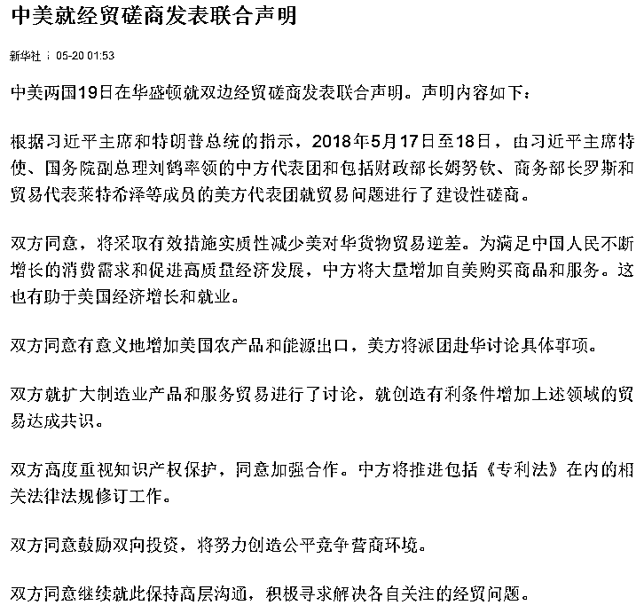
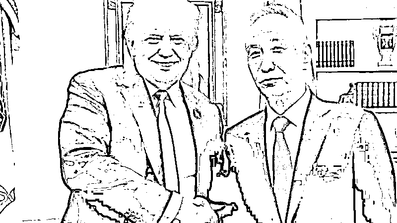

# 深度剖析贸易战中美联合声明，中国房价没事了

紫竹张先生

每篇都有干货的财经公众号

今天凌晨，中美发布联合声明，宣布中美达成共识，不打贸易战，停止互相加征关税，对中美经济都构成重大利好。联合声明的信息量非常大，我这里给大家进行深度剖析：

**贸易战停火的基础**

首先我们看一下贸易战停火的基础，在联合声明的第一条里，双方同意将**实质性减少美对华货物贸易的逆差**，这是美国政府的和谈前提，也是本次贸易战停火的基石，如果没有这一条，恐怕和谈是无法实现的。

减少贸易逆差对中国是好事还是坏事，很多人说是坏事，但是真不一定是坏事，要看怎么个减法。首先我们看一下贸易的本质是什么，**贸易的本质就是中国生产某种商品和服务，去换取美国的某种商品和服务**，现代经济学认为，国际贸易的基础是立足于双方生产力的比较优势而不是绝对优势，所以**增大贸易额**能有效提升双方的国力，是互惠互利的行为，是好事。

想减少贸易逆差，有二条路可以实现，第一条路是美国对中国出口不变，减少中国对美国出口，降低双边贸易额总量。第二条路是中国对美国出口不变，增大美国对中国出口，加大双边贸易额总量。

**减少双边贸易额总量是双输的行为**，**增大双边贸易额总量是双赢的行为**，全面爆发贸易战树立关税壁垒能够有效降低双边贸易额总量，这也是我们一直说贸易战会导致双输的原因所在。故中国对美国的出口是绝不能减少的，而增大美国对中国的贸易额对中国也是有利的。

看到这里很多人纳闷了，增大美国对中国的贸易额对中国也是有利的？没看错吧，媒体不是经常把贸易顺差当成重大功勋来表彰吗，那反过来说，减少贸易顺差就应该是惨败啊。

其实不是这样的，双方只要产生了自由贸易，就一定是有互利基础的，等于是把蛋糕给做大了，区别倒也有，就是贸易顺差的那一方会在贸易中占据优势地位，获得大部分利益。也就是说，中国获得了利益的大头，美国在后面喝汤。但是这并不代表，在美国大幅度逆差的时代，美国就没有获益而是受损了，如果美国逆差就表示美国受损，那美国早就断绝双方贸易关系了，还有什么好谈的，贸易战都懒得和你打。

获得贸易顺差是好事，尤其是在中国外汇匮乏，国力衰弱的时候更是好事，所以会被当成功勋来表彰，但是当**外汇急剧增多，外汇储备出现爆炸式增长**的时候，还继续谋求获得外汇储备就不是什么好事了。

因为我们把生产的商品和服务卖给美国，要的不是美元，而是美国对等的商品和服务，美元只是一张废纸，他只是一个交易的媒介而已。以前中国太穷了，外汇非常珍贵，想买的外国好东西太多了，就是没钱买，所以把美元当成宝。现在反过来了，国力富强了，外汇堆成山，能看上的外国好东西不多了，好不容易看上几个公司，别人还说涉及国际安全不愿意卖，钱堆在手里花不出去，美国那边还在不断通货膨胀让手里的外汇不断缩水，这也很难受。

我记得前几年，有人在网络上批评中国免费给美国人打工，用榨干工人血汗和破坏环境的代价去换美国人印的废纸，现在好了，美国人逼我们拿出这些废纸来换取美国工人的血汗制造的产品，难道这还要批评，那到底怎么样才能不被批评。。。

贸易平衡不仅是美国追求的事情，也是中国追求的事情**，**因为任何一国的交易，本质上都是商品换商品，**美元只是中介，顺差等于赊账，**顺差过大的国际贸易是无法持续的，因为美国不能无穷无尽的印美元来空手换商品，中国收了太多的美元，心里也打鼓，赊账太多怕将来某一天美国赖账，所以美国要求减少贸易逆差，中国也是半推半就。至于对美增加的进口份额，从其他国家的份额上减掉就是，少买一点巴西大豆，美国大豆的量不就提上去了。

**美方的主要诉求**

减少贸易逆差，增大对美进口是谈判的主基调，但是在这个主基调之外，中美都加入了各自的诉求。

如第二个条款就是典型的美方诉求，这里写明**双方同意有意义地增加美国农产品和能源出口，美方将派团赴华讨论具体事项**。第一条明明已经说了要扩大美国商品的出口，为什么第二条还特地添一个增加美国农产品和能源的出口，难道美国农产品和能源不属于美国商品和服务？

当然属于，为什么要把他们单列一条，是因为他们在美国商品和服务里非常特殊，为什么特殊呢，因为他们是特朗普的票仓，而在之前的中美贸易冲突里，**中方第一个制裁的也是他们**，导致特朗普的支持率下滑的非常厉害，如今把他们单列一条，中方不仅要取消之前的制裁，还要明确表示增大农产品和能源的出口，这就让那些本来因为贸易战导致自身利益受损，愤怒无比的人瞬间黑转粉，在即将到来的选举中，特朗普的支持率可以预料的会飞速上升。

特朗普很在意这一条，条款里说了，**美方将派团赴华讨论具体事项**，其他的细节都可以慢慢谈，这一条先给落实了再说。中方特地在声明里加了一个非常奇怪的“**有意义地增加**”，估计也是写给特朗普看的。

我说中国话那么多年，**有意义的增加对美国农产品和能源的出口**这句话怎么听都很别扭，什么叫有意义的，这个前缀真的很没意义，唯一的意义恐怕就是告诉特朗普，我们知道你打的政治小算盘，你欠我们一个人情。

**中方的主要诉求**

而中国的主要诉求是什么呢，中国的主要诉求就是**冲突柔和化、条款模糊化，时间拉长化**，六个条款其实都可以体现这一点。

首先看看第一条，中方将大量增加自美购买服务和商品，美方的要求是定量定性，要求中国以计划经济的手段强制中国 A 企业向美国 B 企业购买价值 C 亿美元的商品来减少逆差，被中国回绝，中方同意减少逆差扩大出口，但是这一切都是建立在自愿买卖，市场经济的基础上，如果美方产品质次价高，中国买了卖不掉，那不能强买强卖，所以大框架有了，但是具体的细节没有，**我同意减少逆差，扩大进口，但是怎么减少，大家再慢慢谈**。

美国人也不傻，这等于没有承诺，只是比谈崩好一点，所以抛出了第二条，得先给点甜头来表示诚意，对于进口美国农产品中国并不排斥，买谁的农产品不是买。

有个别人认为，中国农产品应该全部自给自足，不能从外国进口，否则战争年代会被人掐住脖子，其实这种思维是错误的，买美国的大豆危险，买巴西的大豆难道国家就安全啦？中国的农业安全，取决于 18 亿亩耕地红线，而不是和平年代进口农产品有多少，只要耕地在，农业安全就在。

因为农业并不是个高技术的行业，和芯片完全是两码事，中国的农产品没有竞争力主要是因为土地分散，机械化程度低，成本高居不下，在和平年代进口外国农产品能有效增加中国国力，降低物价水平。

等到了战争年代，如果耕地被占用了那就没辙了，如果耕地还在，哪怕已经抛荒了，一声令下直接就种上庄稼，半年就能收获，成本高在战争年代不是问题，所以中国的农业安全在于耕地的储备红线，以及袁隆平不断发明的新品种。所谓衣食住行，美国高度依赖中国的纺织业，建造一个纺织厂的时间远不止半年。同理推测，如果战争年代美国能饿死中国人，那么中国人也能冻死美国人，这种推导结论一看就很荒谬，所以死守 18 亿亩耕地红线就足够保障国家安全了。

而对于能源进口，更是中国急需的，例如美国的天然气，正是中国怎么进口都不够用的清洁能源，中国为了解决天然气运输问题甚至发明了 LNG 运输船先进技术，在《大国重器》里特地炫耀过，三井公司的 LNG 运输船就是交给中国制造的。

而第三条双方扩大制造业产品和服务进行了讨论**，就创造有利条件增加上述领域的贸易达成共识**。这句话就很模糊了，核心是确定了，但是怎么个创造有利条件一概没说，如果美国愿意卖给我们芯片厂，求之不得啊，多贵都愿意买，所以这里面的细节可谈的地方太多了。

对于第四条，是美方提出的要求，但是这其实并不能算美方的要求，因为我们自己也在做这件事，知识产权的保护太重要了，如果不严格落实知识产权，谁愿意花大力气，冒大风险去进行研发工作，抄袭永远比原创简单。华为的确挺有情怀的，10 年卧薪尝胆投入数千亿元进行研发，但是如果他的知识产权无人保护，发明的专利别人随意抄袭不受惩罚，我想他也没有任何兴趣去进行研发，抄袭才是最理性的选择。中国现在要鼓励研发实现产业升级，大力发展知识产权保护是刻不容缓的事情。

而对于第五条和第六条**，双方鼓励双向投资，双方同意继续保持高层沟通**，这句话是无比正确，放到任何时候都对的话，我看不出什么实际意义，更多的是展示善意和强调双方和平解决贸易战的决心，这二条其实最符合中国模糊化、拖时间的总策略。

**中国没有走日本的老路**

为什么我的标题上写了贸易战停火，中国房价安全了，这是有道理的。中国目前的状态和日本当年的状态非常相似，**成为世界第二经济强国，房价虚高，即将面临人口老龄化，由于贸易逆差过大遭遇了美国的打压。**

那么日本当年是怎么处理美国贸易逆差过大的问题的？被美国逼着签订了广场协定，强制日元升值。这个协议签订后，给日本带来了什么呢，带来了房地产和股市的再度疯涨，**然后嘭的一声炸掉了**。

泡沫破裂之后，日本进入了失去的二十年，一直都今天都没缓过劲了，日本挣扎在泥潭里的时候，中国已经从当年的经济弱国成为了如今的经济强国，取代了日本的位置。

中美的贸易冲突其实已经持续多年了，从特朗普上台的时候就在不断的谋求谈判，中方也曾承诺在 17 年会缩小中美逆差，结果不仅没有减少，17 年反而扩大了，这才引起了 18 年的剧烈冲突。美国是中国的主要对手，也是当今这个地球上唯一有希望超越美国的选手，如果能借贸易冲突的名头直接把中国打残，岂不是美滋滋。

世界第二大经济体无比强大，岂是那么容易被打残的，但是中国有自己的**阿喀琉斯之踵**，**那就是高房价**，情况甚至比日本当年还要危险，中国的房价目前处于高度泡沫之中，勉强维持一个极度脆弱的平衡状态，在目前这种状态下，房价拉一波会炸，跌一波也会炸。

一旦地产的泡沫炸裂，中国就会走上日本的老路，看似是强大的无敌战神，但是只要被人一击命中阿喀琉斯之踵，马上就会像日本那样倒下，然后陷入 20 年的经济泥潭之中。当年的美日贸易逆差问题，美国解决了贸易逆差的同时顺带干掉了日本经济，让日本从此断绝超过美国的可能性。这次中美贸易逆差冲突，美国会放过这个机会吗？一定不会的，美国肯定会全力对中国施压，并设置无数的陷阱，只要踩中一个，恐怕中国就是第二个日本。

而根据目前中美谈判的结果，完全没有涉及外汇壁垒，中方保持了外汇自主权，这就给中国消化地产泡沫，让地产软着陆提供了缓冲时间和机会。中美目前达成共识的这个纲领性文件是扩大美国进口来减少逆差，而且并非强制贸易，是自由贸易，这无非是把其他国家的进口份额转移给了美国而已。美国受益，中国无所谓，其他国家受害，但是其他国家并没有太大的话语权，因为他们对中国的逆差不够多，有些甚至是对中国保持顺差，那么中方减少进口，难度并不大，尤其是这里面美国插上一脚，矛盾更是可以直接转移到美国身上。

**打不死你的东西只会让你更强大**

这次的贸易战，中国是处于极度不利的位置的，对美贸易逆差过大的不争的事实，如果在两国商人自由贸易的情况下出现了逆差过大这种事，在国际上通常都会以贸易不公平为由产生贸易争端的，而**逆差过大的那一方，基本都会采取措施****降低逆差**，一方面是为了让贸易重新平衡，另外一方面贸易的本质是商品换商品，而不是要废纸，美元这东西少量的时候是宝贝，太多了就是烫手山芋了。

而在上一轮美日贸易冲突的时候，日本直接被打死了，而这一次中美贸易冲突，仅从目前的条款来看，美国没有打死中国的可能性，只要中国扛过危机，慢慢发展，未来就有超越美国的机会，我们都知道在七龙珠里面，**任何打不死孙悟空的东西只会让他更强大**。

这个道理对于国家而言也一样，**而中国，离变成超级赛亚人的那一天已经不远了。**

往期回顾（回复“目录”关键词可查看更多）

001 《为什么中国必须购买美国国债？》

002 《租房贷款会将房子拆分成房骨和房皮》

003 《中国自古以来就是一夫一妻制》

004 《宁波老虎事件遇难者不应该得到赔偿》

005 《中国的房价什么时候会崩盘？》

006 《中国地产达到什么样的条件会崩盘？》

007 《中等收入陷阱为何如此难以突破》

008 《如何把自家孩子培养成一个顶尖人才》

009 《我是如何保证自己不近视的》

