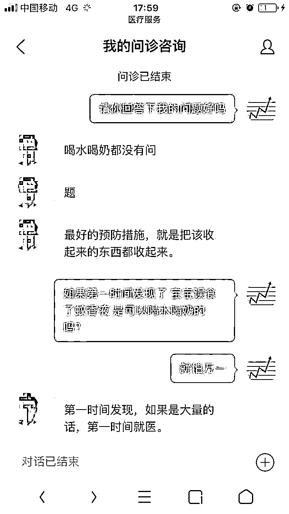

# 夏天忘记这件事，可能会要了小孩的命！！

## （本文转自公众号：川中寻牛 ）

初为人父的我，在今天看了一条新闻被震惊了，被吓住了。想着如果这件事儿发生在女儿身上，我会多么的自责，多么的害怕，多么的后悔，我的余生会在愧疚和自责中渡过，我的家庭会受到撕心裂肺的痛，我的人生可能从此一蹶不振，我的宝贝，我那么爱她的宝贝，也可能智商受损而影响终生！

5 月 14 日下午，家住东莞市长安镇锦厦社区的陈先生带着 1 岁 7 个月大的儿子小伊在家休息。小伊刚学会走路不久，已可以在家中四处走动。他看到小伊独自一人玩得高兴，便放心地忙起了自己的活。然而，就在他离开儿子短短的几分钟里，意外发生了。

“小伊竟偷偷地玩起了放在地上的‘蚊香液’瓶，**并拧开瓶盖喝了近 10ml 的蚊香液**。”说到此时，陈先生仍心有余悸**，**因为他听过小孩误服“蚊香液”中毒身亡的事件。因此，当他看到儿子喝了“蚊香液”后,立即将儿子送往医院救治。

尽管自己反应很快，但就在他将儿子送往医院的途中，**小伊出现了抽搐、口吐白沫、牙关紧闭、四肢不停抽动、脸色紫绀等严重中毒症状**，一度把他吓得够呛。

**命悬一线**

**送院时生命体征极其微弱**

据东莞市长安医院儿科主治医师麦培芬、汪超婵介绍：“我们接诊时，发现小伊出现了全身性抽搐，**全身皮肤苍灰、血压也已检测不到，孩子生命体征极其微弱。如果再晚 20 分钟，后果真的不敢想。”**

~~~~

看到这则新闻我震惊了，家里常用的“驱蚊液”竟然背后潜在着这么大的“危害”！想着好吃嘴的女儿，如果也出现了这一幕，**我又不知道“蚊香液”的危害居然后这么大，要是我等了这 20 分钟，我不是要后悔一辈子吗？**

**再后怕的同时，今天这个事儿一直在脑子里旋转，**对时政新闻研究多年积累出来的敏感度，**总让我感觉哪里有点不对！**

驱蚊液的说明书里明确提到了低毒，挥发后对人体几乎没有影响，怎么液态下 10ml 就能要人性命呢？

10ml 并不多啊，就一瓶荷香正气液的分量。就算是直接吃 10 毫升的中性毒药，也不会反应那么快，怎么就变成了急性剧毒了？这一点特别奇怪！

**于是在网上查了下中毒相关表现，如下**

23 岁的成年男子直接喝了 350ML 的敌敌畏，医生说一天后才会死亡。

而 1 岁多的小孩，服用 10ml“蚊香液”的毒性竟然比成年男子喝 350ML 敌敌畏的毒性还强。

我可以理解小孩的抵抗力肯定比不上成年男性，但成年男性是直接喝了 350ML 的敌敌畏啊，喝的量是“蚊香液”的 35 倍！中毒生亡也要一天的时间啊！直接喝 10ml“蚊香液”的毒性怎么会这么强？而且是急性剧毒，这一点都是不合理啊！

我这个人的好奇心很强，同时抱着以防万一的心态，最后我选择了网络在线就诊，**以下是我和上海交通大学医学院附属第九人民医院（三甲）儿科主治医师的全部对话**

和医生沟通了后就整个人都清醒了。

成分是“除虫菊”的“蚊香液”危害不大。如果小孩少量误食，可以喝水和牛奶或者催吐。吃多了就要去医院。也就是说吃 10ml 除虫菊成分的蚊香液，毒性不大。

**而这一次新闻里面播放的小孩，误食的是含有“氯氟醚菊酯”的“蚊香液”。**

氯氟醚菊酯是农药的成分，没有特效解毒剂！！

这一点在百度百科也印证了。

**氯氟醚菊酯：**

产品是吸入和触杀型杀虫剂，对蚊、蝇等卫生害虫具有卓越的击倒和杀死活性。

**关键的地方是医生的吐槽，部分无良商家却不在产品中标明含有“农药成分的氯氟醚菊酯”，这一点让人很后怕。**误食了 10ml 含有“氯氟醚菊酯”的“蚊香液”，就像是变相的喝了农药，没有特效解药，如果发生不可自身逆转的伤害（智商），又该怎么办？

我知道，我无法百分之百保证小孩不误食“蚊香液”；

也无法百分之百保证购买的“蚊香液”不含有农药成分的氯氟醚菊酯；

但我能够保证！

听医生的话，远离潜在的风险，从蚊帐做起！

**最后。**

**我衷心的祝福看了本文所有朋友，永远不会发生上述的情况；**

**同时也衷心的祝福你们家庭美满，全家幸福。**

（作者：川中寻牛，职业股民；在 18 岁就开始了炒股生涯，最擅长的就是从“新闻联播”中抓住股市大牛，如 16 年的雄安新区，17 年的有色和今年海南博鳌论坛和青岛本地股。他的公众号每晚会推送一篇夜报，会告你市场的主线是什么，潜在的政策面机会在哪里，最应该埋伏的品种是什么。） 

