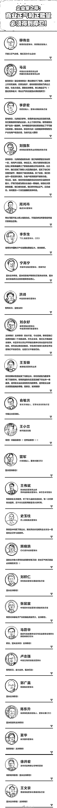
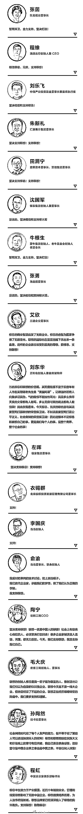
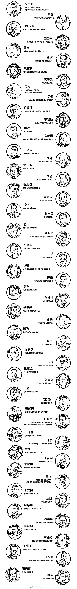
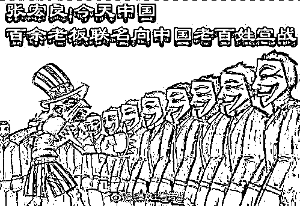

# 百名企业家力挺联想，难道小团体就可以为所欲为？

紫竹张先生

每篇都有干货的财经公众号

近日，联想集团董事长柳传志一封公开信打响了联想荣誉保卫战，这封信发出之后，短短二天之内，就有包括马云、李彦宏、刘强东、雷军、史玉柱、周鸿祎等上百位企业家表示支持柳传志，支持联想，甚至连逃亡美国，微博上沉寂两个多月的贾跃亭都跳出来发声支持联想。除此之外，各大主流传统媒体，也一边倒的为联想站台，撰文支持联想。

图片源自于新财富杂志

看完这份长长的名单之后，我感到又恐惧又欣慰。恐惧的是，这份名单上的大佬，几乎涵盖了中国全部的行业，名单之豪华，控制的资源之庞大令人感到不寒而栗，当这些人抱在一起，组成小团体的时候，还有什么能阻挡他们？欣慰的是，这份名单上只有百人，还有很多知名企业家不在上面，这说明中国还是有很多企业家，不屑于抱团，只凭自己良心做事。更有趣的是，名单里没有投票事件的当事人。

商业正气和正能量是什么？

在这份名单的宣言上，我们看到了二种说辞，第一种说辞是强调商业正气和正能量；第二种是无脑支持柳传志，只要是柳大哥说的话，都对！

人民群众对联想的声讨，主要集中在联想没有考虑国家利益，把票投给美国高通，以及故意在国内销售质次价高的产品，常年被称为美帝良心想，严重损害消费者利益的事情。

但是很搞笑的是，这百名企业家的声明，没有一个涉及到这两点，没有谈联想是否爱国，也没有谈美帝良心想的称号是否合理，反而把全部力量集中在了强调商业正气和正能量上面。

什么叫商业正气和正能量？其含义无非就是在商言商那一套，联想强调技术无国界，企业利益第一，其实也是这个意思。

在商言商其实没什么错，企业家把企业利益摆在第一位，其实也没有错，毕竟资本是无国界的。但是还有一句话，资本是无国界的，但是资本家是有国界的。如果没有国界的区分，为什么中兴把科技产品卖给伊朗就要遭到美国制裁，为什么中国对美国高科技企业的收购，美国以先进科技的出售涉及国家安全为由处处驳回。中国的企业家强调技术无国界的时候，美国人却在强调技术的国界之分，不觉得这很讽刺吗？莫非我们是资本主义国家，美国是社会主义国家？

如果按照商业正气的原则，资本就应该以逐利为第一目的。他们的潜台词其实是：企业如何管理，如何做事是企业家的自由，任何人都不能以任何名义进行干涉，否则就是违反了商业正气，就是负能量。那么当企业的行为和国家利益发生了冲突的时候，应该如何抉择呢，这些企业家已经用行动给予了表态，那就是国家利益无权干涉企业利益。

这种思想和行为，是非常不正确的。如果国家利益都不能管束企业，那么法律和政府还能管束企业吗？一个小小的鸿茅药酒都这么可怕，这百余名巨头掌控的能量将会何等的惊人。

高度抱团的企业家圈子

为什么这百名企业家在短时间内这么密集的发声，是什么力量让他们如此有组织力和号召力，是柳传志的个人魅力吗？不是。这里就要谈谈企业家的结盟圈子了，柳传志之所以被称之为中国企业界的教父，凭借的是他组建的二个圈子。

第一个叫“泰山会”，会长柳传志，会员单位包括联想控股、四通集团、泛海集团、远大集团、复星集团、巨人集团等 15 家，每年只发展 1 家会员单位，限额进入。顾问有中国经济智囊的领军人物吴敬琏、胡德平等，泰山会是中国最知名、最神秘的大型商会之一。

第二个叫“中国企业家俱乐部”，成立于 2006 年。柳传志任主席，俱乐部的成员包括经济学家吴敬琏、张维迎、周其仁、许小年，企业家王石、马蔚华、马云、郭广昌、王健林、牛根生、朱新礼、俞敏洪、李书福、李东生、冯仑等人。

中国总共只有四个高端企业家圈子，另外的二个就是华夏同学会和江南会，其内的高端成员也是互相重叠和交织的，可以说中国的四大企业家圈子是互相融合，不分彼此的。

一开始企业家之间只能通过私交来单独联系，效率低，人脉窄，但是当圈子建立之后，情况马上就不一样了，圈子会定期组织聚会，圈内人士互相结识，友谊深厚。圈子之内结盟互助，互相支援。这样的情况导致很多圈外人士拼命的想进入圈子，只要进了圈，就是自己人，可以拥有更多跨行业的资深而优质的资源。

这个圈子的初衷，是抱团取暖，守望互助，出发点是非常好的。最经典的案例莫过于当初三聚氰胺事发后，蒙牛陷入危机，股价暴跌，牛根生在圈子内发万言书求救，为了防止被人恶意收购，柳传志连夜召开联想控股董事会，48 小时之内就将 2 亿元打到了老牛基金会的账户上；新东方俞敏洪闻讯后火速送来 5000 万元；分众传媒董事长江南春也准备了 5 000 万元救急；中海油傅成玉总经理备了 2.5 亿元，随时可以去取；田溯宁、马云、郭广昌、虞峰、王玉锁等都表态只要需要，随时可以提供帮助，香港百仕达控股主席欧亚平号召买进蒙牛股票，以支撑拉升股价。蒙牛能抗过三聚氰胺的信任危机，依赖圈子的全力支援。

我想问一下

但是随着圈子内江湖义气氛围的浓厚，这个圈子渐渐的变味了，开始不问青红皂白，把圈内成员的利益置于所有利益之上，不管是消费者的利益，还是国家的利益，居然都不能让这些企业家心存顾忌。

我想问一下，当鸿茅药酒把警方视作家丁，跨省抓谭医生的时候，这些企业家有伸张正义，声援谭医生，批判鸿茅药酒的吗？还是说他们认为鸿茅药酒把公权力视作掌心玩物的现象是正常的？

我想问一下，当中兴被美国制裁苦苦挣扎，生死悬于一线的时候。这些企业家有发声支援吗？牛根生的蒙牛因为使用了三聚氰胺陷入破产危机，所有成员有钱出钱，有力出力，为什么中兴没这个待遇，就因为中兴不是圈子内的成员？

我想问一下，联想柳传志发起名誉保卫战，半个中国的企业家都一起发声来展示团体的力量，要全力打赢敌人的时候。我想知道敌人是谁，是爱国群众，还是不在这百人之列的其他企业家？

组建小团体，抱团取暖是可以的，但是这个团体，一定是要把人民的利益和国家的利益置于私人利益之上的团体，这才是中国所需要的团体。如果自以为人数众多，力量强大就可以把私人利益置于国家利益之上，那就不叫抱团取暖，而叫结党营私，一旦结党营私的情况出现，那后续就一定会发展为党同伐异，这是历史所反复证明的，今天百名中国企业家冷眼看中兴挣扎，而无脑支持联想，已经初步展现了党同伐异的苗头。

君子不党，其祸无援；小人利交，其利人助也。

往期回顾（回复“目录”关键词可查看更多）

001 《为什么中国必须购买美国国债？》

002 《租房贷款会将房子拆分成房骨和房皮》

003 《中国自古以来就是一夫一妻制》

004 《宁波老虎事件遇难者不应该得到赔偿》

005 《中国的房价什么时候会崩盘？》

006 《中国地产达到什么样的条件会崩盘？》

007 《中等收入陷阱为何如此难以突破》

008 《如何把自家孩子培养成一个顶尖人才》

009 《我是如何保证自己不近视的》

