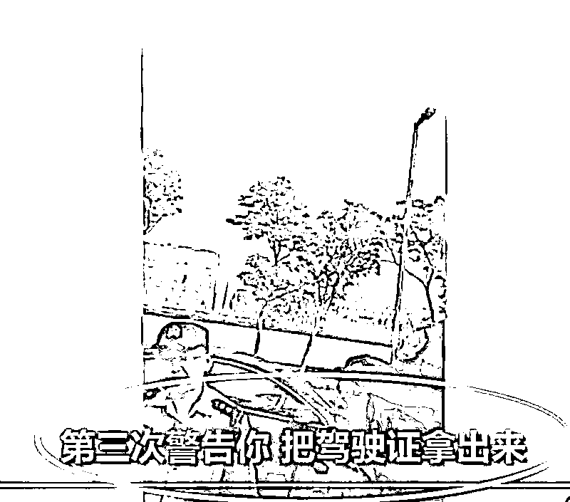
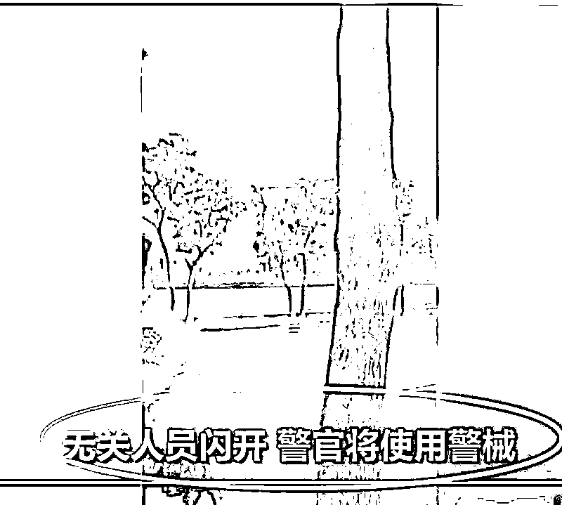
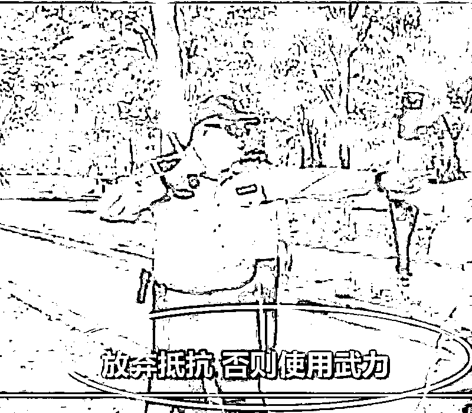
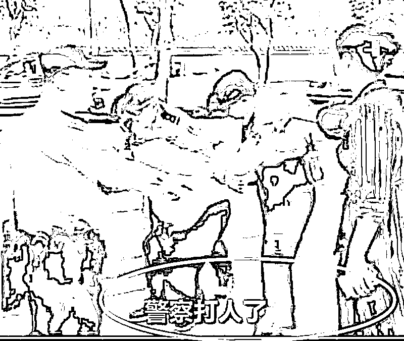

# 为什么一个警察打人的视频得到了全国人民的点赞

紫竹张先生

每篇都有干货的财经公众号

近日上海警方在检查一辆无牌照汽车时，遇当事人抗法，警察进行了暴力执法，该警察一系列执法操作堪称教科书式执法，这段视频值得所有中国警察和普通公民进行学习。

首先，这名警察在遇到违法行为的时候，对违法人进行了口头传唤“请你跟我们到警局接受调查”，这是执法的前提，如果没有这个传唤声明，任何警察都没有权利使用武力。

然后，在对方拒不配合传唤的时候，没有直接使用武力强制执法，而是先进行三次口头警告，这是法律赋予公民的权利，警方在对方拒不配合，使用武力之前，必须至少进行 3 次口头警告，给予一些情绪激动的公民冷静下来配合执法的机会。

而且在进行三次口头警告之后，在使用武力之前，强调无关人员请让开，这是怕使用武力的过程中有无关人员进入执法核心区域被误伤。

然后该警官果断使用武力，在使用武力之前还进行最后提醒：放弃抵抗，否则使用武力，无关人员闪开。

在警官警告三次之后，警官有权使用武力，这是法律赋予警官的权利。

然后，旁边的家属就开始现场喊叫“警察打人啦”，这个是教科书式的耍流氓画面，如果不是这位教官完美的教科书执法无懈可击，这个“打人”视频一上传到网上，立马又是一阵舆论风暴。

下面这一句话更是教科书气息十足，如果不是旁边有人狂喊警察打人，我都会怀疑这是在拍摄警官教学视频。。。

在鸿茅药酒随意调动公权力跨省抓人导致人们对公安系统信心大损的今天，出现了这么一个严格按照法律法规执法的好民警值得我们欣慰。过去一旦出现暴力执法的行为，人们第一反应就是喷警察，但是如果警察都不敢使用暴力了，那警察和咸鱼有什么区别，还浪费纳税人的钱去发工资。

暴力是警察执法的必备要素，人们抗拒警察执法的主要原因是长期以来公权力的随意执法，从抓捕过程到审理过程都有很多的不合法不合规之处，导致人们对法律失去了信心。而一个对法律失去信心的社会，将会陷入一片混乱，人们不能安居乐业，社会发展也将陷入停滞。

对于长期以来随意执法，对百姓权益漠不关心的行为导致人们对警察暴力执法是一边倒的反对，结果情况走向了另外一个极端，就是所有警察都对执法畏首畏尾，哪怕是对方明显违法了，也不敢使用武力进行纠正，以和稀泥的执法为典型代表，因为一旦上新闻就麻烦缠身，最后导致警察形同虚设，人民的合法权益反而遭受了不法分子的侵害。

这个视频，该男子呈现了教科书式的违法和挑衅行为，该警察呈现了教科书式的暴力执法行为。唯一的不足之处就是旁边那个一直在旁边阻挠执法，大喊警察打人了的女子，没有一并带到警局去拘留，该警官涉嫌对女性的性别歧视。。。

警察随意动用权利使用暴力是违法的，但是警察始终不动用暴力，采用和稀泥式的执法，那也是违法的。这个视频应该发给全国的警察看一看，同时也应该给全体公民看一看。

公安民警依法执法就是最好的文明执法！

