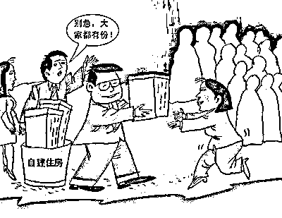
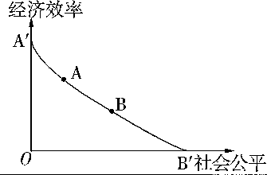

# 格力员工每人分一套房，难道我们要退化到福利分房时代？

紫竹张先生

每篇都有干货的财经公众号

昨天夜间，格力电器在珠海体育中心举办大型活动，在活动现场，格力总裁董明珠当场保证并承诺，只要是格力员工，一人一套房。并宣布，珠海市委市政府为了鼓励格力电器，已经承诺给格力一万套住房的土地。 

我们都知道，住房之所以昂贵，大头就是土地出让金和税收部分，如果扣掉了这二块，再扣除开发商的利润，那其实建房的成本非常的低。格力获得了一万套住房的土地，就能以很低的成本建起一万套房，哪怕后面没有 8 万个，也至少解决掉一万个格力员工的住宅问题。

**为什么格力要给员工解决住宅问题**

从 2015 年开始，格力就开始屡屡提高员工的工资，几乎每年一提，这是为什么呢？因为在 2015 年的股东大会上，董明珠表示 2014 年格力有 600 多名技术人员被挖走，格力被挖人的速度，已经超过了培养人的速度。

留人才最有效的方式是什么？**是讲情怀吗？不是的，是加薪啊**，但是格力没有大规模加薪的能力啊。虽然这几年已经加了很多钱了，但是格力的薪酬，相对而言，还是不够具有吸引力。

**加薪还不够怎么办，董小姐放出了大招，那就是分房子，**而且承诺每人一套房子，但是这个房子员工拿到手之后，使用权归你，但是所有权归公司，什么时候才会把房产证给员工呢，就是这位员工退休的那一天。这一招完美的留住了人才，一旦辞职后果就是损失一套房子，这让资深的格力员工辞职的时候都要掂量掂量了。

这一招留人是非常有效的，但是这一招也有后遗症，那就是格力也不能随心所欲的炒员工鱿鱼了，如果不是员工主动辞职，而是被格力炒掉，那这套房子也就损失掉了，代价也很沉重。从这一点来说，格力的分房制度，等于变相的终身雇佣制，员工不敢轻易辞职，格力也不敢轻易炒人，这一制度，非常的类似国企。这一制度能够有效的留住人才，但是同时也会带来类似国企的效率降低，人浮于事的副作用，这一点董小姐要注意。**和员工签署变相的终身雇佣协议，并非完全是好事。**

**为什么珠海市政府愿意给格力土地**

一人一套房是个巨大的手笔，哪怕仅仅只开发现在的一万套房，那也是巨大的资金需求。如果不是拿到了政府补贴的土地，而是让格力通过土拍去争抢土地，然后按照正经的房地产开发商的流程走，那个成本高的会吓死人，格力绝对无法承受。如果他能承受这个成本，他还不如干脆直接把这些钱发工资给员工，更能提振士气。

所以格力就想到了一个廉价造房子的办法，那就是找政府要土地。政府为什么愿意给格力土地呢，因为高房价已经切切实实的影响到了实体经济的发展。深圳的华为曾经直接点名总部附近房价过高，严重影响公司发展，并部分搬迁到地价更便宜的东莞，后来深圳市政府的多方挽留，才让华为停下继续搬迁的脚步。年薪 50 万的华为未婚工程师，在深圳的幸福感，和在东莞的幸福感，是截然不同的。

而对于珠海市政府来说，格力集团就是手心的宝贝疙瘩，给予一些政策补贴来让格力安心扎根珠海是再正常不过的事情，而最好用的政策，就是贴补土地给格力。

**福利分房时代来临了？**

政府拨给企业土地，企业造好房子后，按照职位和工龄，依次发放给本单位的老员工。这种制度大家想到了什么，没错，就是改革之前的福利分房制度，当年我们打碎福利分房制度，推出商品房改革方案，没想到房地产发展了 20 年，我们又回到了福利分房的老路。

而由政府进行土地的划拨，以大型企事业单位为主体的福利分房制度，已经被历史证明是一种低效率的计划经济制度，如果全面普及福利分房制度，那显然是在开历史倒车。

所以，重启并恢复福利分房制度，肯定是错误的，那么到底是谁错了呢。

**谁都没有错！**

是不是格力做错了呢？不是。董明珠为了格力电器人才梯队的稳定，给员工谋取福利，不管是加薪还是分房，都属于格力员工收入切切实实的增长。从这一点说，董明珠分房的做法没有错，而且应该大力表扬，因为一切不为员工收入考虑的董事长，都是在耍流氓，而董明珠这种为员工谋福利，一言不合就发钱的董事长，才是良心董事长，所以格力电器没有错。

是不是珠海市政府做错了呢？也不是。从珠海市政府的角度来说，政府最大的职能就是为实体经济服务，而当实体经济出现困难的时候，政府应该在自己力所能及的角度，帮企业解决困难，这样的政府，才能被称作一个为人民服务的政府，珠海市政府为了让格力安心扎根珠海，给格力贴补土地，属于政府进行政策扶持的一部分，所以珠海市政府也没有做错。

那能否把锅甩到中央拼命印钱推高房价的政策身上去呢？不行。在 08 年金融危机之后，各国政府争先恐后的进行量化宽松，拼命放水，都试图以邻为壑，把损失转移到邻国头上去。我国的大量印钱，宽松注水，只是被迫跟随行为而已，就是和外国比谁熬的久，谁挺过去谁活，先倒下去的那个国家承受全部损失。而在这种岌岌可危的情况下，地产业属于绝对不能动的行业，所以地价一涨再涨，这也是没办法的事情。中国从上到下，都知道推升房价属于饮鸩止渴的行为，但是没办法，最后还是只能这么做，因为不这么做的话，恐怕挺不到外国先倒下的那一天。所以，中央的房价政策没有错。

那能否把锅甩给普通老百姓呢？也不行。百姓中的确有个别人大肆炒房，但是绝大多数百姓，都是高房价的受害者，要么是始终买不起，要么是本来不想买，但是因为收入还跟不上房子每年上涨的金额才被迫恐慌性上车的，就是那少量的投机分子，也是因为房价永远涨的大势才入场投机。普通百姓没有政策制定权，本身就是高房价的最大受害者，这个锅普通百姓不能背。所以，普通百姓也没有错。

都没有错，那到底是谁错了呢，我只能说，这是时代的悲剧，所有中国人都是受害者。

**不患寡而患不均**

珠海市政府补贴格力电器土地，从格力和珠海市政府的立场上，都没有问题，但是作为普通纳税人的角度，就有很大问题了。格力是纳税大户，我们纳的税也不少啊，甚至从根源上说，承担所有税收的，不是企业，而是终端消费者。

那么政府既然能给格力一人一套房的土地，能否给阿里腾讯的员工一人一套房的土地，能否给中芯国际这样的企业员工一人一套房的土地，能否给我们这种在中小企业工作的普通纳税人一人一套房的土地呢？

如果都分配了，那就是彻底否定住房改革，退化到福利分房时代。如果不分配，那么凭什么格力能有土地，我们不能有呢？大型央企的土地补贴估计已经在路上了，我等平民的土地补贴，估计是遥遥无期。

自古以来不患寡而患不均，只有大型企业能获得土地补贴这肯定是有问题的。珠海政府此次土地补贴的行为从经济建设上说没有错，但是从社会伦理角度考虑有很多欠考虑之处。这种行为能激发人们对格力的羡慕，同时也能激发人们对现行土地政策的愤怒，不知这一点，当初的决策者考虑到没有。

安得广厦千万间，大庇天下寒士俱欢颜。格力员工的土地补贴到手了，不知道我等平民的土地补贴，什么时候才能到手。

****