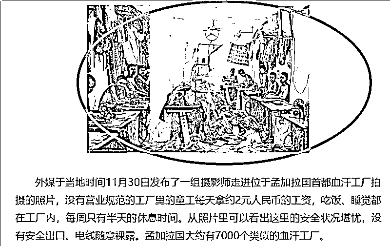
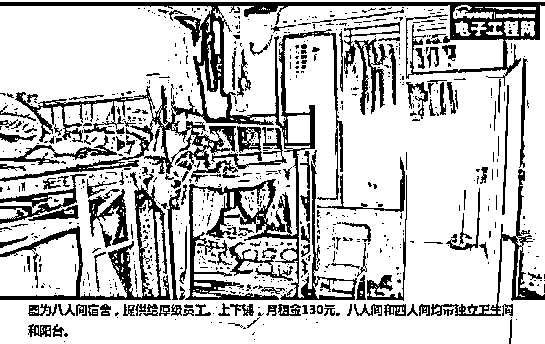
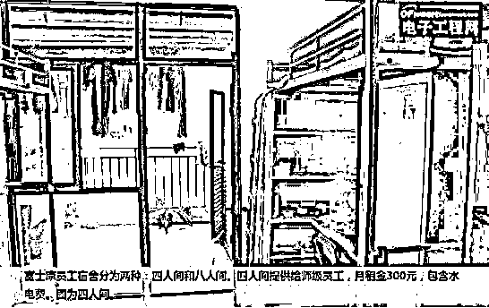
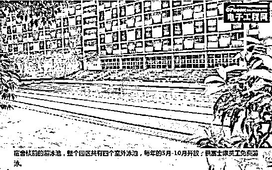
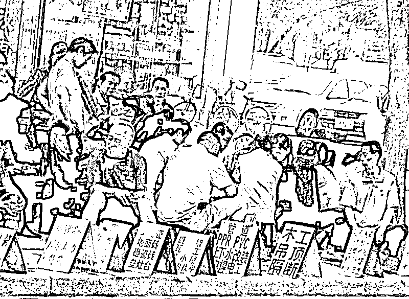

# 深度剖析——富士康究竟是血汗工厂还是高端制造

紫竹张先生

每篇都有干货的财经公众号

*友情提示，本文含有较多视频资料，请在 wifi 模式下观看*

近日，富士康在 A 股上市，不管是在官方公告里，还是在主流媒体的评价中，都是把富士康上市这件事当做中国产业升级、扶持高端制造业进行定性的。

打住，稍等一下，富士康不是鼎鼎大名的血汗工厂吗？它身上的标签一直是血汗工厂、苹果代工这些负面词汇呀，和高端制造有什么关系？**前几年还有很多富士康工人接二连三的跳楼，连美国媒体都看不下去了**，要求苹果放弃和血汗工厂富士康合作，否则全美国人民弃用苹果，由于绝大部分订单都是由富士康完成的，被称之为黑苹果的苹果公司疲于奔命，对美国人民和媒体进行了大面积的解释和安抚工作。

**这才几年，血汗工厂富士康怎么摇身一变成了高端制造了，**高端制造这个词汇和血汗工厂的反差是不是有点太大了？其实，富士康还真的算货真价实的高端制造业，我这里给大家列举一些客观资料，大家看看便知。

通过阅读正统的书籍和媒体报道，普通中国人心中的血汗工厂都有了一个标准化的形象，当美国媒体批判富士康为了完成苹果订单成为血汗工厂的时候，我们印象中，被评为血汗工厂的富士康，应该是长这样的。

如果富士康真的是这样的，苹果怎么洗也不可能洗的白，注定是黑苹果。但是实际上，富士康给予工人提供的工作环境和薪资待遇，在整个中国的工厂里，都算非常良心的。

富士康的居住环境

首先看一下富士康提供给员工的宿舍是个什么样子，下面是富士康的 8 人间，提供给员级员工使用，月租金 130 元，带独立卫生间和阳台。

这是富士康的 4 人间，提供给师级员工使用，月租金 300 元，含水电，带独立卫生间和阳台。

这是员工宿舍的外立面，并配置了一个游泳池，每年 5~10 月供员工免费使用。

上面的照片资料只能看一个视角，不全面，正好网上曾经有人拍摄过富士康的宿舍，大家可以直观感受一下。

讲真的，对于中低端就业人口来说，这个宿舍的费用和环境简直不要太良心，如果这都算恶劣环境的话，我觉得我当年的大学宿舍简直是十八层地狱，难以想象我是怎么熬到毕业的。

富士康的工作环境

那么富士康的生产车间工作环境是怎么样的呢，正好我们有一些其他的资料，可以从第三方的视角客观的了解一下中国的富士康工厂。

几年前，央视一台在拍舌尖上的中国的时候，曾经对富士康工厂进行过纪录片形式的拍摄。那个时候富士康还处在员工跳楼事件的阴影中，所以央视虽然是以记录片标准的客观公正的语气去叙述富士康的，但是话里话外还是透露着淡淡的鄙视。不过没关系，一个带有鄙视的负面眼光去拍摄的纪录片，更能让我们了解富士康。

央视的视频拍摄的还是很全面的，虽然主要是拍摄富士康食堂的，但是从这个视频里，我们也能从其中闪过的几个工作画面，感受到生产车间的整洁明亮，以及先进性。顺便，富士康丰盛的伙食吸引了我，感觉比我大学食堂要好吃多了。。。

在以上的资料里，我们可以从直观的感受中得到结论，富士康的整体生产环境以及员工的饮食起居等环境，都是非常的出色的，可以说是绝对完爆 99%的中国普通工厂。广东的小制衣厂，皮革厂，小商品厂，其生产环境相比富士康，简直是云泥之别。如果非要和发达国家比工作环境，那么和美国谷歌的办公环境相比，中国很多 IT 公司，尤其是创业公司，就等于没有环境，那么中国的 IT 公司，算不算血汗工厂，有人出来指责他们环境差吗。

富士康的待遇问题

看完了环境，谈一谈待遇，富士康的工资待遇低不低，还真不低，你如果拿华为工程师的薪资去和富士康流水线工人的薪资去比较，那是低，但是这肯定是不公平的，因为你要是拿同样的流水线工厂去比较，那富士康可以说是最高的。

富士康每个月 7 号左右发放工资，雷打不动，也就是说只押 7 天工资，一些小厂一般压一个月，甚至更久。富士康辞职直接走流程，不会扣一分钱，其他厂辞职的时候总会找理由扣钱，富士康加班必给 2 倍工资，而很多小厂加班是不给加班费的，富士康给每一个普通员工购买五险一金，而其他很多厂都会去逃避，甚至几千人的大厂也都通过各种手段回避这些福利责任。

富士康目前**在中国雇佣了足足 150 万员工**，进出自由，如果开的工资不够合理的话，工人会用脚投票，直接离开富士康。所以我们从未听说过富士康的员工抱怨过工资低的问题，150 万工人啊，他们都是经过多个流水线工厂福利待遇反复对比过的最终选择。

有人问，为什么要和流水线工厂的薪资比呢，难道就不能让这些人去腾讯阿里工作，拿腾讯阿里中兴华为的薪资去比吗。这真是**站着说话不腰疼，属于何不食肉糜的思维方式**，就好像问你为什么要去蓝翔读书，怎么不去清华呢，能上清华谁愿意去蓝翔啊，如果有能力去这些大企业，谁会去流水线工厂，哪怕是富士康他也不会愿意去的。你要知道，在中国有好多人的工作状态是下面这样的，按日接活还要凭运气，收入完全没保证，对这些人而言，富士康舒服的工作环境，稳定的福利待遇已经算非常好的了。

为什么说富士康是高端制造

分析到这里，基本可以推论出富士康并不是血汗工厂里，在中国的各类代工厂里，属于绝对高个子。但是就算富士康是良心工厂，他也只是个代工厂，代工厂怎么能和高端制造挂上钩。

我们知道，苹果手机大部分的订单，都放在了富士康，如**苹果 8 的订单，95%都被中国郑州富士康给拿下**了。

大家如果有兴趣可以拆开自己的苹果手机看一看，里面的零部件是多么精密，生产这种手机所需要的机器也是非常精密的，单凭手工和简单的设备是绝对无法生产出苹果手机这样的高精尖电子设备的。富士康的牛逼之处在于，他把代工厂模式发展到了极致，成为了全球第一强的代工厂，强大的管理能力让富士康能够招募低水平的劳动人口，简单训练就能成为一个合格的流水线工人，生产过程并不依赖人才，而强大的先进设备让富士康能够承接世界上绝大多数高精尖设备的制造。富士康自己的研发能力其实特别强，每年的研发投入也非常高，只不过他的研发力量都投入到了如何能够设计出更先进，效率和合格率更高的生产机器上面去了，我们可以看一看富士康的五大块业务。

生产衬衣袜子的工厂，大家说是低端制造，生产高精尖电子设备的工厂，如果还叫低端工厂，那什么才算高端工厂。我们可以通过下面这个视频，了解一下**富士康是怎么生产一部手机的**。

整个一部手机的生产过程，基本都是机器完成，流水线工人只是负责最后的收尾工序，因为手机内部的元器件太精密了，手工根本无法完成，即便花大价钱培训出了合格工人，其质量稳定性也无法保证，还不如引入昂贵的自动化机械来做这个事情。富士康采用如此高度自动化的生产设备，无愧于高端制造的称号。

别让富士康跑了

富士康这样具有超高管理能力和超高先进设备的工厂，**完全符合中国产业升级、高端制造的定义和需求**，虽然富士康是台湾的企业，但是只要你工厂落在大陆的土地上，那就足够了。当和台湾关系良好的时候，那不过就是分点利润出去，一旦到了统一战争的阶段，只要工人和机器还留在大陆上，那这个工厂就是大陆所有，先进的产能可以立刻转化为战争的动力源。

实际上，专门生产芯片的台积电，也是代工厂，本身并不设计芯片，苹果最新的 7nm 芯片和华为的麒麟芯片都是自己设计，然后交给台积电代工，而同期大陆最先进的中芯国际，28nm 工艺的不良率都始终无法达标。所以如果能把台积电弄到大陆开厂，只要工厂落地，工人就位，中国就再也不用怕被美国掐脖子了。如果中美关系良好，那一切都好，无非就是一点利润的问题，如果中美处于开战状态，哪怕美国命令台积电的管理层立刻撤回台湾，机器和工人他们也是撤不走的，中方可以立刻接手工厂进行芯片的生产，国家安全的后顾之忧就直接解除了。

当然，美国也不傻，大陆几次三番开出堪比天价的优厚条件，都没能把台积电给忽悠过来。不过富士康既然已经过来了，那就大力扶持，政府的意思很明确，给富士康甜头，高端制造工厂只要愿意来大陆开厂的就大力扶持，让他发大财，形成一个诱导效应。

**特朗普会拉来一个血汗低端工厂去压榨美国人吗？**不会，他选择富士康进行拉拢一定是有道理的，那么在美国人拼命拉拢富士康的时候，我们不采取任何行动，甚至把他向外推，那是非常愚蠢的行为，所以我们不能让富士康跑了。另外还有一点小因素就是，富士康和台积电虽然目前大陆管不到，但是都是台湾省的，都是中国人，扶持他总比扶持三星要好吧。政府认为扶持富士康能促进中国产业升级和高端制造，如此决策必然是有道理的，是经过多方面综合考量的。

最后，希望大家经过这轮资料大科普之后，能够对富士康形成一个客观的看法，对中央的扶持政策表示理解和支持，这样才最有利于中国的产业转型和升级，**只有中国制造强大起来了，我们每个普通中国人的生活才能更富足**。

<link rel="stylesheet" href="view/css/APlayer.min.css"> ****