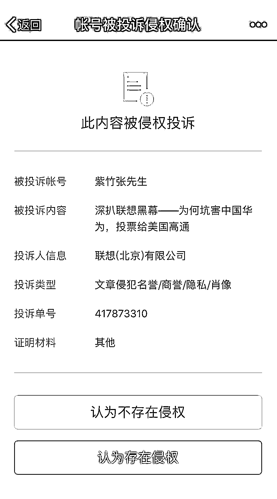
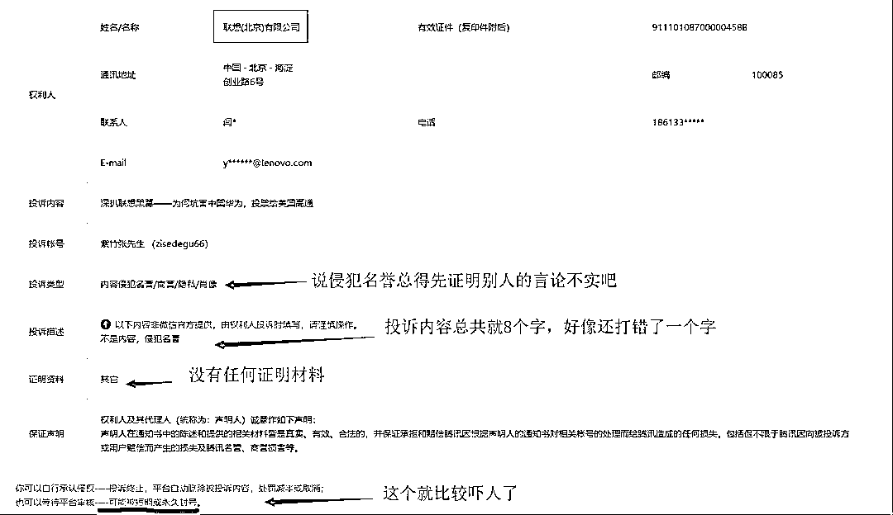
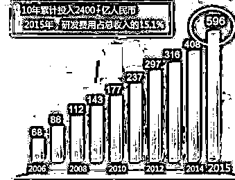
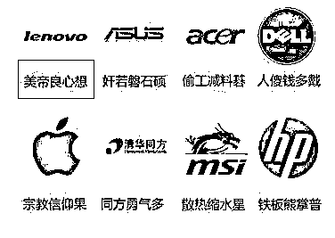
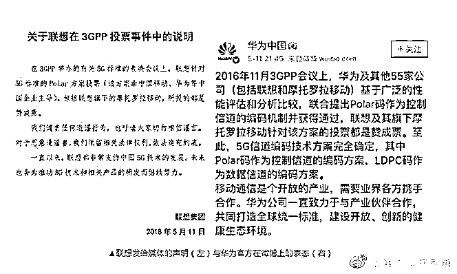
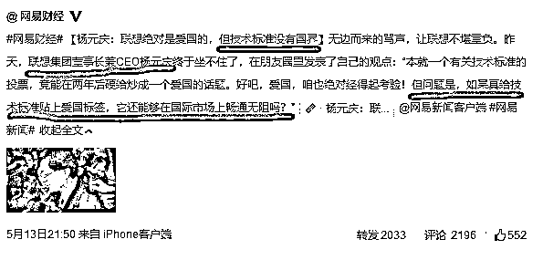
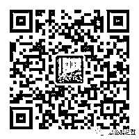

# 联想，说我名誉侵权可以，请拿出证据好吗

紫竹张先生

经济-金融-投资，点击右边按钮关注我

我在 5 月 13 日，写了一篇《深扒联想黑幕——为何坑害中国华为，投票给美国高通》对联想的所作所为进行了点评，所列举的材料都是在网络上经过 3 天以上大规模讨论，有过详细证据支撑的资料，都是经过千万人互相找茬激烈碰撞得出的结论，但是今天却收到了联想公司的名誉侵权投诉。

我当时就点进去看了，看看到底是怎么投诉我的，结果看了以下投诉资料。

我写文章评论是我的自由，联想认为我的言论不恰当投诉我，也是他的自由，但是这个投诉资料是怎么回事，投诉描述总共就 8 个字，还敲错了 1 个字，证明材料为 0，什么都没有。相反，网络上揭发联想的帖子无不是内容详尽，论证严谨。

我们只是个普通公民，所知的内幕相比大公司而言甚少，所以联想投诉我侵权，如果拿出确凿的证据证明内容有不恰当的地方，那我会果断删除帖子，但是你这么个投诉法，恕我无法接受这个投诉。

**那么什么样的投诉法我才会接受，我这里举几个例子。**

首先，我列举了华为的天量研发费用，17 年华为的研发费更是高达 900 亿人民币，进而批评联想吃老本，不思进取，10 年研发费用合计才 300 亿人民币，还不及华为一年支出的费用。

对于这一段的指责，如果联想发布公告列出自己 10 年的研发费用证明我数据有误，那我理当删除帖子，或者删除这一段落后重新发送。

然后，我列举了联想的外号“**美帝良心想”，这个外号可不是我起的**，而是整个互联网界给起的外号，持续多年，也并非针对联想一家，比如戴尔公司因为质量不错但是价格死贵荣获称号“人傻钱多戴”，苹果因为果粉那种类似于宗教狂热信徒般，堪比洗脑一样的不买苹果不罢休的信仰，而荣获称号“宗教信仰果”。至于为什么联想会获得这样的称号，那就得问联想自己了，在国内外销售差价太大，在国外卖手机电脑的中国企业有很多，因为税收缘故，国外都会比国内便宜一点，为什么中兴华为小米，没有收获美帝良心这样的称号，这种事不能问网民，应该问联想自己。

这个事情基本没得辩，纯属口碑问题，联想也拿不出什么东西来证明。

最后，就是最关键的 5G 投票事件的争论了，在这次 5G 行业标准的制定里，联想投了高通 2 票，弃权 2 票，投了华为 2 票，在中美贸易争端的档口，联想为了自身利益，在 5G 中美争端中投给美国高通，这是最让网民气愤的地方。

关于这件事，联想和华为在 5 月 11 日发布的官方声明是这样的：

这个辟谣声明没出之前还好，出了之后直接激怒了网友，导致事件迅速发酵，到我这篇文章出路的 5 月 13 号，已经发酵的不成样子了。为什么呢，因为本来大家还不清楚这次投票细节到底是什么，联想这个声明一出，立刻就有人去深扒了所有的投票现场细节，联想的确对华为投过一次赞成票，但是他也投过反对票导致在 5G 的 86 次会议上华为数据短码方案不通过，拖到 87 次会议上再次表决之后，华为竞争失败。更是对美国企业高通投过赞成票，而联想的声明避重就轻，只说自己投过华为赞成票，其他一概不谈。

这种声明，就类似于我们听闻某个饭店偷偷把地沟油混杂在好油里面给顾客食用，去质问这家饭店到底有没有使用地沟油的时候，这家饭店义正言辞的回答：“本饭店每个月都定期采购合格的食用油”。

听起来好像没什么错，好像是个好饭店，但是你根本就没有正面回答你有没有使用地沟油好嘛。联想这么做这属于利用信息优势，欺负网民不知道投票现场的具体细节，所以在更详细的资料被披露之后，**网民比以前更愤怒了，因为感到自己的智商被侮辱了**。

至于为什么华为替联想说话，那是因为首先都是国内企业，互相捧场不拆台是中国人一贯的做事方式。另外还有一点很重要的是，互联网企业真的是技术优先，各厂商都在为自己的利益争夺。而 5G 标准的制定，是 2016 年 10 月份，那个时候中美的关系还挺不错，美国高通是中国的重要贸易伙伴，小米那个时候也在使用高通的芯片。5G 标准归谁制定，从国家的角度来说肯定希望中国企业制定，但是从每个厂商的角度来说，无非就是把专利费交给谁而已，所以每个厂商都选择对自己最有利的方案进行合作，小米选择了华为，联想选择了高通。

如果没有 18 年贸易战，美国利用芯片来卡中国脖子这件事，这根本不是个事，但是在芯片争端之后，人们发现，所有的核心技术不仅仅是钱和专利费的事情，搞不好还是一个国家的安全问题，要是人家以后利用核心技术优势卡你脖子，你不就傻眼了么。

随后，联想董事长兼 CEO 杨元庆坐不住了，出来发表观点，称技术标准没有国界，如果给技术标准贴上一个爱国标签，它还能够在国际上畅通无阻吗？

这简直是神补刀，杨董事长这句话给了联想重重一击，这句话没说之前，大概还有 30%的人支持联想，说事实尚不清晰应该等待官方表态，杨董事长这番言论发表之后，所有支持联想的人立刻闭嘴了，网络舆论呈现一边倒的姿态。什么叫技术标准没有国界，什么叫技术标准如果贴上爱国标签，那还能在国际上畅通无阻吗？这不就是自己证明当初攻击自己的所有言论都是正确的，不仅没有拿出证据证明自己无辜，反而直接把自己的不爱国罪名给坐实了。

关于这一段技术标准之争的指责，核心就是联想曾投票支持过高通，以及曾经弃权不投华为这二件事。只要联想发布一个公告，说自己从未支持过高通，也从未弃过权，所有选票都和一群国内厂商一样全部投给了华为，那么就代表我所述言论不实，我理当删帖。说我名誉侵权可以，请拿出证据好吗？

联想指责我内容不实，那么就应该提供材料进行逻辑严谨的证明，要堵住全国人民的嘴，就必须自己出一个明确的公告，而不是避重就轻转移话题。企业做错事做好事，我们无权干涉，但是我们有权评价。华为花大钱做研发为国争光，自然要力挺华为，联想不思进取只想赚快钱，连港交所都要把他剔除指数，而且为了在 5G 会议上中兴高通之战的时候，只考虑厂商利益，而没有过多的考虑民族感情，在中美关系良好的时候自然不算什么，但是在中美利益有严重冲突的时候，肯定要付出代价。

如果联想这种企业我们连批评的权利都没有，必须要拍马屁的话，那么中国还有什么企业值得批评。如果我们不鼓励华为这种好孩子，也不批评联想这种坏孩子的话，我觉得所谓制造业强国，永远都无法实现。

另外，我也不知道这个侵权投诉后续会怎么处理，轻则删帖重则封号，所以我准备了一个紫色复活号，如果这个号大家突然找不到了，可以去复活号里找我，如果我被跨省了，等我出来之后，也会在复活号里去找大家。

扫描下方二维码加复活号。

