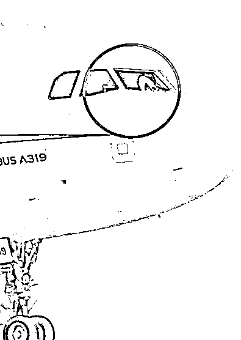
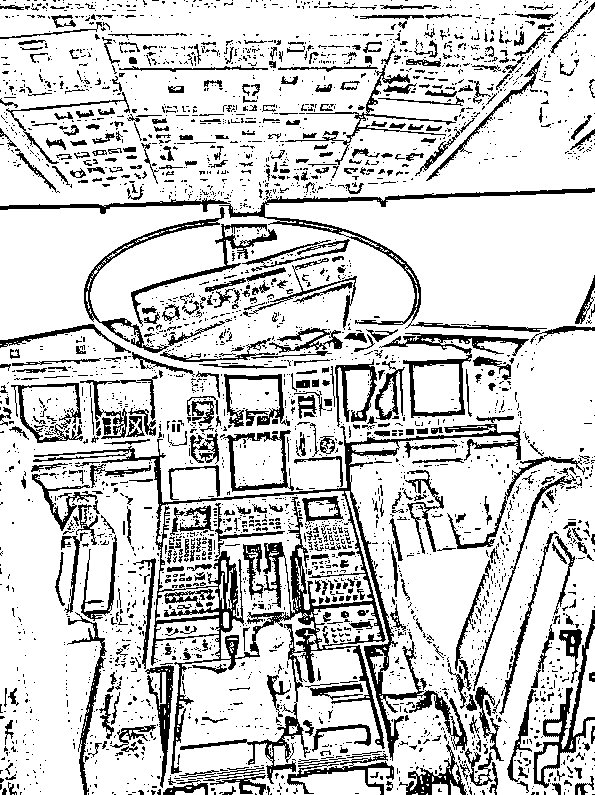
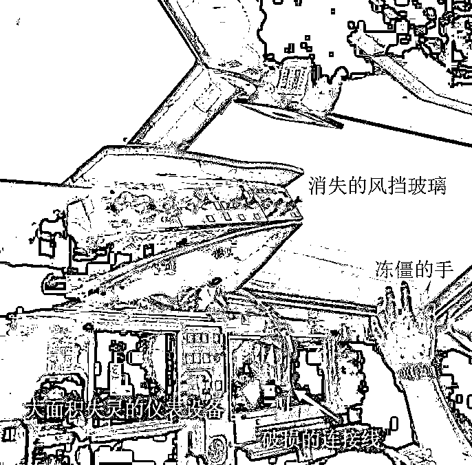
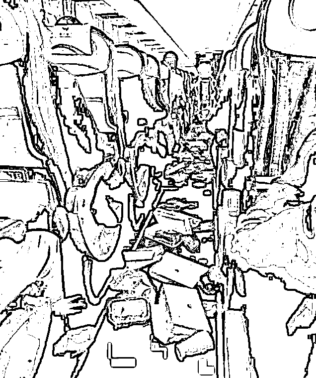
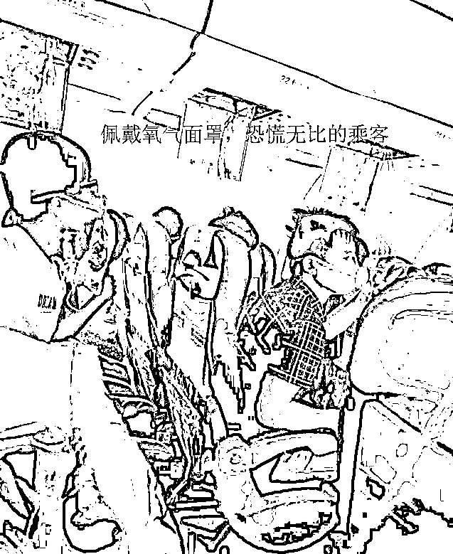
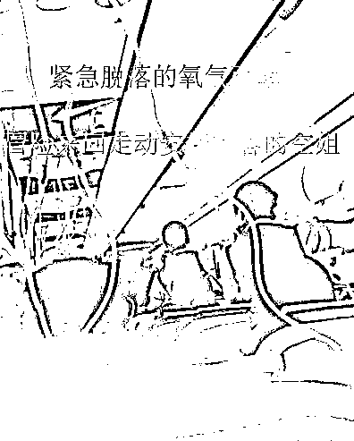
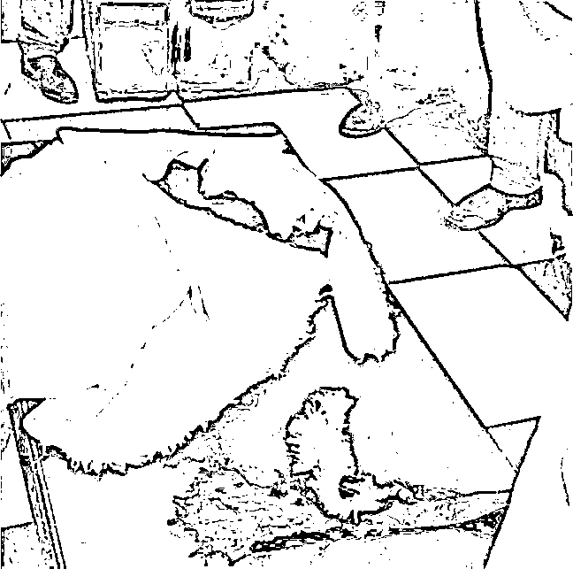
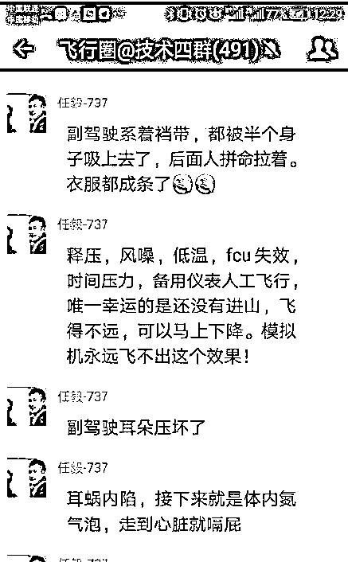
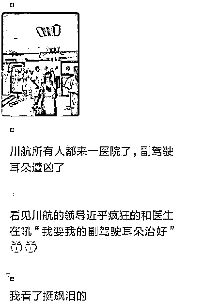

# 我们都应该给川航英雄机长致敬，因为他遭遇的痛苦远超你的想象

紫竹张先生

经济-金融-投资，点击右边按钮关注我

昨日上午，四川航空公司的一架飞机完成了一次生死飞行，这架飞机在起飞后，风挡玻璃脱落，然后飞机紧急从万米高空迫降，最终平安降落，把所有乘客送回了地面。

我最初看到这个新闻的时候，内心是非常平静的，甚至觉得大惊小怪，不就是掉一块玻璃嘛，有什么好报道的。我平时没事的时候开车出去兜风，都特地把两侧玻璃打开的，难道因为汽车的叫挡风玻璃，飞机的叫风挡玻璃，性质就发生改变啦？玻璃掉了正好就在空中开飞机兜个风，除了有点冷之外，好像谈不上什么太大的风险。

但是后来随着报道的资料逐渐增多，我才发现，开汽车兜风，和开飞机兜风，真的是有本质的区别的，而且差别非常的大！

我们以每小时 60 公里的速度在高架上开车的时候，兜风是非常舒服的，比开空调还舒服。以每小时 120 公里的速度在高速上开车的时候，兜风也还好，就是有点吵，同时风力略强有点不舒服，所以通常都是关窗开空调。

但是当时速提升到 300 公里以上的时候，兜风的效果就发生了质变，国外科学家曾经用时速 350 公里的人造风做过试验，吹在人脸上，效果大概是这样的。

这次出事的川航飞机时速是多少呢，据机长介绍，当时的时速大概在八九百公里左右，我无法想象八九百公里时速的风吹在人脸上是什么效果，但是可以肯定是非常痛苦的。而玻璃脱落的一瞬间，形成的强大压力，会把机舱内的一切东西都吸出去，同时机舱内迅速降温降压。

其实在国外有一次航空事故和这次川航的非常相似，那就是 1990 年英国航空 5390 号航班在 5300 米高空的时候，机长位置的风挡玻璃突然脱落，而当时高度很低，机长已经松开了安全带，瞬间就吸出飞机之外，最后在副驾驶临危不乱的操作下平安降落。英国曾经专门拍摄了电影《空中浩劫》来描述这一事故场景，同时还专门拍摄了纪录片来纪念这一英雄事迹。由于川航的事故和英航的高度相似，堪称中国版的空中浩劫，所以我们可以看一下这个小视频，来体验一下当时的危急程度，以及乘客当时巨大的内心恐慌。

川航此次的事故，几乎完全重现了当时的情景，但是还是有区别的，当时英航飞机的高度是 5300 米，川航的是接近万米。英航飞机的时速是 400 公里，川航这次的是八九百公里。英航的机外温度是零下十几度，川航的机外温度是零下四五十度。

这个差距导致川航风挡玻璃在碎裂脱落的一瞬间，产生风压的破坏力远胜于英航飞机。这个超大的风压不仅差点把副驾给吸出窗外，而且直接把驾驶舱内的仪器设备给摧毁的一塌糊涂，我们可以看到，FUC 设备差点被吸出飞机，数据连接线被全部拉断，整个驾驶舱的电子设备大面积失灵，仪表盘开裂、无线电中断，机长被迫在时速八九百的狂风中手动控制飞机进行迫降。

当时机舱的温度直接从零上二三十度暴跌到零下四五十度，穿着夏装的机长几分钟不到整个手就被冻僵了，在这种恶劣的条件下，安全降落的难度是要明显超过 1990 年英航事故的，在这么困难的条件下，机长成功降落了，所有乘客全部安全落地，仅有数人受轻伤，你说难不难。

而在飞机出事的那一刻，飞机内一片混乱，恐慌气氛迅速蔓延，我们可以从事后乘客流传出来的视频资料截图里略窥一二。

因为在万米高空，空气稀薄，一旦飞机失压，所有人会迅速进入缺氧状态，一般来说，如果一二分钟内不采取措施的话，人体就会陷入缺氧昏迷状态。驾驶舱内的机长在玻璃脱落的几十秒内就迅速戴上了氧气面罩才免于昏迷，虽然驾驶舱和乘客舱之间有密封门保护，但是乘客舱的气压也在迅速降低，为了保护乘客的安全，所有乘客都被要求戴上氧气面罩。

我们不是多次进行生化训练的精英战士，只是一名普通的乘客，坐飞机碰上这种事，你说恐慌不恐慌，这个时候，机组的乘务人员，也就是空姐发挥了巨大作用，冒险在飞机上来回走动，挨个安抚乘客的情绪，让所有的乘客都镇静的在座位上等候飞机的降落，不至于引发骚乱影响到驾驶舱机长争分夺秒的抢救操作。

而这起事故里，最惨的就是副驾驶了，上次英航事故，是机长位置的风挡玻璃脱落，导致没佩戴安全带的机长被吸出。而这一次川航事故，是副驾位置的风挡玻璃脱落，副驾虽然佩戴了安全带，但是因为当时处于万米高空，实在是太高，而且时速太快，导致副驾就算带了安全带也半个身子被吸出了飞机之外，靠其他机组人员生拉硬拽才给拖回飞机之内，我们可以看看在医院内脱下的副驾制服变成了什么样子。

在这件事故中，副驾表面看起来毫无作为，开局就被风压给秒杀了，但是这并不是他的错，如果这次的挡风玻璃是机长位置破损，那被吸出舱外的就是机长，而去抢救飞机的人，就会是副驾，就好像英航那样。由于正面对上了风压最强的位置，副驾的耳膜遭遇了极大的压力，大家都知道开高速穿过隧道后因为压强的变化我们的耳朵都会非常难受，而这次副驾面对的风压是足够把固定在驾驶舱的仪表都直接吸出舱外的的强大压力，副驾的耳朵直接给压坏了，而且差点危及生命。

    

整个飞机上的人，受伤最重的，就是这位副驾，而川航的领导，赶到现场的第一个指示，就是要求医院用最好的仪器和医生，不惜代价治好副驾的耳朵。

我们每个人期望在自己陷入危难的时候，世界上会出现一个超级英雄来拯救自己，但是这世界上没有超人，只有凡人。不过今天川航这位英雄机长的所作所为，让我们知道，凡人有时候也可以成为超人，一个受到职业训练的飞行员，在最不利的条件下，恪尽职守，竭尽全力的抢救飞机完成他的使命，在这一时刻，他就是超人。

川航出现如此重大的事故，地勤机械保养人员难辞其咎，对于乘客而言，他们来川航是想坐飞机平安回家的，而不是来欢乐谷坐过山车的，所以哪怕把这些乘客平安送到了地面，川航的地勤保养人员和高层管理人员，也对不起这些乘客，我必须要对其批评。但是以机长为首的机组人员并没有对不起乘客，他们没有辜负乘客的重托，在其他人的失误导致飞机出现重大事故的时候，竭尽所能的保护了乘客的平安，把人员财产的损失降低到了最小，所以，我们必须对机组人员提出表扬。

像川航英雄机长这样技术精湛、临危不乱的人，正是我们整个社会所需要的人才，他和当年那位行驶途中心脏病突发，用尽最后一丝力气把车辆平安停靠在路边的公交司机一样伟大。如果每一个天上的机长，每一个地下的司机，都能具备这样的专业素养和心理素质，我想我们每一个人的出行安全，都能得到质的飞跃。

所以，我今天必须为这位英雄机长、以及全体机组人员发文致敬，你们是好样的，无愧于英雄的称号。

最后，我在 5-13 日发布的《深扒联想黑幕——为何坑害中国华为，投票给美国高通》被联想投诉名誉侵权，我也没啥申诉渠道，所以我把被投诉的资料和截图放在了第二条来写一下，让大家评评理，“联想，你投诉我名誉侵权可以，但是请拿出证据”。

