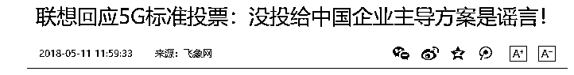
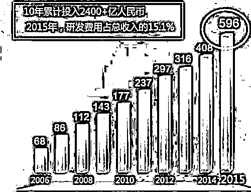
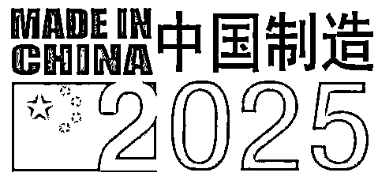
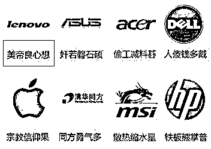
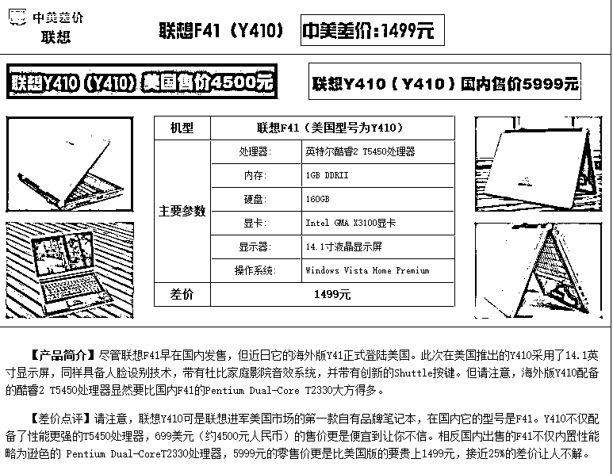
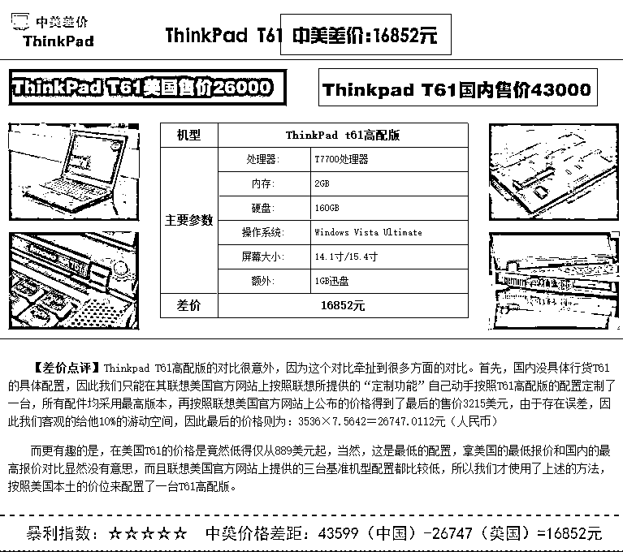
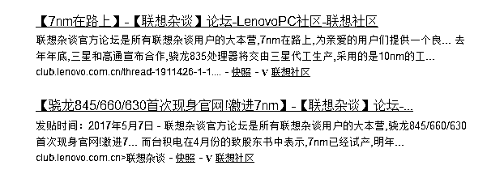

# 深扒联想黑幕——为何坑害中国华为，投票给美国高通

紫竹张先生

经济-金融-投资，点击右边按钮关注我

这几天关于联想的争论热火朝天，在关于全球 5G 行业标准制定的投票之中，联想和他收购的摩托罗拉，都投票给了美国高通，导致华为惨败，行业标准控制权落在美国人手里，严重损害了中国利益。

但是联想出来辟谣，说这是 2016 年 10 月的事情了，而且我有投票给华为啊，投了足足 2 票，说我没有投票给华为，纯属污蔑，是谣言，属于混淆视听。

那么以爱国为标签起家的联想究竟有没有被冤枉，我今天就给大家深扒一下这件事的来龙去脉，用事实说话，然后交给大家自己去判断。

大家都知道，在互联网领域，素有一流企业做标准、二流企业做品牌、三流企业做产品之说。也就是说，谁来制定行业标准，谁就具备了绝对控制权，这份利益表面上是属于单独某个企业的，实际上是属于整个国家共有的。

而在移动通信领域，其行业标准的制定同样非常重要，在 2G 时代，中国的技术能力就是渣渣，只能使用美国高通制定的 2G 标准，每年都要交给高通公司大笔的专利费。在 3G 时代，通过一代中国软件工程师的不懈努力，靠着国家拉拢的亚非拉等兄（pin）弟（qiong）国家的支持勉强成为三大标准之一，吊上了车尾。在 4G 时代，以华为为首的中国企业，砸下了无数的研发费用，仅华为一家 10 年卧薪尝胆期间的研发费用就支出了 2400 多亿人民币，付出巨大的心血之后，终于成为了世界先进技术，凭借烧掉的天量研发费，**这才有了 16 年和美国高通争夺 5G 标准制定的底气**。

那 5G 的行业标准究竟给谁制定呢，中美当然都希望是自家制定，不仅有大量的商业利益，还涉及国家安全的保障，所以矛盾难以调和。不过在移动通信领域，有一个行业协会叫 3GPP，经过协商，所有的大企业大厂家同意进行一次投票，根据投票结果来选举，一旦结果落定就愿赌服输，不得反悔，否则会成为行业公敌。

2016 年 10 月，投票正式开始，这次的行业标准控制权，分割为数据长码、数据短码、控制码三个领域的投票。纯就技术先进程度而言，在数据长码上，高通具有绝对优势，在控制码上，华为具有绝对优势。但是在数据短码上，高通华为各有优劣，难以取舍。数据长码华为是不指望了，技术劣势导致选票明显差距太大，但是数据短码如果能击败高通，那么华为就能拿下 5G 行业标准的大半壁江山，成为全球第一，这代表 5G 时代，是中国领跑的时代，美国退居二线，中国梦指日可待，中国制造 2025 将从华为在 5G 领域的胜出实现第一步。

在这次的投票中，所有的中国企业无脑支持华为，数据短码和控制码当然投华为，数据长码高通的明显更先进？没关系我还是投华为。哪怕是和华为在国内构成直接商业竞争的企业，这个时候都一致对外，甚至台湾的企业联发科和宏碁，也都把票给了华为。而美国的企业，则无脑站队高通，这并非技术决定一切，而是政治正确的需要。

但是联想却把自己的票投给了高通，不仅自己投了，连带自己收购控制的摩托罗拉的一票他也投给了高通，合计 2 票。也许联想觉得自己 3 个领域投票都给高通实在太露骨了，于是很鸡贼的选择了一个方案，高通占绝对优势的数据长码，2 票全部投给高通，华为占据绝对优势的的控制码，2 票全部投给华为，优劣难以区分的数据短码，选择弃权。

实际上，数据长码领域有没有联想的这 2 票，也会是高通获胜，控制码领域有没有联想的这 2 票，也会是华为获胜。而争议巨大的数据短码领域，联想选择了弃权，这实际上就是联想选择了全部弃权，他不想背负卖国的骂名，但是还想交好高通，所以就各投 2 票，然后关键战场弃权。

而联想弃权的结果是，数据长码领域高通碾压获胜，控制码领域华为碾压获胜，在关键的战场，数据短码领域里，华为以 23 比 24 票惜败高通，5G 时代的领跑者，依然是**美国企业高通，中国梦失败**。

你没看错，就是 23 比 24 票，一票之差，联想拥有的 2 票全部弃权，没有投给华为。如果联想没有弃权，把这 2 票投给了华为，那么华为就是 25 比 24 险胜美国高通，成为 5G 时代领跑者，中国将控制 5G 时代大部分领域的行业标准制定，成为世界第一。为了交好美国高通而导致中国核心利益受损，这种行为，**我称之为卖国求荣也不为过**。

那为什么联想宁可冒着背负卖国骂名的风险，也要去干这种为人所不齿的事情，这就要从联想的发家史说起了。

1994 年，中国把进口电脑的关税从 200%降低到 26%，一时间国外电脑汹涌而至，称霸国内市场。这个时候，联想成立电脑事业部，对外以民族品牌宣称，虽然联想的电脑核心部件全部购买自外国，充其量也只是一个装配工厂而已。但是联想毕竟是第一家国内的电脑品牌，是民族企业，于是各大政府部门、事业单位都会从联想采购电脑，消费者也喜欢支持联想，**正如同今天全民支持华为一样**。

凭借打爱国牌，联想成为了国内电脑品牌的龙头，压过了戴尔，打倒了 IBM，甚至走出国门跨到国外，并购了 IMB 的 PC 部门，还收购了摩托罗拉。那个时候的联想，风华正茂，是中国民族企业的精神和希望，当年的联想在人们心中的地位，正如同今天的华为一样。

**联想拿了一手好牌，尽享中国红利，**如果能稳扎稳打，中兴华为甚至小米之流根本不能望其项背，只配当小弟，不可能超越巨无霸联想，曾几何时，机关单位里配置的清一色的都是联想电脑。

但是联想的股价却是一跌再跌，被香港交易所评为 10 年来表现最差的科技公司，打算在 6 月踢出恒生指数。为什么联想表现会那么差，别说华为中兴小米，就连港交所随便拉出一个科技公司，都比联想表现要强，其核心原因就是因为联想是贴牌生产赚取暴利起家，其销售靠的是购买国外核心元器件简单装配贴个牌，然后打爱国感情牌卖出去，极其不重视研发。10 年来，联想累计投入的研发成本总共只有 44 亿美金，不足 300 亿人民币，而同期华为的研发费用合计 2400 亿。而在 17 年这一年，华为投入的研发费用更是达到了 141 亿美金，接近 900 亿人民币，一年更比一年加速，双方的研发投入和技术差距犹如天堑之别。

所以，当华为这种也能打爱国牌，而且愿意牺牲短期利润，投入更多的经费去研发技术的民族企业冒出来，联想自然就一败涂地了。而且更恶劣的是，联想利用国人的爱国情绪谋取暴利，欺骗国人感情导致信用大幅度丧失，被称之为**美帝良心想**。

网民给所有的科技企业都起了调侃的外号，但是起的外号都会是有缘由的，为何会给打中国爱国牌起家的联想一个美帝良心想这么不伦不类的奇怪外号呢？就算是批评联想不研发，靠贴牌以及贩卖爱国情怀赚钱，也应该给一个**中华爱国想**这样的称号吧。

给这么奇怪的称号，是因为联想在国内销售的电脑和国外销售的电脑，是两个品质。同一款产品，售往国外的明显性能更好，质量更稳定，这是专业技术员测试出来的。质量好也就算了，普通用户很难感受到差异，但是价格明显差距巨大，这就很离谱了，属于侮辱智商。

一款普通的联想电脑，**在国外销售的版本不仅性能更佳，而且价格明显的要低，**让人无法理解。而高端的联想产品，其售价差距更大，大到亮瞎眼的地步。

这么高的价差就导致了一个怪现象，如果找海外代购，运回来一款联想电脑，加上关税和运费，成本居然比直接在国内购买还要低，如果你因为爱国，为了支持国货去买联想电脑，最佳的选择是托海外代购在美国买，然后给你运回来，成本比你直接淘宝买还要低，所以在电脑届，联想喜提称号“美帝良心想”。

对美国人是够良心了，对中国人呢？中国人因为爱国情怀，愿意选择质次价高的民族品牌的热情就这么被联想年复一年的消费，一直到了消费殆尽的那一天。当其他民族企业也跑来分食爱国蛋糕的时候，联想因为技术欠缺，盈利就出现了巨大问题，开始变得岌岌可危，不管是电脑业务，还是手机业务，都一败涂地。

所以，这就导致了联想这一次投票给高通的冒险行为，为何联想愿意冒着被骂卖国的风险也要行此险招，因为爱国蛋糕已经不够联想吃了，他急需推出一款最新的顶尖技术产品来抢占市场，但是联想自己造不出来顶尖技术产品，华为也不可能给联想什么实质性的好处，但是高通可以。

根据从联想内部传出的消息，联想将跳过高通 845，直接获得高通骁龙 855 芯片处理器的采购资格。一张内部传出的美国高通高级副总裁，美洲区销售总裁 Mike Finley 在联想内部与高层负责人合影基本证实了这一点！

目前的旗舰手机，高通 835 和高通 845 芯片是主流处理器，但是他们均不支持即将到来的 5G 时代，骁龙 855 是高通第一款采用 7nm 最新工艺生产出来的芯片，支持 5G 功能，7nm 有多牛逼，看看中国如今连 28nm 的工艺都搞不定就知道了，相差至少 3 个时代，连美国人自己都要在明年初才能享受 7nm 工艺的产品。联想此次拿下骁龙 855 的首发采购权，很明显会成为中国第一家推出 5G 手机的厂商，甚至在全球市场，都将占据先机。联想的论坛和社区，已经开始为联想拿下 7nm 芯片代理权准备庆功宴了。

华为底子太差，就算砸下几千亿的研发费用，也仅仅是在编程方面追上了美国的步伐，华为你有芯片吗？你能造出 7nm 的芯片处理器吗？没有芯片，你拿什么去造 5G 手机！拿不出手机，你用什么去抢占市场！等高通三星联想都推出 5G 手机半年了你才拿到 7nm 芯片的供货权，黄花菜都凉了好吗。投奔高通可以获得稀缺的首发芯片供给，投奔华为有这个待遇吗？华为自己的芯片都不够用，靠美国高通施舍才有。美国高通会痛快的把最新芯片给竞争对手来抢占自己的市场吗？象征性的给一丁点证明我没歧视你，然后你等我把市场占领完了，芯片产能过剩了再批量拿货吧。

为什么**华为、中兴、小米、OPPO、酷****派**这些在中国市场表现明显比联想好的企业，没有拿到高通骁龙 855 的首发采购权，而表现垃圾的联想却获得了珍贵的芯片，这明显和钱无关，和 16 年 5G 标准争夺战时候联想致命的倒戈一击让高通获胜，有非常大的关系。这种行为在解放前有个专门的词汇去形容，叫洋人买办。

联想靠爱国情绪销售贴牌电脑起家，发财成为国内霸主之后始终不注重研发投入导致被其他华为这样的民族企业超越，甚至在国内外销售同水准电脑的时候都无下限侮辱国内消费者智商。这次他在中美争夺 5G 行业标准制定的时候，靠卖队友给予中国致命一击，获得了美国高通的友谊，凭借这份友谊拿下了高通的最新芯片，中兴被美国掐断芯片供货给弄死了，华为也在被美国调查，给予各种限制拖慢其 5G 的发展步伐。所以凭借这批芯片货源，如果无人管他的话，联想将在 5G 时代，重新夺回市场老大的地位，这一点是可以预料的。

但是我这里可以告诉联想，不管高通骁龙 855 芯片的 7nm 工艺性能多么神奇，**只要是含有这款芯片的联想产品，我一律不会去购买**，我就算不用 5G 手机，也会等国产半年时间。

<link rel="stylesheet" href="view/css/APlayer.min.css">

