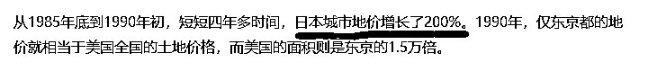
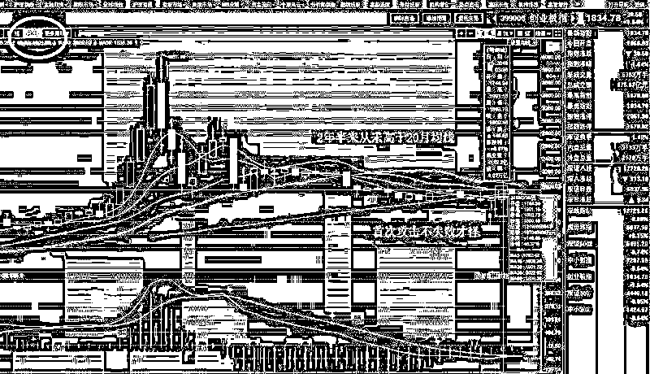
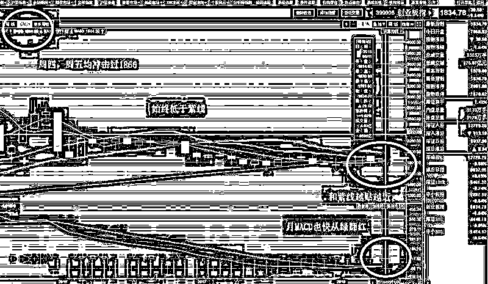
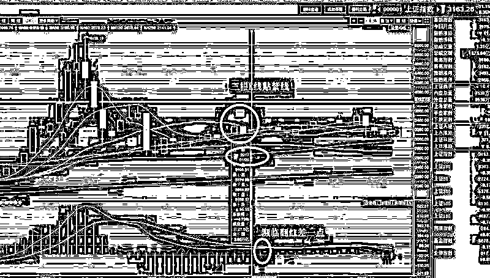

# 今天说一个测房价涨跌的独门秘方

紫竹张先生

经济-金融-投资，点击右边按钮关注我

今天给大家说一个独门秘方，用来测房价绝对有效，而且是紫竹独家所有。我记得我首次写房价是在 2016 年 10 月份，当时写了一篇《中国的房价什么时候会崩盘？》，直接爆款了，阅读量从 2 万飙升到了 40 万，非常的火爆，甚至抄袭我的人都有 10 万+。

后来在 17 年，我陆续应该写了 3 篇还是 4 篇关于房价的，从不同角度出发，几乎也是篇篇 10W+阅读，只要一谈房价，阅读量明显就有个峰值性增长，但是这个阅读量上限明显依次降低，而在 18 年，我应该写了 2 篇，没有一篇突破到 10 万+，而此时我每天的基础阅读，已经从 2 万增长到了六七万，这个差别就太大了。

我可以向大家保证，每一篇我都是用心写的，而且论干货，后面的并不比前面的差，但是非常明显的是其阅读增量倍数是不一样的，我反复对比过，文章内容质量差别并不大。那么问题就来了，为什么 2016 年 10 月份随手一写就是 20 倍的阅读，17 年也有个三四倍，到了 18 年，也就 1 倍多一点。

我个人的分析就是中国人的焦虑问题，16 年 10 月份，北京房价已经翻倍，各地房价都是紧盯北上广的，人们的焦虑情况非常严重，这个时候一篇剖析房价的好文章出来，立马就会被到处传播。但是到了 17 年，明显热度就开始下降，等 18 年的时候，只能说是略微有热度。

而这种热度，对应北上深，甚至整个中国的房价热度，都是非常匹配的数据，也就是说，我可以通过阅读量的数据，来反推房价房价上涨的概率和能量。

现在的地产话题，据我所观察到的数据，依然是所有话题之首，但是其碾压程度明显没有 16 年高了，按照目前的趋势，可能半年之后就和普通话题给拉平了。

鉴于此，我可以大胆的预测，三四线城市的房价上涨动能差不多了，关心房价的人基本都已经淡定下来了。我在 16 年 10 月份通过对一线城市的基本面分析认为北京房价翻倍已经足够多，而且出手调控的时候涉及到了提升利率，所以必然能压制一线城市的房价。日本东京最狂热的时候，一波也就涨 2 倍，也就是从基准 100 涨到 300 的样子，北京一波翻倍，就是从基准 100 涨到了 200，而且仅仅只花费 1 年！从 15 年底到 16 年底，也就是说，只要在 2016 年底到 2020 年初这三年时间里，北京房价再涨个 50%，其泡沫程度就堪比日本最巅峰的时候涨幅了，如果政府在 16 年底没有进行调控插手，实现这个涨幅一点都不困难，后果不言而喻，会嘭的一声炸掉。

而今天，我通过阅读量数据的变化，来推断中国人对房价恐慌的情绪已经随着 1 年多来的持续调控压制而大幅度缓解，加上二三四线城市也跟随了不少涨幅，那么基本上也差不多到了 16 年 10 月份北京的状态了，就是涨不动了，休息个几年冷静一下才能继续涨。

当然，那种因为政府不合理的限价导致的一二手房价格差距高到 20~40%，买到直接赚到引发的抢购现象，并不能计算在房价之内，其周边区域的二手房房价，才是真正反映市场供需情况的价格。

这个就是我研究出来的独门数据，虽然没有国家统计局的基础资料，但是其效果我觉得也相差无几。

对于大盘来说，本周是一场重大战役，也许对大多数人来说，本周就是周一中阳，横盘 3 天，周五小阴，周总体涨了一点而已，但是实际上，在本月，创业板在本周进行了一场月线级别的争夺战。

大家都知道，3 月底，创业板暴涨，首次攻击 1900 点的时候，我曾说过，收盘价不可能高于 1900 点，上攻必然失败，所以一路越涨越卖，差不多把仓位都卖空了。其重要原因之一，就是在月 K 级别的均线里，2 年半多创业板一直处于熊市回调区域，始终低于 20 月均线，3 月底是首次挑战，能冲击成功才是怪事。当时的价格是 1901，我取了个整定为 1900，结果 3 月 31 日收盘刚好 1900 整，早知道不去掉那个零头了。

但是效果是一样的，4 月狂跌，冲击均线失败，而在经历 4 月整整一个月的回调后。本周，创业板再次冲击 20 月均线 1866，在周四和周五，均进行了冲击。

为什么昨天一根小阳线我就比较兴奋，因为昨天在盘中进行了 2 次冲击，开盘冲击了一次引发回落，尾盘拉起来再冲击了一次，这表明做多资金的意愿比较强烈，如果 5 月的月线收盘于 1866 之上，那很明显创业板的月线趋势就明显转暖了。

那么大家看一看，这种 3 根 K 线贴紫线的走势，是不是非常类似于 2017 年 2 月份之前的上证指数走势，然后在 17 年，掀起了上证指数的白马潮，而同时 17 年的创业板就是一路下跌，没完没了，亏钱效应明显。同比类似，大资金非常有可能，在创业板也出现这种突破酝酿走势的时候，玩一波 17 年的手法，不过标的选择为创业板。

所以，本周五，创业板有了一根阴线回调，完全不必恐慌，只要还黏在 20 月均线附近，突击失败的回落是很正常的。我在 3 月底的时候说突破必然失败，1900 站不上去，那是因为他首次攻击，不失败才怪。但是如今是 5 月，在经过 4 月的回调蓄势之后，连续攻击重要均线，回落都很浅，这就非常强势了。我在周三晚上的文章中说能够容忍指数跌回到 1800，都不会动摇我 5 月做多的决心，这个回调幅度就是给予 20 月均线的，没想到周四一口气攻上去了，简直就是脸贴脸，压力 1866，收盘 1865，所以非常兴奋。

5 月不会出现 3 月底之后的那波下跌，如今已经跌不动了，所以这一波突破，成功率是非常大的，我再 4 月底的时候号召越跌越买，看多 5 月，重仓过节，如今我选择重仓冲关，因为我觉得这个关隘拦不住了。

那么突破这个均线之后能否一马平川狂飙不止呢，当然不会，请参考上图的上证指数，突破之后连续 1 年都稳稳的立在 20 月均线之上，但是走势非常平缓，中间还有数次回踩 20 月均线，只是稳定的在涨，但是有涨有跌，同时比较慢，创业板当然不会例外，我估计也是这么涨。

所以，这就是我制定的分批卖出计划的原因，准备在 1900~2000 区域，再次卖空持仓的原因所在，因为我知道，在未来的几个月里，还有多次的回踩机会。

所以我的总体策略是，4 月看跌，越跌越买，5 月看涨，越涨越卖。6 月的策略还没定，到时候再说。

<link rel="stylesheet" href="view/css/APlayer.min.css"> 