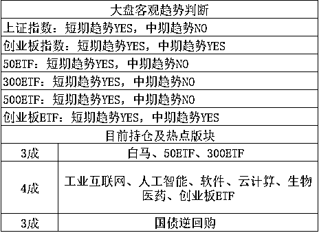

# 我今天遇到了一款很坑爹的保险产品

紫竹张先生

经济-金融-投资，点击右边按钮关注我

 

今天我去银行办事，也许是看到我们带着孩子吧，银行里就有人向我们拼命的推销一款针对宝宝的保险产品，我粗略的看了一眼产品，特别坑爹，于是就礼貌的回绝了，不过宣传单我带回来了，带回来的目的是给大家都看看，免得以后自己被坑。

这个图片有点模糊，我下面放大给大家看。先简单描述这个产品，这个产品针对幼儿推出，年龄越大，年收费越贵，最便宜的就是 1 岁以下的幼儿，每年收费 3450 元，连交 20 年就可以完成合同，对孩子进行终身保障，一辈子中，列出 150 种重疾，只要碰上其中一种，就给予赔付，如果一辈子都没事，那么在 79 岁的时候还可以领取祝寿金，把你 20 年交的 6.9 万元退给你。

这个事情本来是挺好的，关键这里的赔偿金额太坑爹了，这里所列的病，所谓的 50 种轻症，摊到普通人头上，都是天塌下来的大病。而后面列的 100 种大病，那可是真正的大病，要么是罕见的重疾让你终身缠绵病榻，要么就是九死一生的大劫，这里面的病摊上一个，人生基本就完了。

但是这些病都有一个特性，非常稀有，都不是常见病，这里的病染上一个，就是你整个家族都去医院反复探望才能略表安稳的那种重大家族新闻，你可以回顾一下你身边的亲戚，或者你朋友的亲戚圈，有几个人能碰上如此罕见的病症，其概率非常低。

但是你说了，我保的就是这种稀有但是性质恶劣的大病啊，这才是保险的意义。这话倒是没错，但是这里我们要看看假设你非常不幸的染上这里面病其中之一，你会得到多少赔付。

看到没，这里列出了 8 种你会得到赔偿金的情况，无论哪一种，你能得到的极限赔偿金，18 岁以前 2 倍赔偿金，18 岁~60 岁，最多 30 万，60 岁以后，最多 45 万，然后合同就会强行终止。

换句话说，在 18 岁之前，投保者得这种病的概率超过 50%，保险公司才会亏，而这里面病，相当多的都是中老年病，幼儿能得的本来就不多，其综合得病概率，我怎么看，都应该低于 20%，甚至更低，因为我身边上百个亲戚，没有一个听说过染上里面的这种病症的。这里面的病都是特别稀罕的病，染上一个绝对家喻户晓，不可能不知道。

而 18~60 岁这一档就更坑爹了，30 万，这是几十年后的 30 万了，我想知道 30 年后的 30 万能干啥，还能看个感冒吗？1980 年，北京的人均年收入大概是 100 元，今天是 12 万元。今天的保单承诺赔 30 万，相当于 1980 年承诺赔偿 300 元，等到 2010 年你病发了，得了重疾，拿这 300 元，你觉得你能干吗，够一天的医疗费不。

至于 60 岁以上那一档就不谈了，60 年之后，那 45 万估计只够吃一顿早餐了，至于治病就别谈了。

至于 78 岁返还 6 万元的祝寿金，忽略不计忽略不计。。。78 年后差不多都快 2100 年了，这家公司还在不在那都不好说呢，就算还在，6 万元能买包餐巾纸就不错不错的了。

所以说，这个保险并不能够真正保你重疾无忧，基本上最坏情况发生了，也只打算赔你 30 万左右，而且那些花里胡哨承诺几十年后的等等都是没用的，而他也不能在你病发后让你能安心治病。如果单纯从经济效益上讲，100 亿保险金交上去，最终拿出来赔偿的金额，有可能 10 亿都不到，主要这里面拖的时间实在是太长，几十年后，经过通胀率的冲刷，看起来你是赚了，实际上你是亏了，更何况这款产品打着幼儿的旗号，硬生生把时间拖到了几十年之后，本来赔付率就低，再加上通胀，实在坑爹。

那么是不是所有的保险都不能买呢，不是的，有些保险是真的有用。我可以告诉大家什么样的保险适合购买。首先我们要知道保险的本意是什么，保险的本意是保障你的家庭不被天降横祸给击垮，给你一个复活的希望。

那么你家庭最脆弱的节点在哪里，是你家的孩子吗？肯定不是，如果你家的孩子得了重病需要钱来治疗，大人赚钱给他治就是了，除非这个病实在花费太高，但是像保险这种付出去 10 块按平均概率只能拿回 3 块治病钱的情况来说，给幼儿投重疾险是一个血亏不赚的事情。

那么谁是最脆弱的节点，是你家的经济支柱，我举个例子，一家三口，男方年入 50 万，女方年入 10 万，养育有一个宝宝，这是一个传统意义上的幸福之家。那么谁倒下了会对这个家造成毁灭性打击，很明显是年入 50 万的男方，这个家会瞬间陷入窘境。

那么在这种情况下，应该对谁进行保险，很明显是这个男方，那么应该在哪些险种进行保险，很明显是那些能让这个男方丧失经济收入的大事上。如重疾、死亡等。大家想靠保险发财是不可能的，想占保险公司便宜也是不可能的，保险公司的精算师是什么水准，大家又是什么水准，自己心里没点数吗？

所以，保险应该买给家里的经济支柱，险种应该买重疾、死亡等能让经济支柱坍塌的事件上，而且不买捆绑险种，只买单纯的险，一些貌似很好的险种，都是保险公司耍的小把戏，其实对你而言意义不大。而针对幼儿的一切保险，都是坑爹，讲真，最大的保险就是你生个二胎。。。每年花的养育钱，你就当交保险费了，你觉得养男孩子是建设银行花钱，那你生个招商银行嘛。

~~~

今天 AB 的 WXH 宣判了，判刑 18 年，罚款 105 亿，AB 帝国掌门人落幕，一辈子的辉煌就此归零，这事比较敏感大家都知道，我也就一笔带过，免得不知道啥时候碰黄线了，而且这事要么说的很深，触及政治，要么就泛泛而谈没啥意思，我今天就不说了。 

~~~

美股的苹果股价再创新高，前一段时间苹果股价连续下跌大家都知道吧，说苹果不行了，利润下降，市场占有率下降，创新能力不足，苹果 X 卖不出去等等，说啥的都有。

苹果 CEO 一怒，2017 年的盈利，只拿出几十亿分红，其余 1000 亿美金，全部回购流通股来表达管理层对股价的信心，于是苹果股价是这么走的。

一路向上不回头，直接突破新高，而且还在涨，平均日交易量在 50~70 亿美金左右，也就是说管理层每天拿出 10~20 亿美金去单边买入，就足够打破多空平衡引发剧烈上涨。按照 1000 亿美金的预算来看，管理层能连买 100 个交易日，也就是半年。。。。

实在太恐怖了，羡慕美国的小散，希望中石油啥时候拿利润拿出来回购下股份呗。

~~~

今天三大指数收小阳线，再度获得睡后收入，我曾说过，进入 5 月之后，下跌趋势终结，改为上涨趋势，阳多阴少，阳肥阴瘦，此观点半个月前我就提出，一直不改，这也就是我 5 月如此淡定持股的原因，最近几天，天天都有睡后收入，躺着赚钱。

而且今天这根小阳线，具备的意义很大，今天是周四，周四是很容易产生黑周四现象的，也就是容易诱发下跌，概率较大，但是今天却收出小阳线，使得整体图形，再进一步。

在前几天的中阳突破后，创业板一度休息了二天，处于明显的横盘状态。今天盘中曾经一度下跌，接触 5 日均线，然后引发了剧烈反弹，直接刷新了前二天的新高，这就让图形变的非常的舒服好看，趋势更加明显的向多头靠拢。

而今天的收盘价，上证 3174，创业 1865，离我制定的第一步高抛位上证 3200.创业 1886 附近咫尺之遥，只差 1%左右，说跳一下就到了，可以说第一步高抛实现的概率接近 95%以上。

创业板其实 1900 才有压力，但是下方 1886 附近有个缺口，尊重一下缺口，补了我们就出一点货，而且离我指定的 4 月理论回调极限 1786 已经有百点涨幅之多，在熊市里尤为难得，差不多 6%了，所以这个位置，我愿意出一点货，就算后面一口气涨到 2000 甚至更多，我觉得都是值得的，更别提，突破 2000 的概率实在是太少了。。。

至于上证，我没有精确的去测点位，我对这货比较失望，粗略的大致一个 3200/3250/3300 分批出货就差不多了，懒得去详细管他。。。

大概就这么多，虽然接近了第一步高抛点位，我们也随时会进行第一次高抛，但是整个 5 月，上涨是主基调，高抛的原因是涨幅太大，开始逐步收肉了，并非看空后市行情，我可不是那种非要底部一口气买满仓，顶部一口气卖空仓，觉得自己是神的蠢人。我看到 2000 点，1900 附近就开始逐步减仓了，我炒股的核心是按照概率做事，有多大的概率向上涨，我就留多大的仓位，很明显涨的越高，继续上涨的概率越低，那么我就随着上涨概率的降低而逐步降低我的仓位，等价格下跌，跌的越深，上涨的概率就越高，我再随着上涨概率的变高而逐步加大自己的仓位。

炒股就这样，很简单，熟悉之后，可以堪称是睡后收入。

今天给大家通知一个粉丝福利，有券商通知我说近期为了短期冲量，决定开启万 1.7 的优惠佣金活动，由于太低不敢公开宣传，所以想降低自己佣金利率的小伙伴可以扫描下方二维码加开户助理 zisedegu33。

**时间有限，机会难得，先来先得。**

<link rel="stylesheet" href="view/css/APlayer.min.css">

