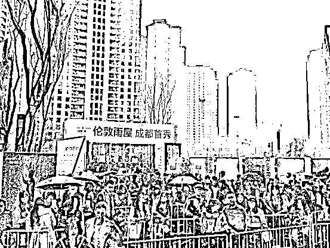
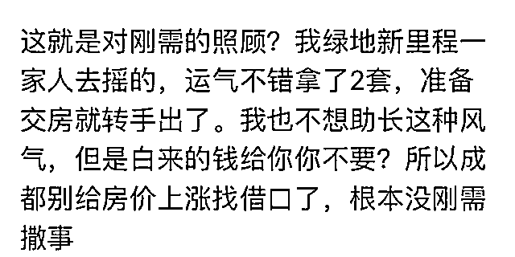

# 成都抢房事件的反思，如何才能实现房住不炒

紫竹张先生

经济-金融-投资，点击右边按钮关注我

房住不炒是中央定下的政策基调，是各地政府的红线所在，其含义简单明了，房子是拿来住的，不是拿来炒的。但是近日的成都抢房事件，对房住不炒的中央政策构成了严重的挑衅，我们今天来分析一下这个事情。

成都的新房摇号中签率低到了个位数，每个楼盘开盘，动辄都是数万人认购，挥舞着钞票冒雨排队，而推出的房源，一般仅仅一二百套。如成都高新区西苑项目，一共 229 套，申请的有 12705 人，中签率只有百分之一点几。

为什么会产生这么热火朝天的抢购，因为这个楼盘带精装均价 14000 元-16000 元/平米，而附近的二手房均价都在 2.7 万到 3 万左右，新房一般都比旧房贵，所以等同于这个楼盘打了 5 折，买到手直接赚一倍，这种直截了当无风险的赚钱机会，当然会引发抢购。当地居民把自家房源挂二手房出售，然后去排队抢购新房，抢新房的都号称是刚需，都符合刚需的一切政策条件，而且这些刚需甚至都愿意全款，但是实际上，他们全都是伪刚需，真正的刚需躲在角落里捏着连首付都不够的钱包瑟瑟发抖呢。

为什么新房的开盘价定的这么低，5 折简直是太离谱了，能 3.2 万以上开盘的，非要 1.6 万以下开盘。每一个给新房限价的城市都会引发排队摇号，但是折价率基本都是 20%左右，这就已经有明显套利空间了，但是没有一个像成都这么离谱的，居然折价 50%，这种超高折价率带来了什么效应呢，就是下面这个帖子所说的效应。

这是赤裸裸的炒房，买房就是为了转手卖了赚钱，就算限售都没有用，因为这些人都是成都本地人，都有老房子，买了新房转手卖老房，规避一切政策和烦恼。。。成都的疯狂程度，恨不能把家族里能动弹的全部拉过来，爷爷奶奶齐上阵去摇号，都是刚需，都缺房！

这种行为明显已经不正常，整个成都已经被扭曲了，为什么政府会设定如此之低的新盘限价，这就要从 2016 年 10 月中央全面调控楼市说起了，那年国庆，中央紧急调控楼市，连下十三道金牌，十一月，16 个城市在国务院领了军令状，房价环比上涨不得超过 2016 年 10 月份这一红线。

这道红线，北上广深都严格遵守了，因为这些一线城市已经翻倍了，但是其余的城市就很难受了，尤其以成都为例，在二线的省会城市里，他是起涨最慢的一个，2016 年 10 月的时候，成都的房价根本就还没开始涨。但是等一线城市严控市场，房价见顶之后，资金开始慢慢外流推升二线城市，于是成都被迫一路限价，二手房则一路上涨，涨到今天，双方的价格差距达到了一倍之多。2016 年 10 月，成都中心区域的最高房价就是 1.6 万一平米，所以今天成都中心区的新房价，一律不得超过 1.6 万，这就是 1.6 万价格尺度的由来。

当年签军令状的 16 个城市，只有四大一线城市无所谓，其余的二线城市，如武汉、南京等，后来的价格相比 2016 年 10 月都有不同程度的上涨，因为资金从一线蔓延到二线需要时间，所以这些城市全部出现了一手房限价的行为，其原因就在于当年签署的军令状，房价不允许超过 2016 年 10 月的红线，二手房控不住，就硬控一手房，至于这个价格是不是荒诞就先不管了，先应付过去再说。

限价带来套利，套利带来抢购，二手房无人问津，一手房挤破脑袋，很明显限价这东西纯属自欺欺人，而这些大胆抢房的人，其核心勇气来源于房价永远不会跌这一个信仰。

中国的楼市已经太狂热了，房价泡沫已经很大，对比曾经房价突破地球极限的日本东京，经历了房地产泡沫破裂的痛苦之后，如今的东京人已经不敢怎么炒房了。我刚搜索了一下东京的房价，大概相当于北京二三环这个位置，一个二三十年房龄，外表略破旧但是里面精装的小独栋，其报价相当于人民币 5~6 万元一平米。而北京同样的地段，老破旧都敢要 8 万元一平米。如果再结合日本超高的人均收入，那么北京的泡沫更加的凸显严重。

在 1989 年，东京的地产泡沫曾经令人目瞪口呆，卖到 6 万人民币一平米，注意那是按照 1989 年的人民币汇率来计算的。1989 年的 6 万元和今天的 6 万元，那是二码事。为什么 30 年之后，曾经狂热炒房的日本人不敢炒房了呢。

那是因为日本人被房地产伤的太深了，被整怕了，一朝被蛇咬十年怕井绳，日本的地产现在非常健康，运行的非常平稳，这几年飙升的房价，也基本都是外国人（中国人）跑过来买给推升起来的。本国人那是彻底的刚需，炒房行为几乎绝迹，就算房价那么便宜，很多年轻人宁愿租房也不愿意买房。

为什么年轻人宁愿租房也不愿意买房，很大的原因就是日本房价常年上涨过于缓慢，手里的钱不管干什么，增值都比买房地产划算，这个时候，很多人就宁愿租房都不愿意买房。这个道理换到中国也一样，只要打破地产永远涨的神话，那么很多刚需立刻就不会买房了，我说的是真正的刚需，马上就要结婚的，不是那种伪刚需，就连这种真刚需，都未必会去买房。

要真正实现房住不炒，什么调控都是没用的，包括压房价最有效，立竿见影的上浮利率行为，都没用。真正最有效的措施就一个，就是中国房价来一场杠杆坍塌式的大跌，一定要跌到一部分人杠杆断裂，一定要跌到一部分人跳楼自杀。

只要跌到这个程度，你会发现，本来满屏幕的刚需立刻就不见了，本来全部惜售的房子马上源源不断像洪水一样涌出来了，你会发现北上广突然像变魔术一样变了好多套房子在出售砸盘。这里有一个非常明显的例子，2015 年股市杠杆断裂，崩塌式下跌，很多人爆仓，血本无归，还有人跳楼自杀。而在股灾之前，股市里的股票供不应求，人人抢购，杠杆 1 倍会被人耻笑的，发财是都是 3 倍 5 倍杠杆，敢 10 倍杠杆买股票的才够竖一下大拇指，卖盘被打的稀里哗啦，敢卖就有人买，谁卖谁 SB，直接给你买涨停，越高越买，大家都抢购的才说明这个票是好股票嘛。

但是杠杆断裂之后，千股跌停，没人抢购了，买盘一夜消失，原本都捂着不卖的股票一夜之前全涌出来了，什么价值投资，什么科技发展，都一边去，赶紧卖掉才是王道。这一波大清洗之后，股市杯弓蛇影，再也没人敢疯狂做多了，买股票之前都想一想，这个股票是不是真的有价值，是不是真的好票，是不是我真的需要去买他，所以，今天的中国股市，和当年的日本楼市一样，像个死鱼一样趴在了地上。

到了房地产，道理是一样的，中国地产要实现房住不炒，急需对“刚需族”进行一波大清洗，只有崩跌一次的市场，才能把伪刚需给甄别出来，才能让本来可买可不买的人，不至于被迫去买房。

但是当前的政府，不敢这么做，要去杠杆，弄崩房地产很简单，但是弄崩之后还能不能控得住就是个很大的问题了，国家队连救股市都麻烦，体量大于股市一个数量级的楼市，一旦硬着陆崩溃了，那根本不是政府能救的。

所以政府的唯一办法，就只有拖，用限价令这种掩耳盗铃的办法去拖，这种办法看起来可笑，但是地方政府也是没办法，已经给中央下了军令状了，中央政府也是没办法，北京已经翻一倍了，不能再涨了，再涨就真崩盘了，至于卸杠杆清洗伪刚需，那是万万不敢的，国之重器，万一玩坏了，谁负的起这个责任。

当前政府走的是另外一条路，就是拖时间，弄个三五年不涨，很多投机客就会被利息给拖垮，这些投机客的杠杆高的可怕，远不是 3 倍能限制住他们的。这种拖的办法对投机客是绝杀，2014 年的时候很多囤房一族就扛不住了，被迫逐渐出货卖房来回笼现金流，因为利息实在付不起了。但是对于伪刚需则效果不大，伪刚需是在投机和刚需的身份里来回切换的。还有一些是真正的刚需，但是这些刚需如果不是涨个不停的房价，他们原本是不打算买房的，日本、欧洲、美国就有一半以上的人是一辈子租房的，宁可租房也不买房，因为买房不划算，他们才是真正的房住不炒。

中国要实现自己的房住不炒，地产价格是绝对不能只有上涨和横盘二条路的，必须有惊心动魄的下杀，楼市必须有风险，大家炒楼的时候才会谨慎，不然谁考虑风险啊，借够钱就买，跌了就去政府大楼闹事，多简单。

当然，有剧烈下跌的楼市，其控制难度会急剧增高，但是这样的楼市才是健康的楼市，如今这种上涨+横盘的楼市看似可控，但是等增长到某一个临界点的时候，会把所有风险一口气给释放出来，那个时候的后果会非常严重。

期待一次下杀，全国楼市都安静了，成都这种闹剧也不会再看到了，全国会真正的房住不炒，不过按照中国的现状，政府是不敢这么玩的，我估计是看不到了，未来的三五年，只能按照横盘考虑，所以房住不炒也只能是个口号。

只要楼市无风险，大家入市就一定不会谨慎。 

<link rel="stylesheet" href="view/css/APlayer.min.css">

长按上方二维码关注我