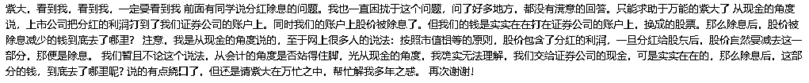
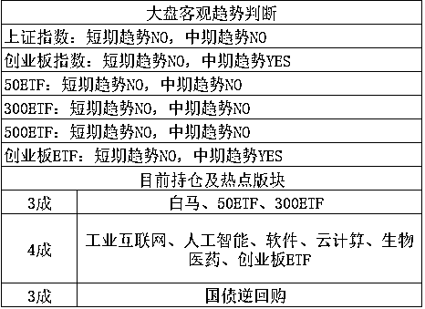

# 分红知识科普扫盲

前几天有人问我一个问题，是关于分红问题的，说问了好多地方都没有满意的答案，想让我说说。他的意思是，上市公司是把分红的利润打到了证券公司的账户上，然后证券公司打到我们账户上，但是同时账户上的股价被除息了，所以我们并没有拿到好处。但是当初我们的钱是实实在在的打给证券公司的，那么从现金的角度，这部分钱到底去哪了？

我先说一下流程，假设某公司说每股分红 1 元钱，你持有 1 万股，那么上市公司会把 1 万元打给证券公司，证券公司会打给你。但是与此同时，你的持仓股价会每股下调 1 元，导致你总市值还是不变，这让很多人非常的困惑，钱到底哪去了，如果摊上要交红利税的时候，你会发现分红还不如不分红，让很多散户感觉到很亏。

其实并不是这样的，首先，上市公司的盈利分红，这笔钱是结结实实从上市公司划出来了，这笔钱也结结实实的打到你的账户了，这 1 万元现金你可以立刻提走，这就是你的分红。然后我说说为什么要出息，把股价下调 1 元，因为如果不这么做的话，会引发相当多的人在股东登记日大举买进股票，一拿到分红就卖出股票，引发股市的剧烈波动。而至于股价是高是低，其实根本无所谓，按照现行会计制度，公司的所有权是按照股数来定义的，假设该公司总股本为 1 亿股，你持有 1 万股，那么你就持有万分之一的该公司，至于股价是 1 块还是 1 万块，你都是持有万分之一的公司，只要公司价值不变，你的权益就不变。所以，除息减掉那 1 元钱，只不过是为了防止股价剧烈波动而已，一般来说只要公司价值不变，后面都会涨会来了，称之为填权。

很多人对填权不敏感，呵呵一笑，你逗我呢，反正我只看到分红我没拿到什么好处，我等了一星期都没填权，没怎么涨啊。之所以你这么认为，是因为 A 股分红的公司太少，大家没感觉，其次分红的股息太低，很多时候年化都是 1~2%，也就是假设公司基本面不改变的情况下，你等一年填权，也就填 2%，你当然感觉不出来了。

这个时候，我们可以举个极端的例子，假设你持有某股票，股价 100 元每股，你持有 100 股，花费 1 万元买入。第二天上市公司宣布，我们每股分红 99 元，于是 9900 现金直接入你账户了，你高兴啊，花 1 万块买的东西，才几天就拿回了 9900，这比卖军火还暴利啊。这个时候股价显示还是 100 块，但是今年的分红已经结束了，不可能再分红了，你心里想的会是什么？直接摁着跌停卖啊，能卖多少是多少，卖的都是赚的，等明年快分红的时候我再买回来，于是股价连吃 N 个跌停，跌到了 1 块钱每股，这个时候大家才是平等的。

这种涨跌走势明显不符合该股的基本面走势规律，于是证监会规定，你拿走这 99 元分红的同时，你持股的股价直接变为 1 元/股，这样你就没有卖出的动力了。那么你是不是亏了呢，假设这家公司未来一年基本面不好不坏，也就是我们都预期这家公司明年还会分红 99 元，你说这家公司的股价会是 1 元吗？不会，他会在明年分红日之前，再度涨回到 100 元，这个时候你就真正的赚到了 9900 元利润，这个回涨的过程，就叫做填权。要在一年之内涨 100 倍，这个股会是天天涨停，这个填权你看起来就明显了。

虽然数值举的非常极端，但是原理是一样的，分红是 A 股上市公司的反哺股东的少数渠道之一，**只有分红存在，A 股才不是赌场**，才是一个真真正正的投资市场，所以我们应该大力支持上市公司分红，同时也要普及分红的常识，分红就是分红，现金是真真切切打到你的账户的，这笔资金没有凭空蒸发，也没人贪污，想清楚道理就好。

* * *

说到上市公司反哺股东，我前一段时间举了国外的例子，A 股还处在分红阶段，而且分红还是很稀罕的，美股已经全面进入了盈利回购股份的时代，回购股份已经是全面普及，不分红不回购的公司直接被卖到退市，这才是健康的市场。比如前一段时间，美国人质疑苹果公司的业绩增速放缓，认为苹果的股价应该下调。苹果公司的管理层为了维护自家公司的股价，显示自己的信心，今天宣布了盈利的分配预案，决定从盈利里拿出 1000 亿美金用于回购并注销自家的苹果股票，并且上调 16%的股息，在回购股票的同时，分红 130 亿美金。

看完这个新闻我在想，这也就是美国了，宣布这种新闻苹果才涨一点点，**要是中石油宣布这样的新闻，明天我就挂涨停板抢**，预估 10 个涨停一字板起步走。

* * *

**今天还要说一个地雷，明天复牌的天业股份**，88 亿市值，说是 52 亿资产去向不明，简直就是第二个保千里，直接把上市公司掏空的只剩一个壳了，听说中小股东到处维权。

对于这种事情，维权肯定是要维权的，不过不要做太大指望，希望很小。如果你恰好倒霉有这个股，我给你的减少损失的第一建议是连夜挂跌停，然后准备半个月以上的天天挂跌停，如果运气好还能跑出来，算你幸运，就是减少损失了，然后你再慢慢的去搞维权的事情，真正维权成功拿到钱的希望渺茫到微乎其微，虽然事实很残酷，但是我陈述的是事实，碰到这种事，先挂跌停跑路才是上策，虽然挂跌停你也很难出去，但是出去的概率，是绝对比维权拿到钱的概率要大上很多倍的。

~~

我上周五刚说过，每天要杀一匹白马，今天这事轮到东阿阿胶了，开盘直接闪崩跌停。。又是因为业绩不符合预期，换句话说这种业绩不配他的涨幅，涨太多了。未来一段时间，全面回避各种白马股，如果非要买，建议买已经披露业绩的，至少这个雷已经爆过了。

今天开盘之后，直线冲高，涨幅喜人，创业板涨了 1.5%，然后诡异的下杀，到了中午的时候知道原因了，刘鹤邀请美国谈判代表团 5 月 3~4 号来中国进行谈判，也就是明天或者后天，中国没谈出什么成果，把美国代表团拉到中国来灌点茅台就能谈出好成果了？我觉得不太可能，估计市场资金也是担心再碰到几个黑天鹅，于是暂时就不敢拉了。

从新闻看到这个消息的时候，已经中午啦，那个时候指数都翻绿了，我琢磨了一下，也就是个美方代表团来华谈判，开启谈判只是增大了黑天鹅的概率而已，并不是什么黑天鹅。何况，4 月的时候那么多真正的黑天鹅都没砸死，就是再吃一二个小黑天鹅又怎么样，于是我就很淡定的不动。

不动的结果，就是下午再度下杀之后，尾盘给拉起来了，于是局面又回到了假期之前那种跌下去有人拉，涨上去有人砸的胶着局面。对于这个局面，只需要一根中阳线就能破局，虽然今天被打下来了，但是我觉得只要熬到美国代表团走人，应该就没事了。

**我个人对这种震荡走势，并不担心，**因为整个 3 月和 4 月的下跌已经说明了一件事，最危险的时候已经过去了，下跌这东西只会越跌越慢，不存在越跌越快这种事，这是违反股市定律的。

那么在那么长时间的回调之后，至少我们可以排除了大暴跌的担心，那么只要没有大暴跌，就可以耐心持股，整个 18 年是练技术的，所以心态也不那么着急，每一波都安稳的吃点碎肉，以稳定小额盈利为主，千万不能慌，这么窄幅的震荡，只有波段操作才有戏。

感觉还有好多想说的，但是时间到了，今晚多翻几个留言上墙吧。

长按上方二维码关注我