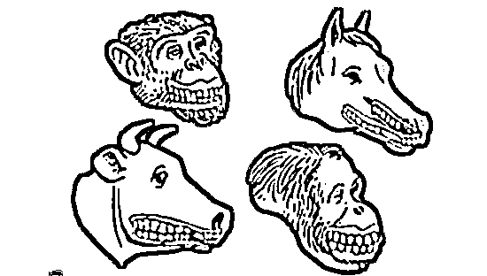
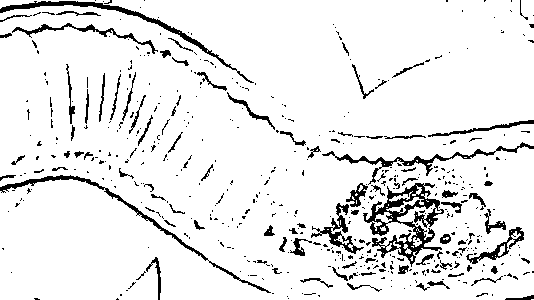
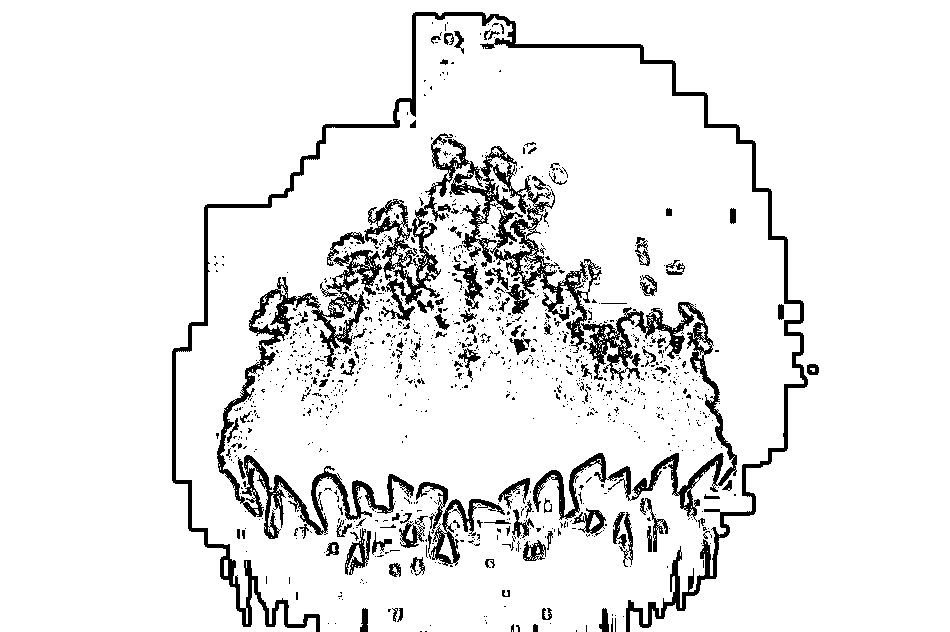
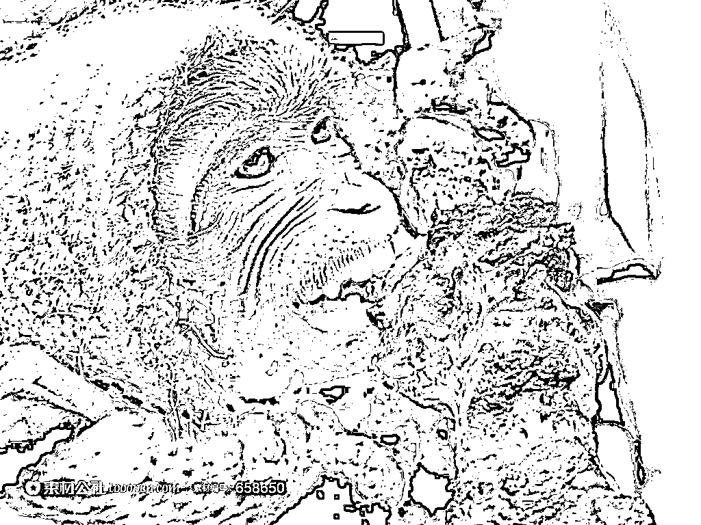
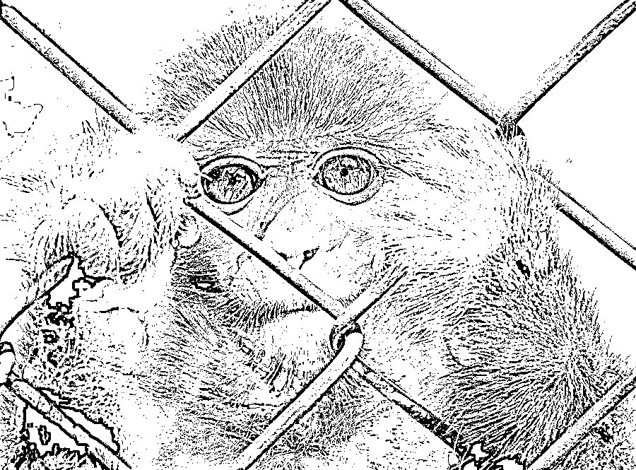

# 吃烤肉是人类文明进化的源动力

紫竹张先生

经济-金融-投资，点击右边按钮关注我

现在的健康专家呀，越来越不像话了，居然反对人类吃肉，甚至说吃烤肉对人类是有害的。过量吃烤肉当然是有害的，那是因为你吃太多，适当吃烤肉是有益且必须的。烤肉在人类文明进化史上具有伟大功绩，难道他们不知道，如果没有烤肉，人类文明不可能进化到如今这个程度嘛，人类是必须适当吃烤肉的，这也是为什么你吃烤肉的时候感觉那么好吃的原因，这是基因决定的。

首先，人类是从猿猴进化来的，整体基因和身体结构基本都是为了素食准备的，这也是素食健康论的主要证明材料，但是人类的进化过程出现了一点小小的意外，那就是烤肉，今天我就先从素食基因的角度进行一步步的推翻证明。

01

首先从食物抵达的第一站开始说，牙齿。人类的牙齿是典型的素食者牙齿，人类的犬齿非常的薄弱，就靠人类这幅牙口，也就只能吃水果了，假设现在给你一只兔子或者牛羊，首先没有现代工具的话你就很难打死他，就算我帮你打死之后，你能直接生吃吗？估计咬破皮都困难，不信你咬一口牛皮给我看看，人类和虎狼之类典型的肉食者发达的犬齿出现鲜明的差距。

看看老虎这牙口，一口破皮，二口碎肉，犀利异常，再看看人类的牙口，和吃草的牛马差不了多少。

其次看食物抵达的第二站，胃部。人类的胃液酸度明显是为果蔬类准备的，典型肉食类动物如虎狼等胃液酸度都是人类的十倍以上，只有达到那么高的酸液浓度，才能有效杀灭生肉中含有的各种寄生虫和细菌。

人类吃肉，就算费劲千辛万苦把生肉直接撕开咽下去了，到了胃部，你直接就染上了猪肉绦虫，而老虎该吃吃该喝喝，猪肉绦虫到了老虎的胃里，直接给融成渣，别说感染老虎了，尸骨都找不到了。

最后看看食物抵达的第三站，肠道。人类的肠道又是天然的果蔬类肠道，其肠道的长度远远短于草食类牛羊的肠道长度，但是又远远长于肉食类的肠道长度。为什么牛羊需要那么长的肠道长度，因为草类太难消化了，单靠胃部消化不了，所以他们的胃部就是个糅合道场而已，主要靠肠道内的有益细菌帮忙分解植物纤维，所以需要很长的肠道。而对于虎狼之类的肉食动物而言，肉类是极易消化的，胃部就能把肉基本分解完毕，肠道直接吸收就好，不用你再度分解了，肠道的任务就把食物残渣尽可能快的排出体外，因为肉类残渣是有毒的。对于人类而言，如果擅自食用生肉，肠道的长度过长排不出去，熬过胃液而不死的细菌，极有可能在肠道大量繁殖导致致命性的疾病。

02

素食主义者和营养专家说了，对啊，就是这样的啊，人类天生就不应该吃肉，就是应该吃果蔬，这才是祖传的，基因决定了我们必须吃素。这里就要谈到人类和猴子的区别了，为什么人类最终从猴子进化成了人类，而猴子过了几亿年依然是猴子，就是因为猴子只吃果蔬，而人类吃上了肉。

演化至今，人类已经成了必须吃肉的种族了，如果长期不吃肉，人类会患上奇怪的疾病，虚弱无力，发育不全等。有个成语可以显著的说明这一点，叫面有菜色，长期吃素的人，就会面有菜色，明显和正常人红润的面色不一样，如果是从小就荤腥不沾，那极有可能影响发育，引起发育不良。

人类一个典型的素食基因种族，为什么会产生面有菜色这种奇葩的成语，你见过有人用面有菜色来形容猴子和牛羊吗，这就要从火种说起了。

03

为什么说火种是人类文明的源泉，奥运使用的是圣火而不是圣水，这是非常有道理的，人类第一次接触烤肉，一定是来自于雷电引发的森林大火。大火之后，个别猿猴（未来的人类）在里面发现了烧焦的动物尸体，这份被火烤熟的尸体完美的解决了上面几个问题。

首先，动物已经被烧死了，猿猴不用冒着受伤感染的风险去打死牛羊了。然后，皮毛等防御层已经被烧熟了，一撕就开，而不是用力都咬不开的尴尬局面了。最后，火焰彻底灭杀了肉类里面的细菌和寄生虫，同时让蛋白质得到了初步分解，让人类的胃液也能完成消化工作。

就这样，有个猿猴吃到了人类历史上的第一份烤肉，这是他的一小口，但是却是人类的一大口。从这一口烤肉开始，人类文明进化迈出了极为关键的一步，那就是开始吃烤肉！

一旦人类掌握了吃肉的方法，让自己的身体能消化吸收肉类，吃肉的人类和吃素的人类身体差距就明显的开始出现分化。吃肉的人类明显更强壮，大脑发育更健全。这些武力强大且更加聪明的猿猴很明显的成为了统治者，也就是君主，咳，不对，是猴王。这些猴王具备了更多的交配权，他们的后代也都继承了他们的基因，越来越有利于消化烤肉。

进化至今，人类已经从纯素食基因，进化成了一种奇葩的基因混合体，那就是人类体内有几种氨基酸是无法自身合成的，必须从肉类中取得，缺少这几种氨基酸，会严重干扰人体发育，导致肌肉发育不良，甚至能影响大脑智力的发育，简称面有菜色。而同样的氨基酸，人类的亲戚猴子和猩猩，都能通过食用果蔬进行自身合成，不需要吃肉。

很明显，这是人类进化时的一种缺陷，人类的体格、爪、牙、消化系统都明显不是为了捕猎动物准备的，而人类的基因居然不吃肉会缺乏必须氨基酸，这明显是不对的。产生这种基因误差的原因，应该是远古的某只猿猴种群由于基因突变，特别擅长吃烤肉，他们进化的非常聪明强壮。但是基因突变的同时，也产生了基因缺陷，这个基因缺陷导致的氨基酸缺乏无法自身合成，原本是致死性质的，至少也是个虚弱无比应该被淘汰的个体，由于这个种群特别擅长吃烤肉，最后保留下来了。

看，不吃烤肉，你就会被自然进化给淘汰掉！

04

现在强大的种群诞生了，这个种群会用火烤肉，但是基因缺陷导致他们必须每隔一段时间就要吃肉来补充氨基酸。这下麻烦了，森林大火不可能年年都有，想等大火之后去火场里捡尸体这种事只能靠碰运气，但是肉不能不吃，要是一年不沾荤腥，这个本来强壮无比的种群就反过来还不如普通吃素的隔壁部落，下场只能是被灭族，男猴子被杀光，女猴子被抢走传承别人吃素的基因。

自身的基因缺陷迫使这个种族必须不停的吃烤肉，为了找到烤肉的原料，他们被迫从果树上爬下来对动物进行捕猎来获取烤肉的基本原料，也就是生肉，**如果猎取不到生肉，他们的下场就是灭族**。

于是，这个种族首先采集树枝来维系火种，自家的火是绝对不能灭的，不然猎取了生肉还有啥用，谁生吃谁死啊。在用树枝烧火的时候，有人发现部分树木的枝干，如果用火进行适当的烤一下来减少里面的水分，能烤的非常坚硬，顶部削尖后制成的木矛，能够穿透动物皮毛，对动物有效造成杀伤力。于是这群人就拿着木矛对小动物进行捕猎，拥有木矛为武器的人类，和兔子山羊干架还是一杀一个准的，碰到了老虎狮子，也能自保，不被杀的太惨。

木矛的攻击力实在是有点弱，最多也就欺负兔子山羊，一头野猪都能干掉原始人派出的木矛精英小队，木矛连穿透野猪的毛皮防御都非常困难，野猪顶人倒是一击必杀，没几个人扛得住野猪的一次冲撞。后来人类尝试把石头给磨成武器的形状，石头哪有那么好磨的，磨出来的不规律的形状威力也不大，所以石斧武器诞生后给人类的提升并不大。

为了吃烤肉，人类再度向烤肉的源头，也就是火焰进行求教，有人发现，某些石头在火焰的炙烤下会软化，等停止灼烧的时候又会再度硬化。这下不得了啊，必须给诺贝尔奖啊！

石头要是被烧软了，那就好办了，你硬的时候我拿你没办法，软的时候还不好修理你吗，想捏成什么形状就捏成什么形状。于是，人类用这种软化的石头，制成了非常锋利的石制武器，其锋利程度是普通石头怎么都不可能磨出来的。

为了把这种武器和普通石制武器进行区分，人类把这种能被烧软的石头所打造的武器，称之为青铜器。有了青铜器加持的人类，成为了真正的地球主宰，青铜剑在手的人类，能轻易对老虎狮子这种顶级食物链主宰造成致命的伤害。从此人类进阶为地球主宰，至于山羊这种货色，也犯不着用木矛慢慢扎了，一剑毙命。

没有不得不去吃烤肉的基因缺陷，人类就不会那么着急的去猎杀动物，吃点香蕉桃子不也生活的挺好的嘛，一样吃得饱。正是因为这种基因缺陷的种群不断的试图去冒险猎杀动物，他们才发明出了木矛、发明出了石斧，最终发明了青铜剑。几千年之后，小气的人类最终把当初那群在树上舒服吃香蕉，看他们笑话的亲戚们给关进了动物园。

所以，人类进化成了现在这个样子，没有肉食者的强壮体魄，没有肉食者锋利的爪子，没有肉食者能轻易撕开皮毛的牙齿，甚至连肉食者用来消化肉类的肠胃系统都没进化出来，但是偏偏必须要吃烤肉。

正是因为吃烤肉的需求，人类才成为了万物之灵，站立在地球之巅。吃烤肉这东西，往小了说是满足你口舌之欲，往大了说是为了人类文明的进化。所以，为了人类文明的飞速进化，为了自己不被关进动物园，我们必须要吃烤肉。

所以，在人类文明的进化史上，没有什么难点是一串烤肉解决不了的，如果有，那就来二串。

长按上方二维码关注我