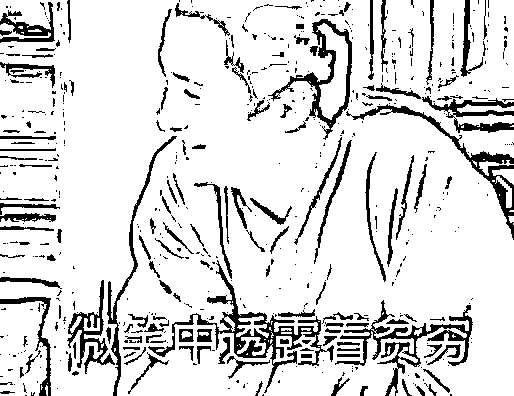
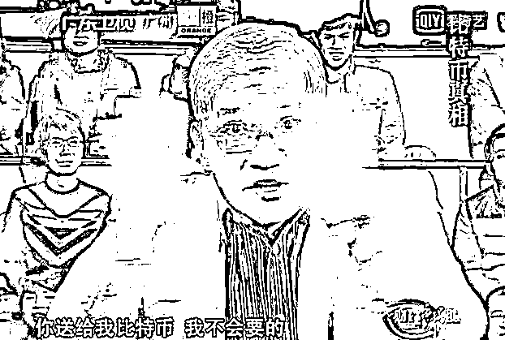
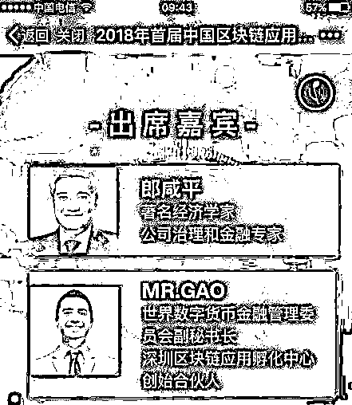
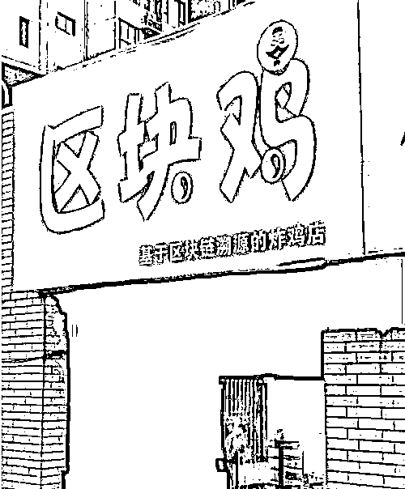
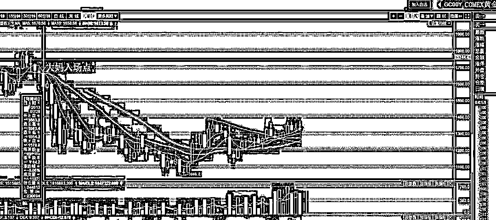
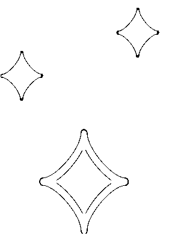

# 区块链和虚拟货币的前生今世

紫竹张先生

经济-金融-投资，点击右边按钮关注我

<link rel="stylesheet" href="view/css/APlayer.min.css"> 最近区块链再度火起来了，在一个区块链大会上，中国大妈蜂拥入场，而且平时问我买币是否可行的朋友也增多了起来，今天我就谈一下区块链和虚拟货币的前生今世，来帮助大家剖析他的本质。

其实，我是在 2014 年左右就知道比特币的，当时在中国了解比特币的人并不多，至少普通工薪层和中国大妈并不知道，当时对比特币的定义和旗帜是成为一个去中心化的货币来取代全球的法币，成为未来的世界币。经过我强大的金融专业知识素养来分析，比特币取代全球法币的概率无限接近于 0，一个号称要取代法币的东西被我认为取代法币的概率就是 0，那么他的价值也应该为 0，现在看来，应该是有什么东西限制了我的想象力。

但是我的认知其实没错，比特币的确没有取代法币的可能性，各国央行从来没有把比特币看成是竞争对手，支撑比特币上涨的另外一个东西，那就是炒作泡沫和另类的庞氏骗局。

这里首先要给大家科普一下区块链和虚拟货币的前生今世，很多人说区块链好，好在哪不知道，只知道买虚拟货币就能赚钱，所以好。后来虚拟货币跌了，就开始说虚拟货币不行，但是技术无罪，区块链技术是好的。

比特币的概念起源于 2009 年，一位叫中本聪的人为了打破各国央行疯狂发行货币灌水的铸币权，发明了比特币的概念，各国法币是一个中心化的货币，权利集中在央行手里，他想发多少就发多少，而比特币是一个去中心化的货币，没有一个人有权利干涉比特币的发行，他就固定那么多数量，以这个特质来对各国央行法币进行挑战。

既然确立了这个目标，那就要解决二个很重要的问题，比特币又不能从天上掉下来，既然是去中心化了，那么谁来负责发放初始的比特币呢，你发还是我发，谁都想发发行权弄到自己手里，但是如果某个人或机构具备了发行权，不就是一个另类的央行嘛。第二个问题是，比特币是纯电子化的货币，如果有黑客入侵篡改了数据怎么办，没有中心进行备份，一旦黑客攻击，可能直接连痕迹都找不到了。

为了帮比特币实现这个目标，中本聪发明了区块链技术，区块链技术本质上是一种记账方式，比特币进行交易的时候是需要一个账本的，在一定时间段内如果有任何数据变化，系统中每个人都可以来进行记账，系统会评判这段时间内记账最快最好的人，把他记录的内容写到账本，并将这段时间内账本内容发给系统内所有的其他人进行备份。这样系统中的每个人都了一本完整的账本。

比特币的初衷是让全球的计算机都在业余时间贡献出自己的算力，然后通过这个算力把比特币成功的平均分发出去，等全球的每个人都拥有一定数量的比特币之后，他们自然就开始进行流通交易了，从而解决了比特币的初始分发问题。而通过把比特币账本在所有人进行备份的基础上，除非黑客的算力超过了全球算力集合的 50%，否则他就不可能修改比特币账本，从而难以抹去，达到去中心化的效果。

听起来好像很美好的东西，那为什么我之前就直接判定他不能取代法币呢，因为这些比特币所具备的特质其实并不特殊，总量恒定、去中心化，其实早就有一个东西做到了，那就是黄金。黄金的数量是基本恒定的，每年新挖掘的黄金数量和数千年来挖掘的总量相比微不足道，至少比现在每天挖出的比特币数量要少的多。其次黄金是去中心化的，没有央行能凭空制造黄金。最后黄金是各国人类千年以来的公认硬通货，根正苗红，远远比比特币背景深厚。

那么黄金取代了央行的法币吗？没有，金价死死的趴在地上呢，如今的金价也就是比矿山的挖矿价格高那么一点，就是一种普通的金属而已，只不过价格贵一点，称之为贵金属。。。既然黄金都没能干掉法币，各方面能力都远不如黄金的比特币，凭什么来干掉法币。

但是干不掉法币没关系，这玩意概念新啊，可以炒作，当这个世界上只有 100 万人认可比特币的时候，他的价值是 1，那么当 200 万人认可比特币的时候，他的价值就是 2，这个定律是非常守恒的，也是诸多泡沫炒作的一贯定价规律。所以在只有中本聪一个人知道比特币的 2009 年，币价接近于 0。在极少量人知道比特币的 2011 年，1000 个比特币才买来了一个披萨。在不少计算机人士知道比特币的 2014 年，币价 800 美金。在各国媒体疯狂报道，大妈跑步入场的 2017 年，币价飙升到 2 万美金一枚，当币价飙升到最高点的时候，砖家和大妈跑步入场。

比如在 2014 年说送他比特币都不会要的郎咸平，2018 年宣布参加区块链大会，多么讽刺。而在报纸大量曝光，砖家大妈入场之后，比特币的价格已经直接腰斩都不止了。

所以，虚拟货币就是一个概念炒作而已，他唯一的价值恐怕就是依托匿名性来进行黑道非法交易而已，比如毒品和军火买卖的时候可以避免现金交易且不留痕，很安全且方便。如果把这个东西定义为比特币的价值所在的话，那么炒币的人，都是在赌世界黑帮势力越来越强大，非法交易越来越多，这个道德上是个悖论。

至于区块链技术，他原本就是给比特币服务的底层架构，所谓去中心化和匿名性并不是什么特大的进步，谁都能和区块链沾个边，只要沾个边就能发一个自己的 XX 币。比如在虚拟货币中比较有名的区块鸡货币，就是有区块链卖鸡为现实应用的，这款区块链技术可以把每只鸡给追根溯源，确保不可篡改，让每个人都能吃上放心鸡。这款算是良心币了，至少还有一个说得过去的股市。很多区块链技术就是天上飘，甚至就是纯粹的空气币，连个故事都懒得编了，傻子太多，骗子不够用了。

但是这款给鸡肉追根溯源的技术，你怎么保证养鸡场老板报给你的数据是真的，他滥用激素了会自己写在记录里吗？所有的区块链所谓去中心化，不可篡改且追根溯源的东西都有这个问题，那就是如果没有一个中心进行核查和甄别，你根本无法保证上传的数据是真的，但是如果有这么一个中心进行核查和甄别，那又谈什么去中心化呢，我们直接让政府来做这个事就不好了吗。

而现在所谓的比特币去中心化特质可能也没了，有技术专家发明了矿机这个东西，利用显卡进行挖矿运算，其算力是同价格主机的上万倍，简单高效粗暴，除了运算挖矿啥都不会的矿机诞生了，其存在的意义就是挖矿。

这种矿机诞生后是不是节约资源了呢，不是，他疯狂的繁殖，目前世界上几乎所有的比特币算力都是矿机弄出来的，而三大矿场巨头掌握的算力已经远不止全球的 50%算力了，理论上，只要他们联合起来，他们就是中心，有权利修改所有的比特币账本。

而即便他们不联合，疯狂繁殖的矿机也在令人目瞪口呆的消耗人类的能源，因为比特币是一种军备竞赛，是一个囚徒困境。假设全球所有人都不挖比特币，那么我只要打开我家的个人电脑随便挖一下，全球所有的比特币都是我的。但是如果邻居也开了一台电脑，那么我付出同样的算力和电能，只能获得一半的比特币，如果邻居开了一台矿机，提供了大约我一万倍的算力，那么 99.99%的比特币都是他的，我只能拿个零头。

所以世界上的矿场都疯了，你拿一万台矿机，我就拿二万台，一直到硬件的成本+电源成本+承担的风险=挖矿卖出的收益为止。人类在 17 年为了挖币付出的电能达到了 300 亿度电，大约相当于人类总耗能的千分之三。。。

既然这玩意这么多缺点，也没什么优势，那他怎么会炒的那么高。二万美元其实不高，中国的兰花曾经在从 10 块钱一盆炒到了 100 万元一盆，藏獒曾经从 100 一条炒到了 1000 万一条，这些都是泡沫，藏獒甚至连涨 10 年，所以比特币即便不符合经济规律，也不耽误他瞎几把乱炒，中国人既然愿意买 1000 万一条的藏獒，二万美金买一下比特币怎嘛了。 

2013 年，中国大妈抢购黄金，号称打垮华尔街的壮举震惊世界，这些抢黄金的大妈如今赚钱了吗？看看黄金月 K 图：

而如今，这些大妈又来抢购虚拟货币了，你觉得是央行聪明，还是大妈聪明。不管这玩意的炒作是炒 5 年还是 10 年，除非你创造了真正的价值，降低了社会成本，否则出来混总是要还的，而对于比特币这种不降低社会成本，还虚耗电费增加了社会成本的东西，也就是个巨大的投机品种而已，当大妈都入场的时候，差不多也就到头了。

长按上方二维码关注我

点击阅读原文查看更多