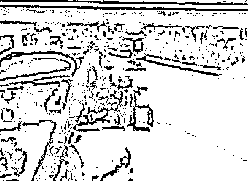
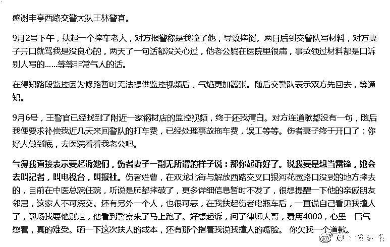
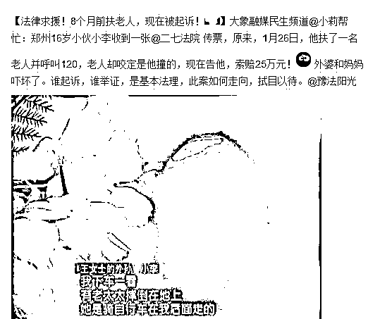
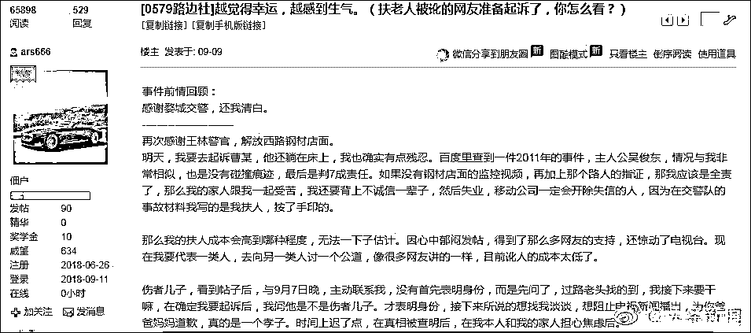
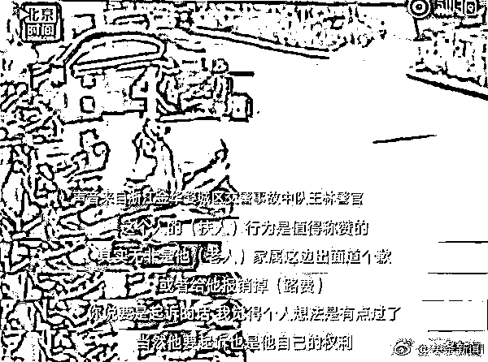

# 诬告碰瓷必须严惩，否则中国谁还敢扶老人 | 紫竹张先生

喜欢我的都关注我了~

热心青年扶老人反被诬陷，被迫赔偿巨额医药费这种事深得“民怨”，被吐槽已久，但是我没有想到的是，这个被媒体诟病如此之久的顽疾，依然没有引起司法系统的重视，甚至连基层民警都不认为老人碰瓷敲诈有什么不对。

近日，一位热血青年在街头扶起一位老人后，被老人敲诈勒索，要求赔偿巨额医药费。

幸运的是，事发路段恰好有监控视频，在交警的协助下调取后，我们发现，扶老人的黑衣青年在前面骑车骑的好好的，骑红色电动车的老人从后面直冲出来自行摔倒，黑衣青年下车扶老人，然后被直接反咬一口，老人向警方指控，是黑衣青年撞倒自己的。

扶老人的黑衣青年，在老人报警后，被迫反复前往交警大队配合调查，严重影响工作，而老人的家属在交警队直接破口大骂，尤其是在得知涉事路段由于修路无法提供监控视频时气焰更加嚣张，吃定这个小青年了。

幸好在交警队王警官的努力之下，调取了附近一家钢材店的监控视频，视频中很清晰的还原了事实真相，老人是自行摔倒，黑衣青年是被冤枉的，老人诬告青年，涉嫌敲诈勒索罪。

但是这个时候老人认罪了吗？别说认罪了，连道歉都没给一个，老人妻子还恬不知耻的说:“既然你是好人，就好人做到底，再去医院看望下我老公吧，如果你想要出名，我帮你叫记者，找电视台。”什么叫恶人嘴脸，我想这就是了。

而当热血黑衣青年气的想起诉他们的时候，诬告者无所谓的说，那你就起诉好了。

气不过是吧，气不过那你就去告啊，诬告者有恃无恐，就是吃定诬告你成本极低，诬告成功收益极大，失败了也无所谓。

黑衣小青年不信邪，真去找律师了，还是社会经验浅薄啊，律师告诉他，起诉费用大概 4000，收益不明，几乎没有反诉要求赔钱成功的，大概率最后只能捞一个道歉，你还要不要告啊。

小伙子想了想，还是算了。但是如果他被诬告成功了呢？按以前的案例，少则赔偿几万，多则赔偿几十万，一辈子都算毁了。

如果赔不起，那么你会付出更大的代价，甚至会丢掉工作。

你看看，讹人诬告多爽，简直是一本万利的买卖，成功了收益无限，失败了最多就是给个道歉。

在整个事件的处理过程中，王警官其实是很负责的，在交警大队监控不足的情况下走访附近店铺获得证据。但是对这个案件的态度却让我很心寒，王警官认为扶人的行为是值得称赞的，但是如果要起诉诬告他的老人，就有点过了。。。

请问哪里有点过了？莫非王警官认为诬告是理所应该的事情？其实这也表明了大多数基层警官的态度，几乎没有人把碰瓷、诬告当回事，也从来没人把老人的这种行为当成是敲诈勒索，基层警官特别喜欢调停，以和和气气为第一重任，而不是贯彻法律，肃清歪风邪气。

1**调停也要分情况**

扶老人被诬告和肇事者撞到老人拒不认账，其实都是被人深恶痛绝的事情，所以对于扶老人这件事，我们要客观的进行看待。

首先，在事发路段没有监控，也没有目击证人愿意作证的情况下，老人很难证明自己被人撞了，扶人者也很难证明自己被冤枉了。在这种情况下，基层警官和稀泥，有所不妥，但是我也不会说他什么，毕竟这的确不好说。即便真的是冤枉扶人者，后面给个道歉，也不会激发大面积的民众反感。所以在这种情况下，谁扶老人谁倒霉，只能认栽，因为有一定的概率，老人是真的被人撞到了但是对方不认账。

但是在另外一种情况下，有监控视频可以还原事件经过时，基层警官就不应该和稀泥。如果双方确实发生了碰撞，那就按责任划分，55 开或者 37 开或者全责，这都是属于交通事故的范畴。

但是，如果是老人自己撞上来的，或者双方明显还隔老远自己摔倒的，这就要另当别论了。这种情况下，在警方弄清事实之前，其实老人心里就很清楚到底是谁的责任，但是他揣着明白装糊涂，为了获得大笔钱财而故意诬告别人，搏一搏收益，万一警方弄不清楚事实自己就发财了，所以这就已经脱离了交通事故的范畴了，属于敲诈勒索。

《中华人民共和国刑法》第二百七十四条规定，敲诈勒索罪是指以非法占有为目的，对被害人使用威胁或要挟的方法，强行索要公私财物的行为。老人自行摔倒反咬扶人者一口，然后依靠公权力威胁或要挟扶人者赔钱的行为完全符合敲诈勒索的法律定义。

为什么老人的诬告行为触发的是敲诈勒索罪而不是诬告罪，因为法律定义的诬告陷害罪是指捏造事实，作虚假告发，意图陷害他人，使他人受刑事追究的行为。老人的诬告行为完全符合条文里的所有定义，除了里面的刑事追究这一条，所以不能算诬告罪。

现在国家法律对这方面的处罚之轻已经到了令人无法容忍的地步，甚至已经滋生出了碰瓷一族，专业诬告，以敲诈勒索来谋生。敲诈成功则满嘴流油，敲诈失败则轻飘飘道歉，基层民警完全置之不理，来钱比诈骗抢劫都快的多，而且几乎没有风险。

如果老人的索赔金额是 20 万，那么当找到充足的证据证明他是故意敲诈之后，至少也应该让老人赔偿 200 万以上，才能勉强压住敲诈勒索之风，才能让中华民族重拾互帮互助的传统美德。因为很难证明老人是恶意敲诈勒索，需要详细的视频，以及老人最开始满满的恶意，证明的条件非常苛刻，如果不能证明，那么警方只能和稀泥，扶老人的热心人只能赔钱。扶老人不仅是应该的，而且是必须的，一个老人摔倒了，应该数十人冲上去帮忙，而不应该像现在这样如避蛇蝎。

现在的法律有问题，故意敲诈勒索的老人必须被严惩，如果考虑到老人本身负伤，又年老体弱很难起诉，那么就应该是谁主张谁举证，老人要想让他人赔偿，必须自行举证，拿出明确证据。

至于真相大白后给扶人者的误工赔偿，谈这个真的没意义，因为对这种负伤的老人，警方没办法行政拘留，也没办法罚款，不管法律规定多少误工赔偿，都是个虚数，有本事你去起诉好了，法院判赔就判赔呗，你让法院找我们执行吧，反正我不给，大家看谁耗的过谁，不管法律怎么规定，都极其难以执行，其实这也是基层民警明知不妥但是视而不见的原因之一。

鉴于这种执行难的情况，要么以敲诈勒索罪严惩诬告的老人，要么就严格要求老人举证，否则不会给予老人任何赔偿。如果不这样处理，没有哪几个中国人敢去扶老人，传统美德荡然无存。

敲诈勒索失败之后，轻飘飘的来一句“那你起诉好了”，这是法律的悲哀，也是中国人的悲哀，更是我们的悲哀，因为你和我终归都会老去。

~~~~~

微信改版了，没有标注星标的用户以后收到推送，不会凸显头条，所以大家加个星标，以后更容易看到文章。

觉得此文的分析有道理，对你有所帮助，请随手转发。

长按下方图片，识别二维码，即可关注我

近期精彩文章回顾（回复“目录”关键词可查看更多）

华为员工都这么穷，怪不得拼多多能火 | 房价跌 20%就会全面崩盘，地产杠杆远比你想的要脆弱 |  为什么碧桂园的质量那么差 | 清醒点，放弃全面开征房产税的幻想 | 央行和财政部隔空掐架，我支持央妈 |中国土地制度源自香港，但是香港却是劏房密布 | 为什么中介哄抢租赁房源，因为贩毒都没它来钱快