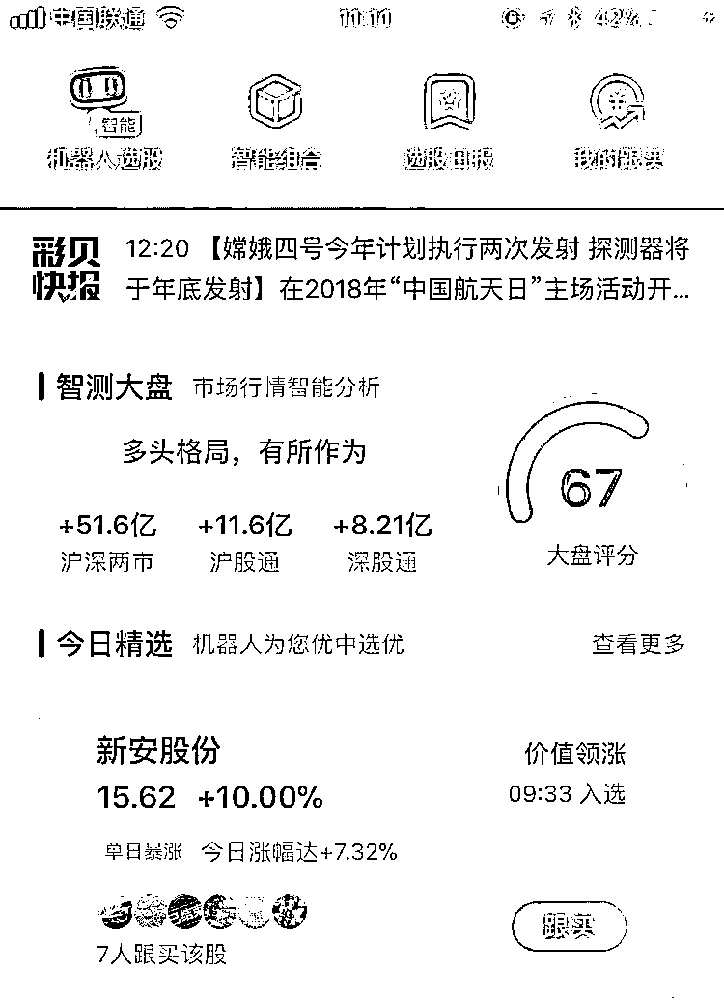
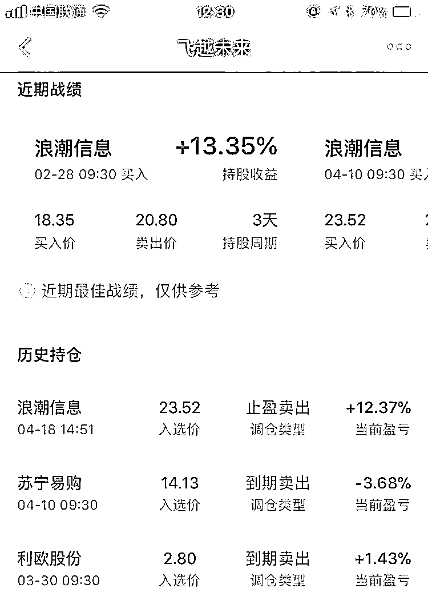
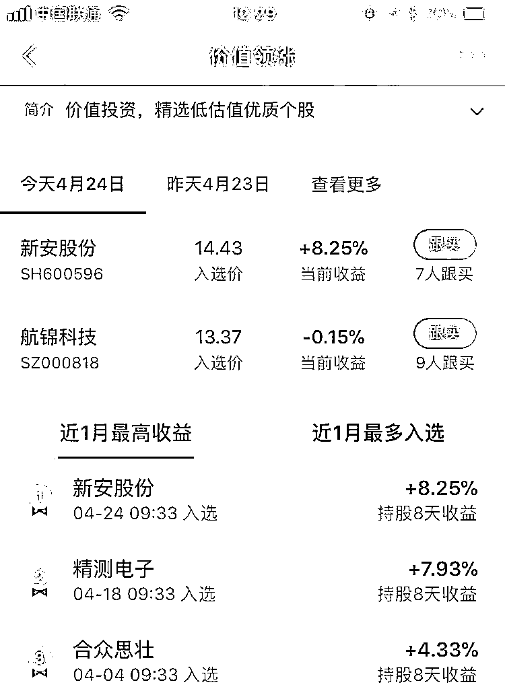

# 带个苹果入境为什么被严厉处罚

今天，美国一女子从法国旅游回国的时候，在飞机上空姐发了她一个苹果，可能她当时不饿吧，没有当场吃掉，随后下飞机的时候节俭的她不想扔掉，就随手塞进行李中打算回家再吃，注意哦，她当时连苹果的封装都没有拆掉，上面还带着航空公司的包装袋。

但是当她下飞机准备转机的时候，被海关抽查，发现了这个苹果，海关工作人员认为她的申报清单里没有这个苹果，所以涉嫌携带“未经申报的农产品”，属于严重违法行为，被海关罚款 500 美元，并取消了她全球入境许可资格。该乘客觉得自己比窦娥还冤，向媒体控诉并且已经向法院提出申诉。

首先，一个苹果而已，还是航空公司送的，如此严厉的处罚确实有点过度了，没收之后随便罚点款意思一下就好了。然后，我今天要给大家科普一下，这名海关判罚该乘客私带生鲜入境严重违法是否恰当。

这名海关说的是对的，没有申报的苹果携带入境，的确是彻头彻尾的私带生鲜入境，只不过性质很轻微而已，但是本质是一样的。而对于全球绝大部分国家，包括我国，都是严禁携带生鲜入境的，什么苹果香蕉啊、宠物小乌龟啊，都一律不允许入境，甚至中国的月饼，都无法带出国，不信你可以带一次试试。

为什么这么做呢，主要是因为检疫的问题，以中国为例，16 年中国深圳海关罗湖口岸，累计截获有害生物达 172 种 1.2 万批次，其中绝大部分，都不是恶意携带入境，都是从无知乘客身上截获的。这种有害生物入境之后，会对中国国内的生态环境造成巨大的破坏，而实际上，地球之大，国境线之宽，想要彻底杜绝某种有害生物入境是绝对不可能的。但是有没有有害生物入境是一回事，多少数量入境又是另外一回事。

除了极少数天赋异禀，上帝垂青的无敌物种能够迅速的膨胀种群规模之外，99.9%的有害生物物种，想要从少变多，是有一个非常漫长的时间，这个时间足够本国人不断的去削弱它。以巴西龟为例，是典型的有害物种，破坏国内环境，但是我们并没有确切的感知到中国国内环境被巴西龟破坏多少，那是因为他的种群数量还不够大，如果没有立法限制，有人一口气从国外进口几十万只巴西龟给放生了，你说这恐不恐怖。其实立法针对的主要是这种行为，对于乘客携带的那么几只生物并不看重，也不认为有什么过大的危害，但是所谓积沙成塔，防微杜渐，既然法律已经立了，也认定该生物有害了，那么能少一点就少一点，既然乘客被查出来了，理所当然的没收并且进行处罚。

目前中国境内，除了个别例如**水葫芦这种入侵无敌物种无解****之外，其他的都好解决**，就连鼎鼎大名，在外国被称为无敌入侵物种的小龙虾，都被中国人吃的一干二净，现在甚至都需要养殖才够吃了，只要能吃的东西，在中国都形不成气候，无论它多牛逼。

~~~

今天还有个事，**澳门举办区块链大会**，举办大会也就算了，居然在开幕式上邀请**邓紫棋演唱她的成名曲《泡****沫****》**，我也是醉了，这帮区块链的组织者心态如此肥大的嘛，还是如此有恃无恐了，心里知道，没必要说出来吧。

* * *

今天股市迎来暴涨，上证上涨 2%，创业上涨 3%，满屏红，找绿的都难，标准的普涨大阳线。

我在周末的时候说过，本周估计是横盘，不会涨到哪里去，也不会跌到哪里去，多头空头都心存忌讳。而周一开盘直接单边下跌，到了尾盘才有护盘行为，让很多人心里有打鼓了，我昨天说我看到下跌心里是非常踏实的，因为我笃定他不会跌哪去，随时会大涨，这个位置因为黑天鹅的因素已经跌到正常回调之下，但是我也不追求买到最低点，分批加仓已经差不多了。而这次黑天鹅下跌的因素，周末是完全看不出来的，就算周一也只是猜，我猜的原因，是市场缺钱，资金紧张，是从国债逆回购的利率看出来的，数值高的异常。

而对于这种缺钱，我是非常不以为然的，因为央行刚宣布定向降准，明天周三就会正式实施，再怎么缺钱也不会这个节骨眼缺钱啊，刚放水。据我猜，可能是央行觉得自己放水了，这几天没有执行 MLF 放水操作，到期就收回资金，没有再度投入市场，可能度没把握好，导致这几天的临时资金紧张。

周一大家搞清楚情况之后，今天市场就回归原样，再度暴涨，在消息面一片风平浪静的情况下，周一暴跌，周二暴涨，这是很不正常的，所以我的猜测应该没有错，八成就是利率在作怪。

而昨天正好也触发了 60 分钟底背离，二个一叠加，今天才涨的那么欢快。今天这么一涨，加上明天降准落地，我们就不用太操心缺钱的问题了，后面市场还会按照正常的节奏走。

后面的节奏怎么走，那自然是本周横盘，顶多因为某些黑天鹅导致振幅大了一点而已，但是终归还是要回到轨迹。一个多月前我在强调 1900 点过不去，甚至不惜打赌吃鼠标，巧克力鼠标我都捏好了。。。1900 点下来之后触发顶背离，然后我整个 4 月都在强调，处于回调周期，周期大概 24 个交易日，也就是一整月，故中期看多创业板，但是短期看空，不跌不买，等了足足大半个月，才给到机会买进，看到的回调最低点是 1786，因为 1781 是缺口，实际最低单略低吧，不过是因为诸多黑天鹅的因素，这些黑天鹅不可测，不可控，我当时也说了不奢求买最低点，分批买进即可，我看好的并不是这些小幅波动，而是最重要的一点我要在 4 月底之前完成分批逢低加仓，然后等下一轮上涨波动，那就是 5 月后。

当前这个任务完成的差不多了，4 月底之前，我最多在 1840-1856 区间高抛 1 成，五一放假前买回。上证无视，五一后他会跟着涨的，等到位了高抛就是。 

~~~

今天没啥好说的，昨天我没动，预设的仓位我已经吃够了，所以我今天也没动，这个 T 虽然肉够，但是他是黑天鹅引起的，这个缺钱的原因到现在都没有新闻出来，靠猜，所以我也并不可惜。

* * *

要想做好股票，除了刻苦钻研，提升专业水平之外，一款好的工具也是非常重要的武器。普通股民的对手很多是武装到牙齿的专业机构。所以，工具就是武器，武器越好战斗力就越强。 

今天就给大家推荐一款免费的**智能机器人选股工具——彩贝财经 APP**，这款 APP 最厉害的地方就是通过大数据和先进算法，帮助大家解决买卖点及选股的问题，对散户来说简直是炒股利器！ 

而且这款 app 是大网易的团队出来做的，从产品设计和功能上也能看出**一脉传承的专业水准**。这里简单给大家介绍他们的**3 个重磅功能**：

**1、智测大盘**

这个是根据消息、技术、资金多维实时监测，计算机智能分析大盘多空强弱，而且直接给出评分和操盘建议。比如今天早盘，他们的智测大盘评分一直在 67 分左右（看下图），操盘建议是：**“多头格局，有所作为**”。市场趋势、资金动向监测一目了然，每天开盘之后，可以参考下这个指标。

**2、智能组合**

他们家机器人做的组合，最大的好处就是没有人的情绪化，没有恐惧和贪婪，机器人按照量化系统和模型跑，**收益率和胜率相当优异**，作为参考工具还是很不错的。

组合选中的股票，买点、持股周期、卖点提示很清楚，完全更得上！机器人也不能做到每只股票都涨，但跑的最好的“**飞越未来**”和**“次新股精选**”等组合**近一年的收益都很高**，可以说非常厉害了！

**3、智能选股**

相对智能组合，智能选股功能更像一个精选股票池的概念，有不同的选股模型，每天开盘后机器人会根据模型因子精选 1-2 只牛股。比如这个“**价值领****涨”，早上选的新安股份，提示的入选价是 14.43 元，中午收盘涨停！**另外，如果你看好这只股票，就可以点跟买，他们家的机器人会帮你监测这只股票的卖点，并会消息提醒，这个还是很人性化的设计。

工具好不好用我说了不算，试试就知道了，**长按识别二维码或者点击“阅读原文”****，**就可以下载了。

