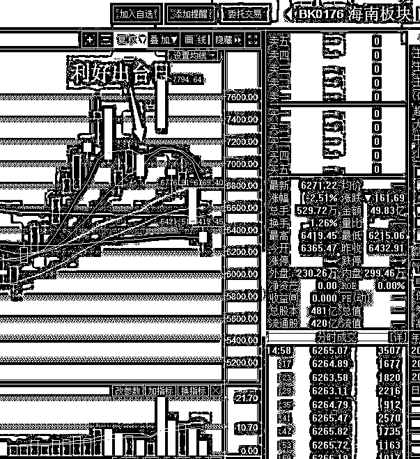
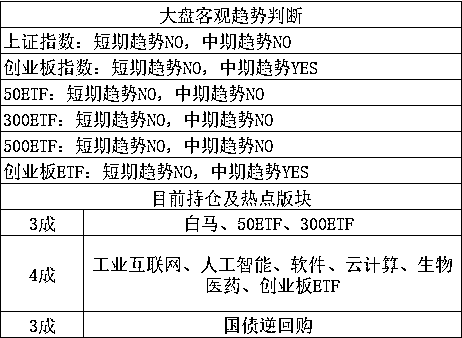

# 听说清华副校长都供不起房贷了？

紫竹张先生

经济-金融-投资，点击右边按钮关注我

今天看到一个新闻，被刷屏了，哇哈哈董事长宗庆后透露，西湖大学校长施一公之所以请辞清华大学副校长，主要还是因为收入太少。这位学科领军人物，清华大学每年给 48 万年薪，但是施一公有两个小孩，都在上学，一年要花 60 万，施一公自己还在北京贷款买房，需要还房贷，小孩上学费用，加上家庭日常开销，清华这点薪水远远不能解决生活所需，房贷都到了还不起的地步。所以他来到了西湖大学。 

马上就刷屏了，连清华副校长都供不起北京的房贷，我等屁民怎么能供得起，北京房价大大的有问题。但是后来我琢磨了一下，这个新闻有点问题，首先施一公即便真的还不起房贷，那也不是真的没钱，二个小孩上学的花费一年都要 60 万，别出国，留在中国上大学，二个小孩一年 10 万绰绰有余了吧，一下 50 万就省出来了，还不够房贷吗？

其次，施一公敢于以一年 60 万的成本送小孩去上学的同时还背着北京房贷，说明他的收入绝对不止明面的 48 万，到了这种高级别的领导，如果说只有死工资，那我是不信的，中国特色国情嘛。

再次，就算施一公真的缺钱，他也不会因为钱而去西湖大学当校长，明面工资能给多少，不可能给太多的，到了这种级别的人，不会怎么缺钱，做这个决定一定是有多方面因素考量，单纯从钱考虑，太 low 了。

除开这个新闻，最近最火的就是海南房价的新闻，我上周其实就想写的，那个时候海南大面积抢房，政府限价，开发商封盘，但是我发现写这个的公众号文章全被和谐了，我就没敢写，今天我略微提一下吧，因为有人问了我这个问题，关于海南房价，下面这个图表达的最清楚。

这个图火在雄安，如今海南概念再度拉出来用，说明人们把海南房价类比雄安房价，那么海南炒房团的命运如何，我们可以直接类比雄安炒房团嘛，在政府的严格打击下，至少我现在还没听说谁在雄安炒房挣大钱的，政府直接封了流动性，买不进，卖不出。。。

其实，我们从股市里的海南概念板块，也能略窥一二，股市和楼市其实有相似性，只不过楼市因为大势为牛市而走势为增强版而已。

海南利好政策出台之后，海南概念板块次日一字涨停，和海南楼市高度相似，抢购但是买不到，区别就是楼市是大牛市，后面还能冲一下所以政府要压制，股市直接就泄了，连续暴跌。。。

最近中兴被制裁，美国芯片引爆全民痛点之后，对高房价多年积累的不满直接爆发了，简直是全民讨伐高房价和茅台之流，不过我还是维持之前的观点，这一波翻倍暴涨之后，已经结束了，需要休息 3~5 年，大横盘，北京的房价走势其实就可以预告其他 2345 线城市的未来走势，货币化棚改只是短期刺激，不会影响最终大势。

02

关于股市，我昨天晚上说了，本周预估是横盘，五一前最后一周，不太可能大涨，也不太可能大跌，大横盘的概率大，顶多是有消息爆发的时候，波动幅度大一点而已。

今天开盘，股市单边杀跌，创业板一度最多盘中跌 3%，到了尾盘抄底资金入场护盘，到收盘，上证跌 0.11%，创业跌 1.67%，上证倒没怎么跌，创业今天盘中的振幅倒是挺大的。

周末没什么消息，我琢磨了一下，可能是资金面紧缺的原因，国债逆回购的利率连续 3 天上扬，显示市场资金紧缺，我没想到今天他居然还缺钱。

至于为什么资金紧缺，我到现在都没找到原因，新闻报纸上一片风平浪静，什么原因都看不出来，据（券商中国）报道，今天银行间市场隔夜回购利率最高成交到 18%，15%以内资金被一抢而空。“现在资金不是紧，是超级紧，到尾盘都还有不少机构没借平，违约的不少。”一位券商人士表示，近几日资金面紧张已达到罕见程度，大多数市场参与者都没有料到缴税会带来如此显著的影响，市场期望降准落地能给资金面带来转机。

券商也没料到这几天资金面会如此紧张，没到季度尾，也不是年尾，也没过节，哪来的资金紧张。。。不过国债逆回购昨天的尾盘，和今天的尾盘，都有资金狂砸，注入流动性，想来也不会有太大的问题，只是短期紧缺，而且有资金在维稳。

对于股市的影响，今天是下行的，但是只要资金不持续紧张，我觉得没什么太大的问题，央行前几天就宣布了定向降准，很快就会落地，而且资金持续紧张的话，非常有可能在近期展开 MLF 操作注入流动性。

所以今天盘中最低跌 3%的时候我都很淡定，我非常相信我的判断，本周是回调的最后一周，依然处于弱势很正常，但是非理性杀跌也不会跌太多，毕竟他是最后一周，同时叠加五一，五一假期会压制多头的欲望，也会压制空头的欲望，没有重大黑天鹅很难改变这一点。

昨天我和大家说过，在这最后一周里，上涨，我们就卖出，估计不会大涨，下跌我们不买入，因为仓位买的差不多了，不奢求买最低点。至于说非理性杀跌，今天跌这么一点点还不够格，3 成仓操作国债逆回购这几天收利息倒是挺爽，不要认为无法对冲，因为股市在本周末，会回到横盘原点的，而五一之后，上涨的概率很大。

这是我的大势分析，至于说技术面，那就更安全了，今天触发了 60 分钟底背离。总的来说，我很淡定的持股不动，在这轮回调波段的尾部慢慢吃货，下一个上涨波段才能慢慢减仓，我也不奢求减最高点，涨一点我就卖一点，分批出货，和跌的时候分批买入是一样的。

~~~

鉴于最近趋势很弱，不明显，很多人不清楚临界点的重要性，我决定暂时删除临界值，只标注短中期趋势，等波动异常剧烈需要盘中决断趋势的时候，我再重新贴临界点，至于创业板的中期趋势，最多拖到五一附近，不涨就会变 NO。

