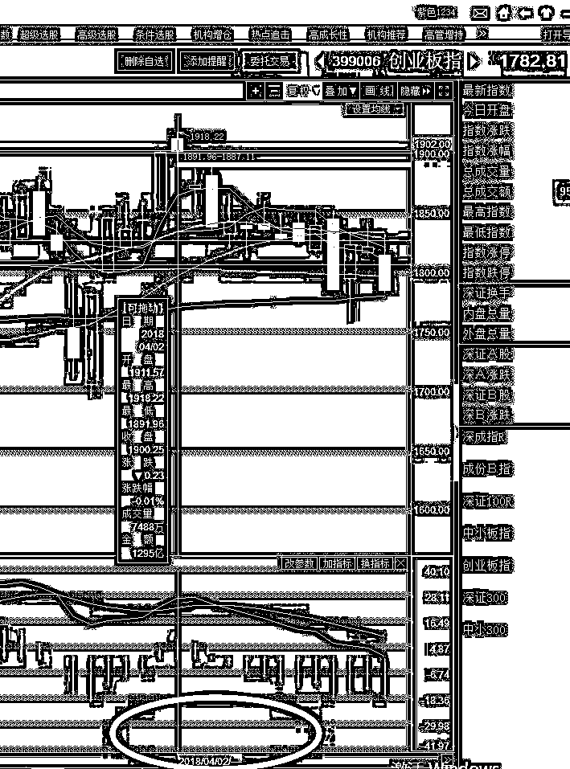
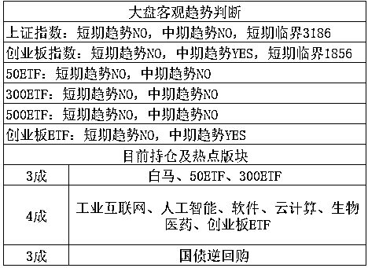

# 4-23 大盘分析

今天一不留神写多了，就当一篇大文章发了，本来是拆成二段的，现在拆成二篇文章，这篇是市场分析部分，前面还有一篇大文章，请戳主页第一篇文章。

受到中兴制裁发酵等一系列影响，周五的时候市场再度暴跌，芯片一家独大，资金涌入芯片抱团取暖。

这个周末，中兴制裁，茅台躺枪，全国都在喷茅台，为啥喷茅台呢，因为欧美市场也一直涨，也是买蓝筹，不过区别是美国的漂亮 50 是芯片、汽车产业，是苹果、亚马逊、谷歌，是特斯拉，而中国是茅台、格力电器、万科等，茅台作为蓝筹龙头，你说该不该喷。。。

这轮回调周期，起源于 4 月 2 号，就是 1900 点，我还清晰的记得，那一次我认为短期冲刺太快，一周创业暴涨 10%，冲不远了，1900 之上处处抛压，打赌收盘不会高于 1900 点，不然吃鼠标。

然后 3 月 30 号周五收盘，故意拉倒 1900 之上，最后集合竞价阶段拉上去的，收盘 1900.48，害的我周末还用巧克力捏了个鼠标外形，捏的可难看了。。。与其说是鼠标不如说是豆腐块。让收盘价刚好拉到 1900 之上，估计是为了吸引市场做多情绪，引导一下做多资金，可惜还是不行，周一开盘冲了一下就迅速大跌。 

在这一波下跌刚开始的时候，没人知道会跌多少，跌多少都有可能，所谓下跌不言底嘛，所以严格轻仓，顶多跌 100 个点我买 1 成，有本事你跌个 600 点那我服你。但是仅仅跌到 1836-1856 区间就获得了强大的支撑，不知道什么人在买买买，在经历过半个多月的不跌之后，形势就变了，因为回调周期有限，日 K 顶背离最多回调 24 个交易日，误差不会特别大，这个不敢说 100%，80%以上的概率都会这么走，这是多年总结出来的。那么大概就是持续到 4 月底，过了五一就要转势。

在后面剩余时间不多的情况下，就不敢跌 100 个点买 1 成了，跌 100 个点，我直接买了 3 成，先打够仓位再说，手里还捏着 3 成子弹，等非理性暴跌。这一波跌到这个位置差不多就是理性回调的区域附近了，但是如果小概率出现非理性暴跌，那也没什么，除非大牛市，否则一定留一部分子弹等大型黑天鹅，只有大的黑天鹅导致的大型非理性暴跌，才能在非牛市里赚大钱，如果在弱势里不等大暴跌捡便宜，那基本赚不到什么大钱，因为并非牛市，而如果始终仓位过轻，那也没什么意思，也容易错过上涨，这就是仓位控制的原理。

而对于下周而言，叠加二个因素，第一，他依然处于回调周期内，虽然是回调的最后一周，但是毕竟还没结束，所以不宜上涨。第二，下周是五一放假的最后一周，按惯例，节前通常不会暴涨暴跌，多空都不敢，越长的假期越不敢。

所以，我认为下周的波动不会很大，涨一点就会有人卖，跌一点就会有人买，涨不多，跌不深，震荡吧，区别无非就是有大消息的时候，震荡力度会大一点而已。

所以，对于下周的看法，我认为向上很难超过 1836-1856 区间，我打算 1840 附近减仓 1 成。向下我们仓位已满，觉得 1781 附近其实就差不多了，合理回调的仓位已经加足，剩下的都是等非理性暴跌的备用子弹，所以向下不打算加仓，除非高抛的那 1 成仓位变成了子弹，这里很可惜上周四的时候我定的点位是 1846-1856，实际最高 1839，否则我就可以顺利高抛一次，下周就可以随便低吸了。。。

至于上证，证监会下一次宣布价值投资之前，基本没救，不管怎么筑底都不加仓，只要涨起来就抛，这一个大格局我始终坚持不改基调。

~~ 

对于创业板而言，这次一个月的回调也差不多了，如果五一之后不能直线反弹，中期趋势可能会转 no，如果转了 no，即便不赚钱我也会开始减仓来控制仓位。

