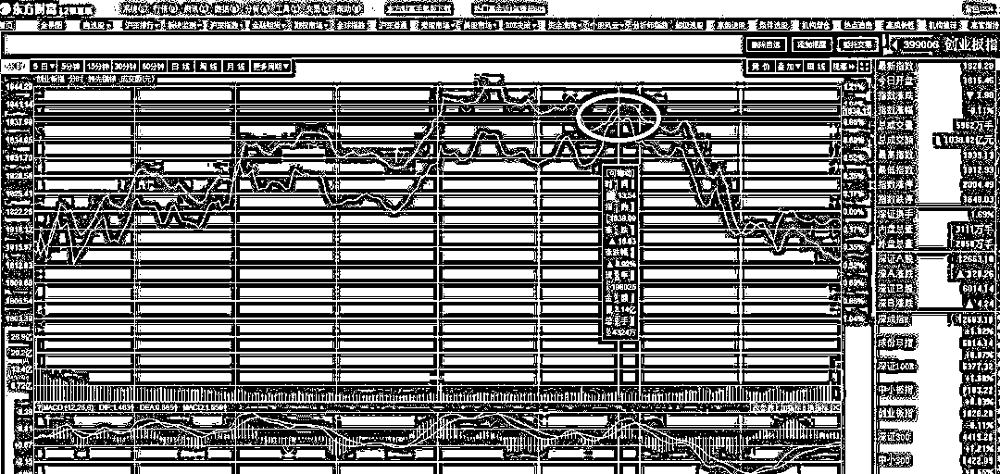
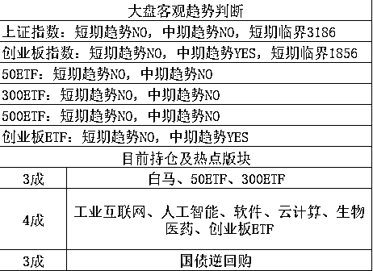

# 在北京租房需要一次性缴纳 480 万，房都租不起了

今天，万科遭到监管问询，问询原因是其位于海淀区的一个叫翡翠书院项目涉嫌以租代售，2016 年，万科通过拍卖取得项目，100%自持租赁，不得出售。迫于资金压力，该项目现在启动预租，注意是预租不是预售，这个房子 2020 年才能建好，装修还要半年时间，但是现在就开始预租啦。 

预租的价格是 90 平米三居室的月租金为 1.5 万至 1.8 万元，180 平方米以上的复式四居室月租金为 3 万至 4 万元，是不是很贵？还有更贵的呢，那就是这个房子不接受月租，只接受长租，要求一次性付清 10 年的租金，必须一次性支付给地产商 180 万-480 万元。

也就是说，就算是这么离谱的租金，都不能满足地产商的胃口，他们要求一次性回款，一次性支付 480 万只为了租 10 年？会有人愿意吗？肯定没有，这必然有私下承诺，以租代售的可能性非常大。

不这么搞没办法啊，假设一个月租金 3 万到 4 万，按月出租，假设都能租出去，开发商是不是赚肿了？并不是的，万科翡翠书院涉及的两块地总地价是 109 亿元，装修和建安成本大约 50 亿元，目前投入的总成本已有 159 亿元，如果按照 90 平米 1.5 万租金一个月，180 平 3 万租金一个月来计算，投资回报率大概只有 2%~3%左右，而开发商的贷款资金成本，至少也在 8%左右，这是血亏啊。别说租 70 年，7 年就给租破产了。

然鹅，这个租金也是远超市场正常租金的，北京房地产中介行业协会会长李文杰表示，万科以成本反推租金，无非是要把高昂的拿地成本和建设成本转嫁到承租人头上，实现企业的利益。但是这种反推出来的租金水平已经完全偏离了市场实际，该做法显然背离了国家的政策方向，而且，这么高的租金定价给周边房主租金报价也带来不必要的干扰，不利于区域住房租赁市场平稳发展。

那么如果按照市场正常的租金出租，投资回报率有多少呢，1%左右，万科拿着 8%的资金成本去开发一个投资回报率 1%的物业，不搞以租代售只有巨亏一条路。那么当初万科为什么敢拍这块地呢，很明显，试探下政策底线，万一政策给个口子，别人不敢拍自己敢，那自己就赚大了。

其实自持物业就是个伪命题，以租代售是必然选择，去年“中国铁建理想家”项目对外宣传“企业自持商品房租金一次付 10 年押金要付 20 年”比万科这个还离谱，被有关部分多次约谈。但是万科没办法，他也只能这么弄，只要还有一丝希望，都不可能正常出租的，出租只有死路一条。为什么租金那么低，房价那么高，地产商如果正常出租只有死路一条，居民买来出租就没事呢，很显然这就是牛市的功劳了，这里面的损耗是很大的，分摊到居民头上，然后牛市一冲，就给抹平了，否则这个东西必然是玩不转的，这就是为什么楼市公认存在巨大泡沫的原因，他不符合经济学原理。

今天简单的说到这，这个话题其实可以扩展成大文章的，我打算周六写，土拍中的自持租赁就是个伪命题，能够成交完全是疯狂的地产商在牛市里的冲动行为，如果达到真正的租赁价格平衡，北京房价要下跌 70%以上，我周末会进行详细数据分析。

* * *

今天，人民日报发文力挺芯片股，称中国制造“缺芯少魂”，中国强大离不开自主创“芯”，并称：“可以预见，从现在开始，中国将不计成本加大在芯片产业的投入，整个产业将迎来历史性的机遇。”

在这番言论的刺激下，芯片股今天继续上攻，我昨天告诉大家，芯片这一轮炒作，昨天简直是一步到位，今天冲高就跑，结果今天大幅冲高后，尾盘迅速跳水，分化严重，预估明天会更严重，今天落袋的人舒服了。

不过对于芯片版块我还是有话说的，我今天让大家冲高就卖，并不是不看好他，而是非常看好，但是他短期涨的实在太多了，芯片本身并没有太大的基本面支撑，造芯片是非常非常费钱的，吃力不讨好，成本特别巨大，而且成功概率很小，一旦失败就是几亿美金打水漂，就算成功，还没一年呢，外国的新一代产品又出来了。计算机行业有个摩尔定律，每 18 个月，性能会翻一倍，18 个月啊，才一年半。。。这导致芯片国产化非常的困难，别说抄袭困难，就算能抄，刚破译出来上了新生产线，对方的更新生产线已经落地了，一条生产线的建设也是要不少的时间的。

所以，在很长时间里，芯片国产化是一个美好的梦想，实际落地非常困难，转化成业绩就更难了，我本来就是打算当概念炒一炒的，直接涨停超预期，今天再拉高先出了再说，更何况，我认为今天创业板会冲高回落，那更加不能留芯片。

至于后面怎么办，很简单，后面还会涨，等回调到位继续吃回，下一波创业板上攻，芯片明显还是要跟随的，大概 4 月底 5 月初开始。

对于创业板，前天大幅加仓，昨天舒服的吃到大涨之后，我认为创业板又将来到压力位，4 月底之前，创业板很难有明显的大涨，所以逢压力位卖一点是没有错的，以前我不敢卖，因为我持仓太低，如今兵强马壮，手头大量仓位，就有卖的资格了。

卖的价位，我定在了 1846-1856，我认为大概这里附近，差不多会遇阻回落，然后今天最高点冲到 1839，只差一点点，突然跳水，估计有资金抢跑。

这么点差距，没啥好改口的，实盘我自己也没卖，筹码珍惜我不想乱动，于是就不动了，明天我还是定 1846-1856，不进入这个区间附近，我也不打算卖，就算一直持股不动到 4 月底，也是不错的选择。

此外还有一个利好消息，今日创业板 ETF 再次获得大额净申购，华安创业板 50ETF 今日份额增加近 4 亿份，年初以来规模扩大逾 19 倍。资金持续涌入创业板，手里好不容易有点仓位，不拉高那就算了，不过如果拉高到区间内，记得要坚决卖一点，因为创业整体还在回调周期内，就差那么几天了，但是依然处于周期之内，所以冲高就会有压力。

* * *

坚瑞沃能去年预报是盈利，然后今天突然业绩变脸，净利亏损逾 36 亿，总市值也才百亿，亏那么 3 次，公司直接就归零了。。。这个案例告诉我们，散户炒股不能盯着表面的业绩报表来看，A 股里搞腾挪战术的上市公司实在太多了，利用会计做账，把业绩使劲的集中在几年里，造一个非常好看的业绩报表出来，套现之后，再制造一个巨大的亏损，把利润给抹掉，把账做平。

在这做账的一进一出中，上市公司本身运行没什么影响，只是报表进行处理了一下而已，但是大股东赚的盆满钵满，至于高位接盘的散户，真是可怜呐。

~~~

昨天没有任何动作，差一点就减仓了，被人抢跑了，明天再看看吧，拉高到位我就卖，如果 3~4 个交易日我还没有机会卖出的话，我就不打算卖了，因为回调周期快结束了，怕买不回来。上证临界点下调 20 个点。

紫竹张先生

经济-金融-投资