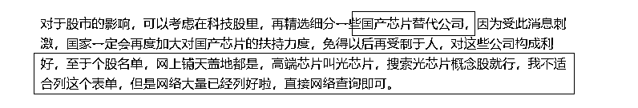
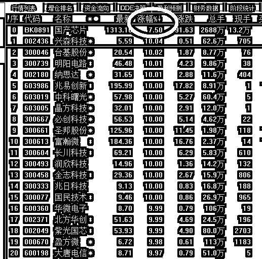
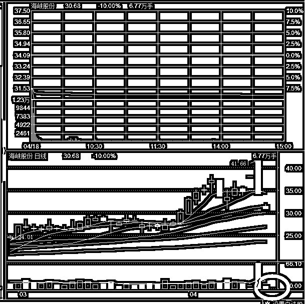
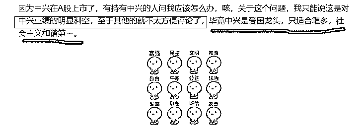
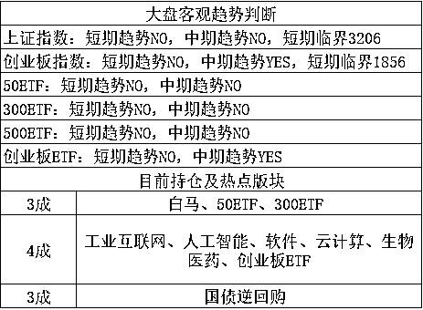

# 绝地大反击，芯片股掀起涨停潮

<link rel="stylesheet" href="view/css/APlayer.min.css"> 昨天突发大利空，美国制裁中兴，对中兴下达出口禁令，在关键的芯片部位上高度依赖美国的中兴极有可能破产，这个时候我们才突然发现，原来我们引以为傲的国内科技龙头，样板企业中兴华为，居然这么的脆弱，美国不卖你芯片你就得完蛋。。。

处于对美国对中国科技制裁打击面扩大的忧虑，昨天创业板暴跌，因为创业板的核心灵魂就是科技股，不过这也给我们带来了一个机会，大家可以知道，我等跌很久了，差不多半个月了吧，创业仓位一直是 1 成，简直不能忍，每次看到了高抛的机会我都不敢动，就 1 成卖啥卖，但是创业日 K 顶背离都死活不跌，让我也不敢高位买，我对创业的评判词就是短期回调，中期看涨，啥都好就是价格有点高，就这么忍了半个月昨天一个黑天鹅终于给了一次买入的机会，于是果断加仓，收盘仓位提升到了 4 成，加上压舱石上证的 3 成，达到了 7 成仓位，这下有仓位可以机动了，冲高我也敢卖了，4 成不高不低，具备中等操作空间，跌可买，涨可卖。

芯片是中国每年进口的第一大商品，美日欧合计进口额达到 2000 多亿美金，而且这玩意还不是说外国求着卖给中国，是中国求着去买，别人心情不好还给你来个禁运，给钱都不卖，卖你芯片不是剥削你，是在帮你，中国你要搞清楚自己的身份。

这怎么能忍，我昨天晚上给大家做了分析，中央提倡新经济，倡导新科技，在和美国打贸易战的时候被芯片给掐死了喉咙，必须让步去救中兴，这口气怎能忍得住。后续必然大力扶持国有芯片，原来扶持力度就很大了，但是后面肯定更大。在这个科技兴国的档口，证监会也绝对不敢提价值投资引导资金去蓝筹，肯定是继续鼓励科技股。我昨天晚上分析完中兴通讯的现状后，特地让大家精选国产芯片替代股，这些列表网上早已做好，百度随便一搜就是，鉴于我大 V 的特性，只能告诉大家搜索渠道，不便直接贴个股列表。

和预期一致，今天芯片股爆了，而且爆的是超预期，昨天我让大家精选国产芯片概念股，选出那些做芯片比较厉害的，而不是擦边的，但是今天芯片实在太热，开盘的时候没涨多少，但是收盘几乎全部涨停，资金涌入太多以至于整个板块涨 7.5%，就算只是擦个边的，给芯片做点基础服务的公司都涨停了，简直壮观，今天买入芯片股的，都不用选股了，**闭着眼睛吃涨停**。

而且这还不是一字板，绝大部分的股，开盘涨幅都在 1%左右，收盘净吃 9%，而且全天封死，鸡犬升天，大面积一起涨停，明天很显然会继续上涨，这是一口大肥肉，昨天的全力分析得到了硕果，要知道我几个月才会在公众号里公开看多某个版块或者个股的，没有 9 成把握，我不想没事找喷，公开带你们买买 ETF 就行了。

而对于我连续看空的海南概念股，要么买不到，买到就是坑，昨天追板的人买到了宇宙深坑，龙头股海峡股份今天低开-8%，然后瞬间跌停，全天居然是无量跌停，几乎没有成交量，看这个势头，**明天还要暴跌**！

**我滴个神啊，昨天追板的已经吃了 22%的大面了，**今天根本没给逃命的机会，再吃 10%亏损，看这个走势明天显然还要暴跌，不管吃多少跌幅出局，这都是绝对重伤了，一口气回到解放前。对比芯片股，一进一出，跳楼的心都有了。

对了，对于芯片股，我的看法是，今天全体涨停，明天必然冲高，大幅拉高后，可以考虑出局落袋，我不认为芯片版块能连拉 2 个涨停，就算明天再封板，后天也得回落，所以安稳期间，明天不等涨停，逢高就减，芯片吃十四五个点涨幅就够啦，要那么多干嘛。

这个判断的另一面，是大势判断，我昨天果断大幅度抄底创业板，判断是正常回调状态下，创业板差不多补了 1781 的缺口就差不多了，昨天黑天鹅，散户情绪崩溃，导致今天极限低点略微低了一点，但是大体是非常精确的，我的策略在黑天鹅之前就制定好了，那就是分批买入，以防买不到。

说实话这个分批买入是非常重要的，首先如果没有昨天凌晨中兴这个黑天鹅，真有可能买不到，你看这么大的利空，今天触底也直接强反弹，没有这个利空，能跌多少，花多长时间跌到那还真不好说。其次，我是提前好多天就制定的硬性买入条件，给很多散户有了足够的时间去分析合理性，到了点位他们敢买，如果不提前那么长时间说，突发暴跌的时候，普通散户你敢买吗？你的形势分析判断能力和买入的勇气有那么足吗？大部分人是没有的，所以 1900 他们敢买，跌到 1786 他们反而不敢买了，等反应过来，瞬间就飞上去了。

这是我下跌敢买的判断，和这个判断我同时说的，是日 K 顶背离会持续接近一个月，4 月底才会彻底结束回调，在这之前，创业板连续大涨的概率是比较小的，很困难，鉴于我们现在仓位吃的饱饱的，4 月份的买入额度都用完了，明天拉高到 1846-1856，我会卖出 1 成，这个大势判断，也是我认为芯片概念虽然好，但是不会连续暴涨的原因所在，不如等回调几天，下周在逢低买进不迟，我个人还是比较看好芯片的，他本身就在新经济概念里面，下一波创业板上涨，他肯定还是冲锋在前，但是连续涨停，尤其是在创业板不适合暴涨的基础大势下，不太可能。

说说消息面，**今天有二家公募基金率先下调中兴通讯的估值，下调幅度达到 2 个跌停，**哎不知道爱国吗，居然说的那么明显，我灌输正能量的文章都被连封 2 篇差点被永封账号了，建议直接永封这二家公募，和谐第一嘛。

还有个新闻是关于贸易战缓和的，他的标题是**：“特朗普对中国做出重大让步！同意就 301 征税与中国进行磋商！”**

**这个新闻我不太想评论，**特朗普同意就制裁问题和中国进行磋商居然成了重大让步，这个标题的意思是要告诉我之前中国连谈判的资格都没有吗。这新闻我不适合评论，要么有违本心，要么被和谐。

* * *

**今天我进行了改名，从紫色的股改名成****紫竹张先生****，**改名酝酿一个月啦，大家给的建议里，评分最高的就是紫气东来，的确是非常好的名字，不过这个名字使用的人实在太多了，因为名字确实好啊，现在还流行用本名的，不过一般都是 3 个字的好听，我的名字是二个字的，直接当公众号的名字不好听，就改成张先生。

另外紫是要保留的，都形成品牌了，那么中间就只差 1 个字了，这个字我希望体现的是财富+知识，这才能最大程度的体现我公众号的特色，有人问什么字这么神奇，居然能体现这么多元素，还真被我找到了，那就是竹，中国古人用竹简记录文字，古人又云书中自有黄金屋，这个书，也是用竹简组成，所以竹可以代表知识+财富，另外，紫竹也挺好听的，于是就这么用啦。

在改名的 48 小时提交期内，我把所有平台都注册了一遍紫色的股和紫竹张先生，确保没有抢注的。有很多人问怎么是张先生，我说我一直是男的啊，他说你注册信息是女的，这点我要解释一下，我比较懒，我**所有平台的账户都是我老婆代为注册的，我就是喜欢写写东西而已，**实际上前几年，写这些东西纯属兴趣爱好，公众号的价值就是 0，这几年才突然具备价值了而已，我老婆一直说有旺夫相，**我在很多平台都是不小的 V**，这方面有赖于我老婆每天代发我写好的东西，要是我可能就不发了，平台太多精力不足。

所以，**注册主体是妹子，但是实际****上****我是个****美男子****呀**。

* * *

昨天按计划进行了加仓，仓位飞升，明天如果再拉高，创业 1846-1856，我打算减仓 1 成，因为快接近 4 月底了，不知道还有几次低吸机会，所以不会多减，1 成够了。

紫竹张先生

经济-金融-投资