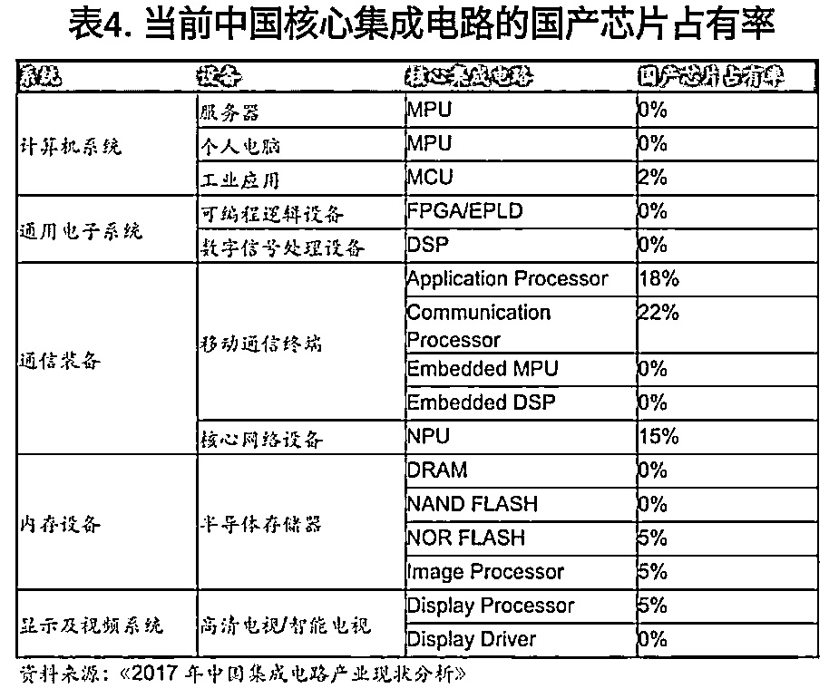
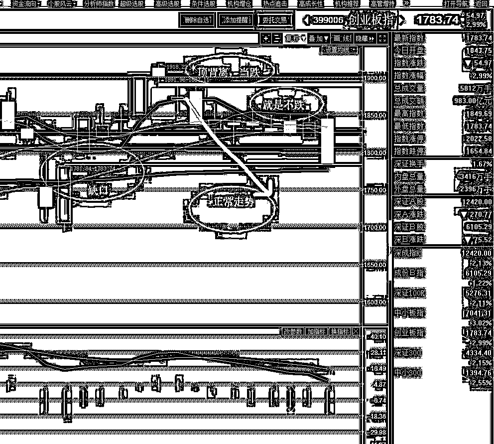
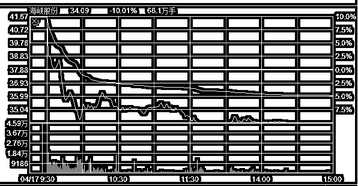
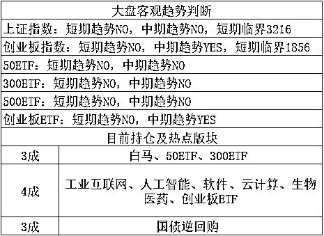

# 今天凌晨，美国宣布制裁中兴

今天凌晨，美国商务部宣布了对中国科技龙头中兴通讯的激活拒绝令，将禁止美国公司向中兴通讯销售零部件、商品、软件和技术 7 年，一直到 2025 年为止。

中兴通讯被制裁的表面原因，是中兴违规向伊朗、朝鲜出售美国科技产品，这些被美国制裁的国家，为了获取相关产品，通常都会找一些外国公司代为购买，然后偷偷运回本国，中兴想赚这个中间费，但是做事不周密被美国抓住了证据，在 2016 年被美国宣布制裁，但是随后宣布达成谅解协议，暂缓制裁，然后在今天凌晨，突然宣布重新启动制裁禁运。

而这次贸易战阶段，先制裁俄罗斯，然后制裁中兴，时间点敏感，很明显是故意的，甚至美国官员自己都直言不讳的指出，美国的真正考量是要遏制中国制造业升级，拖慢《中国制造 2025》这一强国战略。

那么这个禁运制裁对中国的影响有多大呢，很大，中国的通讯行业是绝对主力龙头就是中兴和华为，5G 技术研发的主力军，中国的目标是要在 19 年实现 5G 的商业化落地，这将大幅缩小中国和美国的技术代差。而中兴的产品，元器件 20~30%依赖进口，其中的核心高端芯片高度几乎全部依赖美国进口。

如果没有这些美国元器件，中兴别说 5G，连 4G 产品也造不出来，目前纯国产化，中国刚进化到 3G 产品，只有 3G 能实现纯国产不依赖进口。这怪中兴研发力度不够吗？并不怪，产业分工向来都是行规，中兴是负责通讯研发的，芯片都是给专业的芯片公司来做，中国的国产芯片技术实在是不够，看看这个市场占有率。

国产芯片市场占有率惨不忍睹，这可不是国家不保护，如果有哪家厂商实现高端芯片国产化，国家立马能塞一大堆订单给你，关键都是阿斗，扶不起来啊，而对于企业而言，在商言商，美国芯片加上关税，性价比都比国产的高一大截，甚至有时候根本不是价格的问题，而是就算愿意高价买国产货，你也达不到那个性能。做不出达标的产品，那就基本不谈降低成本的问题了。

所以，一旦中兴被美国断货，中兴就算高价想买国产货，也买不到，这种货色甚至日本和欧盟都造不出来，在这方面，美国是绝对技术优势，那么中兴将会陷入供货合同危机，没有足够的产品提供给供货商，整个链条有断裂的可能，即便挺过去了，也很难达成国家下达的 19 年 5G 落地的目标，自身难保的时候哪还有精力高速发展。

那么中兴能够通过其他中国公司向美国进口然后转给自己吗？当美国是瞎子么，中兴如此庞大的公司，需求的元器件是一个海量的数字，这么多元器件从美国出关就非常困难，皮包公司根本没资格购买，否则对伊朗朝鲜的制裁还有什么意义，所以如果中兴能够正常的出货，那么美国一定会追查到底是谁在买，谁运货给中兴的，然后中国又多一家被制裁的公司。。。

如果中兴就地解散，重整进另外一家公司，倒是可以规避制裁，但是这么大的公司，这么大的品牌，哪是说重整就重整的，花个二三年平衡各方利益再正常不过了，还是拖慢了研发 5G 的进程，最后美国想要的效果是一样的。

看到这里，大家知道中国的芯片很弱了吧，那么国家知道吗？知道，国家基金 60%的资金主要投向芯片制造领域，誓要用举国体制堆出一个超级芯片制造商挑战美国的技术优势，而美国也在千方百计的维护自己的优势，尽可能的拖延中国进化的脚步，制裁中兴就是为了让中国有钱都无法投资，毕竟有些科技优势，巨额投资可以加速，但是并不能无止尽的加速，是有极限的，而制裁可以显著降低这个极限的天花板。

受美国商务部对公司激活拒绝令的影响，中兴通讯 A 股、H 股在 4 月 17 日早间相继发布停牌公告。而英国也来掺和一脚，今天上午，英国国家网络安全中心发出新的建议，警告电信行业不要使用中兴的设备和服务，让中兴雪上加霜。

因为中兴在 A 股上市了，有持有中兴的人问我应该怎么办，咳，关于这个问题，我只能说这是对中兴业绩的明显利空，至于其他的就不太方便评论了，毕竟中兴是爱国龙头，只适合唱多，社会主义和谐第一。

对于股市的影响，可以考虑在科技股里，再精选细分一些国产芯片替代公司，因为受此消息刺激，国家一定会再度加大对国产芯片的扶持力度，免得以后再受制于人，对这些公司构成利好，至于个股名单，网上铺天盖地都是，高端芯片叫光芯片，搜索光芯片概念股就行，我不适合列这个表单，但是网络大量已经列好啦，直接网络查询即可。

* * *

而对于股市的影响，我们可以看到，由于担忧对中兴制裁只是一个突破口，后续会对中国科技股产生大面积制裁，所以中国科技股产生了重挫，导致今天创业板单边下杀，收跌超过 3%，收盘于 1783，已经达到我昨天说的补仓点位。

就在昨天早上大幅冲高的时候，还有人喷我踏空，今天直接单边暴跌那么多，恐怕这些人没想到吧，昨天我重点分析了这一点，本来创业板就是回调周期，看好，但是就是要等他跌了才补，否则不踏实，今天 1806/1786 分别加仓 1 成，顺利完成整个 4 月的加仓计划，后面就可以静观其变了，如果是正常回调，就差不多了，如果是不正常回调，那就要等他大幅下杀后再上剩余 3 成。

对于创业板而言，轮技术面的话，早该跌了，轮消息面，昨天晚上啥也没有，今天的异常暴跌，还是科技股带头杀跌，很明显美国制裁中兴的消息要背这个锅。

但是对于大势而言，我们可以看到，当初 4 月 3 号创业板日 K 顶背离成型的时候，他就应该是下跌的，当时我认为他应该直接下去补掉 1781 的缺口，但是至今已经半个月有余，他始终没有跌，而且还多次冲高，这让我创业板的仓位一直非常非常的轻，1 成仓等跌真的很难受，万一他不跌就麻烦大了，没有足够的机动仓位，涨了我也不敢动，只能不动。

这也就是我制定了下跌分批补仓计划的原因，不多加点仓位，实在太尴尬了，回调周期预估是到 4 月底结束，我认可的普通回调极限是 1786，如果有重大利空刺激多跌一点，我还可以继续补，重仓过五一不是问题，但是如果不跌，那就麻烦了。

今天的利空导致的创业板暴跌，正好是一个补仓的机会，顺利把创业仓位从 1 成提升到了 4 成，至于上证的 3 成，形态筑底反弹，但是我一直看空，不加仓，拉起来就卖，但是始终阿斗一样拉不起来，现在还是原计划，拉起来就卖，已经筑底这么久了，等等吧。

至于今天 3100 的破位，不是问题，3100 这里隐约就有人护盘，今天收盘破位之后，央行立刻发布通知，下调部分金融机构存款准备金率 1 个百分点，新加坡的富时 A50 直线暴涨 2%，但是我的策略还是等拉高卖，3200 之上逐步减仓，3200/3250/3300 附近各减 1 成。

创业板我就比较踏实了，目前仓位够了，拉高我就有卖的资格了，之前啥仓位都没有，动都动不了，至于因为美国制裁连续暴跌不太可能，我更认为是个黑天鹅，因为这不是全面制裁，只是制裁中兴一家而已，中兴之前本身司法上有瑕疵，更多的应该是属于美国对中国的威慑和警告，试图在其他领域拿到更多好处而已。

更何况，中国的科技股呀，本质上来说并不怎么看业绩，题材概念大一点，如今美国全力打压中国的科技股新经济，中央全力扶持科技股新经济，证监会是必须要支持科技股新经济的，而不能支持蓝筹白马把资金再向传统经济导，在这个大形势变化之前，证监会开口鼓励价值投资之前，上证越涨越卖，创业越跌越买是大趋势，按这个趋势操作即可，区别就是多少卖，多少买而已，而我们目前制定的分批计划，已经最大程度的规避了风险，不试图买最低，但是也大幅的降低了踏空风险。

对了还有海南概念，周末海南概念爆出了重大利好，周一直接封一字板，整个板块涨幅 9.5%左右，几乎都涨停了，我连续二天反复强调，这个版块，要么买不到，买到就是坑，这句话今天应验了，坑到什么程度呢，简直是巨坑、血坑，看看海南概念龙头股之一的海峡股份。

开盘追一字板的，昨天买不到，今天顺利买到了心仪的股票，但是这个票，涨停开盘，跌停收盘，封死跌停预示明天还会继续下跌，对于那些不听劝执意追高的人，今晚默默吃下这碗大面，雄安都不行，更何况海南还不如雄安。

要么买不到，买到就是坑，这句话特别适合这种概念版块。

~~~

今天按计划进行了加仓，创业板加仓 2 成，总持仓最近几天从 4 成，直线飞升到 7 成，目前吃饱了，打算休息一会，暂时不管什么走势都不打算加仓了，拉起来，我再考虑减部分仓位做 T。

紫色的股

经济-金融-投资