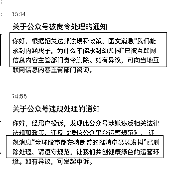
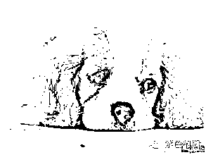

# 今晚说一件大事

<link rel="stylesheet" href="view/css/APlayer.min.css">

今天晚上说一件大事，并不是叙利亚遭受真正战争攻击了，而是今天下午的时候，我连收二条提醒，不知道哪路大佬路过我的文章给审核了下，直接有二篇文章被删除了。

最近处于敏感时期，我也知道，我最近的文章**谈的全是正能量**，非正能量的很多内容我都故意忽略不谈的，就算是被删除的这二篇，我仔细反思了下，这二篇也是正能量，没看出有啥违规的地方，尤其是谈特朗普乱发推特那一篇，全篇清汤寡水的就是单纯的批判了下特朗普，也被判违规了，我感觉我好冤枉。

这说明了一个问题，那就在原来已经很严格的审核标准上，又再度提升了严格等级，但是关键的是这个审核标准是不公布的，我们并不知道说什么会触犯天规，说什么不会，这就很郁闷了，今天这二个文章因为说了啥被判触碰黄线我不清楚，那红线的标准我也不清楚，要是哪天不小心碰了红线直接把我给永封了才真是******冤******啊，所以大家再加一下我的后花园微信号吧，这个号平时是沉寂状态，不会发送任何信息，唯一的作用就是万一将来小概率我碰了红线被永封了，这个号还能复活一下和大家继续聊天。

事技术的高低，也就是击落导弹的能力，远远比战争本身更重要。

导弹轰炸后，俄罗斯的第一反应不是威胁报复美国并实质性的调兵遣将，而是开始炫耀自己反导系统的强大，美国第一反应不是宣布要进一步扩大战争规模扫平叙利亚，而是在和俄罗斯就击落导弹的数量狂打口水战，这就足够说明这一场叙利亚危机顶格也就是地缘政治危机了，双方就是掰掰手腕而已，局部冲突不会上升为真正的战争。

那么，对于 A 股，我认为就没啥影响，影响一天的走势就不得了了，无视之，还是继续按大趋势走吧，上周被特朗普耍的够呛，再不敢偏离趋势按美国消息做判断了。

~~~~~~

周末还发生了一件趣事需要谈一下，广州一位医生谭某写了一篇文章叫《中国神酒，来自天堂的毒药》，称鸿茅药酒不是酒，是药，且含有多种有毒成分，谭某的公众号总共有 5 位粉丝，经朋友圈散播后总共有 2000 阅读，是小小小小小 V，鸿茅药酒怒了，直接报案凉城公安，称给公司带来了七八十万的退货，产生了巨额损失，于是凉城公安连夜出发，跨省逮捕谭某，关押了 3 个月。然后本周末这件事不知道被哪个医药界大 V 知道了，写了一篇帖子质疑凉城公安，同时用铁的证据，证明鸿茅药酒他的确是有问题的，谭某说的一点都没错。

然后好了，整个医药界所有的 V 都沸腾了，火力全开把鸿茅药酒炸成了飞灰，连其他领域的大 V 都开始参与批判，攻击鸿茅药酒的文章总阅读，我感觉都快破亿了吧，本来没啥人知道鸿茅药酒不好，但是这下全国人民都知道鸿茅药酒就是毒酒了。

不知道鸿茅药酒会不会后悔当初滥用公权力擅自抓人，如此只手遮天的事情发生在法制社会，太高看自己的力量了吧。

~~~

对于这一波的海南新政策，我周五已经谈过了，今晚再强调一下，虽然宣布了诸多重大利好，但是这些好政策和曾经的力度比，都差了点，而以前的政策并没有让海南带来质变，这一次也不会。

对于股价的短期刺激影响，我的看法是，要么买不到，要么是个套。从诸多资金长达半年的潜伏来看，后者的概率还要大于前者。。。

创业板自动 4 月初触发日 K 顶背离以后，按照技术规律，一直到 4 月底，走势都不会强硬，但是根据更大的基本面，我们应该越跌越买，趁机补仓，周五尾盘击破 1826，趁机加了 1 成，持仓达到 5 成，后面我打算再 1806 和 1786 分别再加 1 成，能加多少算多少，再然后的仓位，我就要等彻底逆势才会加了。

至于上证指数，我并不操心，反正已经很久收盘没破 3100 了，就这么横着呗，拉上去我就卖，拉不上去我就拿着，我并不认为他有大问题，当然我也不认为他最近会有大出息，机会还在创业板，可惜位置有点高。

对于创业板炒作的方向，最近证监会沉寂了下来，什么都不说了，所以暂时还是只能按新经济炒，他们强创业才会强，其实和创业板是命运共同体，大家要随时关注证监会的言行，他们令旗一挥，赶快切换板块，不需要犹豫。

周五全天，三大板块都属于高开低走，非常的挫伤人气，而周末又爆出叙利亚战争正式爆发的事件，虽然周末 IPO 只发行 2 家，30 亿规模，还有海南利好，但是并不足以对冲。IPO 并不是特大利好，其实等于没有利好，而海南的利好见光死的概率怎么看都是要大那么一丢丢的。

但是我坚定的认为，更大的基本面上来看，创业板的下跌就是加仓的机会，创业板 ETF 引来机构的持续大额申购就是明证，而上证就算了，无论怎么看企稳，看反弹，我都始终秉着拉升就卖的原则，绝不加仓。

今天就写那么多了，最后再贴一次二维码吧，大家都加一下，我希望这个号会永远沉寂永不启用，因为他启用之时，就是大号被永封之时，被封的那几篇看到的人都算赚了，因为以后都看不到了。

